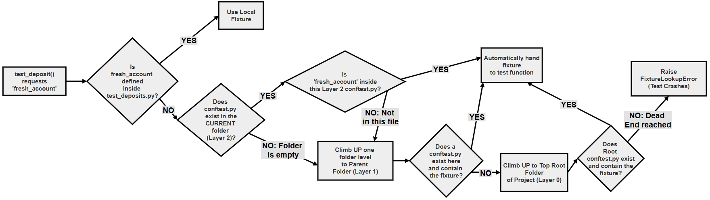
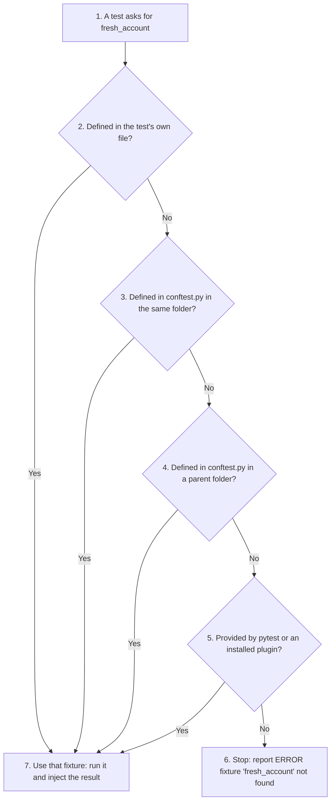
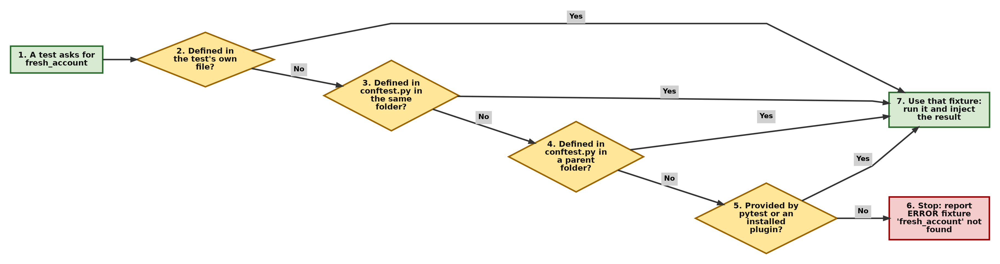

# Project and Research Task: The Distributed Test Suite (Sharing Fixtures with conftest.py)

**Note: Scaling to Multiple Test Files with `conftest.py`**

When your test suite grows across several files (for example `test_deposits.py` and `test_withdrawals.py`), copying and pasting the same `fresh_account` fixture into each file breaks the **DRY (Don't Repeat Yourself)** principle. To avoid this, pytest automatically recognises a special file named `conftest.py`. Fixtures placed in it are shared with every test file in the same folder and in all the folders inside it.

This online resource is a complete practical guide. It covers:

- **Implicit Injection Mechanics:** How pytest automatically finds and shares fixtures *without* a single import statement. The phrase means two things happen automatically behind the scenes:
    - **Implicit (hidden):** You do not write an `import` statement to connect your test file to your fixture file. Pytest connects them silently in the background, based entirely on where the files are stored.
    - **Injection (handing over):** Pytest automatically runs your fixture function and "hands over" (injects) the resulting object straight into the parentheses of your test function.
- **Refactoring Code Scripts:** A ready-to-run, multi-file banking project, split cleanly into folders.
- **Directory Lookup Flowchart:** A diagram tracing how pytest finds a fixture across folder boundaries.
- **Comparison Matrix:** A quick-reference table comparing local fixtures (inside a test file) with shared fixtures (inside `conftest.py`).

In the earlier pages of this chapter, every fixture lived in the same file as the tests that used it. Real projects soon outgrow a single test file. This page shows the standard pytest way of sharing setup code across many files and folders, and it also covers a common beginner problem: the `ModuleNotFoundError` that appears when tests are moved into their own folder.

## Table of Contents

- [Project and Research Task: The Distributed Test Suite (Sharing Fixtures with conftest.py)](065-ch20-conftest-py.md#project-and-research-task-the-distributed-test-suite-sharing-fixtures-with-conftestpy)
    - [Key Terms Used on This Page](065-ch20-conftest-py.md#key-terms-used-on-this-page)
    - [The Project Scenario](065-ch20-conftest-py.md#the-project-scenario)
    - [The Research Question](065-ch20-conftest-py.md#the-research-question)
    - [Your To-Do Checklist](065-ch20-conftest-py.md#your-to-do-checklist)
    - [The Solution](065-ch20-conftest-py.md#the-solution)
        - [1. Core Concept: What is conftest.py?](065-ch20-conftest-py.md#1-core-concept-what-is-conftestpy)
        - [2. Automatic Discovery (The Detective Phase)](065-ch20-conftest-py.md#2-automatic-discovery-the-detective-phase)
            - [How It Works Step by Step](065-ch20-conftest-py.md#how-it-works-step-by-step)
            - [Implicit Injection](065-ch20-conftest-py.md#implicit-injection)
        - [3. Project Directory Architecture](065-ch20-conftest-py.md#3-project-directory-architecture)
        - [4. Centralized Solution Scripts](065-ch20-conftest-py.md#4-centralized-solution-scripts)
            - [File 1: tests/conftest.py](065-ch20-conftest-py.md#file-1-testsconftestpy)
            - [File 2: tests/test_deposits.py](065-ch20-conftest-py.md#file-2-teststest_depositspy)
            - [File 3: tests/test_withdrawals.py](065-ch20-conftest-py.md#file-3-teststest_withdrawalspy)
            - [File 4: bank_account.py](065-ch20-conftest-py.md#file-4-bank_accountpy)
            - [File 5: pytest.ini](065-ch20-conftest-py.md#file-5-pytestini)
        - [5. Running the Suite and Verifying Implicit Injection](065-ch20-conftest-py.md#5-running-the-suite-and-verifying-implicit-injection)
        - [6. Why pytest.ini Is Needed](065-ch20-conftest-py.md#6-why-pytestini-is-needed)
        - [7. How Pytest Resolves Distributed Fixtures](065-ch20-conftest-py.md#7-how-pytest-resolves-distributed-fixtures)
            - [Flowchart](065-ch20-conftest-py.md#flowchart)
        - [8. Going Further: A conftest.py in a Sub-folder](065-ch20-conftest-py.md#8-going-further-a-conftestpy-in-a-sub-folder)
        - [9. Summary Table](065-ch20-conftest-py.md#9-summary-table)
    - [Scripts for This Page and How to Run Them](065-ch20-conftest-py.md#scripts-for-this-page-and-how-to-run-them)
    - [Follow-Up Questions](065-ch20-conftest-py.md#follow-up-questions)
        - [Question 1: Where Should conftest.py Go?](065-ch20-conftest-py.md#question-1-where-should-conftestpy-go)
        - [Question 2: Why Not Import It Anyway?](065-ch20-conftest-py.md#question-2-why-not-import-it-anyway)
        - [Question 3: Overriding a Shared Fixture](065-ch20-conftest-py.md#question-3-overriding-a-shared-fixture)
        - [Question 4: Using a Fixture from a Sub-folder](065-ch20-conftest-py.md#question-4-using-a-fixture-from-a-sub-folder)
    - [Summary](065-ch20-conftest-py.md#summary)
    - [Further Reading](065-ch20-conftest-py.md#further-reading)

## Key Terms Used on This Page

| Term | Simple Meaning | Learn More |
| --- | --- | --- |
| Fixture | A function marked with `@pytest.fixture` that prepares something a test needs | [pytest: How to use fixtures](https://docs.pytest.org/en/stable/how-to/fixtures.html) |
| `conftest.py` | A specially named file whose fixtures are shared with all test files in its folder and in the folders below it | [pytest: conftest.py](https://docs.pytest.org/en/stable/reference/fixtures.html#conftest-py-sharing-fixtures-across-multiple-files) |
| DRY principle | "Don't Repeat Yourself": write each piece of knowledge in one place only, so that a change is made once | [DRY on Wikipedia](https://en.wikipedia.org/wiki/Don%27t_repeat_yourself) |
| Dependency injection | Handing a function the objects it needs from outside, instead of letting it create them | [Dependency injection on Wikipedia](https://en.wikipedia.org/wiki/Dependency_injection) |
| Test runner | A program (here, pytest) that finds tests, runs them and reports the results | |
| Test discovery | The process by which pytest searches folders and files to find the tests | [pytest: test discovery](https://docs.pytest.org/en/stable/explanation/goodpractices.html#conventions-for-python-test-discovery) |
| Root folder (rootdir) | The top folder of the project, which pytest treats as the base of the test run | [pytest: rootdir](https://docs.pytest.org/en/stable/reference/customize.html#initialization-determining-rootdir-and-configfile) |
| `pytest.ini` | A settings file for pytest, placed in the project's root folder | [pytest: configuration](https://docs.pytest.org/en/stable/reference/customize.html) |
| `sys.path` | The list of folders Python searches when it runs an `import` statement | [Python docs: sys.path](https://docs.python.org/3/library/sys.html#sys.path) |

[Back to the Table of Contents](065-ch20-conftest-py.md#table-of-contents)

## The Project Scenario

Look closely at your current test file. Both `test_deposit(fresh_account)` and `test_withdraw(fresh_account)` rely on the exact same `fresh_account()` fixture function.

Now imagine your banking application expands. You need to break your test suite up into separate specialized files for scalability: `test_deposits.py` and `test_withdrawals.py`.

[Back to the Table of Contents](065-ch20-conftest-py.md#table-of-contents)

## The Research Question

> **"If you simply copy and paste your `@pytest.fixture def fresh_account():` code block into both files, your code violates the DRY (Don't Repeat Yourself) architectural rule. How can we store shared fixtures in a single centralized configuration file so that Pytest automatically injects them across multiple distinct test files without a single import statement?"**

[Back to the Table of Contents](065-ch20-conftest-py.md#table-of-contents)

## Your To-Do Checklist

1.  **Explore Discovery Mechanics:** Investigate how Pytest automatically discovers files named exactly `conftest.py` inside your test folders.

2.  **Refactor the Suite:** Create a clean folder structure, pull the `fresh_account` fixture out of your test files, and centralize it into `conftest.py`.

3.  **Verify Implicit Injections:** Run your test suite to verify that your separate test files can still access `fresh_account` without writing `from conftest import fresh_account`.

[Back to the Table of Contents](065-ch20-conftest-py.md#table-of-contents)

## The Solution

Below is the detailed solution. Sections 1 and 2 answer checklist item 1, sections 3 and 4 answer item 2, and section 5 answers item 3.

[Back to the Table of Contents](065-ch20-conftest-py.md#table-of-contents)

### 1. Core Concept: What is conftest.py?

In pytest, `conftest.py` is a specially recognised file. It acts as a **shared fixture store** for the folder it sits in.

- Any fixture written in `conftest.py` can be used by every test file in the **same folder** and in **all the folders inside it**.
- It is not truly global: a test file in a folder **above** or **beside** that folder cannot see it.
- A project can have several `conftest.py` files, one per folder, each serving its own part of the folder tree.

The name must be exactly `conftest.py`, all in lower case. A file called `Conftest.py` or `conftests.py` is not treated specially.

[Back to the Table of Contents](065-ch20-conftest-py.md#table-of-contents)

### 2. Automatic Discovery (The Detective Phase)

**Automatic discovery:** You never import `conftest.py`. When you run pytest, it scans the folders, finds any `conftest.py` files, and makes their fixtures available to the test files in that part of the folder tree.

In standard Python, a script only knows about code that is in the same file or that it imports explicitly at the top. Pytest works differently because it is a **test runner**: before running any test, it actively searches your folders for tests and for `conftest.py` files.

When you type `pytest` in the terminal, it follows a fixed order:

```text
Project Root/
  └── tests/
       ├── conftest.py          <-- 1. Pytest finds and loads this first
       ├── test_deposits.py     <-- 2. Then it collects the tests in this file
       └── test_withdrawals.py  <-- 3. Then it collects the tests in this file
```

[Back to the Table of Contents](065-ch20-conftest-py.md#table-of-contents)

#### How It Works Step by Step

1. **Folder scanning:** Pytest starts from the folder you run it in (or the folder you name on the command line) and goes through it and every folder inside it. It looks for test files whose names match `test_*.py` or `*_test.py`. It does not need the folder to be called `tests`. That name is simply a common and tidy choice.
2. **conftest.py comes first:** In each folder it visits, pytest checks for a file named exactly `conftest.py` and loads it **before** it collects any test file in that folder.
3. **Registering the fixtures:** When `conftest.py` is loaded, pytest records every function marked with `@pytest.fixture` (such as `fresh_account`), together with the folder it came from. You can think of this as a **fixture registry**: an internal list of fixture names and where each one may be used.
4. **Downstream availability:** From then on, those fixtures can be used by every test file in that folder and in all the folders deeper down.
5. **Injection at run time:** When a test asks for a fixture by name, pytest looks it up, runs it and passes the result into the test.

You can see which fixtures a test file can use, and where each one comes from, with the `--fixtures` flag, as shown in [Running the Suite and Verifying Implicit Injection](065-ch20-conftest-py.md#5-running-the-suite-and-verifying-implicit-injection).

[Back to the Table of Contents](065-ch20-conftest-py.md#table-of-contents)

#### Implicit Injection

Test functions simply name the fixture as a parameter, for example:

```python
def test_deposit(fresh_account):
```

Pytest finds `fresh_account` in `conftest.py`, runs it and injects the result into the test behind the scenes. The test file contains no `import` for `conftest.py` and no `import` for the fixture. The **name** of the parameter is the only link.

[Back to the Table of Contents](065-ch20-conftest-py.md#table-of-contents)

### 3. Project Directory Architecture

To put the solution into practice, organise the banking project folders like this:

```text
banking_project/
│
├── pytest.ini               # Pytest settings (marks the project root)
├── bank_account.py          # Core application logic
└── tests/
    ├── conftest.py          # SHARED FIXTURES LIVE HERE (no test functions)
    ├── test_deposits.py     # Contains deposit-specific tests
    └── test_withdrawals.py  # Contains withdrawal-specific tests
```

The small `pytest.ini` file is important. Without it, the tests cannot import `bank_account.py`, because it sits in a different folder from the tests. The reason and the fix are explained in [Why pytest.ini Is Needed](065-ch20-conftest-py.md#6-why-pytestini-is-needed).

[Back to the Table of Contents](065-ch20-conftest-py.md#table-of-contents)

### 4. Centralized Solution Scripts

[Back to the Table of Contents](065-ch20-conftest-py.md#table-of-contents)

#### File 1: tests/conftest.py

```python
# File: tests/conftest.py
# Description: Shared fixture repository for every test file in the tests
# folder and in all the folders inside it. Do not put test functions here.
# Pytest finds this file by its name. No test file ever imports it.

# Step 1 - Import pytest and the class the fixture will build
import pytest
from bank_account import BankAccount


# Step 2 - The shared fixture
@pytest.fixture
def fresh_account():
    """A new BankAccount for John with a balance of 100, created fresh for every test."""

    # --- SETUP (runs before each test that asks for fresh_account) ---
    print("\n[CONFTEST FIXTURE] Creating fresh account for a distributed test...")
    account_instance = BankAccount("John", 100)

    # Hand the account to whichever test asked for it
    yield account_instance

    # --- TEARDOWN (runs after that test has finished) ---
    print("\n[CONFTEST FIXTURE] Tearing down account after the test...")
```

Points to note:

1. The file contains fixtures only, and no test functions.
2. The fixture has the default **function scope**, so it runs once for **each** test that asks for it. Each test gets its own new account with a balance of 100.
3. The teardown code after `yield` runs after **each** test, not after the whole file.

[Back to the Table of Contents](065-ch20-conftest-py.md#table-of-contents)

#### File 2: tests/test_deposits.py

```python
# File: tests/test_deposits.py
# Notice: there is NO import statement for conftest.py or fresh_account.
# Pytest finds fresh_account in tests/conftest.py by itself.


def test_deposit(fresh_account):
    # Step 1 - Show which file is running and the starting balance
    print("[TEST] Running deposit inside test_deposits.py")
    print(f"[TEST] Starting balance: {fresh_account.get_balance()}")

    # Step 2 - Deposit 50 and check the new balance
    fresh_account.deposit(50)
    print(f"[TEST] Balance after deposit: {fresh_account.get_balance()}")
    assert fresh_account.get_balance() == 150
```

[Back to the Table of Contents](065-ch20-conftest-py.md#table-of-contents)

#### File 3: tests/test_withdrawals.py

```python
# File: tests/test_withdrawals.py
# Notice: fresh_account is injected by pytest from tests/conftest.py.
# Again, no import statement is needed.


def test_withdraw(fresh_account):
    # Step 1 - Show which file is running and the starting balance
    print("[TEST] Running withdraw inside test_withdrawals.py")
    print(f"[TEST] Starting balance: {fresh_account.get_balance()}")

    # Step 2 - Withdraw 30 and check the new balance
    fresh_account.withdraw(30)
    print(f"[TEST] Balance after withdrawal: {fresh_account.get_balance()}")
    assert fresh_account.get_balance() == 70
```

Neither test file imports `conftest` or `fresh_account`. Both simply name `fresh_account` as a parameter.

[Back to the Table of Contents](065-ch20-conftest-py.md#table-of-contents)

#### File 4: bank_account.py

The class being tested. It goes in the project's root folder, `banking_project`.

```python
# bank_account.py
# Core application logic: a simple bank account.


class BankAccount:

    # Step 1 - Create an account with an owner and an opening balance
    def __init__(self, owner, balance=0):
        self.owner = owner
        self.balance = balance

    # Step 2 - Add money to the account
    def deposit(self, amount):
        if amount <= 0:
            raise ValueError("Deposit amount must be positive")
        self.balance += amount

    # Step 3 - Take money out of the account
    def withdraw(self, amount):
        if amount > self.balance:
            raise ValueError("Insufficient funds")
        self.balance -= amount

    # Step 4 - Report the current balance
    def get_balance(self):
        return self.balance
```

[Back to the Table of Contents](065-ch20-conftest-py.md#table-of-contents)

#### File 5: pytest.ini

This file also goes in the root folder, `banking_project`.

```ini
# pytest.ini
# Settings for pytest. This file marks the project's root folder.

[pytest]
# Add the project root folder to Python's search path, so that
# 'from bank_account import BankAccount' works from inside the tests folder.
pythonpath = .
```

[Back to the Table of Contents](065-ch20-conftest-py.md#table-of-contents)

### 5. Running the Suite and Verifying Implicit Injection

Open a terminal in the `banking_project` folder (the folder that contains `pytest.ini`) and run the two test files:

```bash
pytest -v -s tests/test_deposits.py tests/test_withdrawals.py
```

Output:

```text
============================= test session starts ==============================
platform win32 -- Python 3.10.10, pytest-9.0.3, pluggy-1.6.0 -- C:\Users\Anurag Gupta\AppData\Local\Programs\Python\Python310\python.exe
cachedir: .pytest_cache
rootdir: C:\banking_project
configfile: pytest.ini
plugins: anyio-4.12.1
collected 2 items

tests/test_deposits.py::test_deposit
[CONFTEST FIXTURE] Creating fresh account for a distributed test...
[TEST] Running deposit inside test_deposits.py
[TEST] Starting balance: 100
[TEST] Balance after deposit: 150
PASSED
[CONFTEST FIXTURE] Tearing down account after the test...

tests/test_withdrawals.py::test_withdraw
[CONFTEST FIXTURE] Creating fresh account for a distributed test...
[TEST] Running withdraw inside test_withdrawals.py
[TEST] Starting balance: 100
[TEST] Balance after withdrawal: 70
PASSED
[CONFTEST FIXTURE] Tearing down account after the test...


============================== 2 passed in 0.00s ===============================
```

Read the output in steps:

1. The line `configfile: pytest.ini` shows that pytest found and used the settings file.
2. Before each test, the line `[CONFTEST FIXTURE] Creating fresh account...` appears. The fixture from `tests/conftest.py` was run for tests in **two different files**, without any import.
3. Both tests print `Starting balance: 100`. Each test received its **own** fresh account. The deposit in the first test did not affect the second.
4. After each test, the teardown message appears once. The teardown runs after every test because the fixture has the default function scope.

To confirm where the fixture comes from, ask pytest to list the fixtures that `test_deposits.py` can use:

```bash
pytest --fixtures tests/test_deposits.py
```

Near the end of the long list, you will see:

```text
------------------------ fixtures defined from conftest ------------------------
fresh_account -- tests\conftest.py:13
    A new BankAccount for John with a balance of 100, created fresh for every test.
```

This shows the fixture name, the file and line where it is defined, and the fixture's docstring. The rest of the list shows the fixtures that are built into pytest.

[Back to the Table of Contents](065-ch20-conftest-py.md#table-of-contents)

### 6. Why pytest.ini Is Needed

In the folder structure above, the tests live in `tests/`, but `bank_account.py` lives one level up, in `banking_project/`. When `tests/conftest.py` runs `from bank_account import BankAccount`, Python searches the folders listed in `sys.path`. By default, when you type `pytest`, the project root folder is **not** on that list.

If you delete `pytest.ini` and run `pytest`, you get this error:

```text
ImportError while loading conftest 'C:\banking_project\tests\conftest.py'.
tests\conftest.py:8: in <module>
    from bank_account import BankAccount
E   ModuleNotFoundError: No module named 'bank_account'
```

There are three common fixes:

| Fix | How | Notes |
| --- | --- | --- |
| Add `pytest.ini` with `pythonpath = .` | The file shown in File 5 | Recommended. It works however you start pytest. Needs pytest 7 or newer |
| Run `python -m pytest` instead of `pytest` | Type the longer command in the root folder | Works because `python -m` adds the current folder to `sys.path`. Easy to forget |
| Add an empty `conftest.py` in the root folder | Create `banking_project/conftest.py` with nothing in it | Works because pytest adds the folder of a root-level `conftest.py` to `sys.path` |

You can read more in the pytest guide on [pytest import mechanisms and sys.path](https://docs.pytest.org/en/stable/explanation/pythonpath.html).

[Back to the Table of Contents](065-ch20-conftest-py.md#table-of-contents)

### 7. How Pytest Resolves Distributed Fixtures

When a test asks for a fixture, pytest searches for it in a fixed order, starting close to the test and moving outwards. The first match it finds is used.

#### Flowchart



The same lookup, step by step:





| Search Order | Where Pytest Looks | Example |
| --- | --- | --- |
| 1 | The test file itself (and the test's class, if it has one) | A `fresh_account` fixture written inside `test_deposits.py` |
| 2 | `conftest.py` in the same folder as the test file | `tests/conftest.py` |
| 3 | `conftest.py` in each parent folder, moving up towards the root folder | `banking_project/conftest.py` |
| 4 | Fixtures built into pytest and its plugins | `tmp_path`, `capsys`, `monkeypatch` |

Because the closest definition wins, a test file can **override** a shared fixture by defining its own fixture with the same name. The override applies only to that file. Follow-up Question 3 shows this.

[Back to the Table of Contents](065-ch20-conftest-py.md#table-of-contents)

### 8. Going Further: A conftest.py in a Sub-folder

Larger projects often have several `conftest.py` files. Each one serves its own folder and everything below it. Let us add a `premium` folder with its own `conftest.py`:

```text
banking_project/
│
├── pytest.ini
├── bank_account.py
└── tests/
    ├── conftest.py              # fresh_account (for all of tests/)
    ├── test_deposits.py
    ├── test_withdrawals.py
    └── premium/
        ├── conftest.py          # premium_account (only for tests/premium/)
        └── test_premium.py
```

`tests/premium/conftest.py`:

```python
# File: tests/premium/conftest.py
# A second conftest.py, one level deeper. Its fixtures are visible ONLY to
# tests inside the premium folder (and folders below it).

# Step 1 - Import pytest and the class the fixture will build
import pytest
from bank_account import BankAccount


# Step 2 - A fixture that only premium tests can use
@pytest.fixture
def premium_account():
    print("\n[PREMIUM CONFTEST] Creating premium account with balance 10000...")
    return BankAccount("Bruce", 10000)
```

`tests/premium/test_premium.py`:

```python
# File: tests/premium/test_premium.py
# This test uses TWO fixtures from TWO different conftest.py files:
#   premium_account -> from tests/premium/conftest.py (same folder)
#   fresh_account   -> from tests/conftest.py (the parent folder)


def test_transfer_to_regular(premium_account, fresh_account):
    # Step 1 - Show both starting balances
    print(f"[TEST] Premium starts with {premium_account.get_balance()}, "
          f"regular starts with {fresh_account.get_balance()}")

    # Step 2 - Move 500 from the premium account to the regular account
    premium_account.withdraw(500)
    fresh_account.deposit(500)
    print(f"[TEST] Premium now {premium_account.get_balance()}, "
          f"regular now {fresh_account.get_balance()}")

    # Step 3 - Check both balances
    assert premium_account.get_balance() == 9500
    assert fresh_account.get_balance() == 600
```

Run the whole suite from the `banking_project` folder:

```bash
pytest -v -s
```

Output:

```text
============================= test session starts ==============================
platform win32 -- Python 3.10.10, pytest-9.0.3, pluggy-1.6.0 -- C:\Users\Anurag Gupta\AppData\Local\Programs\Python\Python310\python.exe
cachedir: .pytest_cache
rootdir: C:\banking_project
configfile: pytest.ini
plugins: anyio-4.12.1
collected 3 items

tests/premium/test_premium.py::test_transfer_to_regular
[PREMIUM CONFTEST] Creating premium account with balance 10000...

[CONFTEST FIXTURE] Creating fresh account for a distributed test...
[TEST] Premium starts with 10000, regular starts with 100
[TEST] Premium now 9500, regular now 600
PASSED
[CONFTEST FIXTURE] Tearing down account after the test...

tests/test_deposits.py::test_deposit
[CONFTEST FIXTURE] Creating fresh account for a distributed test...
[TEST] Running deposit inside test_deposits.py
[TEST] Starting balance: 100
[TEST] Balance after deposit: 150
PASSED
[CONFTEST FIXTURE] Tearing down account after the test...

tests/test_withdrawals.py::test_withdraw
[CONFTEST FIXTURE] Creating fresh account for a distributed test...
[TEST] Running withdraw inside test_withdrawals.py
[TEST] Starting balance: 100
[TEST] Balance after withdrawal: 70
PASSED
[CONFTEST FIXTURE] Tearing down account after the test...


============================== 3 passed in 0.01s ===============================
```

Read the output in steps:

1. Pytest found all three test files, including the one in the `premium` sub-folder, with no extra settings.
2. `test_transfer_to_regular` received `premium_account` from `tests/premium/conftest.py` **and** `fresh_account` from the parent folder's `tests/conftest.py`. A test can use fixtures from its own folder and from every folder above it.
3. `premium_account` can be used **only** inside `tests/premium/`. If `test_deposits.py` asked for it, pytest would report `fixture 'premium_account' not found`.

[Back to the Table of Contents](065-ch20-conftest-py.md#table-of-contents)

### 9. Summary Table

| | Local Test File Fixtures | Centralized conftest.py Fixtures |
| --- | --- | --- |
| Where it is written | Inside one test file | In `conftest.py` |
| Visibility scope | Only the tests in the file where it is written | All test files in the same folder and in every folder below it |
| Import rules | No import needed | No import needed (pytest finds it by name and folder) |
| If both define the same name | The local fixture wins for that file | Used everywhere the local one does not override it |
| Best use | Setup data that only one test file needs | Common setup shared by many files (such as `fresh_account`, database connections or common settings) |
| Maintainability | Harder to maintain if several files need it, because it must be copied | Easier to maintain: follows DRY, so a change is made once and applies everywhere |
| Should it contain tests? | Yes, it is a normal test file | No, keep it for fixtures (and other pytest settings) only |

[Back to the Table of Contents](065-ch20-conftest-py.md#table-of-contents)

## Scripts for This Page and How to Run Them

All the scripts on this page are available in the [banking_project folder](https://github.com/ag999git/001-Python-book-2026/tree/main/20-unittest/banking_project).

| File | What It Contains |
| --- | --- |
| [pytest.ini](https://github.com/ag999git/001-Python-book-2026/blob/main/20-unittest/banking_project/pytest.ini) | Pytest settings: adds the root folder to the import path |
| [bank_account.py](https://github.com/ag999git/001-Python-book-2026/blob/main/20-unittest/banking_project/bank_account.py) | The BankAccount class being tested |
| [tests/conftest.py](https://github.com/ag999git/001-Python-book-2026/blob/main/20-unittest/banking_project/tests/conftest.py) | The shared `fresh_account` fixture |
| [tests/test_deposits.py](https://github.com/ag999git/001-Python-book-2026/blob/main/20-unittest/banking_project/tests/test_deposits.py) | The deposit test |
| [tests/test_withdrawals.py](https://github.com/ag999git/001-Python-book-2026/blob/main/20-unittest/banking_project/tests/test_withdrawals.py) | The withdrawal test |
| [tests/premium/conftest.py](https://github.com/ag999git/001-Python-book-2026/blob/main/20-unittest/banking_project/tests/premium/conftest.py) | The `premium_account` fixture, visible only in the premium folder |
| [tests/premium/test_premium.py](https://github.com/ag999git/001-Python-book-2026/blob/main/20-unittest/banking_project/tests/premium/test_premium.py) | A test that uses fixtures from two conftest.py files |

To run them on your computer:

1. Create a folder `banking_project`. Save `pytest.ini` and `bank_account.py` in it.
2. Inside it, create a folder `tests` and save `conftest.py`, `test_deposits.py` and `test_withdrawals.py` there.
3. Inside `tests`, create a folder `premium` and save its `conftest.py` and `test_premium.py` there. Note that there are **two different** files called `conftest.py`, in two different folders.
4. Open the `banking_project` folder in VS Code (**File > Open Folder...**) and open the terminal (**Terminal > New Terminal**). The terminal must be in `banking_project`, not in `tests`.
5. Check that pytest is installed with `python -m pytest --version`. If you see `No module named pytest`, install it with `python -m pip install pytest`.
6. Run the commands shown in sections 5 and 8, for example `python -m pytest -v -s`. All three tests should pass.

Detailed, step-by-step instructions (installing Python and VS Code, downloading files from GitHub and fixing common errors) are given in [Running the Scripts on Your Computer](020-ch20-unittest-disadvantage-rigid-oop-style.md#running-the-scripts-on-your-computer).

[Back to the Table of Contents](065-ch20-conftest-py.md#table-of-contents)

## Follow-Up Questions

### Question 1: Where Should conftest.py Go?

A project has tests in `tests/api/` and `tests/database/`. Both folders need a fixture called `sample_user`. Where should it be written so that it is written only once?

**Answer:**

1. A `conftest.py` is visible to its own folder and all the folders below it.
2. The closest folder that contains both `tests/api/` and `tests/database/` is `tests/`.
3. So write `sample_user` in `tests/conftest.py`. Both sub-folders will then be able to use it without any import.

[Back to the Table of Contents](065-ch20-conftest-py.md#table-of-contents)

### Question 2: Why Not Import It Anyway?

What is wrong with writing `from conftest import fresh_account` at the top of a test file?

**Answer:**

1. It is not needed. Pytest already makes the fixture available through `conftest.py`.
2. It can cause errors. In a project with several `conftest.py` files, Python may not know which one you mean, and the import may fail or pick up the wrong file.
3. It goes against the design. The point of `conftest.py` is that tests depend only on fixture **names**, so fixtures can be moved between files and folders without changing any test.
4. The pytest documentation also advises against importing fixtures into a test module, because pytest then records them as if they were defined in that module.

[Back to the Table of Contents](065-ch20-conftest-py.md#table-of-contents)

### Question 3: Overriding a Shared Fixture

Suppose `tests/test_deposits.py` defines its own fixture called `fresh_account` that creates an account with a balance of 0, while `tests/conftest.py` still has the version with a balance of 100. Which one does `test_deposit` receive? What about `test_withdraw` in `tests/test_withdrawals.py`?

**Answer:**

1. Pytest searches the test's own file first.
2. `test_deposit` is in `test_deposits.py`, which has its own `fresh_account`. So it receives the local version, with a balance of 0. (Its assert `== 150` would then fail, because 0 + 50 is 50.)
3. `test_withdraw` is in `test_withdrawals.py`, which has no local `fresh_account`. So it receives the shared version from `conftest.py`, with a balance of 100.
4. The override affects only the file in which it is written.

[Back to the Table of Contents](065-ch20-conftest-py.md#table-of-contents)

### Question 4: Using a Fixture from a Sub-folder

Can `tests/test_deposits.py` use the `premium_account` fixture from `tests/premium/conftest.py`?

**Answer:**

1. No. A `conftest.py` shares its fixtures downwards, with its own folder and the folders below it, never upwards or sideways.
2. `test_deposits.py` is in `tests/`, which is **above** `tests/premium/`.
3. Pytest would report `ERROR` with the message `fixture 'premium_account' not found`.
4. If both folders need it, move `premium_account` up into `tests/conftest.py`.

[Back to the Table of Contents](065-ch20-conftest-py.md#table-of-contents)

## Summary

- `conftest.py` is a specially named file where you can put fixtures that many test files share.
- Pytest finds and loads it automatically. Test files never import it.
- Its fixtures can be used in its own folder and in every folder below it.
- Tests ask for a shared fixture exactly as they ask for a local one: by naming it as a parameter.
- When the same fixture name is defined in several places, the one closest to the test wins.
- When tests live in their own folder, add `pytest.ini` with `pythonpath = .` so that they can import the code being tested.

[Back to the Table of Contents](065-ch20-conftest-py.md#table-of-contents)

## Further Reading

- [pytest: conftest.py, sharing fixtures across multiple files](https://docs.pytest.org/en/stable/reference/fixtures.html#conftest-py-sharing-fixtures-across-multiple-files)
- [pytest: Override a fixture on various levels](https://docs.pytest.org/en/stable/how-to/fixtures.html#overriding-fixtures-on-various-levels)
- [pytest: Import mechanisms and sys.path](https://docs.pytest.org/en/stable/explanation/pythonpath.html)
- [pytest: Configuration files](https://docs.pytest.org/en/stable/reference/customize.html)

[Back to the Table of Contents](065-ch20-conftest-py.md#table-of-contents)

