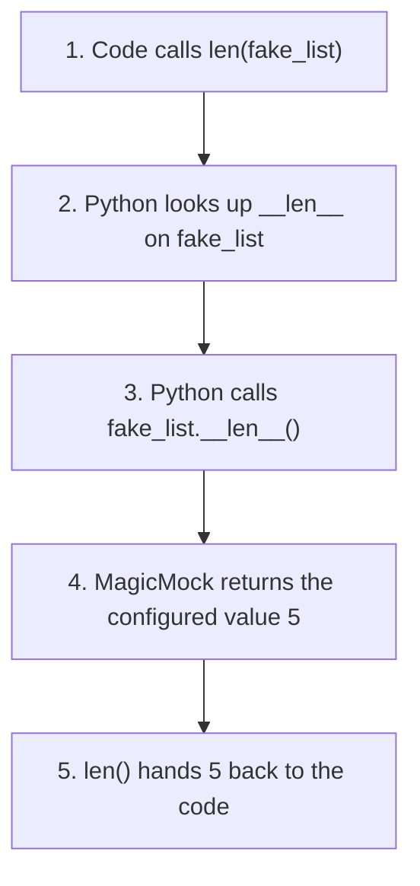
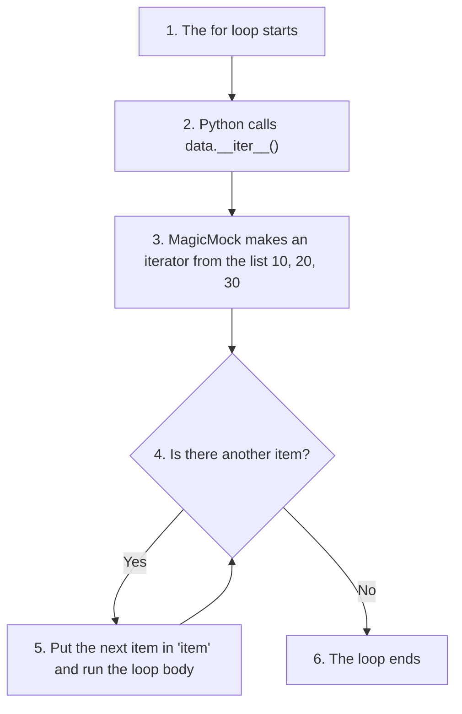
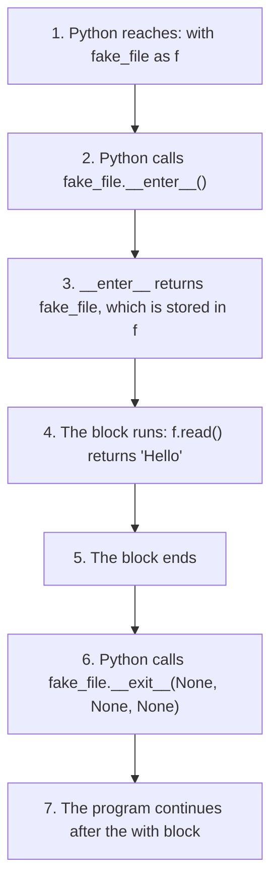

# MagicMock: An Introduction

**Additional Online Resource: MagicMock**

The chapter in the printed book introduced the basics of `Mock`, which is enough for simulating ordinary objects and methods. However, many real-world Python objects support special operations such as `len(obj)`, iteration (`for item in obj`), dictionary-style access (`obj[key]`), membership testing (`x in obj`) and context managers (`with obj:`). These operations are carried out by Python's special (magic) methods.

This page discusses `MagicMock`, a specialised form of `Mock` designed to simulate such objects. It includes detailed explanations, comparison tables, execution flowcharts and runnable examples involving iterators, containers, dictionaries, files and context managers. Every example is shown with its actual output. The page ends with a small set of pytest tests that use `MagicMock` in the way you would in a real project.

Mocking is an important testing skill. It lets you test your own code without needing the real files, databases or network services that it normally talks to. `MagicMock` extends this to objects that are used with Python's built-in operations, which is very common in everyday Python code.

## Table of Contents

- [MagicMock: An Introduction](067-ch20-magicmock.md#magicmock-an-introduction)
    - [Key Terms Used on This Page](067-ch20-magicmock.md#key-terms-used-on-this-page)
    - [What is MagicMock?](067-ch20-magicmock.md#what-is-magicmock)
        - [How Python Uses Magic Methods](067-ch20-magicmock.md#how-python-uses-magic-methods)
    - [Importing MagicMock](067-ch20-magicmock.md#importing-magicmock)
    - [Simplified Constructor](067-ch20-magicmock.md#simplified-constructor)
    - [Mock vs MagicMock](067-ch20-magicmock.md#mock-vs-magicmock)
        - [Seeing the Difference](067-ch20-magicmock.md#seeing-the-difference)
        - [Default Behaviour of a MagicMock](067-ch20-magicmock.md#default-behaviour-of-a-magicmock)
    - [Why Do We Need MagicMock?](067-ch20-magicmock.md#why-do-we-need-magicmock)
    - [Example 1: Simulating len()](067-ch20-magicmock.md#example-1-simulating-len)
        - [Execution Flow of len()](067-ch20-magicmock.md#execution-flow-of-len)
    - [Example 2: Simulating String Conversion](067-ch20-magicmock.md#example-2-simulating-string-conversion)
    - [Example 3: Simulating Membership Testing](067-ch20-magicmock.md#example-3-simulating-membership-testing)
    - [Example 4: Simulating Iteration](067-ch20-magicmock.md#example-4-simulating-iteration)
        - [Execution Flow of Iteration](067-ch20-magicmock.md#execution-flow-of-iteration)
        - [A Common Pitfall: iter() Instead of a List](067-ch20-magicmock.md#a-common-pitfall-iter-instead-of-a-list)
    - [Example 5: Simulating Dictionary Access](067-ch20-magicmock.md#example-5-simulating-dictionary-access)
    - [Example 6: Simulating a Context Manager](067-ch20-magicmock.md#example-6-simulating-a-context-manager)
        - [Context Manager Flow](067-ch20-magicmock.md#context-manager-flow)
    - [All Six Examples in One Script](067-ch20-magicmock.md#all-six-examples-in-one-script)
    - [Using MagicMock in pytest Tests](067-ch20-magicmock.md#using-magicmock-in-pytest-tests)
        - [The Code Under Test: inventory.py](067-ch20-magicmock.md#the-code-under-test-inventorypy)
        - [The Tests: test_inventory.py](067-ch20-magicmock.md#the-tests-test_inventorypy)
        - [Running the Tests](067-ch20-magicmock.md#running-the-tests)
    - [Common Magic Methods](067-ch20-magicmock.md#common-magic-methods)
    - [Typical Uses of MagicMock](067-ch20-magicmock.md#typical-uses-of-magicmock)
    - [Mock vs MagicMock: Which Should You Use?](067-ch20-magicmock.md#mock-vs-magicmock-which-should-you-use)
        - [Use Mock When](067-ch20-magicmock.md#use-mock-when)
        - [Use MagicMock When](067-ch20-magicmock.md#use-magicmock-when)
    - [Scripts for This Page and How to Run Them](067-ch20-magicmock.md#scripts-for-this-page-and-how-to-run-them)
    - [Follow-Up Questions](067-ch20-magicmock.md#follow-up-questions)
        - [Question 1: Why Does Mock Fail with len()?](067-ch20-magicmock.md#question-1-why-does-mock-fail-with-len)
        - [Question 2: What Is f Inside the with Block?](067-ch20-magicmock.md#question-2-what-is-f-inside-the-with-block)
        - [Question 3: Different Values for Different Keys](067-ch20-magicmock.md#question-3-different-values-for-different-keys)
        - [Question 4: Checking How a Mock Was Used](067-ch20-magicmock.md#question-4-checking-how-a-mock-was-used)
    - [Summary](067-ch20-magicmock.md#summary)
    - [Further Reading](067-ch20-magicmock.md#further-reading)

## Key Terms Used on This Page

| Term | Simple Meaning | Learn More |
| --- | --- | --- |
| Mock | A stand-in object used in tests in place of a real one. It accepts any attribute or method call and records how it was used | [unittest.mock: Mock](https://docs.python.org/3/library/unittest.mock.html#unittest.mock.Mock) |
| MagicMock | A `Mock` that also comes with Python's magic methods already set up | [unittest.mock: MagicMock](https://docs.python.org/3/library/unittest.mock.html#unittest.mock.MagicMock) |
| Magic method (dunder method) | A method whose name starts and ends with two underscores, such as `__len__`. Python calls it automatically for built-in operations. "Dunder" is short for "double underscore" | [Python docs: special method names](https://docs.python.org/3/reference/datamodel.html#special-method-names) |
| `return_value` | The value a mock gives back every time it is called | [unittest.mock: return_value](https://docs.python.org/3/library/unittest.mock.html#unittest.mock.Mock.return_value) |
| `side_effect` | A function, exception or list that decides what a mock does when called, used when one fixed `return_value` is not enough | [unittest.mock: side_effect](https://docs.python.org/3/library/unittest.mock.html#unittest.mock.Mock.side_effect) |
| Iterator | An object that hands out values one at a time, for example in a `for` loop. Once used up, it gives nothing more | [Python glossary: iterator](https://docs.python.org/3/glossary.html#term-iterator) |
| Context manager | An object used with the `with` statement. It runs set-up code at the start of the block and clean-up code at the end | [Python glossary: context manager](https://docs.python.org/3/glossary.html#term-context-manager) |
| Code under test | The real code whose behaviour a test checks | |

[Back to the Table of Contents](067-ch20-magicmock.md#table-of-contents)

## What is MagicMock?

`MagicMock` is a specialised version of `Mock` provided by Python's `unittest.mock` module.

It behaves like a normal `Mock` object, but it also comes with Python's special methods (often called **magic methods** or **dunder methods**) already set up and ready to configure.

Examples of magic methods include:

```text
__len__()
__str__()
__iter__()
__contains__()
__getitem__()
__enter__()
__exit__()
```

You rarely call these methods yourself. Python calls them automatically when you use certain operations. The next section shows which operation calls which method.

A regular `Mock` object does not support these operations at all unless you add each magic method yourself. A `MagicMock` object is designed specifically for this purpose.

[Back to the Table of Contents](067-ch20-magicmock.md#table-of-contents)

### How Python Uses Magic Methods

| When Your Code Writes | Python Calls |
| --- | --- |
| `len(obj)` | `obj.__len__()` |
| `str(obj)` or `print(obj)` | `obj.__str__()` |
| `for item in obj:` | `obj.__iter__()` to get an iterator, then asks that iterator for one item at a time |
| `item in obj` | `obj.__contains__(item)` |
| `obj[key]` | `obj.__getitem__(key)` |
| `obj[key] = value` | `obj.__setitem__(key, value)` |
| `with obj:` | `obj.__enter__()` at the start of the block, and `obj.__exit__(...)` at the end |

The same information written as code:

```python
len(obj)
# Python internally calls:
obj.__len__()

str(obj)
# Python internally calls:
obj.__str__()

for item in obj:
    ...
# Python internally calls:
obj.__iter__()

item in obj
# Python internally calls:
obj.__contains__(item)

obj[key]
# Python internally calls:
obj.__getitem__(key)

with obj:
    ...
# Python internally calls:
obj.__enter__()
# ... the body of the with block runs ...
obj.__exit__(None, None, None)
```

The three `None` values passed to `__exit__()` mean "no error happened inside the block". If an error does happen, Python passes the details of that error instead.

One more detail: Python looks for magic methods on the object's **class**, not on the object itself. That is why simply adding a `__len__` attribute to an ordinary object is not enough. `MagicMock` takes care of this for you.

[Back to the Table of Contents](067-ch20-magicmock.md#table-of-contents)

## Importing MagicMock

```python
from unittest.mock import MagicMock
```

`unittest.mock` is part of Python's standard library, so there is nothing extra to install. It works with pytest as well as with `unittest`.

[Back to the Table of Contents](067-ch20-magicmock.md#table-of-contents)

## Simplified Constructor

```python
MagicMock(
    spec=None,
    side_effect=None,
    return_value=DEFAULT
)
```

The commonly used parameters are the same as those used with `Mock`:

| Parameter | What It Does | Default |
| --- | --- | --- |
| `spec` | Limits the mock to the attributes and methods of a real class or object, so a spelling mistake raises an error instead of passing silently | `None` (no limit) |
| `side_effect` | A function to call, an exception to raise, or a list of values to hand out one per call, whenever the mock itself is called | `None` |
| `return_value` | What the mock returns when it is called, as in `mock()` | `DEFAULT`, which means "return a new `MagicMock`" |

Note that these parameters describe what happens when the mock itself is **called**. To control a magic method, you set it on that method, as the examples below do: `mock.__len__.return_value = 5`.

[Back to the Table of Contents](067-ch20-magicmock.md#table-of-contents)

## Mock vs MagicMock

| Feature | Mock | MagicMock |
| --- | --- | --- |
| Attributes | Can simulate object attributes | Can simulate object attributes |
| Methods | Can simulate ordinary methods | Can simulate ordinary methods |
| `return_value` | Supports configurable return values | Supports configurable return values |
| `side_effect` | Supports custom behaviour and exceptions | Supports custom behaviour and exceptions |
| Magic methods | Not supported unless you add each one yourself | Most of Python's magic methods are already set up |
| Context managers | You must add `__enter__()` and `__exit__()` yourself | Works with `with` straight away |
| Iteration | `for item in obj` raises `TypeError` | Works; by default the loop simply has no items |
| `len()`, `in`, `obj[key]` | Raise `TypeError` | Work straight away; you choose the results |
| Typical use | Mocking ordinary objects and methods | Mocking containers, iterators, files, dictionaries and context managers |
| Beginner recommendation | Use for simple mocking tasks | Use when special Python operations are involved |

[Back to the Table of Contents](067-ch20-magicmock.md#table-of-contents)

### Seeing the Difference

Save this as `mock_vs_magicmock.py`:

```python
# mock_vs_magicmock.py
# What happens when a plain Mock and a MagicMock meet special operations?

# Step 1 - Import both classes
from unittest.mock import Mock, MagicMock

plain = Mock()
magic = MagicMock()

# Step 2 - A list of operations to try, each written as a small function
operations = [
    ("len(obj)", lambda obj: len(obj)),
    ("list(obj)", lambda obj: list(obj)),
    ('"a" in obj', lambda obj: "a" in obj),
    ("bool(obj)", lambda obj: bool(obj)),
]

# Step 3 - Try each operation on both objects
for label, operation in operations:
    for name, obj in [("Mock", plain), ("MagicMock", magic)]:
        try:
            print(f"{name:9} {label:11} -> {operation(obj)!r}")
        except TypeError as error:
            print(f"{name:9} {label:11} -> TypeError: {error}")

# Step 4 - A plain Mock can support len() only if we add __len__ ourselves
plain.__len__ = Mock(return_value=5)
print("Mock after adding __len__ by hand -> len =", len(plain))
```

Run it:

```bash
python mock_vs_magicmock.py
```

Output:

```text
Mock      len(obj)    -> TypeError: object of type 'Mock' has no len()
MagicMock len(obj)    -> 0
Mock      list(obj)   -> TypeError: 'Mock' object is not iterable
MagicMock list(obj)   -> []
Mock      "a" in obj  -> TypeError: argument of type 'Mock' is not iterable
MagicMock "a" in obj  -> False
Mock      bool(obj)   -> True
MagicMock bool(obj)   -> True
Mock after adding __len__ by hand -> len = 5
```

What this shows:

1. A plain `Mock` raises `TypeError` for `len()`, loops and `in`, because it has no `__len__`, `__iter__` or `__contains__` methods.
2. A `MagicMock` handles all of them without any setup and returns sensible default values.
3. `bool()` works for both, because every Python object is `True` by default.
4. A plain `Mock` can be made to support `len()`, but only by adding the magic method by hand.

[Back to the Table of Contents](067-ch20-magicmock.md#table-of-contents)

### Default Behaviour of a MagicMock

If you do not configure a magic method, a `MagicMock` still answers with a safe default:

| Operation | Default Result |
| --- | --- |
| `len(obj)` | `0` |
| `list(obj)` or a `for` loop | Empty: the loop body never runs |
| `item in obj` | `False` |
| `bool(obj)` | `True` |
| `int(obj)` | `1` |
| `str(obj)` | Text such as `<MagicMock id='...'>` |
| `obj[key]` | A new `MagicMock` |
| `with obj as f:` | `f` is a **new** `MagicMock`, not `obj` itself |
| `__exit__()` | Returns `False`, so errors inside the `with` block are not hidden |

These defaults mean your code will not crash, but they are rarely the values your test needs. In the examples below we set the values we want.

[Back to the Table of Contents](067-ch20-magicmock.md#table-of-contents)

## Why Do We Need MagicMock?

Consider the following code:

```python
def count_items(container):
    return len(container)
```

The function uses:

```python
len(container)
```

Internally, Python runs:

```python
container.__len__()
```

Therefore the object passed in must support the special method:

```python
__len__()
```

In a test, we may not want to build a real list or connect to a real database just to check this function. We want a stand-in object whose length we can choose. This is where `MagicMock` becomes useful.

[Back to the Table of Contents](067-ch20-magicmock.md#table-of-contents)

## Example 1: Simulating len()

Save this as `ex1_len.py`:

```python
# ex1_len.py - Simulating len()

# Step 1 - Import MagicMock
from unittest.mock import MagicMock

# Step 2 - Create a MagicMock that will pretend to be a list
fake_list = MagicMock()

# Step 3 - Tell its __len__ method what to return
fake_list.__len__.return_value = 5

# Step 4 - len() calls fake_list.__len__() behind the scenes
print("len(fake_list) =", len(fake_list))

# Step 5 - A mock also records how it was used
print("Was __len__ called?", fake_list.__len__.called)
```

Run it with `python ex1_len.py`.

Output:

```text
len(fake_list) = 5
Was __len__ called? True
```

The mock did two jobs. It returned the value we chose (5), and it recorded that `__len__` had been called. Tests often check both.

[Back to the Table of Contents](067-ch20-magicmock.md#table-of-contents)

### Execution Flow of len()


The same flow, step by step:



[Back to the Table of Contents](067-ch20-magicmock.md#table-of-contents)

## Example 2: Simulating String Conversion

Save this as `ex2_str.py`:

```python
# ex2_str.py - Simulating string conversion

# Step 1 - Import MagicMock
from unittest.mock import MagicMock

# Step 2 - Create a MagicMock that will pretend to be a user object
user = MagicMock()

# Step 3 - Tell its __str__ method what to return
user.__str__.return_value = "John"

# Step 4 - print() converts the object to text by calling str(user),
#          which in turn calls user.__str__()
print(user)
print("Using str() directly:", str(user))
```

Run it with `python ex2_str.py`.

Output:

```text
John
Using str() directly: John
```

Normally:

```python
print(user)
```

causes Python to convert `user` to text with `str(user)`, which runs:

```python
user.__str__()
```

Without Step 3, `print(user)` would show something like `<MagicMock id='2179312345678'>` instead of `John`.

[Back to the Table of Contents](067-ch20-magicmock.md#table-of-contents)

## Example 3: Simulating Membership Testing

Save this as `ex3_contains.py`:

```python
# ex3_contains.py - Simulating membership testing

# Step 1 - Import MagicMock
from unittest.mock import MagicMock

# Step 2 - Create a MagicMock that will pretend to be a container
container = MagicMock()

# Step 3 - Make __contains__ always answer True
container.__contains__.return_value = True

# Step 4 - The 'in' operator calls container.__contains__("apple")
print('"apple" in container ->', "apple" in container)

# Step 5 - Note: with return_value, EVERY item is "found"
print('"brick" in container ->', "brick" in container)

# Step 6 - To answer differently for different items, use side_effect
#          with a function that decides for each item
container.__contains__.side_effect = lambda item: item in ["apple", "banana"]
print('After side_effect, "apple" in container ->', "apple" in container)
print('After side_effect, "brick" in container ->', "brick" in container)
```

Run it with `python ex3_contains.py`.

Output:

```text
"apple" in container -> True
"brick" in container -> True
After side_effect, "apple" in container -> True
After side_effect, "brick" in container -> False
```

Python internally runs:

```python
container.__contains__("apple")
```

Notice the difference between Step 3 and Step 6:

1. With `return_value = True`, the mock answers `True` for every item, even `"brick"`.
2. With `side_effect` set to a function, the mock calls that function with the item and returns its answer. Now only `"apple"` and `"banana"` are "found".

When `side_effect` is a function, it takes priority, and its result is used instead of `return_value`.

[Back to the Table of Contents](067-ch20-magicmock.md#table-of-contents)

## Example 4: Simulating Iteration

Suppose the code contains:

```python
for item in data:
    print(item)
```

Python internally uses:

```python
data.__iter__()
```

A `MagicMock` can simulate this. Save this as `ex4_iter.py`:

```python
# ex4_iter.py - Simulating iteration

# Step 1 - Import MagicMock
from unittest.mock import MagicMock

# Step 2 - Create a MagicMock that will pretend to be a collection
data = MagicMock()

# Step 3 - Give __iter__ a LIST of values.
#          MagicMock turns the list into a fresh iterator every time
#          the object is looped over, so it can be looped over many times.
data.__iter__.return_value = [10, 20, 30]

# Step 4 - The for loop calls iter(data), which calls data.__iter__()
print("First loop:")
for item in data:
    print(item)

# Step 5 - Loop again: the values are still there
print("Second loop:", list(data))
```

Run it with `python ex4_iter.py`.

Output:

```text
First loop:
10
20
30
Second loop: [10, 20, 30]
```

[Back to the Table of Contents](067-ch20-magicmock.md#table-of-contents)

### Execution Flow of Iteration


The same flow, step by step:



[Back to the Table of Contents](067-ch20-magicmock.md#table-of-contents)

### A Common Pitfall: iter() Instead of a List

You may see examples that write `data.__iter__.return_value = iter([10, 20, 30])`. This works for the first loop only. Save this as `ex4_iter_pitfall.py`:

```python
# ex4_iter_pitfall.py - Why return_value should be a list, not iter([...])

# Step 1 - Import MagicMock
from unittest.mock import MagicMock

# Step 2 - Give __iter__ a ready-made iterator instead of a list
data = MagicMock()
data.__iter__.return_value = iter([10, 20, 30])

# Step 3 - The first loop uses up the iterator
print("First loop:", list(data))

# Step 4 - The same, used-up iterator is returned again, so nothing is left
print("Second loop:", list(data))
```

Run it with `python ex4_iter_pitfall.py`.

Output:

```text
First loop: [10, 20, 30]
Second loop: []
```

Why the second loop is empty:

1. `iter([10, 20, 30])` creates one iterator. An iterator hands out each value only once.
2. The mock returns that **same** iterator every time `__iter__` is called.
3. The first loop uses up all the values. The second loop gets the used-up iterator and finds nothing.

If you give a **list** instead, as in `ex4_iter.py`, `MagicMock` makes a fresh iterator from it every time. This is safer, because the code under test may loop over the object more than once.

[Back to the Table of Contents](067-ch20-magicmock.md#table-of-contents)

## Example 5: Simulating Dictionary Access

Suppose the code under test contains:

```python
value = config["host"]
```

Python actually runs:

```python
config.__getitem__("host")
```

`MagicMock` can simulate this. Save this as `ex5_getitem.py`:

```python
# ex5_getitem.py - Simulating dictionary access

# Step 1 - Import MagicMock
from unittest.mock import MagicMock

# Step 2 - Create a MagicMock that will pretend to be a settings dictionary
config = MagicMock()

# Step 3 - config[...] calls config.__getitem__(key); give it a return value
config.__getitem__.return_value = "localhost"
print('config["host"] =', config["host"])

# Step 4 - return_value gives the SAME answer for every key
print('config["port"] =', config["port"])

# Step 5 - For a different answer per key, use side_effect with a real dict.
#          The dict's own __getitem__ is used, so a missing key raises KeyError.
settings = {"host": "localhost", "port": 5432}
config.__getitem__.side_effect = settings.__getitem__
print('After side_effect, config["host"] =', config["host"])
print('After side_effect, config["port"] =', config["port"])

# Step 6 - Check which key was asked for last
print("Last key asked for:", config.__getitem__.call_args)
```

Run it with `python ex5_getitem.py`.

Output:

```text
config["host"] = localhost
config["port"] = localhost
After side_effect, config["host"] = localhost
After side_effect, config["port"] = 5432
Last key asked for: call('port')
```

What this shows:

1. With `return_value`, every key gives the same answer. Even `config["port"]` returns `localhost`, which is probably not what a real test wants.
2. With `side_effect = settings.__getitem__`, each key is looked up in a real dictionary, so `host` and `port` get their own values. A key that is not in `settings` raises `KeyError`, just like a real dictionary.
3. `call_args` shows the argument of the last call, `call('port')`, so a test can check which key the code asked for.

[Back to the Table of Contents](067-ch20-magicmock.md#table-of-contents)

## Example 6: Simulating a Context Manager

Suppose the code contains:

```python
with open("data.txt") as f:
    text = f.read()
```

The object returned by `open()` must support:

```python
__enter__()
__exit__()
```

`MagicMock` can simulate this. Save this as `ex6_context.py`:

```python
# ex6_context.py - Simulating a context manager

# Step 1 - Import MagicMock
from unittest.mock import MagicMock

# Step 2 - Create a MagicMock that will pretend to be an open file
fake_file = MagicMock()

# Step 3 - 'with fake_file as f' puts the result of __enter__() into f.
#          By default __enter__ returns a DIFFERENT, new MagicMock,
#          so we tell it to return fake_file itself.
fake_file.__enter__.return_value = fake_file

# Step 4 - Tell the read() method what text to return
fake_file.read.return_value = "Hello"

# Step 5 - Use the fake file exactly as a real one would be used
with fake_file as f:
    print(f.read())

# Step 6 - Check that the with block really entered and exited
print("__enter__ called:", fake_file.__enter__.called)
print("__exit__ called:", fake_file.__exit__.called)
print("__exit__ was called with:", fake_file.__exit__.call_args)
```

Run it with `python ex6_context.py`.

Output:

```text
Hello
__enter__ called: True
__exit__ called: True
__exit__ was called with: call(None, None, None)
```

Step 3 matters. In `with fake_file as f`, the name `f` receives whatever `__enter__()` returns, not `fake_file` itself. A real file object returns itself from `__enter__()`, so we make the mock do the same. Without Step 3, `f` would be a different, new `MagicMock`, and `f.read()` would not return `"Hello"`.

`__exit__` was called with `(None, None, None)`, which means the block finished without an error.

[Back to the Table of Contents](067-ch20-magicmock.md#table-of-contents)

### Context Manager Flow


The same flow, step by step:



For mocking the built-in `open()` function itself, `unittest.mock` provides a ready-made helper called `mock_open()`. It is used in the pytest tests later on this page.

[Back to the Table of Contents](067-ch20-magicmock.md#table-of-contents)

## All Six Examples in One Script

Here are Examples 1 to 6 combined into one script, `magicmock_examples.py`:

```python
# magicmock_examples.py
# All six MagicMock examples in one script.
# Run it with:  python magicmock_examples.py

from unittest.mock import MagicMock

# ------------------------------------------------------------
# Example 1: Simulating len()
# ------------------------------------------------------------
print("\n=== Example 1: Simulating len() ===")

# Step 1 - Create a MagicMock that will pretend to be a list
fake_list = MagicMock()

# Step 2 - Tell its __len__ method what to return
fake_list.__len__.return_value = 5

# Step 3 - len() calls fake_list.__len__() behind the scenes
print("len(fake_list) =", len(fake_list))

# Step 4 - A mock also records how it was used
print("Was __len__ called?", fake_list.__len__.called)


# ------------------------------------------------------------
# Example 2: Simulating string conversion
# ------------------------------------------------------------
print("\n=== Example 2: Simulating string conversion ===")

# Step 1 - Create a MagicMock that will pretend to be a user object
user = MagicMock()

# Step 2 - Tell its __str__ method what to return
user.__str__.return_value = "John"

# Step 3 - print() converts the object to text by calling str(user),
#          which in turn calls user.__str__()
print(user)
print("Using str() directly:", str(user))


# ------------------------------------------------------------
# Example 3: Simulating membership testing
# ------------------------------------------------------------
print("\n=== Example 3: Simulating membership testing ===")

# Step 1 - Create a MagicMock that will pretend to be a container
container = MagicMock()

# Step 2 - Make __contains__ always answer True
container.__contains__.return_value = True

# Step 3 - The 'in' operator calls container.__contains__("apple")
print('"apple" in container ->', "apple" in container)

# Step 4 - Note: with return_value, EVERY item is "found"
print('"brick" in container ->', "brick" in container)

# Step 5 - To answer differently for different items, use side_effect
#          with a function that decides for each item
container.__contains__.side_effect = lambda item: item in ["apple", "banana"]
print('After side_effect, "apple" in container ->', "apple" in container)
print('After side_effect, "brick" in container ->', "brick" in container)


# ------------------------------------------------------------
# Example 4: Simulating iteration
# ------------------------------------------------------------
print("\n=== Example 4: Simulating iteration ===")

# Step 1 - Create a MagicMock that will pretend to be a collection
data = MagicMock()

# Step 2 - Give __iter__ a LIST of values.
#          MagicMock turns the list into a fresh iterator every time
#          the object is looped over, so it can be looped over many times.
data.__iter__.return_value = [10, 20, 30]

# Step 3 - The for loop calls iter(data), which calls data.__iter__()
print("First loop:")
for item in data:
    print(item)

# Step 4 - Loop again: the values are still there
print("Second loop:", list(data))


# ------------------------------------------------------------
# Example 5: Simulating dictionary access
# ------------------------------------------------------------
print("\n=== Example 5: Simulating dictionary access ===")

# Step 1 - Create a MagicMock that will pretend to be a settings dictionary
config = MagicMock()

# Step 2 - config[...] calls config.__getitem__(key); give it a return value
config.__getitem__.return_value = "localhost"
print('config["host"] =', config["host"])

# Step 3 - return_value gives the SAME answer for every key
print('config["port"] =', config["port"])

# Step 4 - For a different answer per key, use side_effect with a real dict.
#          The dict's own __getitem__ is used, so a missing key raises KeyError.
settings = {"host": "localhost", "port": 5432}
config.__getitem__.side_effect = settings.__getitem__
print('After side_effect, config["host"] =', config["host"])
print('After side_effect, config["port"] =', config["port"])

# Step 5 - Check which key was asked for last
print("Last key asked for:", config.__getitem__.call_args)


# ------------------------------------------------------------
# Example 6: Simulating a context manager
# ------------------------------------------------------------
print("\n=== Example 6: Simulating a context manager ===")

# Step 1 - Create a MagicMock that will pretend to be an open file
fake_file = MagicMock()

# Step 2 - 'with fake_file as f' puts the result of __enter__() into f.
#          By default __enter__ returns a DIFFERENT, new MagicMock,
#          so we tell it to return fake_file itself.
fake_file.__enter__.return_value = fake_file

# Step 3 - Tell the read() method what text to return
fake_file.read.return_value = "Hello"

# Step 4 - Use the fake file exactly as a real one would be used
with fake_file as f:
    print(f.read())

# Step 5 - Check that the with block really entered and exited
print("__enter__ called:", fake_file.__enter__.called)
print("__exit__ called:", fake_file.__exit__.called)
print("__exit__ was called with:", fake_file.__exit__.call_args)
```

Run it with `python magicmock_examples.py`.

Output:

```text
=== Example 1: Simulating len() ===
len(fake_list) = 5
Was __len__ called? True

=== Example 2: Simulating string conversion ===
John
Using str() directly: John

=== Example 3: Simulating membership testing ===
"apple" in container -> True
"brick" in container -> True
After side_effect, "apple" in container -> True
After side_effect, "brick" in container -> False

=== Example 4: Simulating iteration ===
First loop:
10
20
30
Second loop: [10, 20, 30]

=== Example 5: Simulating dictionary access ===
config["host"] = localhost
config["port"] = localhost
After side_effect, config["host"] = localhost
After side_effect, config["port"] = 5432
Last key asked for: call('port')

=== Example 6: Simulating a context manager ===
Hello
__enter__ called: True
__exit__ called: True
__exit__ was called with: call(None, None, None)
```

[Back to the Table of Contents](067-ch20-magicmock.md#table-of-contents)

## Using MagicMock in pytest Tests

The examples above use `MagicMock` in plain scripts. In practice, you use it inside tests, to stand in for the objects that your own code works with.

[Back to the Table of Contents](067-ch20-magicmock.md#table-of-contents)

### The Code Under Test: inventory.py

Save this as `inventory.py`. Each function uses one of the special operations covered on this page.

```python
# inventory.py
# Small functions that use special Python operations.
# They are the "code under test" for test_inventory.py.


# Step 1 - Uses len()
def count_items(container):
    return len(container)


# Step 2 - Uses a for loop (iteration)
def total_quantity(stock):
    total = 0
    for quantity in stock:
        total += quantity
    return total


# Step 3 - Uses the 'in' operator
def is_available(item, warehouse):
    return item in warehouse


# Step 4 - Uses dictionary-style access
def get_database_url(config):
    return f"{config['host']}:{config['port']}"


# Step 5 - Uses a with block and open()
def read_greeting(path):
    with open(path) as f:
        return f.read().strip()
```

[Back to the Table of Contents](067-ch20-magicmock.md#table-of-contents)

### The Tests: test_inventory.py

Save this as `test_inventory.py` in the same folder:

```python
# test_inventory.py
# Tests for inventory.py that use MagicMock instead of real
# lists, dictionaries and files.
# Run it with:  pytest -v -s test_inventory.py

# Step 1 - Imports
from unittest.mock import MagicMock, mock_open, patch
from inventory import (count_items, total_quantity, is_available,
                       get_database_url, read_greeting)


# Step 2 - Test len() with __len__
def test_count_items():
    container = MagicMock()
    container.__len__.return_value = 3
    result = count_items(container)
    print(f"\n   count_items returned {result}")
    assert result == 3
    container.__len__.assert_called_once()   # len() was used exactly once


# Step 3 - Test a for loop with __iter__
def test_total_quantity():
    stock = MagicMock()
    stock.__iter__.return_value = [5, 10, 15]
    result = total_quantity(stock)
    print(f"\n   total_quantity returned {result}")
    assert result == 30


# Step 4 - Test 'in' with __contains__, and check what was asked for
def test_is_available():
    warehouse = MagicMock()
    warehouse.__contains__.return_value = True
    assert is_available("pen", warehouse) is True
    warehouse.__contains__.assert_called_once_with("pen")
    print("\n   __contains__ was called with 'pen'")


# Step 5 - Test dictionary access with a different value for each key
def test_get_database_url():
    config = MagicMock()
    config.__getitem__.side_effect = {"host": "db.example.com", "port": 5432}.__getitem__
    result = get_database_url(config)
    print(f"\n   get_database_url returned {result}")
    assert result == "db.example.com:5432"


# Step 6 - Test a function that opens a file, without any real file.
#          patch() swaps the built-in open() for a fake one during the with block.
#          mock_open() builds that fake: a MagicMock set up to act like a file.
def test_read_greeting():
    fake_open = mock_open(read_data="Hello from a fake file\n")
    with patch("builtins.open", fake_open):
        result = read_greeting("greeting.txt")
    print(f"\n   read_greeting returned {result!r}")
    assert result == "Hello from a fake file"
    fake_open.assert_called_once_with("greeting.txt")   # the right file name was used
```

Two new tools appear in the last test:

1. `mock_open(read_data=...)` builds a `MagicMock` that behaves like the built-in `open()` function. The file it "opens" works with `with` and returns `read_data` from `read()`. See [mock_open](https://docs.python.org/3/library/unittest.mock.html#mock-open).
2. `patch("builtins.open", fake_open)` temporarily replaces Python's own `open()` with the fake one, but only inside its `with` block. When the block ends, the real `open()` is put back. See [patch](https://docs.python.org/3/library/unittest.mock.html#unittest.mock.patch).

So `read_greeting()` runs its normal code, but it never touches a real file.

[Back to the Table of Contents](067-ch20-magicmock.md#table-of-contents)

### Running the Tests

Run:

```bash
pytest -v -s test_inventory.py
```

Output:

```text
============================= test session starts ==============================
platform win32 -- Python 3.10.10, pytest-9.0.3, pluggy-1.6.0 -- C:\Users\Anurag Gupta\AppData\Local\Programs\Python\Python310\python.exe
cachedir: .pytest_cache
rootdir: C:\magicmock-demo
plugins: anyio-4.12.1
collected 5 items

test_inventory.py::test_count_items
   count_items returned 3
PASSED
test_inventory.py::test_total_quantity
   total_quantity returned 30
PASSED
test_inventory.py::test_is_available
   __contains__ was called with 'pen'
PASSED
test_inventory.py::test_get_database_url
   get_database_url returned db.example.com:5432
PASSED
test_inventory.py::test_read_greeting
   read_greeting returned 'Hello from a fake file'
PASSED

============================== 5 passed in 0.03s ===============================
```

Each test replaced a real list, dictionary or file with a `MagicMock`, and checked both the result and, in some cases, **how** the mock was used (`assert_called_once()`, `assert_called_once_with("pen")`).

[Back to the Table of Contents](067-ch20-magicmock.md#table-of-contents)

## Common Magic Methods

| Magic Method | Triggered By | Default in MagicMock |
| --- | --- | --- |
| `__len__()` | `len(obj)` | `0` |
| `__str__()` | `str(obj)` or `print(obj)` | Text such as `<MagicMock id='...'>` |
| `__iter__()` | `for item in obj`, `list(obj)` | An empty iterator |
| `__contains__()` | `x in obj` | `False` |
| `__getitem__()` | `obj[key]` | A new `MagicMock` |
| `__setitem__()` | `obj[key] = value` | Does nothing, but records the call |
| `__bool__()` | `if obj:`, `bool(obj)` | `True` |
| `__enter__()` | Start of a `with` block | A new `MagicMock` |
| `__exit__()` | End of a `with` block, even if an error occurred | `False` |

[Back to the Table of Contents](067-ch20-magicmock.md#table-of-contents)

## Typical Uses of MagicMock

| Scenario | Why MagicMock Helps |
| --- | --- |
| File handling | Simulate `open()` and file objects, usually with `mock_open()` |
| Context managers | Simulate `with` blocks |
| Containers | Simulate lists, dictionaries and sets |
| Iterators | Simulate loops |
| APIs | Simulate complex response objects |
| Database connections | Simulate connection objects, which are often used with `with` |

[Back to the Table of Contents](067-ch20-magicmock.md#table-of-contents)

## Mock vs MagicMock: Which Should You Use?

[Back to the Table of Contents](067-ch20-magicmock.md#table-of-contents)

### Use Mock When

- Ordinary attributes are needed.
- Ordinary methods are needed.
- No special Python operations are involved.

Example:

```python
from unittest.mock import Mock

response = Mock()
response.json.return_value = {"status": "ok"}
print(response.json())    # {'status': 'ok'}
```

[Back to the Table of Contents](067-ch20-magicmock.md#table-of-contents)

### Use MagicMock When

The object takes part in any of these operations:

```python
len(obj)            # 1. length
for item in obj:    # 2. iteration
obj[key]            # 3. dictionary-style access
item in obj         # 4. membership test
with obj:           # 5. context manager
```

or any other operation that uses Python's magic methods.

If you are unsure, `MagicMock` is a safe choice. It can do everything a `Mock` can do, plus the magic methods. This is why many developers use `MagicMock` by default.

[Back to the Table of Contents](067-ch20-magicmock.md#table-of-contents)

## Scripts for This Page and How to Run Them

All the scripts on this page are available in the [magicmock-demo folder](https://github.com/ag999git/001-Python-book-2026/tree/main/20-unittest/magicmock-demo).

| File | What It Contains |
| --- | --- |
| [mock_vs_magicmock.py](https://github.com/ag999git/001-Python-book-2026/blob/main/20-unittest/magicmock-demo/mock_vs_magicmock.py) | Compares Mock and MagicMock with special operations |
| [ex1_len.py](https://github.com/ag999git/001-Python-book-2026/blob/main/20-unittest/magicmock-demo/ex1_len.py) | Example 1: simulating `len()` |
| [ex2_str.py](https://github.com/ag999git/001-Python-book-2026/blob/main/20-unittest/magicmock-demo/ex2_str.py) | Example 2: simulating string conversion |
| [ex3_contains.py](https://github.com/ag999git/001-Python-book-2026/blob/main/20-unittest/magicmock-demo/ex3_contains.py) | Example 3: simulating `in` |
| [ex4_iter.py](https://github.com/ag999git/001-Python-book-2026/blob/main/20-unittest/magicmock-demo/ex4_iter.py) | Example 4: simulating iteration |
| [ex4_iter_pitfall.py](https://github.com/ag999git/001-Python-book-2026/blob/main/20-unittest/magicmock-demo/ex4_iter_pitfall.py) | Why `iter([...])` works only once |
| [ex5_getitem.py](https://github.com/ag999git/001-Python-book-2026/blob/main/20-unittest/magicmock-demo/ex5_getitem.py) | Example 5: simulating dictionary access |
| [ex6_context.py](https://github.com/ag999git/001-Python-book-2026/blob/main/20-unittest/magicmock-demo/ex6_context.py) | Example 6: simulating a context manager |
| [magicmock_examples.py](https://github.com/ag999git/001-Python-book-2026/blob/main/20-unittest/magicmock-demo/magicmock_examples.py) | All six examples in one script |
| [inventory.py](https://github.com/ag999git/001-Python-book-2026/blob/main/20-unittest/magicmock-demo/inventory.py) | Code under test for the pytest example |
| [test_inventory.py](https://github.com/ag999git/001-Python-book-2026/blob/main/20-unittest/magicmock-demo/test_inventory.py) | Five pytest tests that use MagicMock and mock_open |

To run them on your computer:

1. Create a folder, for example `magicmock-demo`, and save all the files in it.
2. Open the folder in VS Code (**File > Open Folder...**) and open the terminal (**Terminal > New Terminal**).
3. Run the example scripts with Python, for example `python ex1_len.py`. They do not need pytest.
4. For the tests, check that pytest is installed with `python -m pytest --version`. If you see `No module named pytest`, install it with `python -m pip install pytest`. Then run `python -m pytest -v -s test_inventory.py`.

Detailed, step-by-step instructions (installing Python and VS Code, downloading files from GitHub and fixing common errors) are given in [Running the Scripts on Your Computer](020-ch20-unittest-disadvantage-rigid-oop-style.md#running-the-scripts-on-your-computer).

[Back to the Table of Contents](067-ch20-magicmock.md#table-of-contents)

## Follow-Up Questions

### Question 1: Why Does Mock Fail with len()?

What happens with the following code, and why?

```python
from unittest.mock import Mock
m = Mock()
print(len(m))
```

**Answer:**

1. `len(m)` makes Python look for a `__len__` method on `m`'s class.
2. A plain `Mock` does not have magic methods set up.
3. So Python raises `TypeError: object of type 'Mock' has no len()`.
4. Using `MagicMock()` instead fixes it. `len()` then returns `0`, or whatever value you set with `__len__.return_value`.

[Back to the Table of Contents](067-ch20-magicmock.md#table-of-contents)

### Question 2: What Is f Inside the with Block?

In Example 6, what would `f.read()` return if Step 3 (`fake_file.__enter__.return_value = fake_file`) were left out?

**Answer:**

1. In `with fake_file as f`, the name `f` receives the result of `fake_file.__enter__()`.
2. By default, a `MagicMock`'s `__enter__()` returns a **new** `MagicMock`, not `fake_file`.
3. So `f` would be that new mock. We only set `read.return_value` on `fake_file`, not on `f`.
4. `f.read()` would therefore return yet another `MagicMock`, and `print(f.read())` would show something like `<MagicMock name='mock.__enter__().read()' id='...'>` instead of `Hello`.

[Back to the Table of Contents](067-ch20-magicmock.md#table-of-contents)

### Question 3: Different Values for Different Keys

How would you make a `MagicMock` return `"admin"` for `obj["user"]` and `"secret"` for `obj["password"]`?

**Answer:**

1. `return_value` gives one answer for every key, so it is not enough.
2. Put the values in a real dictionary: `values = {"user": "admin", "password": "secret"}`.
3. Set `obj.__getitem__.side_effect = values.__getitem__`.
4. Now `obj["user"]` returns `"admin"`, `obj["password"]` returns `"secret"`, and any other key raises `KeyError`.

[Back to the Table of Contents](067-ch20-magicmock.md#table-of-contents)

### Question 4: Checking How a Mock Was Used

In `test_is_available`, what does `warehouse.__contains__.assert_called_once_with("pen")` check, and why is that useful?

**Answer:**

1. It checks that `__contains__` was called exactly once, and that it was called with the argument `"pen"`.
2. The `return_value` of `True` only proves that the function passed the mock's answer back.
3. The extra check proves that `is_available()` actually asked about the right item. If it had checked `"Pen"` or `"pencil"` by mistake, the test would fail.
4. Checking both what comes out and how the mock was used makes a test much stronger.

[Back to the Table of Contents](067-ch20-magicmock.md#table-of-contents)

## Summary

A `Mock` object is useful for simulating ordinary objects and methods.

A `MagicMock` object extends this by supporting Python's special (magic) methods out of the box, such as:

```text
__len__()
__iter__()
__getitem__()
__contains__()
__enter__()
__exit__()
```

As a result, `MagicMock` is the preferred choice when the object being mocked behaves like a container, iterator, file object, dictionary or context manager.

Key points to remember:

- Set a magic method's result with `mock.__method__.return_value = ...`.
- Use `side_effect` when the answer must depend on the argument.
- For `__iter__`, give a list, not `iter([...])`, so the object can be looped over more than once.
- For `with` blocks, remember that `f` receives the result of `__enter__()`.
- To fake the built-in `open()`, use `mock_open()` together with `patch()`.

[Back to the Table of Contents](067-ch20-magicmock.md#table-of-contents)

## Further Reading

- [Python docs: unittest.mock](https://docs.python.org/3/library/unittest.mock.html)
- [Python docs: Mocking magic methods](https://docs.python.org/3/library/unittest.mock.html#mocking-magic-methods)
- [Python docs: unittest.mock getting started](https://docs.python.org/3/library/unittest.mock-examples.html)
- [Python docs: special method names](https://docs.python.org/3/reference/datamodel.html#special-method-names)

[Back to the Table of Contents](067-ch20-magicmock.md#table-of-contents)

