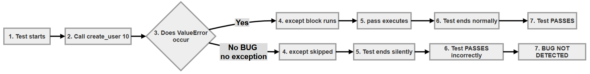
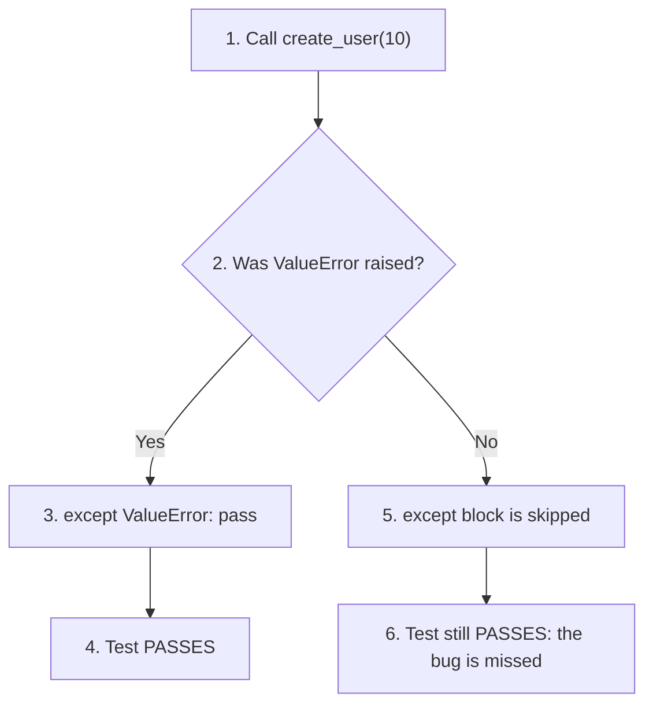
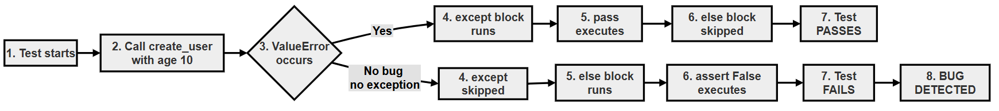
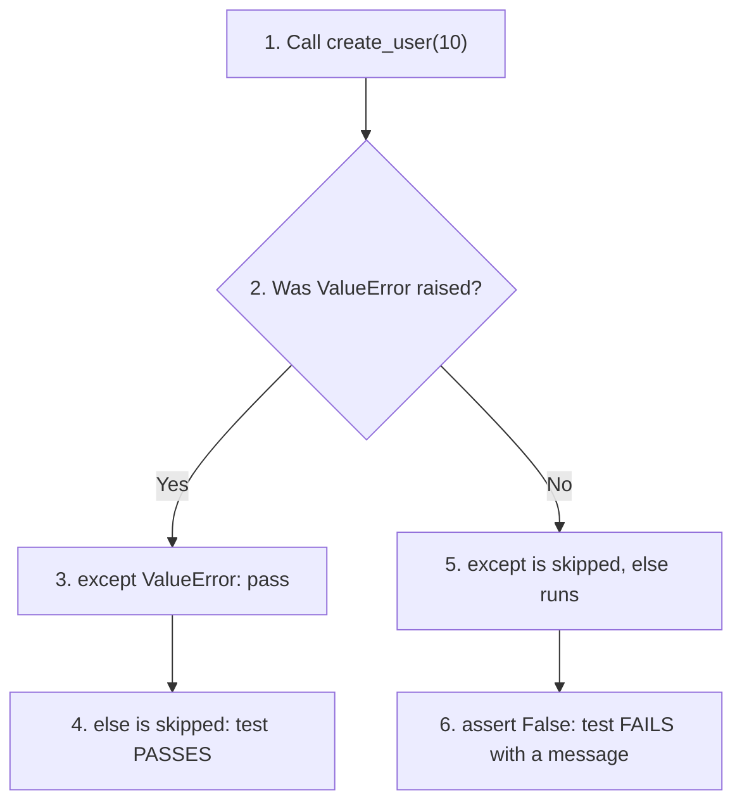
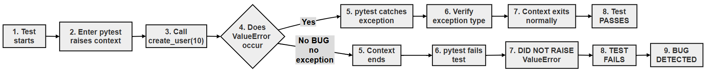
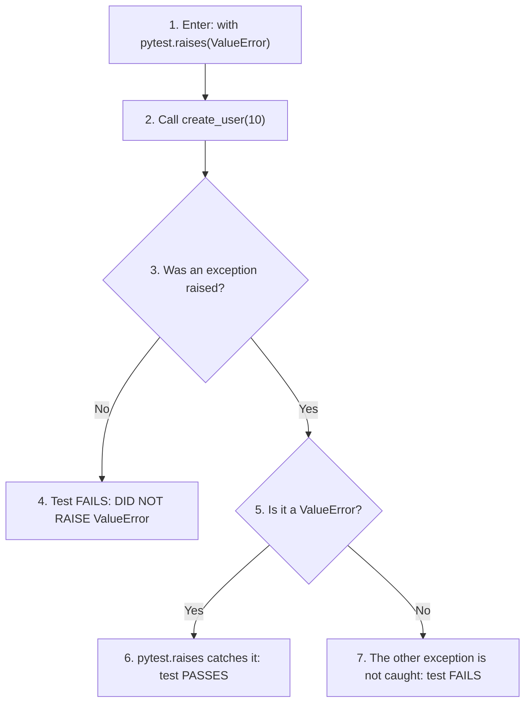

# Exception Testing in pytest: Why pytest.raises Is Better Than try/except

Many functions are designed to refuse bad input by **raising an exception**. A test for such a function has to check two things: that the exception is raised when it should be, and that the test **fails** when it is not. Beginners often write exception tests that look correct but can never fail. Such a test gives false confidence, which is worse than having no test at all.

This page compares three ways of writing an exception test:

1. `try/except` on its own (incorrect)
2. `try/except/else` (correct, but long-winded)
3. `pytest.raises()` (recommended)

We run all three against a correct function **and** a deliberately broken one, so you can see with your own eyes which tests catch the bug. The page also explains black-box testing, how to choose test inputs, and what `pytest.raises()` does behind the scenes.

This topic builds on the `try`/`except` statement you met earlier in the book and on the `pytest.raises()` examples elsewhere in this chapter.

## Table of Contents

- [Exception Testing in pytest: Why pytest.raises Is Better Than try/except](070-ch20-pytest-raises-vs-try-except.md#exception-testing-in-pytest-why-pytestraises-is-better-than-tryexcept)
    - [Key Terms Used on This Page](070-ch20-pytest-raises-vs-try-except.md#key-terms-used-on-this-page)
    - [1. Introduction](070-ch20-pytest-raises-vs-try-except.md#1-introduction)
    - [2. Example Function](070-ch20-pytest-raises-vs-try-except.md#2-example-function)
    - [3. Incorrect Approach (Using only try/except without else)](070-ch20-pytest-raises-vs-try-except.md#3-incorrect-approach-using-only-tryexcept-without-else)
        - [Problem](070-ch20-pytest-raises-vs-try-except.md#problem)
            - [Flow chart (Using only try/except without else)](070-ch20-pytest-raises-vs-try-except.md#flow-chart-using-only-tryexcept-without-else)
    - [4. Improved Manual Approach (try/except/else)](070-ch20-pytest-raises-vs-try-except.md#4-improved-manual-approach-tryexceptelse)
        - [Why this works](070-ch20-pytest-raises-vs-try-except.md#why-this-works)
            - [Flow chart for try/except with else](070-ch20-pytest-raises-vs-try-except.md#flow-chart-for-tryexcept-with-else)
    - [5. Recommended Approach (pytest.raises)](070-ch20-pytest-raises-vs-try-except.md#5-recommended-approach-pytestraises)
        - [Flow chart of pytest raises](070-ch20-pytest-raises-vs-try-except.md#flow-chart-of-pytest-raises)
        - [Why this is better](070-ch20-pytest-raises-vs-try-except.md#why-this-is-better)
    - [6. Proving It: Running All Three Approaches Against a Broken Function](070-ch20-pytest-raises-vs-try-except.md#6-proving-it-running-all-three-approaches-against-a-broken-function)
    - [7. Key Insight: Black-box Testing](070-ch20-pytest-raises-vs-try-except.md#7-key-insight-black-box-testing)
    - [8. Common Misunderstanding](070-ch20-pytest-raises-vs-try-except.md#8-common-misunderstanding)
    - [9. Valid vs Invalid Inputs](070-ch20-pytest-raises-vs-try-except.md#9-valid-vs-invalid-inputs)
    - [10. Internal Working of pytest.raises](070-ch20-pytest-raises-vs-try-except.md#10-internal-working-of-pytestraises)
    - [Scripts for This Page and How to Run Them](070-ch20-pytest-raises-vs-try-except.md#scripts-for-this-page-and-how-to-run-them)
    - [Follow-Up Questions](070-ch20-pytest-raises-vs-try-except.md#follow-up-questions)
        - [Question 1: Can This Test Ever Fail?](070-ch20-pytest-raises-vs-try-except.md#question-1-can-this-test-ever-fail)
        - [Question 2: How Do You Know a Test Can Fail?](070-ch20-pytest-raises-vs-try-except.md#question-2-how-do-you-know-a-test-can-fail)
        - [Question 3: The Wrong Exception Type](070-ch20-pytest-raises-vs-try-except.md#question-3-the-wrong-exception-type)
        - [Question 4: Which Ages Would You Test?](070-ch20-pytest-raises-vs-try-except.md#question-4-which-ages-would-you-test)
    - [11. Summary](070-ch20-pytest-raises-vs-try-except.md#11-summary)
    - [Further Reading](070-ch20-pytest-raises-vs-try-except.md#further-reading)

## Key Terms Used on This Page

| Term | Simple Meaning | Learn More |
| --- | --- | --- |
| Exception | An error signal raised while a program runs. If nothing catches it, the program stops | [Python tutorial: Errors and Exceptions](https://docs.python.org/3/tutorial/errors.html) |
| `try/except/else` | `try` runs some code, `except` runs if a matching exception happens, and `else` runs only if **no** exception happened | [Python tutorial: Handling Exceptions](https://docs.python.org/3/tutorial/errors.html#handling-exceptions) |
| `pytest.raises()` | A pytest tool that checks that a block of code raises a given exception, and fails the test if it does not | [pytest: expected exceptions](https://docs.pytest.org/en/stable/how-to/assert.html#assertions-about-expected-exceptions) |
| Boilerplate | Code that must be written again and again but adds nothing to what is being checked | |
| False positive (in testing) | A test that passes even though the code is broken | |
| Black-box testing | Testing what a piece of code does (its inputs and outputs), without looking at how it does it | [Black-box testing on Wikipedia](https://en.wikipedia.org/wiki/Black-box_testing) |
| Boundary value | An input right at the edge of a rule, such as 12 and 13 for "at least 13" | [Boundary-value analysis on Wikipedia](https://en.wikipedia.org/wiki/Boundary-value_analysis) |

[Back to the Table of Contents](070-ch20-pytest-raises-vs-try-except.md#table-of-contents)

## 1. Introduction

Exception handling is one of the most common areas where beginners write misleading tests. A misleading test is one that passes when it should fail, so it hides bugs instead of finding them.

This guide explains why `pytest.raises()` is preferred over hand-written `try/except` patterns. We start with a simple function, look at three ways of testing it, and then prove the difference by running all three against a broken copy of the function.

[Back to the Table of Contents](070-ch20-pytest-raises-vs-try-except.md#table-of-contents)

## 2. Example Function

```python
def create_user(age):
    if age < 13:
        raise ValueError("User must be at least 13 years old")
    return "User created"
```

Business rule:

| Input | Expected Behaviour |
| --- | --- |
| `age < 13` | Raise `ValueError` |
| `age >= 13` (13 or more) | Return `"User created"` |

For the runnable examples on this page, this function is saved as `user_service.py`:

```python
# user_service.py
# The CORRECT version of create_user().

def create_user(age):
    # Step 1 - Business rule: users must be at least 13 years old
    if age < 13:
        raise ValueError("User must be at least 13 years old")
    # Step 2 - The age is acceptable
    return "User created"
```

To test our tests, we also need a **broken** copy of the function. Imagine a programmer who mistypes `13` as `1`. Save this as `user_service_broken.py`:

```python
# user_service_broken.py
# A BROKEN version of create_user(), used only to test our tests.
# Someone mistyped 13 as 1, so an age of 10 no longer raises an error.

def create_user(age):
    # Step 1 - The bug: the check should be 'age < 13'
    if age < 1:
        raise ValueError("User must be at least 13 years old")
    # Step 2 - An age of 10 now reaches this line
    return "User created"
```

With the broken version, `create_user(10)` no longer raises an error. A good exception test must notice this and fail.

[Back to the Table of Contents](070-ch20-pytest-raises-vs-try-except.md#table-of-contents)

## 3. Incorrect Approach (Using only try/except without else)

```python
def test_create_user():
    try:
        create_user(10)
    except ValueError:
        pass
```

[Back to the Table of Contents](070-ch20-pytest-raises-vs-try-except.md#table-of-contents)

### Problem

If the function is broken and stops raising the exception, the test **still passes**.

Follow the two possible paths step by step:

1. **When the function works:** `create_user(10)` raises `ValueError`. The `except` block catches it and does nothing (`pass`). The test ends normally, so it passes. Good.
2. **When the function is broken:** `create_user(10)` returns `"User created"` and raises nothing. The `except` block is skipped. The test reaches its end with no failed `assert`, so it **also passes**. Bad.

A test that passes in both cases cannot tell a working function from a broken one. It checks nothing.

[Back to the Table of Contents](070-ch20-pytest-raises-vs-try-except.md#table-of-contents)

#### Flow chart (Using only try/except without else)



The same flow, step by step:



[Back to the Table of Contents](070-ch20-pytest-raises-vs-try-except.md#table-of-contents)

## 4. Improved Manual Approach (try/except/else)

```python
def test_create_user():
    try:
        create_user(10)
    except ValueError:
        pass
    else:
        assert False, "Expected ValueError was not raised"
```

[Back to the Table of Contents](070-ch20-pytest-raises-vs-try-except.md#table-of-contents)

### Why this works

- `except` handles the expected exception. The test carries on and passes.
- `else` catches the missing exception. It runs **only** when no exception happened, and `assert False` makes the test fail with a clear message.

Step by step:

1. **When the function works:** `ValueError` is raised, `except` catches it, `else` is skipped, and the test passes.
2. **When the function is broken:** no exception is raised, so `except` is skipped and `else` runs. `assert False` fails the test with the message `Expected ValueError was not raised`.

This version is correct, but it takes six lines to say one simple thing. It is also easy to forget the `else` part, which silently turns it back into the incorrect approach.

A small improvement: instead of `assert False, "..."`, pytest provides `pytest.fail("...")`, which says more clearly that the test should fail at this point.

[Back to the Table of Contents](070-ch20-pytest-raises-vs-try-except.md#table-of-contents)

#### Flow chart for try/except with else



The same flow, step by step:



[Back to the Table of Contents](070-ch20-pytest-raises-vs-try-except.md#table-of-contents)

## 5. Recommended Approach (pytest.raises)

```python
import pytest


def test_create_user():
    with pytest.raises(ValueError):
        create_user(10)
```

[Back to the Table of Contents](070-ch20-pytest-raises-vs-try-except.md#table-of-contents)

### Flow chart of pytest raises



The same flow, step by step:



[Back to the Table of Contents](070-ch20-pytest-raises-vs-try-except.md#table-of-contents)

### Why this is better

- **Clear intention:** the line `with pytest.raises(ValueError):` reads almost like English: "this code should raise a ValueError".
- **Less boilerplate:** two lines instead of six.
- **Fails automatically if the exception is missing:** there is no `else` to forget.
- **Easier to read:** anyone familiar with pytest recognises it at once.
- **More checks with little effort:** `match="..."` checks the message, and `as excinfo` lets you inspect the exception afterwards.

| | try/except only | try/except/else | pytest.raises |
| --- | --- | --- | --- |
| Passes when the exception is raised | Yes | Yes | Yes |
| Fails when the exception is missing | **No** | Yes | Yes |
| Lines of code | 4 | 6 | 2 |
| Easy to get wrong | Yes, it is already wrong | Yes, if `else` is forgotten | No |
| Checks the message | Only with extra code | Only with extra code | Yes, with `match=` |
| Recommended | No | Acceptable | **Yes** |

[Back to the Table of Contents](070-ch20-pytest-raises-vs-try-except.md#table-of-contents)

## 6. Proving It: Running All Three Approaches Against a Broken Function

Words are one thing. Let us run all three approaches against both the correct and the broken versions of `create_user()`. Save this as `test_three_approaches.py`, in the same folder as `user_service.py` and `user_service_broken.py`:

```python
# test_three_approaches.py
# Runs the three styles of exception test against the CORRECT and the
# BROKEN version of create_user(). A good test must PASS for the correct
# version and FAIL for the broken one.
# Run it with:  pytest -v test_three_approaches.py

# Step 1 - Import pytest and both versions of the function
import pytest
import user_service
import user_service_broken


# Step 2 - Approach A: try/except without else (the incorrect approach)
def check_try_except_only(create_user):
    try:
        create_user(10)
    except ValueError:
        pass


# Step 3 - Approach B: try/except/else (the improved manual approach)
def check_try_except_else(create_user):
    try:
        create_user(10)
    except ValueError:
        pass
    else:
        assert False, "Expected ValueError was not raised"


# Step 4 - Approach C: pytest.raises (the recommended approach)
def check_pytest_raises(create_user):
    with pytest.raises(ValueError):
        create_user(10)


# Step 5 - Run each approach against each version
def test_A_try_except_only_correct():
    check_try_except_only(user_service.create_user)

def test_A_try_except_only_broken():
    check_try_except_only(user_service_broken.create_user)

def test_B_try_except_else_correct():
    check_try_except_else(user_service.create_user)

def test_B_try_except_else_broken():
    check_try_except_else(user_service_broken.create_user)

def test_C_pytest_raises_correct():
    check_pytest_raises(user_service.create_user)

def test_C_pytest_raises_broken():
    check_pytest_raises(user_service_broken.create_user)
```

The three `check_...` functions do not start with `test`, so pytest does not run them directly. They are helpers. Each `test_...` function calls one helper with one version of `create_user`, which gives six tests in all.

Run:

```bash
pytest -v test_three_approaches.py
```

Output:

```text
============================= test session starts ==============================
platform win32 -- Python 3.10.10, pytest-9.0.3, pluggy-1.6.0 -- C:\Users\Anurag Gupta\AppData\Local\Programs\Python\Python310\python.exe
cachedir: .pytest_cache
rootdir: C:\raises-demo
plugins: anyio-4.12.1
collected 6 items

test_three_approaches.py::test_A_try_except_only_correct PASSED          [ 16%]
test_three_approaches.py::test_A_try_except_only_broken PASSED           [ 33%]
test_three_approaches.py::test_B_try_except_else_correct PASSED          [ 50%]
test_three_approaches.py::test_B_try_except_else_broken FAILED           [ 66%]
test_three_approaches.py::test_C_pytest_raises_correct PASSED            [ 83%]
test_three_approaches.py::test_C_pytest_raises_broken FAILED             [100%]

=================================== FAILURES ===================================
________________________ test_B_try_except_else_broken _________________________

    def test_B_try_except_else_broken():
>       check_try_except_else(user_service_broken.create_user)

test_three_approaches.py:48:
_ _ _ _ _ _ _ _ _ _ _ _ _ _ _ _ _ _ _ _ _ _ _ _ _ _ _ _ _ _ _ _ _ _ _ _ _ _ _ _

create_user = <function create_user at 0x0000021F4C8B7D90>

    def check_try_except_else(create_user):
        try:
            create_user(10)
        except ValueError:
            pass
        else:
>           assert False, "Expected ValueError was not raised"
E           AssertionError: Expected ValueError was not raised
E           assert False

test_three_approaches.py:28: AssertionError
_________________________ test_C_pytest_raises_broken __________________________

    def test_C_pytest_raises_broken():
>       check_pytest_raises(user_service_broken.create_user)

test_three_approaches.py:54:
_ _ _ _ _ _ _ _ _ _ _ _ _ _ _ _ _ _ _ _ _ _ _ _ _ _ _ _ _ _ _ _ _ _ _ _ _ _ _ _

create_user = <function create_user at 0x0000021F4C8B7D90>

    def check_pytest_raises(create_user):
>       with pytest.raises(ValueError):
E       Failed: DID NOT RAISE <class 'ValueError'>

test_three_approaches.py:33: Failed
=========================== short test summary info ============================
FAILED test_three_approaches.py::test_B_try_except_else_broken - AssertionErr...
FAILED test_three_approaches.py::test_C_pytest_raises_broken - Failed: DID NO...
========================= 2 failed, 4 passed in 0.02s ==========================
```

The memory addresses (such as `0x0000021F4C8B7D90`) will be different on your computer.

Read the results in a table:

| Approach | Correct Version | Broken Version | Verdict |
| --- | --- | --- | --- |
| A. try/except only | PASSED | **PASSED** | Useless: it cannot see the bug |
| B. try/except/else | PASSED | FAILED | Works |
| C. pytest.raises | PASSED | FAILED | Works, with the shortest code |

The key line is `test_A_try_except_only_broken PASSED`. The function is broken, yet the test passes. Approaches B and C both fail on the broken version, which is exactly what a good test should do. Notice also that approach C gives the clearest message, `DID NOT RAISE <class 'ValueError'>`, without us having to write one.

[Back to the Table of Contents](070-ch20-pytest-raises-vs-try-except.md#table-of-contents)

## 7. Key Insight: Black-box Testing

Tests do NOT inspect internal logic like:

```python
if age < 13
```

Instead, they check behaviour:

- Input → Output
- Input → Exception

This is called **black-box testing**. Think of the function as a sealed box. You cannot see inside it. You can only put something in (an input) and watch what comes out (a return value or an exception).

This matters because the inside of a function can change. Someone might rewrite `if age < 13` as `if not age >= 13`, or move the check into another function. The behaviour stays the same, so black-box tests keep passing. They fail only when the **behaviour** changes, which is exactly when you want to know.

[Back to the Table of Contents](070-ch20-pytest-raises-vs-try-except.md#table-of-contents)

## 8. Common Misunderstanding

| | Statement |
| --- | --- |
| WRONG | "The test should check that `age < 13` exists in the code." |
| CORRECT | "The test should check what happens when `age = 10`." |

A test that looks for a particular line of code would break as soon as the code is tidied up, even if it still works perfectly. A test that checks behaviour does not care how the code is written.

[Back to the Table of Contents](070-ch20-pytest-raises-vs-try-except.md#table-of-contents)

## 9. Valid vs Invalid Inputs

```python
create_user(10)  # should raise an error
create_user(14)  # should succeed
```

Each test case checks one observable behaviour. A good set of tests covers both kinds of input:

1. **Invalid input** (such as 10) must raise `ValueError`.
2. **Valid input** (such as 14) must succeed.
3. **Boundary values** (12 and 13) must fall on the correct side of the rule. Bugs often hide here. For example, writing `age <= 13` instead of `age < 13` would wrongly refuse a 13-year-old, and only a test with age 13 would catch it.

Here is a complete set of tests. Save it as `test_create_user.py`:

```python
# test_create_user.py
# A complete set of black-box tests for create_user().
# Each test checks one observable behaviour.
# Run it with:  pytest -v test_create_user.py

# Step 1 - Import pytest and the function under test
import pytest
from user_service import create_user


# Step 2 - An invalid age must raise ValueError with the right message
def test_age_10_is_rejected():
    with pytest.raises(ValueError, match="at least 13"):
        create_user(10)


# Step 3 - A valid age must succeed
def test_age_14_is_accepted():
    assert create_user(14) == "User created"


# Step 4 - The boundary: 12 is the last age refused, 13 the first accepted
def test_age_12_is_rejected():
    with pytest.raises(ValueError):
        create_user(12)


def test_age_13_is_accepted():
    assert create_user(13) == "User created"
```

Run:

```bash
pytest -v test_create_user.py
```

Output:

```text
============================= test session starts ==============================
platform win32 -- Python 3.10.10, pytest-9.0.3, pluggy-1.6.0 -- C:\Users\Anurag Gupta\AppData\Local\Programs\Python\Python310\python.exe
cachedir: .pytest_cache
rootdir: C:\raises-demo
plugins: anyio-4.12.1
collected 4 items

test_create_user.py::test_age_10_is_rejected PASSED                      [ 25%]
test_create_user.py::test_age_14_is_accepted PASSED                      [ 50%]
test_create_user.py::test_age_12_is_rejected PASSED                      [ 75%]
test_create_user.py::test_age_13_is_accepted PASSED                      [100%]

============================== 4 passed in 0.01s ===============================
```

| Test | Input | Expected | Why It Is Needed |
| --- | --- | --- | --- |
| `test_age_10_is_rejected` | 10 | `ValueError` mentioning "at least 13" | A clearly invalid age |
| `test_age_14_is_accepted` | 14 | `"User created"` | A clearly valid age |
| `test_age_12_is_rejected` | 12 | `ValueError` | The last age that must be refused |
| `test_age_13_is_accepted` | 13 | `"User created"` | The first age that must be accepted |

[Back to the Table of Contents](070-ch20-pytest-raises-vs-try-except.md#table-of-contents)

## 10. Internal Working of pytest.raises

Conceptually, `pytest.raises()` does the same job as the `try/except/else` pattern:

```python
try:
    create_user(10)
except ValueError:
    pass
else:
    pytest.fail("DID NOT RAISE <class 'ValueError'>")
```

The real `pytest.raises()` does a little more than this sketch:

1. It catches `ValueError` and any exception **built on top of it** (a subclass).
2. If a **different** kind of exception is raised, it lets that exception pass through, and the test fails with it.
3. If **no** exception is raised, it fails the test with the message `DID NOT RAISE <class 'ValueError'>`.
4. If `match=` is given, it also checks the message.
5. It stores the caught exception so you can inspect it with `as excinfo`.

To see the idea without pytest, save this as `demo_manual_raises.py`. It builds a tiny version of `pytest.raises()` by hand:

```python
# demo_manual_raises.py
# A simplified, home-made version of what pytest.raises does,
# so that we can watch each step. Run it with: python demo_manual_raises.py

# Step 1 - Import the correct and broken versions of the function
import user_service
import user_service_broken


# Step 2 - A simple checker that works like pytest.raises
def expect_error(func, value, expected_error):
    try:
        func(value)
    except expected_error as error:
        # The expected error happened: the check passes
        print(f"   PASS: {expected_error.__name__} raised -> {error}")
    else:
        # No error happened: the check must fail
        print(f"   FAIL: DID NOT RAISE {expected_error.__name__}")


# Step 3 - Try it on both versions
print("Correct version, age 10:")
expect_error(user_service.create_user, 10, ValueError)

print("Broken version, age 10:")
expect_error(user_service_broken.create_user, 10, ValueError)
```

Run it with Python:

```bash
python demo_manual_raises.py
```

Output:

```text
Correct version, age 10:
   PASS: ValueError raised -> User must be at least 13 years old
Broken version, age 10:
   FAIL: DID NOT RAISE ValueError
```

This is exactly the `try/except/else` logic, packed into a reusable function. `pytest.raises()` gives you a well-tested version of it, so you never have to write it yourself.

[Back to the Table of Contents](070-ch20-pytest-raises-vs-try-except.md#table-of-contents)

## Scripts for This Page and How to Run Them

All the scripts on this page are available in the [raises-demo folder](https://github.com/ag999git/001-Python-book-2026/tree/main/20-unittest/raises-demo).

| File | What It Contains |
| --- | --- |
| [user_service.py](https://github.com/ag999git/001-Python-book-2026/blob/main/20-unittest/raises-demo/user_service.py) | The correct `create_user()` function |
| [user_service_broken.py](https://github.com/ag999git/001-Python-book-2026/blob/main/20-unittest/raises-demo/user_service_broken.py) | A broken copy used to test the tests |
| [test_three_approaches.py](https://github.com/ag999git/001-Python-book-2026/blob/main/20-unittest/raises-demo/test_three_approaches.py) | The three approaches run against both versions (two tests fail on purpose) |
| [test_create_user.py](https://github.com/ag999git/001-Python-book-2026/blob/main/20-unittest/raises-demo/test_create_user.py) | A complete set of black-box tests, including boundary values |
| [demo_manual_raises.py](https://github.com/ag999git/001-Python-book-2026/blob/main/20-unittest/raises-demo/demo_manual_raises.py) | A home-made version of `pytest.raises()` (run with `python`) |

To run them on your computer:

1. Create a folder, for example `raises-demo`, and save all five files in it.
2. Open the folder in VS Code (**File > Open Folder...**) and open the terminal (**Terminal > New Terminal**).
3. Check that pytest is installed with `python -m pytest --version`. If you see `No module named pytest`, install it with `python -m pip install pytest`.
4. Run the test files with `python -m pytest -v test_three_approaches.py` and `python -m pytest -v test_create_user.py`. Run `demo_manual_raises.py` with `python demo_manual_raises.py`.

If you run all the test files together with `python -m pytest -v`, expect the summary `2 failed, 8 passed`. The two failures come from `test_three_approaches.py`, where they show that approaches B and C catch the bug.

Detailed, step-by-step instructions (installing Python and VS Code, downloading files from GitHub and fixing common errors) are given in [Running the Scripts on Your Computer](020-ch20-unittest-disadvantage-rigid-oop-style.md#running-the-scripts-on-your-computer).

[Back to the Table of Contents](070-ch20-pytest-raises-vs-try-except.md#table-of-contents)

## Follow-Up Questions

### Question 1: Can This Test Ever Fail?

A student writes:

```python
def test_create_user():
    try:
        create_user(10)
    except ValueError:
        print("Error raised as expected")
```

Is this a good test?

**Answer:**

1. If `create_user(10)` raises `ValueError`, the message is printed and the test passes.
2. If it raises nothing, the `except` block is skipped and the test still passes.
3. There is no `assert` and no `else`, so there is no way for the test to fail on a missing exception.
4. It is the incorrect approach from section 3. The `print()` makes no difference. Use `pytest.raises(ValueError)` instead.

[Back to the Table of Contents](070-ch20-pytest-raises-vs-try-except.md#table-of-contents)

### Question 2: How Do You Know a Test Can Fail?

What simple habit tells you whether a new test is really checking something?

**Answer:**

1. Break the code on purpose, for example by changing `13` to `1`, as `user_service_broken.py` does.
2. Run the test.
3. If the test **fails**, it is doing its job. If it still passes, it is not checking what you think.
4. Put the code back and check that the test passes again.

[Back to the Table of Contents](070-ch20-pytest-raises-vs-try-except.md#table-of-contents)

### Question 3: The Wrong Exception Type

What happens if `create_user(10)` raised `TypeError` instead of `ValueError`, and the test uses `pytest.raises(ValueError)`?

**Answer:**

1. `pytest.raises(ValueError)` catches only `ValueError` and its subclasses.
2. A `TypeError` is not caught. It passes straight through the `with` block.
3. The test fails and shows the `TypeError`.
4. This is correct behaviour: the function raised the wrong kind of error, and the test reports it.

[Back to the Table of Contents](070-ch20-pytest-raises-vs-try-except.md#table-of-contents)

### Question 4: Which Ages Would You Test?

The rule changes to "users must be at least 16". Which ages would you use in the tests, and why?

**Answer:**

1. One clearly invalid age, such as 10, which must raise `ValueError`.
2. One clearly valid age, such as 30, which must succeed.
3. The two boundary values: 15 (the last age refused) and 16 (the first age accepted).
4. The boundary tests are the most important ones, because mistakes like `<` versus `<=` show up only there.

[Back to the Table of Contents](070-ch20-pytest-raises-vs-try-except.md#table-of-contents)

## 11. Summary

- Tests check behaviour, not the way the code is written (black-box testing).
- An exception test must fail when the exception is missing. A `try/except` without `else` cannot do this.
- `try/except/else` works, but it is long and easy to get wrong.
- `pytest.raises()` is the cleanest and safest approach. It fails automatically with `DID NOT RAISE` when no exception is raised.
- Test valid inputs, invalid inputs and the boundary values between them.
- To be sure a test works, make the code fail on purpose and check that the test fails too.

[Back to the Table of Contents](070-ch20-pytest-raises-vs-try-except.md#table-of-contents)

## Further Reading

- [pytest: Assertions about expected exceptions](https://docs.pytest.org/en/stable/how-to/assert.html#assertions-about-expected-exceptions)
- [pytest: pytest.raises reference](https://docs.pytest.org/en/stable/reference/reference.html#pytest-raises)
- [pytest: pytest.fail reference](https://docs.pytest.org/en/stable/reference/reference.html#pytest-fail)
- [Python tutorial: Handling Exceptions](https://docs.python.org/3/tutorial/errors.html#handling-exceptions)

[Back to the Table of Contents](070-ch20-pytest-raises-vs-try-except.md#table-of-contents)

