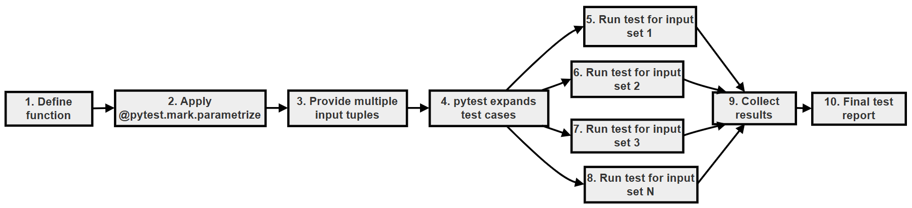
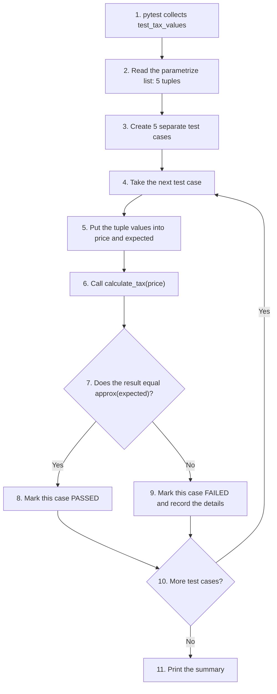

# Project: The "Micro-Precision" Tax Calculator (Using Parameterized Testing)

This project follows one small function, a 10% tax calculator, through three rounds of testing. Each round fixes a problem found in the one before:

1. **Repetitive tests:** one test function per price. This works, but it does not scale, and one of the tests fails in a surprising way.
2. **Parameterized tests:** one test function with a list of prices, using `@pytest.mark.parametrize`. The repetition is gone, but the surprising failure remains.
3. **Parameterized tests with `pytest.approx()`:** the surprising failure is explained and fixed.

Along the way you will learn why computers cannot store most decimal numbers exactly (a **floating-point** issue that affects every programming language, not just Python), how to give each test case a readable name with `ids`, and what a real money application should do about rounding.

This project brings together two ideas from this chapter: writing many tests without repeating code, and comparing results correctly. Both are everyday skills for anyone writing Python tests.

## Table of Contents

- [Project: The "Micro-Precision" Tax Calculator (Using Parameterized Testing)](080-ch20-tax-collector-project.md#project-the-micro-precision-tax-calculator-using-parameterized-testing)
    - [Key Terms Used on This Page](080-ch20-tax-collector-project.md#key-terms-used-on-this-page)
    - [1. Problem Statement](080-ch20-tax-collector-project.md#1-problem-statement)
    - [2. Application Script (Which Is to Be Tested)](080-ch20-tax-collector-project.md#2-application-script-which-is-to-be-tested)
    - [3. First Attempt: Repetitive Tests, Not Using Parameterized Testing (Bad Practice)](080-ch20-tax-collector-project.md#3-first-attempt-repetitive-tests-not-using-parameterized-testing-bad-practice)
        - [The Output](080-ch20-tax-collector-project.md#the-output)
        - [Problem](080-ch20-tax-collector-project.md#problem)
    - [4. Solution: Parameterized Testing](080-ch20-tax-collector-project.md#4-solution-parameterized-testing)
    - [5. What pytest Does Internally](080-ch20-tax-collector-project.md#5-what-pytest-does-internally)
    - [6. Hidden Problem (Floating-Point Issue)](080-ch20-tax-collector-project.md#6-hidden-problem-floating-point-issue)
    - [7. Concept Insight](080-ch20-tax-collector-project.md#7-concept-insight)
    - [8. Solution: pytest.approx Inside parametrize](080-ch20-tax-collector-project.md#8-solution-pytestapprox-inside-parametrize)
    - [9. Flowchart: Parametrized Testing and Execution](080-ch20-tax-collector-project.md#9-flowchart-parametrized-testing-and-execution)
    - [10. Tests Are Separate](080-ch20-tax-collector-project.md#10-tests-are-separate)
    - [11. Using ids in parametrize](080-ch20-tax-collector-project.md#11-using-ids-in-parametrize)
    - [12. What Should a Real Money Application Do?](080-ch20-tax-collector-project.md#12-what-should-a-real-money-application-do)
    - [Scripts for This Page and How to Run Them](080-ch20-tax-collector-project.md#scripts-for-this-page-and-how-to-run-them)
    - [Follow-Up Questions](080-ch20-tax-collector-project.md#follow-up-questions)
        - [Question 1: Adding a New Test Case](080-ch20-tax-collector-project.md#question-1-adding-a-new-test-case)
        - [Question 2: Why Not Use a Loop?](080-ch20-tax-collector-project.md#question-2-why-not-use-a-loop)
        - [Question 3: Does approx Hide Real Mistakes?](080-ch20-tax-collector-project.md#question-3-does-approx-hide-real-mistakes)
        - [Question 4: A Mismatched ids List](080-ch20-tax-collector-project.md#question-4-a-mismatched-ids-list)
    - [Summary](080-ch20-tax-collector-project.md#summary)
    - [Further Reading](080-ch20-tax-collector-project.md#further-reading)

## Key Terms Used on This Page

| Term | Simple Meaning | Learn More |
| --- | --- | --- |
| Parameterized testing | Running one test function many times, each time with a different set of input values | [pytest: parametrize](https://docs.pytest.org/en/stable/how-to/parametrize.html) |
| `@pytest.mark.parametrize` | The pytest decorator that supplies the sets of values for a parameterized test | [pytest: parametrize reference](https://docs.pytest.org/en/stable/reference/reference.html#pytest-mark-parametrize) |
| Floating-point number (float) | Python's type for numbers with a decimal point, such as `1.10`. It is stored in binary and is often slightly inexact | [Python tutorial: Floating-Point Arithmetic](https://docs.python.org/3/tutorial/floatingpoint.html) |
| `pytest.approx()` | A pytest helper that treats two numbers as equal if they are extremely close | [pytest: pytest.approx](https://docs.pytest.org/en/stable/reference/reference.html#pytest-approx) |
| Tolerance | How big a difference is allowed before two numbers count as "not equal" | |
| Test ID | The name pytest gives each test case, shown in square brackets, such as `test_tax_values[1.1-0.11]` | [pytest: parametrize ids](https://docs.pytest.org/en/stable/example/parametrize.html#different-options-for-test-ids) |
| `Decimal` | A Python type from the `decimal` module that stores decimal numbers exactly, often used for money | [Python docs: decimal](https://docs.python.org/3/library/decimal.html) |

[Back to the Table of Contents](080-ch20-tax-collector-project.md#table-of-contents)

## 1. Problem Statement

You are building a simple Point of Sale system (the software a shop uses at the checkout counter).

The system calculates tax using:

> Tax rate = 10%

Your task is to test the function with many different inputs, efficiently, using **parameterized testing**.

[Back to the Table of Contents](080-ch20-tax-collector-project.md#table-of-contents)

## 2. Application Script (Which Is to Be Tested)

Save this as `tax_calculator.py`:

```python
# tax_calculator.py
# The application code to be tested.


def calculate_tax(price):
    # Step 1 - The tax rate is 10%, written as a decimal fraction
    tax_rate = 0.10
    # Step 2 - Tax is the price multiplied by the rate
    return price * tax_rate
```

For example, `calculate_tax(2.00)` returns `0.2`, which is 10% of 2.00.

[Back to the Table of Contents](080-ch20-tax-collector-project.md#table-of-contents)

## 3. First Attempt: Repetitive Tests, Not Using Parameterized Testing (Bad Practice)

Save this as `test_tax_calculator.py` in the same folder:

```python
# test_tax_calculator.py
# First attempt: one separate test function for every price (repetitive).
# Run it with:  pytest -v test_tax_calculator.py

# Step 1 - Import the function we want to test
from tax_calculator import calculate_tax


# Step 2 - Test case 1: a price of 1.00 should give a tax of 0.10 (10% of 1.00)
def test_tax_1():
    assert calculate_tax(1.00) == 0.10


# Step 3 - Test case 2: a price of 1.10 should give a tax of 0.11 (10% of 1.10)
def test_tax_2():
    assert calculate_tax(1.10) == 0.11


# Step 4 - Test case 3: a price of 2.00 should give a tax of 0.20 (10% of 2.00)
def test_tax_3():
    assert calculate_tax(2.00) == 0.20
```

[Back to the Table of Contents](080-ch20-tax-collector-project.md#table-of-contents)

### The Output

Run the following command in the terminal:

```bash
pytest -v test_tax_calculator.py
```

Output:

```text
============================= test session starts ==============================
platform win32 -- Python 3.10.10, pytest-9.0.3, pluggy-1.6.0 -- C:\Users\Anurag Gupta\AppData\Local\Programs\Python\Python310\python.exe
cachedir: .pytest_cache
rootdir: C:\tax-demo
plugins: anyio-4.12.1
collected 3 items

test_tax_calculator.py::test_tax_1 PASSED                                [ 33%]
test_tax_calculator.py::test_tax_2 FAILED                                [ 66%]
test_tax_calculator.py::test_tax_3 PASSED                                [100%]

=================================== FAILURES ===================================
__________________________________ test_tax_2 __________________________________

    def test_tax_2():
>       assert calculate_tax(1.10) == 0.11
E       assert 0.11000000000000001 == 0.11
E        +  where 0.11000000000000001 = calculate_tax(1.1)

test_tax_calculator.py:16: AssertionError
=========================== short test summary info ============================
FAILED test_tax_calculator.py::test_tax_2 - assert 0.11000000000000001 == 0.11
========================= 1 failed, 2 passed in 0.01s ==========================
```

[Back to the Table of Contents](080-ch20-tax-collector-project.md#table-of-contents)

### Problem

- **Repetitive code:** the three test functions are almost identical. Only the numbers change.
- **Not scalable:** testing 50 prices would need 50 functions.
- **Hard to maintain:** if the function name or the way of checking changes, every test must be edited.
- **1 test failed and 2 passed, because of an approximation issue.** The function is doing exactly what it was written to do, but `1.10 * 0.10` gives `0.11000000000000001`, not `0.11`. This would not be obvious without the test. We explain it in [section 7](080-ch20-tax-collector-project.md#7-concept-insight).

[Back to the Table of Contents](080-ch20-tax-collector-project.md#table-of-contents)

## 4. Solution: Parameterized Testing

Save this as `test_tax_calculator2.py`:

```python
# test_tax_calculator2.py
# This file contains tests for the calculate_tax function in tax_calculator.py.
# To run the tests in this file, use the command: pytest -v test_tax_calculator2.py

# Step 1 - Import pytest and the function under test
import pytest
from tax_calculator import calculate_tax


# Step 2 - Use @pytest.mark.parametrize to run the same test with several sets of data.
#   "price, expected" names the two arguments the test function receives.
#   The list of tuples holds the data sets: (input, expected result).
@pytest.mark.parametrize("price, expected", [
    (1.00, 0.10),
    (1.10, 0.11),
    (2.00, 0.20),
    (5.50, 0.55),
    (10.00, 1.00),
])
# Step 3 - One test function, run once for each tuple above
def test_tax_values(price, expected):
    assert calculate_tax(price) == expected
```

How it works:

1. `"price, expected"` names the two parameters that the test function will receive.
2. The list contains five tuples. Each tuple is one set of test data: `(input price, expected tax)`.
3. Pytest runs `test_tax_values` once for each tuple. Each time, it puts the first value into `price` and the second into `expected`.

Run:

```bash
pytest -v test_tax_calculator2.py
```

Output:

```text
============================= test session starts ==============================
platform win32 -- Python 3.10.10, pytest-9.0.3, pluggy-1.6.0 -- C:\Users\Anurag Gupta\AppData\Local\Programs\Python\Python310\python.exe
cachedir: .pytest_cache
rootdir: C:\tax-demo
plugins: anyio-4.12.1
collected 5 items

test_tax_calculator2.py::test_tax_values[1.0-0.1] PASSED                 [ 20%]
test_tax_calculator2.py::test_tax_values[1.1-0.11] FAILED                [ 40%]
test_tax_calculator2.py::test_tax_values[2.0-0.2] PASSED                 [ 60%]
test_tax_calculator2.py::test_tax_values[5.5-0.55] PASSED                [ 80%]
test_tax_calculator2.py::test_tax_values[10.0-1.0] PASSED                [100%]

=================================== FAILURES ===================================
__________________________ test_tax_values[1.1-0.11] ___________________________

price = 1.1, expected = 0.11

    @pytest.mark.parametrize("price, expected", [
        (1.00, 0.10),
        (1.10, 0.11),
        (2.00, 0.20),
        (5.50, 0.55),
        (10.00, 1.00),
    ])
    # Step 3 - One test function, run once for each tuple above
    def test_tax_values(price, expected):
>       assert calculate_tax(price) == expected
E       assert 0.11000000000000001 == 0.11
E        +  where 0.11000000000000001 = calculate_tax(1.1)

test_tax_calculator2.py:22: AssertionError
=========================== short test summary info ============================
FAILED test_tax_calculator2.py::test_tax_values[1.1-0.11] - assert 0.11000000...
========================= 1 failed, 4 passed in 0.02s ==========================
```

Result:

- It **solves** the problem of repetitive code. One short test function now checks five prices, and adding a sixth price needs just one more line.
- It **does not solve** the approximation problem. The case with a price of 1.1 still fails in exactly the same way.

[Back to the Table of Contents](080-ch20-tax-collector-project.md#table-of-contents)

## 5. What pytest Does Internally

Each tuple becomes a separate test case, with its own name (test ID):

| Input (price) | Expected | Test Run | Test ID Shown by pytest | Result with `==` |
| --- | --- | --- | --- | --- |
| 1.00 | 0.10 | Test 1 | `test_tax_values[1.0-0.1]` | PASSED |
| 1.10 | 0.11 | Test 2 | `test_tax_values[1.1-0.11]` | FAILED |
| 2.00 | 0.20 | Test 3 | `test_tax_values[2.0-0.2]` | PASSED |
| 5.50 | 0.55 | Test 4 | `test_tax_values[5.5-0.55]` | PASSED |
| 10.00 | 1.00 | Test 5 | `test_tax_values[10.0-1.0]` | PASSED |

Pytest builds each test ID from the parameter values, joined by `-`. Python writes `1.00` as `1.0` and `0.10` as `0.1`, so that is how they appear in the IDs.

[Back to the Table of Contents](080-ch20-tax-collector-project.md#table-of-contents)

## 6. Hidden Problem (Floating-Point Issue)

As the output above shows, one of these tests fails:

```text
assert 0.11000000000000001 == 0.11
```

It is the price of 1.10. The other four prices happen to give results that compare as equal. This is the dangerous part: the problem appears for some inputs and not for others, so it is easy to miss unless you test many values.

[Back to the Table of Contents](080-ch20-tax-collector-project.md#table-of-contents)

## 7. Concept Insight

Floating-point numbers are stored approximately, in binary (base 2).

In our everyday decimal system, some fractions cannot be written exactly. For example, 1/3 is 0.3333... and goes on for ever. In binary, the same happens to many simple decimal fractions, including 0.1. The computer stores the closest binary value it can, which is very slightly off.

So:

- 0.1 is not exactly 0.1 inside the computer.
- Small errors like this can add up, or show up, when numbers are multiplied or added.
- Comparing two floats with `==` can therefore give `False` even when, on paper, the numbers are equal.

This is not a bug in Python. Almost every programming language stores floats in the same way. You can read more in the Python tutorial on [floating-point arithmetic](https://docs.python.org/3/tutorial/floatingpoint.html).

Save this as `float_demo.py` to see it for yourself:

```python
# float_demo.py
# Why 1.10 * 0.10 is not exactly 0.11 in Python.
# Run it with:  python float_demo.py

# Step 1 - The calculation used by calculate_tax(1.10)
result = 1.10 * 0.10
print("1.10 * 0.10         =", result)
print("Is it equal to 0.11?", result == 0.11)

# Step 2 - The same effect in a famous example
print("0.1 + 0.2           =", 0.1 + 0.2)
print("Is it equal to 0.3? ", 0.1 + 0.2 == 0.3)

# Step 3 - What is really stored for 0.1 (shown with 25 decimal places)
print("0.1 is stored as    ", format(0.1, ".25f"))

# Step 4 - Way 1 to compare safely: allow a small tolerance
import math
print("math.isclose(result, 0.11):", math.isclose(result, 0.11))

# Step 5 - Way 2 for money: round to 2 decimal places
print("round(result, 2)    =", round(result, 2))

# Step 6 - Way 3 for money: use the decimal module, which stores
#          decimal fractions exactly when created from strings
from decimal import Decimal
exact = Decimal("1.10") * Decimal("0.10")
print("Decimal result      =", exact)
print("Equal to Decimal('0.11')?", exact == Decimal("0.11"))
```

Run it with Python:

```bash
python float_demo.py
```

Output:

```text
1.10 * 0.10         = 0.11000000000000001
Is it equal to 0.11? False
0.1 + 0.2           = 0.30000000000000004
Is it equal to 0.3?  False
0.1 is stored as     0.1000000000000000055511151
math.isclose(result, 0.11): True
round(result, 2)    = 0.11
Decimal result      = 0.1100
Equal to Decimal('0.11')? True
```

What this shows:

1. `1.10 * 0.10` gives `0.11000000000000001`, which is not equal to `0.11`.
2. The famous example `0.1 + 0.2` gives `0.30000000000000004`.
3. The number stored for `0.1` is really `0.1000000000000000055511151...`.
4. There are three common ways to deal with this: compare with a small tolerance (`math.isclose()`, or `pytest.approx()` in tests), round to 2 decimal places, or use the `Decimal` type for money.

[Back to the Table of Contents](080-ch20-tax-collector-project.md#table-of-contents)

## 8. Solution: pytest.approx Inside parametrize

Save this as `test_tax_calculator3.py`:

```python
# test_tax_calculator3.py
# This file contains tests for the calculate_tax function in tax_calculator.py.
# To run the tests in this file, use the command: pytest -v test_tax_calculator3.py

# Step 1 - Import pytest and the function under test
import pytest
from tax_calculator import calculate_tax


# Step 2 - The same five data sets as before
@pytest.mark.parametrize("price, expected", [
    (1.00, 0.10),
    (1.10, 0.11),
    (2.00, 0.20),
    (5.50, 0.55),
    (10.00, 1.00),
])
# Step 3 - Compare with pytest.approx instead of plain ==
def test_tax_values(price, expected):
    # pytest.approx allows a very small difference (tolerance),
    # so tiny floating-point errors do not make the test fail.
    assert calculate_tax(price) == pytest.approx(expected)
```

Run:

```bash
pytest -v test_tax_calculator3.py
```

Output:

```text
============================= test session starts ==============================
platform win32 -- Python 3.10.10, pytest-9.0.3, pluggy-1.6.0 -- C:\Users\Anurag Gupta\AppData\Local\Programs\Python\Python310\python.exe
cachedir: .pytest_cache
rootdir: C:\tax-demo
plugins: anyio-4.12.1
collected 5 items

test_tax_calculator3.py::test_tax_values[1.0-0.1] PASSED                 [ 20%]
test_tax_calculator3.py::test_tax_values[1.1-0.11] PASSED                [ 40%]
test_tax_calculator3.py::test_tax_values[2.0-0.2] PASSED                 [ 60%]
test_tax_calculator3.py::test_tax_values[5.5-0.55] PASSED                [ 80%]
test_tax_calculator3.py::test_tax_values[10.0-1.0] PASSED                [100%]

============================== 5 passed in 0.01s ===============================
```

Here the approximation problem is solved by using `pytest.approx()`. All five cases pass, including the price of 1.1.

How `pytest.approx()` decides:

1. By default, it allows a difference of up to one millionth of the expected value (a **relative tolerance** of `1e-6`).
2. For `0.11`, that means anything from about `0.1099999` to `0.1100001` counts as equal. `0.11000000000000001` is well inside this range.
3. For an expected value of exactly `0`, a relative tolerance would allow no difference at all, so it also allows a tiny **absolute** difference of `1e-12`.
4. You can choose your own tolerance, for example `pytest.approx(0.11, abs=0.005)` allows any value within half a paisa or half a cent.

`pytest.approx()` is still strict enough to catch real mistakes. For example, `0.110001 == pytest.approx(0.11)` is `False`.

[Back to the Table of Contents](080-ch20-tax-collector-project.md#table-of-contents)

## 9. Flowchart: Parametrized Testing and Execution



The same flow, step by step:



Notice that step 9 does not stop the run. It records the failure and moves on to the next case. The next section explains why this matters.

[Back to the Table of Contents](080-ch20-tax-collector-project.md#table-of-contents)

## 10. Tests Are Separate

> Each parameter set becomes a SEPARATE test case.

So:

- One failure does NOT stop the others.
- All inputs are checked independently.

You can see this in the output of `test_tax_calculator2.py`: the case with a price of 1.1 failed, yet the cases for 2.0, 5.5 and 10.0 still ran and passed. The summary line `1 failed, 4 passed` counts each case separately.

Compare this with a single test that checks all five prices in a loop. There, the first failing `assert` would stop the test, and the remaining prices would never be checked. You would only find the next problem after fixing the first one.

[Back to the Table of Contents](080-ch20-tax-collector-project.md#table-of-contents)

## 11. Using ids in parametrize

You can make the test report easier to read by giving each case a name with `ids`:

```python
@pytest.mark.parametrize(
    "price, expected",
    [
        (1.00, 0.10),
        (1.10, 0.11),
    ],
    ids=["basic price", "rounded price"],  # Custom names for each test case
)
```

The list of `ids` must have exactly one name for each tuple, in the same order.

Here is a complete example with four cases. Save it as `test_tax_calculator_ids.py`:

```python
# test_tax_calculator_ids.py
# Giving each parameter set a readable name with 'ids'.
# To run the tests in this file, use the command: pytest -v test_tax_calculator_ids.py

# Step 1 - Import pytest and the function under test
import pytest
from tax_calculator import calculate_tax


# Step 2 - One name in 'ids' for each tuple, in the same order
@pytest.mark.parametrize(
    "price, expected",
    [
        (1.00, 0.10),
        (1.10, 0.11),
        (0.00, 0.00),
        (999.99, 99.999),
    ],
    ids=["basic price", "price with decimals", "free item", "large price"],
)
# Step 3 - The test itself is unchanged
def test_tax_values(price, expected):
    assert calculate_tax(price) == pytest.approx(expected)
```

Run:

```bash
pytest -v test_tax_calculator_ids.py
```

Output:

```text
============================= test session starts ==============================
platform win32 -- Python 3.10.10, pytest-9.0.3, pluggy-1.6.0 -- C:\Users\Anurag Gupta\AppData\Local\Programs\Python\Python310\python.exe
cachedir: .pytest_cache
rootdir: C:\tax-demo
plugins: anyio-4.12.1
collected 4 items

test_tax_calculator_ids.py::test_tax_values[basic price] PASSED          [ 25%]
test_tax_calculator_ids.py::test_tax_values[price with decimals] PASSED  [ 50%]
test_tax_calculator_ids.py::test_tax_values[free item] PASSED            [ 75%]
test_tax_calculator_ids.py::test_tax_values[large price] PASSED          [100%]

============================== 4 passed in 0.01s ===============================
```

Instead of `test_tax_values[999.99-99.999]`, the report now says `test_tax_values[large price]`. When a test fails, a name that says what the case is about makes the report much easier to understand.

[Back to the Table of Contents](080-ch20-tax-collector-project.md#table-of-contents)

## 12. What Should a Real Money Application Do?

`pytest.approx()` fixes the **test**, not the **calculation**. In a real shop, a customer cannot pay 0.11000000000000001 in tax. For money, the code itself should usually produce exact amounts. Two common ways:

| Approach | Example | When to Use |
| --- | --- | --- |
| Round the result | `round(price * 0.10, 2)` | Simple programs, where rounding to 2 decimal places is enough |
| Use `Decimal` | `Decimal("1.10") * Decimal("0.10")` | Real financial software, where every paisa or cent must be exact |

If `calculate_tax()` returned `round(price * 0.10, 2)`, the plain `==` tests would pass too. Even so, `pytest.approx()` is the right tool whenever you compare floats in a test, because tiny differences can appear in many places.

[Back to the Table of Contents](080-ch20-tax-collector-project.md#table-of-contents)

## Scripts for This Page and How to Run Them

All the scripts on this page are available in the [tax-demo folder](https://github.com/ag999git/001-Python-book-2026/tree/main/20-unittest/tax-demo).

| File | What It Contains |
| --- | --- |
| [tax_calculator.py](https://github.com/ag999git/001-Python-book-2026/blob/main/20-unittest/tax-demo/tax_calculator.py) | The `calculate_tax()` function being tested |
| [test_tax_calculator.py](https://github.com/ag999git/001-Python-book-2026/blob/main/20-unittest/tax-demo/test_tax_calculator.py) | First attempt: three repetitive tests (one fails) |
| [test_tax_calculator2.py](https://github.com/ag999git/001-Python-book-2026/blob/main/20-unittest/tax-demo/test_tax_calculator2.py) | Parameterized tests with `==` (one fails) |
| [test_tax_calculator3.py](https://github.com/ag999git/001-Python-book-2026/blob/main/20-unittest/tax-demo/test_tax_calculator3.py) | Parameterized tests with `pytest.approx()` (all pass) |
| [test_tax_calculator_ids.py](https://github.com/ag999git/001-Python-book-2026/blob/main/20-unittest/tax-demo/test_tax_calculator_ids.py) | Parameterized tests with readable `ids` |
| [float_demo.py](https://github.com/ag999git/001-Python-book-2026/blob/main/20-unittest/tax-demo/float_demo.py) | Shows the floating-point issue and three ways to handle it (run with `python`) |

To run them on your computer:

1. Create a folder, for example `tax-demo`, and save all six files in it.
2. Open the folder in VS Code (**File > Open Folder...**) and open the terminal (**Terminal > New Terminal**).
3. Check that pytest is installed with `python -m pytest --version`. If you see `No module named pytest`, install it with `python -m pip install pytest`.
4. Run each test file with the command given in its section, for example `python -m pytest -v test_tax_calculator3.py`. Run `float_demo.py` with `python float_demo.py`.

If you run all the test files together with `python -m pytest -v`, expect the summary `2 failed, 15 passed`. The two failures are the price of 1.10 in the first and second attempts. They are there on purpose, to show the floating-point problem.

Detailed, step-by-step instructions (installing Python and VS Code, downloading files from GitHub and fixing common errors) are given in [Running the Scripts on Your Computer](020-ch20-unittest-disadvantage-rigid-oop-style.md#running-the-scripts-on-your-computer).

[Back to the Table of Contents](080-ch20-tax-collector-project.md#table-of-contents)

## Follow-Up Questions

### Question 1: Adding a New Test Case

You want to test a price of 20.00 as well. What do you change in `test_tax_calculator3.py`?

**Answer:**

1. Work out the expected tax: 10% of 20.00 is 2.00.
2. Add one tuple to the list: `(20.00, 2.00),`.
3. Nothing else changes. Pytest now creates six test cases instead of five.

[Back to the Table of Contents](080-ch20-tax-collector-project.md#table-of-contents)

### Question 2: Why Not Use a Loop?

A student writes one test with a `for` loop over the five prices, each with an `assert`. What is lost compared with `parametrize`?

**Answer:**

1. The loop is a single test. The first `assert` that fails stops it, so the remaining prices are never checked.
2. The report shows one test, not five, so you cannot see at a glance which prices passed and which failed.
3. With `parametrize`, each price is a separate test with its own test ID and its own PASSED or FAILED result.

[Back to the Table of Contents](080-ch20-tax-collector-project.md#table-of-contents)

### Question 3: Does approx Hide Real Mistakes?

If `calculate_tax(1.10)` returned `0.110001` because of a bug, would `pytest.approx(0.11)` let it pass?

**Answer:**

1. The default relative tolerance is one millionth of the expected value: `0.11 × 0.000001 = 0.00000011`.
2. The difference here is `0.110001 − 0.11 = 0.000001`, which is bigger than `0.00000011`.
3. So the test **fails**. `pytest.approx()` only ignores differences far smaller than any real money amount.

[Back to the Table of Contents](080-ch20-tax-collector-project.md#table-of-contents)

### Question 4: A Mismatched ids List

What happens if the parametrize list has two tuples but `ids` has only one name?

**Answer:**

1. Pytest checks the counts when it collects the tests, before running anything.
2. It stops with an error like: `In test_tax_values: 2 parameter sets specified, with different number of ids: 1`.
3. Fix it by giving exactly one name for each tuple.

[Back to the Table of Contents](080-ch20-tax-collector-project.md#table-of-contents)

## Summary

- Writing one test function per input is repetitive, hard to scale and hard to maintain.
- `@pytest.mark.parametrize` runs one test function with many sets of data. Each set becomes a separate test case, so one failure does not stop the others.
- Floats are stored approximately in binary, so `1.10 * 0.10` is `0.11000000000000001`, not `0.11`.
- Compare floats in tests with `pytest.approx()`, not with plain `==`.
- Use `ids` to give each test case a readable name.
- For real money calculations, round to 2 decimal places or use `Decimal`.

[Back to the Table of Contents](080-ch20-tax-collector-project.md#table-of-contents)

## Further Reading

- [pytest: How to parametrize fixtures and test functions](https://docs.pytest.org/en/stable/how-to/parametrize.html)
- [pytest: pytest.approx reference](https://docs.pytest.org/en/stable/reference/reference.html#pytest-approx)
- [Python tutorial: Floating-Point Arithmetic: Issues and Limitations](https://docs.python.org/3/tutorial/floatingpoint.html)
- [Python docs: decimal module](https://docs.python.org/3/library/decimal.html)

[Back to the Table of Contents](080-ch20-tax-collector-project.md#table-of-contents)

