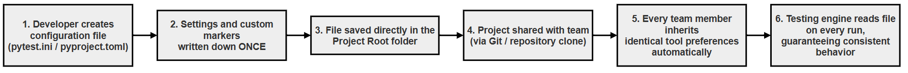
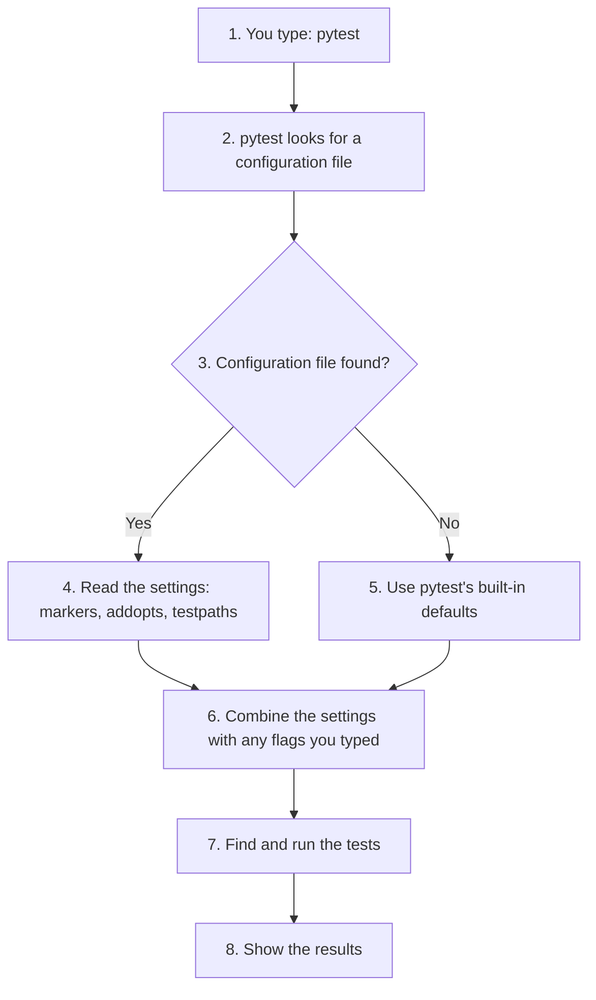
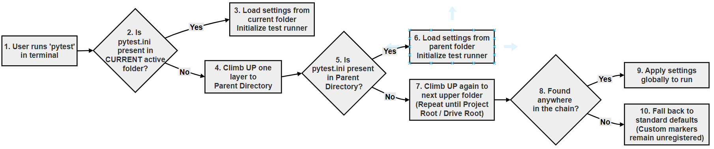
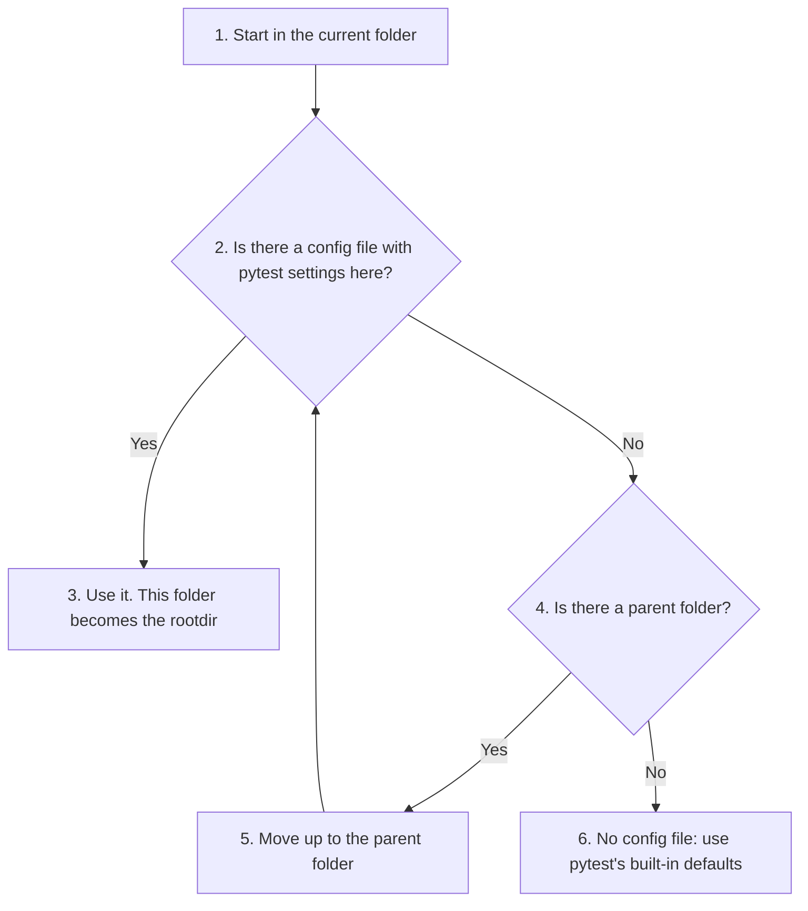
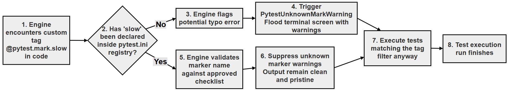
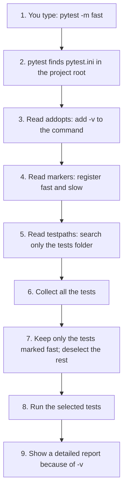

# A Beginner's Guide to pytest.ini and pyproject.toml

Have you ever used a custom marker like `@pytest.mark.slow` and seen a warning in your terminal saying `PytestUnknownMarkWarning`? This warning appears because pytest does not know what "slow" means yet. It has not been introduced to it.

The fix is a simple text file named `pytest.ini` (or `pyproject.toml`). This file acts as a "settings menu" for your project. It tells pytest which markers you have created, which flags to use by default, and how to behave the same way on every computer.

This guide explains how to silence that warning, register your markers and keep your team's test runs identical. It includes step-by-step setup, a comparison of the two file formats, a complete worked example with its actual output, and a "No-Warning" cheat sheet.

Configuration files are not special to pytest. Almost every Python tool uses them, from code formatters to package installers, so the ideas on this page will be useful throughout your work with Python. In this chapter, they tie together several things you have already met: markers, command-line flags such as `-v`, and the `pythonpath` setting used when tests live in their own folder.

## Table of Contents

- [A Beginner's Guide to pytest.ini and pyproject.toml](090-ch20-config-files.md#a-beginners-guide-to-pytestini-and-pyprojecttoml)
    - [Key Terms Used on This Page](090-ch20-config-files.md#key-terms-used-on-this-page)
    - [1. What is a Configuration File? (The Everyday Analogy)](090-ch20-config-files.md#1-what-is-a-configuration-file-the-everyday-analogy)
        - [What Does a Configuration File Look Like?](090-ch20-config-files.md#what-does-a-configuration-file-look-like)
        - [The Three Things a Configuration File Does](090-ch20-config-files.md#the-three-things-a-configuration-file-does)
            - [Thing 1: Stores your preferences so you do not have to repeat them](090-ch20-config-files.md#thing-1-stores-your-preferences-so-you-do-not-have-to-repeat-them)
            - [Thing 2: Tells the tool about things it does not know yet](090-ch20-config-files.md#thing-2-tells-the-tool-about-things-it-does-not-know-yet)
            - [Thing 3: Makes behaviour consistent across a whole team](090-ch20-config-files.md#thing-3-makes-behaviour-consistent-across-a-whole-team)
        - [One-Line Definition](090-ch20-config-files.md#one-line-definition)
        - [Configuration Files in the Python World](090-ch20-config-files.md#configuration-files-in-the-python-world)
            - [You May Have Already Used a Configuration File](090-ch20-config-files.md#you-may-have-already-used-a-configuration-file)
            - [Flowchart Explaining How a Configuration File Is Used](090-ch20-config-files.md#flowchart-explaining-how-a-configuration-file-is-used)
    - [2. Why Does Pytest Need One?](090-ch20-config-files.md#2-why-does-pytest-need-one)
        - [The "Unknown Marker" Warning](090-ch20-config-files.md#the-unknown-marker-warning)
        - [Turning the Warning into an Error with --strict-markers](090-ch20-config-files.md#turning-the-warning-into-an-error-with---strict-markers)
    - [3. The Two Main Files: pytest.ini vs pyproject.toml](090-ch20-config-files.md#3-the-two-main-files-pytestini-vs-pyprojecttoml)
        - [The Same Settings in Both Formats](090-ch20-config-files.md#the-same-settings-in-both-formats)
    - [4. Where Does the File Live?](090-ch20-config-files.md#4-where-does-the-file-live)
        - [Flowchart Showing How Pytest Finds the Configuration File](090-ch20-config-files.md#flowchart-showing-how-pytest-finds-the-configuration-file)
    - [5. How to Fix the Warning (Step-by-Step)](090-ch20-config-files.md#5-how-to-fix-the-warning-step-by-step)
        - [Step 1: Create the File](090-ch20-config-files.md#step-1-create-the-file)
        - [Step 2: Add the markers Setting](090-ch20-config-files.md#step-2-add-the-markers-setting)
        - [Step 3: Run pytest](090-ch20-config-files.md#step-3-run-pytest)
        - [Step 4: Use the Markers](090-ch20-config-files.md#step-4-use-the-markers)
    - [6. Useful Tricks: Default Flags (addopts)](090-ch20-config-files.md#6-useful-tricks-default-flags-addopts)
    - [7. Visualizing the Lifecycle (Flowchart)](090-ch20-config-files.md#7-visualizing-the-lifecycle-flowchart)
    - [8. A Complete Worked Example](090-ch20-config-files.md#8-a-complete-worked-example)
        - [File 1: bank_account.py (The Application Code)](090-ch20-config-files.md#file-1-bank_accountpy-the-application-code)
        - [File 2: tests/test_bank.py (The Tests)](090-ch20-config-files.md#file-2-teststest_bankpy-the-tests)
        - [File 3: pytest.ini (The Configuration)](090-ch20-config-files.md#file-3-pytestini-the-configuration)
        - [Scenario 1: Run All Tests](090-ch20-config-files.md#scenario-1-run-all-tests)
        - [Scenario 2: Run Only the Fast Tests (Filtering)](090-ch20-config-files.md#scenario-2-run-only-the-fast-tests-filtering)
        - [Scenario 3: Run Everything Except the Slow Tests](090-ch20-config-files.md#scenario-3-run-everything-except-the-slow-tests)
        - [Scenario 4: List the Registered Markers](090-ch20-config-files.md#scenario-4-list-the-registered-markers)
    - [9. The "No-Warning" Cheat Sheet](090-ch20-config-files.md#9-the-no-warning-cheat-sheet)
    - [Scripts for This Page and How to Run Them](090-ch20-config-files.md#scripts-for-this-page-and-how-to-run-them)
    - [Follow-Up Questions](090-ch20-config-files.md#follow-up-questions)
        - [Question 1: Warning or Error?](090-ch20-config-files.md#question-1-warning-or-error)
        - [Question 2: Converting to pyproject.toml](090-ch20-config-files.md#question-2-converting-to-pyprojecttoml)
        - [Question 3: Running pytest from the tests Folder](090-ch20-config-files.md#question-3-running-pytest-from-the-tests-folder)
        - [Question 4: A Misspelt Setting](090-ch20-config-files.md#question-4-a-misspelt-setting)
    - [Summary](090-ch20-config-files.md#summary)
    - [Further Reading](090-ch20-config-files.md#further-reading)

## Key Terms Used on This Page

| Term | Simple Meaning | Learn More |
| --- | --- | --- |
| Configuration file | A plain text file that stores settings for a tool, so you do not have to type them every time | [Configuration file on Wikipedia](https://en.wikipedia.org/wiki/Configuration_file) |
| Marker | A label attached to a test with `@pytest.mark.<name>`, used to group or select tests | [pytest: How to mark test functions](https://docs.pytest.org/en/stable/how-to/mark.html) |
| Registering a marker | Listing a custom marker in the configuration file so pytest knows it is intended | [pytest: Registering marks](https://docs.pytest.org/en/stable/how-to/mark.html#registering-marks) |
| Flag (option) | A short setting added to a command, such as `-v` in `pytest -v` | [pytest: command-line flags](https://docs.pytest.org/en/stable/reference/reference.html#command-line-flags) |
| Project root | The top folder of your project. Pytest calls it the **rootdir** | [pytest: rootdir](https://docs.pytest.org/en/stable/reference/customize.html#initialization-determining-rootdir-and-configfile) |
| INI format | A simple format of section headers in square brackets and `key = value` lines | [INI file on Wikipedia](https://en.wikipedia.org/wiki/INI_file) |
| TOML format | A slightly stricter format, similar to INI, in which text is written in quotes and lists in square brackets | [TOML website](https://toml.io/en/) |
| Warning | A message that something may be wrong. Unlike an error, it does not stop the program | [Python docs: warnings](https://docs.python.org/3/library/warnings.html) |

[Back to the Table of Contents](090-ch20-config-files.md#table-of-contents)

## 1. What is a Configuration File? (The Everyday Analogy)

Imagine you start a new job. On your first day, you adjust your chair height, set up your two monitors and log in to your computer. You do this **once**. The next day, you just sit down and work, because the computer "remembers" your preferences.

A configuration file works the same way for software tools like pytest. It is a plain text file where you write down your preferences (settings) **once**. Every time you run the tool, it reads this file and behaves exactly as you want, automatically.

**Why not just type the settings every time?** If you want pytest to be "verbose" (show detailed output), you could type `pytest -v` every time. But if you have 10 flags you always use, typing them becomes tedious. Worse, if a new developer joins your team, they will not know which flags to use, and their test results will look different from yours.

A configuration file solves this by storing these rules in the project folder. Everyone who downloads the project gets the same settings automatically.

[Back to the Table of Contents](090-ch20-config-files.md#table-of-contents)

### What Does a Configuration File Look Like?

Configuration files are deliberately simple. They are plain text, so you can open them in Notepad if you want to. They do not contain Python code, and they do not contain HTML. They use a small, readable format: a setting name, an equals sign, and the value you want.

Here is a real configuration file for pytest:

```ini
[pytest]
addopts = -v
testpaths = tests
markers =
    slow: marks tests that are slow
    fast: marks tests that are fast
```

Reading it line by line:

| Line | Meaning |
| --- | --- |
| `[pytest]` | A section header. It says "the settings below are for pytest" |
| `addopts = -v` | Always add the `-v` flag, as if you had typed it |
| `testpaths = tests` | Look for tests in the `tests` folder |
| `markers =` | The start of a list of custom markers |
| `slow: marks tests that are slow` | One marker: its name, a colon and a short description. The lines of a list must be indented |

A configuration file is not a Python script. It is not run line by line, and it has no functions or variables. The tool simply reads it and picks up the settings it recognises. Pytest is helpful here: if you misspell a setting name (for example `markerz` instead of `markers`), it shows the warning `PytestConfigWarning: Unknown config option: markerz`, so mistakes do not go unnoticed.

[Back to the Table of Contents](090-ch20-config-files.md#table-of-contents)

### The Three Things a Configuration File Does

Almost every configuration file in software does the same three jobs.

[Back to the Table of Contents](090-ch20-config-files.md#table-of-contents)

#### Thing 1: Stores your preferences so you do not have to repeat them

Instead of typing `pytest -v --tb=short` every time, you write those preferences in the configuration file once. Every future run picks them up automatically. (`--tb=short` makes the error details, called the **traceback**, shorter when a test fails.)

[Back to the Table of Contents](090-ch20-config-files.md#table-of-contents)

#### Thing 2: Tells the tool about things it does not know yet

Some tools need to be told about things you have created. Pytest, for example, only knows about its own built-in markers. If you invent a new marker called `@pytest.mark.slow`, pytest has never heard of it. The configuration file is where you formally introduce your new marker to pytest.

[Back to the Table of Contents](090-ch20-config-files.md#table-of-contents)

#### Thing 3: Makes behaviour consistent across a whole team

Because the configuration file lives inside the project folder, alongside your code, everyone who works on the project automatically uses the same settings. A new team member downloads (clones) the project and gets identical behaviour from day one.

[Back to the Table of Contents](090-ch20-config-files.md#table-of-contents)

### One-Line Definition

A configuration file is a plain text file that stores settings for a software tool, so that the tool behaves the way you want it to, automatically, every time you use it.

[Back to the Table of Contents](090-ch20-config-files.md#table-of-contents)

### Configuration Files in the Python World

Python tools use configuration files very widely. Here are the most common ones you will meet, grouped by the tool they belong to:

| File Name | Tool It Belongs To | What It Configures |
| --- | --- | --- |
| `pytest.ini` | pytest | Registers custom markers, sets default flags, says which folder holds the tests |
| `pyproject.toml` | Many tools | The modern standard. It can hold settings for pytest, Black, Ruff, mypy and packaging, all in one file |
| `.flake8` | flake8 | Configures the code style checker: which rules to ignore, maximum line length and so on |
| `mypy.ini` | mypy | Configures the type checker: how strict to be, which packages to check |
| `setup.cfg` | setuptools (and some other tools) | An older packaging and tool configuration format, still common in existing projects |
| `.env` | Your application | Stores environment variables, such as API keys, database passwords and feature switches. Because it holds secrets, it should never be committed to Git |
| `requirements.txt` | pip | Lists the Python packages the project depends on. Strictly, it is a list for the package installer rather than a settings file |

[Back to the Table of Contents](090-ch20-config-files.md#table-of-contents)

#### You May Have Already Used a Configuration File

If you have ever used `pip install -r requirements.txt`, you have already used a file of this kind. The `requirements.txt` file is simply a list (package names and versions) that tells pip what to install. There is no magic: you write a list in a file, and a tool reads it. Configuration files work on the same principle.

[Back to the Table of Contents](090-ch20-config-files.md#table-of-contents)

#### Flowchart Explaining How a Configuration File Is Used



The same idea, step by step:



[Back to the Table of Contents](090-ch20-config-files.md#table-of-contents)

## 2. Why Does Pytest Need One?

The most common reason beginners create a configuration file is to fix a specific warning.

[Back to the Table of Contents](090-ch20-config-files.md#table-of-contents)

### The "Unknown Marker" Warning

When you learned about markers, you might have written code like this. Save it as `test_backup.py` in an empty folder:

```python
# test_backup.py
# A test that uses a custom marker which has not been registered yet.

# Step 1 - Import pytest so that we can use pytest.mark
import pytest


# Step 2 - Label the test with our own marker, 'slow'
@pytest.mark.slow  # A custom marker we invented
def test_database_backup():
    pass
```

Run it:

```bash
pytest
```

Output:

```text
============================= test session starts ==============================
platform win32 -- Python 3.10.10, pytest-9.0.3, pluggy-1.6.0
rootdir: C:\warning-demo
plugins: anyio-4.12.1
collected 1 item

test_backup.py .                                                         [100%]

=============================== warnings summary ===============================
test_backup.py:9
  C:\warning-demo\test_backup.py:9: PytestUnknownMarkWarning: Unknown pytest.mark.slow - is this a typo?  You can register custom marks to avoid this warning - for details, see https://docs.pytest.org/en/stable/how-to/mark.html
    @pytest.mark.slow  # A custom marker we invented

-- Docs: https://docs.pytest.org/en/stable/how-to/capture-warnings.html
========================= 1 passed, 1 warning in 0.00s =========================
```

The full warning message is:

```text
PytestUnknownMarkWarning: Unknown pytest.mark.slow - is this a typo?  You can register custom marks to avoid this warning
```

**Why?** Pytest knows about its own built-in markers (such as `skip`, `skipif`, `xfail` and `parametrize`), but it does not know about your new marker `slow`. It thinks you might have made a typo. For example, if you wrote `@pytest.mark.slwo` by mistake, the warning would help you notice.

Note that the test still ran and passed. A warning does not stop anything. But a project full of warnings is untidy, and real problems can get lost among them.

**The fix:** You need to "introduce" your marker to pytest in a configuration file. Once it is registered, the warning disappears, and you can run commands like `pytest -m slow` to select your tests reliably.

[Back to the Table of Contents](090-ch20-config-files.md#table-of-contents)

### Turning the Warning into an Error with --strict-markers

If you want pytest to be strict, you can make an unknown marker an **error** instead of a warning:

```bash
pytest --strict-markers
```

With the same unregistered `slow` marker, the output ends with:

```text
_______________________ ERROR collecting test_backup.py ________________________
'slow' not found in `markers` configuration option
=========================== short test summary info ============================
ERROR test_backup.py - Failed: 'slow' not found in `markers` configuration op...
!!!!!!!!!!!!!!!!!!!! Interrupted: 1 error during collection !!!!!!!!!!!!!!!!!!!!
=============================== 1 error in 0.08s ===============================
```

Many teams add `--strict-markers` to `addopts` in their configuration file. Then a misspelt marker stops the test run at once, instead of being ignored.

[Back to the Table of Contents](090-ch20-config-files.md#table-of-contents)

## 3. The Two Main Files: pytest.ini vs pyproject.toml

Pytest can read its settings from several files, but you only need to pick one. The two most common choices are compared below.

| Feature | pytest.ini | pyproject.toml |
| --- | --- | --- |
| Format | INI: `key = value`; text needs no quotes | TOML: `key = value`; text must be in quotes and lists in square brackets |
| Section header | `[pytest]` | `[tool.pytest.ini_options]` (pytest 9 and later also accept `[tool.pytest]`) |
| Best for | Projects where you only need to configure pytest | Modern Python projects that configure several tools |
| Difficulty | Simplest | Slightly more structured |
| Readability | Very easy for beginners | Slightly more wordy |
| Age | Older, traditional approach | The modern Python standard |
| Holds settings for other tools | No (pytest only) | Yes (Black, Ruff, mypy, pytest, packaging and more) |
| One file for the whole project | No: other tools need their own files | Yes: one file can configure everything |
| Suitable for small projects | Excellent | Excellent |
| Suitable for large projects | Good | Excellent |
| Most common in new projects | Less common | More common |
| Learning recommendation | Start here | Learn after understanding `pytest.ini` |

If a folder contains both files, `pytest.ini` wins. Pytest uses it, and its output header says `configfile: pytest.ini (WARNING: ignoring pytest config in pyproject.toml!)`, so keep your pytest settings in only one of the two files.

[Back to the Table of Contents](090-ch20-config-files.md#table-of-contents)

### The Same Settings in Both Formats

`pytest.ini`:

```ini
[pytest]
addopts = -v
markers =
    slow: marks tests as slow (run with: pytest -m slow)
    fast: marks tests as fast unit tests
```

`pyproject.toml`:

```toml
[tool.pytest.ini_options]
addopts = "-v"
markers = [
    "slow: marks tests as slow (run with: pytest -m slow)",
    "fast: marks tests as fast unit tests",
]
```

Notice the three differences in the TOML version:

1. The section header is `[tool.pytest.ini_options]`.
2. Text values are in double quotes: `"-v"`.
3. The markers are a list in square brackets, with a comma after each item.

Both files were tested with pytest 9.0.3, and both register the markers correctly.

[Back to the Table of Contents](090-ch20-config-files.md#table-of-contents)

## 4. Where Does the File Live?

Your configuration file should live in the **project root**. The project root is the main folder of your project, the folder where you usually type `pytest` in your terminal.

Structure example:

```text
my_project/              <-- Project root (put the file here)
│
├── pytest.ini           <-- The configuration file
├── src/
│   └── bank_account.py
└── tests/
    └── test_bank.py
```

In this layout, the code is in `src/` and the tests are in `tests/`. For `test_bank.py` to be able to write `from bank_account import BankAccount`, add `pythonpath = src` to `pytest.ini`. (If `bank_account.py` sits directly in the project root, as in the worked example below, use `pythonpath = .` instead.)

**How pytest finds the file:** When you run `pytest`, it starts from the folder you are in (or the folder you name on the command line). It looks there for `pytest.ini`, `pyproject.toml`, `tox.ini` or `setup.cfg`. If it finds none that contain pytest settings, it looks in the parent folder, then the grandparent folder, and so on, until it finds one. The folder where it finds the file becomes the project root (rootdir). The pytest documentation explains the full rules in [determining rootdir and configfile](https://docs.pytest.org/en/stable/reference/customize.html#initialization-determining-rootdir-and-configfile).

This is why you can run `pytest` from inside the `tests` folder and still get your settings: pytest walks up and finds `pytest.ini` in the folder above.

[Back to the Table of Contents](090-ch20-config-files.md#table-of-contents)

### Flowchart Showing How Pytest Finds the Configuration File



The same search, step by step:



[Back to the Table of Contents](090-ch20-config-files.md#table-of-contents)

## 5. How to Fix the Warning (Step-by-Step)

Let us create a `pytest.ini` file to register the `slow` and `fast` markers (and a third one, `db`) for the `test_backup.py` example.

[Back to the Table of Contents](090-ch20-config-files.md#table-of-contents)

### Step 1: Create the File

Create a file named `pytest.ini` in your project root, next to `test_backup.py`. The first line must be `[pytest]`.

Take care that the name is exactly `pytest.ini`. In Windows, turn on **View > Show > File name extensions** in File Explorer to make sure it has not been saved as `pytest.ini.txt`.

[Back to the Table of Contents](090-ch20-config-files.md#table-of-contents)

### Step 2: Add the markers Setting

Under `[pytest]`, add a line `markers =`. Then list your markers one per line, each indented by a few spaces. The format is `name: description`.

```ini
[pytest]
markers =
    slow: marks tests as slow (run with: pytest -m slow)
    fast: marks tests as fast unit tests
    db: marks tests that need a database
```

The description is optional, but it is shown by `pytest --markers`, so it helps your team know what each marker means.

[Back to the Table of Contents](090-ch20-config-files.md#table-of-contents)

### Step 3: Run pytest

Now run your tests again:

```bash
pytest
```

Output:

```text
============================= test session starts ==============================
platform win32 -- Python 3.10.10, pytest-9.0.3, pluggy-1.6.0
rootdir: C:\warning-demo
configfile: pytest.ini
plugins: anyio-4.12.1
collected 1 item

test_backup.py .                                                         [100%]

============================== 1 passed in 0.00s ===============================
```

The warning is gone. Notice the new line `configfile: pytest.ini`, which confirms that pytest found and used the file.

[Back to the Table of Contents](090-ch20-config-files.md#table-of-contents)

### Step 4: Use the Markers

Now you can select tests by marker with the `-m` flag.

Run only the slow tests:

```bash
pytest -m slow
```

Run only the fast tests:

```bash
pytest -m fast
```

Run everything except the slow tests:

```bash
pytest -m "not slow"
```

Put the expression in double quotes whenever it contains a space, as in `"not slow"`. The worked example in section 8 shows the output of these commands.

[Back to the Table of Contents](090-ch20-config-files.md#table-of-contents)

## 6. Useful Tricks: Default Flags (addopts)

Besides markers, the most useful setting is `addopts`, short for **"add options"**.

If you are tired of typing `pytest -v --tb=short` every single time, you can make it the default in your configuration file.

Example `pytest.ini`:

```ini
[pytest]
# Register markers
markers =
    slow: marks tests as slow

# Set default flags
addopts = -v --tb=short
```

**Result:** now, if you just type `pytest`, pytest behaves exactly as if you had typed `pytest -v --tb=short`.

Lines starting with `#` are comments. Pytest ignores them, so you can use them to explain your settings to your team.

Other settings that are often used:

| Setting | Example | What It Does |
| --- | --- | --- |
| `addopts` | `addopts = -v --strict-markers` | Flags added to every run |
| `markers` | `markers = slow: slow tests` | Registers custom markers |
| `testpaths` | `testpaths = tests` | Folders to search for tests when you run plain `pytest` |
| `pythonpath` | `pythonpath = .` | Folders added to Python's import path, so tests can import your code |

More settings, and the rules for where pytest looks for them, are described in the pytest guide on [configuration](https://docs.pytest.org/en/stable/reference/customize.html).

[Back to the Table of Contents](090-ch20-config-files.md#table-of-contents)

## 7. Visualizing the Lifecycle (Flowchart)



The whole lifecycle of a test run with a configuration file, step by step:



[Back to the Table of Contents](090-ch20-config-files.md#table-of-contents)

## 8. A Complete Worked Example

Here is a full example using the `BankAccount` class. The folder looks like this:

```text
config-demo/             <-- Project root
│
├── pytest.ini
├── bank_account.py
└── tests/
    └── test_bank.py
```

[Back to the Table of Contents](090-ch20-config-files.md#table-of-contents)

### File 1: bank_account.py (The Application Code)

```python
# bank_account.py
# The application code: a simple bank account.


class BankAccount:

    # Step 1 - Create the account with an owner and an opening balance
    def __init__(self, owner, balance=0):
        self.owner = owner
        self.balance = balance

    # Step 2 - Add money
    def deposit(self, amount):
        self.balance += amount

    # Step 3 - Take money out, refusing if there is not enough
    def withdraw(self, amount):
        if amount > self.balance:
            raise ValueError("Insufficient funds")
        self.balance -= amount

    # Step 4 - Report the balance (the tests use this method)
    def get_balance(self):
        return self.balance
```

[Back to the Table of Contents](090-ch20-config-files.md#table-of-contents)

### File 2: tests/test_bank.py (The Tests)

```python
# tests/test_bank.py
# Tests for bank_account.py, labelled with the custom markers
# 'fast' and 'slow' that are registered in pytest.ini.

# Step 1 - Imports
import time

import pytest
from bank_account import BankAccount


# Step 2 - A quick test, labelled 'fast'
@pytest.mark.fast
def test_deposit_small_amount():
    # A fast, in-memory test
    account = BankAccount("Alice", 100)
    account.deposit(50)
    assert account.get_balance() == 150


# Step 3 - A test that takes longer, labelled 'slow'
@pytest.mark.slow
def test_deposit_large_amount():
    # time.sleep(0.5) pauses for half a second to imitate a slow test
    account = BankAccount("Bob", 0)
    time.sleep(0.5)
    account.deposit(1000000)
    assert account.get_balance() == 1000000
```

[Back to the Table of Contents](090-ch20-config-files.md#table-of-contents)

### File 3: pytest.ini (The Configuration)

```ini
# pytest.ini
# Settings for pytest. This file must be in the project root folder.

[pytest]
# Show each test name and result (as if -v were typed every time)
addopts = -v

# Look for tests only in the 'tests' folder
testpaths = tests

# Add the project root to Python's search path, so the tests
# can import bank_account.py from the folder above them
pythonpath = .

# Register the custom markers used in the tests
markers =
    fast: Quick unit tests
    slow: Slow integration tests
```

Each setting has a job:

1. `addopts = -v` shows each test name without typing `-v`.
2. `testpaths = tests` tells pytest where the tests are.
3. `pythonpath = .` lets `tests/test_bank.py` import `bank_account.py` from the folder above. Without it, pytest stops with `ModuleNotFoundError: No module named 'bank_account'`.
4. `markers` registers `fast` and `slow`, so there are no warnings.

[Back to the Table of Contents](090-ch20-config-files.md#table-of-contents)

### Scenario 1: Run All Tests

Open the terminal in the `config-demo` folder and type:

```bash
pytest
```

Output:

```text
============================= test session starts ==============================
platform win32 -- Python 3.10.10, pytest-9.0.3, pluggy-1.6.0 -- C:\Users\Anurag Gupta\AppData\Local\Programs\Python\Python310\python.exe
cachedir: .pytest_cache
rootdir: C:\config-demo
configfile: pytest.ini
testpaths: tests
plugins: anyio-4.12.1
collected 2 items

tests/test_bank.py::test_deposit_small_amount PASSED                     [ 50%]
tests/test_bank.py::test_deposit_large_amount PASSED                     [100%]

============================== 2 passed in 0.51s ===============================
```

Both tests ran, and `-v` was applied automatically. The header lines `configfile: pytest.ini` and `testpaths: tests` show that pytest used the settings. The run took about half a second because of the slow test.

[Back to the Table of Contents](090-ch20-config-files.md#table-of-contents)

### Scenario 2: Run Only the Fast Tests (Filtering)

```bash
pytest -m fast
```

Output:

```text
============================= test session starts ==============================
platform win32 -- Python 3.10.10, pytest-9.0.3, pluggy-1.6.0 -- C:\Users\Anurag Gupta\AppData\Local\Programs\Python\Python310\python.exe
cachedir: .pytest_cache
rootdir: C:\config-demo
configfile: pytest.ini
testpaths: tests
plugins: anyio-4.12.1
collected 2 items / 1 deselected / 1 selected

tests/test_bank.py::test_deposit_small_amount PASSED                     [100%]

======================= 1 passed, 1 deselected in 0.00s ========================
```

The `slow` test was **deselected** (left out) because of the filter. It did not run at all, so the run finished almost instantly.

[Back to the Table of Contents](090-ch20-config-files.md#table-of-contents)

### Scenario 3: Run Everything Except the Slow Tests

```bash
pytest -m "not slow"
```

Output:

```text
============================= test session starts ==============================
platform win32 -- Python 3.10.10, pytest-9.0.3, pluggy-1.6.0 -- C:\Users\Anurag Gupta\AppData\Local\Programs\Python\Python310\python.exe
cachedir: .pytest_cache
rootdir: C:\config-demo
configfile: pytest.ini
testpaths: tests
plugins: anyio-4.12.1
collected 2 items / 1 deselected / 1 selected

tests/test_bank.py::test_deposit_small_amount PASSED                     [100%]

======================= 1 passed, 1 deselected in 0.00s ========================
```

Here the result is the same as Scenario 2, because the project has only two tests. In a real project, `"not slow"` would also run tests that have no marker at all, while `-m fast` would run only the tests marked `fast`.

[Back to the Table of Contents](090-ch20-config-files.md#table-of-contents)

### Scenario 4: List the Registered Markers

```bash
pytest --markers
```

The first lines of the output show your own markers, with the descriptions from `pytest.ini`:

```text
@pytest.mark.fast: Quick unit tests

@pytest.mark.slow: Slow integration tests
```

The rest of the list shows the markers that are built into pytest.

[Back to the Table of Contents](090-ch20-config-files.md#table-of-contents)

## 9. The "No-Warning" Cheat Sheet

| What You Want to Do | Command or Code | Notes |
| --- | --- | --- |
| Create the file | `pytest.ini` in the project root | Must start with the `[pytest]` header |
| Register a marker | `slow: description` | Goes under `markers =`, indented |
| Run fast tests | `pytest -m fast` | Selects tests by marker name |
| Exclude slow tests | `pytest -m "not slow"` | Use quotes when the expression has a space |
| Make unknown markers an error | `addopts = --strict-markers` | Catches misspelt markers |
| List all markers | `pytest --markers` | Shows your registered markers first |
| Set default flags | `addopts = -v` | Saves typing long commands |
| Let tests import your code | `pythonpath = .` | Needed when tests are in their own folder |
| Check which file pytest used | `pytest --co` | The header shows `configfile: pytest.ini` if the file was found |

`--co` is short for `--collect-only`. It lists the tests that pytest finds, without running them.

[Back to the Table of Contents](090-ch20-config-files.md#table-of-contents)

## Scripts for This Page and How to Run Them

All the files on this page are available in the [config-demo folder](https://github.com/ag999git/001-Python-book-2026/tree/main/20-unittest/config-demo) and the [warning-demo folder](https://github.com/ag999git/001-Python-book-2026/tree/main/20-unittest/warning-demo).

| File | What It Contains |
| --- | --- |
| [warning-demo/test_backup.py](https://github.com/ag999git/001-Python-book-2026/blob/main/20-unittest/warning-demo/test_backup.py) | A test with an unregistered marker, to see the warning (sections 2 and 5) |
| [config-demo/pytest.ini](https://github.com/ag999git/001-Python-book-2026/blob/main/20-unittest/config-demo/pytest.ini) | The configuration file for the worked example |
| [config-demo/bank_account.py](https://github.com/ag999git/001-Python-book-2026/blob/main/20-unittest/config-demo/bank_account.py) | The BankAccount class |
| [config-demo/tests/test_bank.py](https://github.com/ag999git/001-Python-book-2026/blob/main/20-unittest/config-demo/tests/test_bank.py) | Two tests with the `fast` and `slow` markers |

To run them on your computer:

1. For the warning: create a folder `warning-demo`, save `test_backup.py` in it, open the folder in VS Code (**File > Open Folder...**) and run `python -m pytest` in the terminal (**Terminal > New Terminal**). Then add a `pytest.ini` as in section 5 and run it again.
2. For the worked example: create a folder `config-demo`, save `pytest.ini` and `bank_account.py` in it, create a `tests` folder inside it and save `test_bank.py` there. Open `config-demo` in VS Code and run the commands from section 8, for example `python -m pytest -m fast`.
3. If you see `No module named pytest`, install it with `python -m pip install pytest`.

Detailed, step-by-step instructions (installing Python and VS Code, downloading files from GitHub and fixing common errors) are given in [Running the Scripts on Your Computer](020-ch20-unittest-disadvantage-rigid-oop-style.md#running-the-scripts-on-your-computer).

[Back to the Table of Contents](090-ch20-config-files.md#table-of-contents)

## Follow-Up Questions

### Question 1: Warning or Error?

A test uses `@pytest.mark.slow`, but `slow` is not registered. What happens with `pytest`, and what happens with `pytest --strict-markers`?

**Answer:**

1. With plain `pytest`, the test runs, but pytest shows `PytestUnknownMarkWarning: Unknown pytest.mark.slow`.
2. With `--strict-markers`, pytest treats the unknown marker as an error. It stops while collecting the tests and reports `'slow' not found in markers configuration option`. No tests run.
3. Registering `slow` under `markers =` in `pytest.ini` fixes both cases.

[Back to the Table of Contents](090-ch20-config-files.md#table-of-contents)

### Question 2: Converting to pyproject.toml

Rewrite this `pytest.ini` as a `pyproject.toml`:

```ini
[pytest]
addopts = -v --tb=short
markers =
    db: tests that need a database
```

**Answer:**

1. Change the section header to `[tool.pytest.ini_options]`.
2. Put the text value of `addopts` in quotes.
3. Turn the markers into a list of quoted strings in square brackets.

```toml
[tool.pytest.ini_options]
addopts = "-v --tb=short"
markers = [
    "db: tests that need a database",
]
```

[Back to the Table of Contents](090-ch20-config-files.md#table-of-contents)

### Question 3: Running pytest from the tests Folder

In the worked example, you open the terminal inside `config-demo/tests` and type `pytest`. Are the settings in `config-demo/pytest.ini` still used?

**Answer:**

1. Pytest starts looking for a configuration file in the current folder, `tests`. There is none.
2. It moves up to the parent folder, `config-demo`, and finds `pytest.ini`.
3. So yes, the settings are used, and `config-demo` becomes the project root.

[Back to the Table of Contents](090-ch20-config-files.md#table-of-contents)

### Question 4: A Misspelt Setting

You write `markerz =` instead of `markers =` in `pytest.ini`. What happens?

**Answer:**

1. Pytest does not recognise `markerz`, so it shows `PytestConfigWarning: Unknown config option: markerz`.
2. Your markers are not registered, because they were listed under the wrong name.
3. So you also get `PytestUnknownMarkWarning` for each custom marker used in the tests.
4. The warnings point straight to the mistake. Fix the spelling, and both warnings disappear.

[Back to the Table of Contents](090-ch20-config-files.md#table-of-contents)

## Summary

- A configuration file stores a tool's settings once, so every run, and every team member, gets the same behaviour.
- Pytest reads its settings from `pytest.ini` (section `[pytest]`) or `pyproject.toml` (section `[tool.pytest.ini_options]`).
- Register custom markers under `markers =` to remove `PytestUnknownMarkWarning`. Add `--strict-markers` to make misspelt markers an error.
- Use `addopts` for flags you always want, `testpaths` to say where the tests are, and `pythonpath` so that tests can import your code.
- Put the file in the project root. Pytest searches the current folder and then each parent folder until it finds one.

[Back to the Table of Contents](090-ch20-config-files.md#table-of-contents)

## Further Reading

- [pytest: Configuration](https://docs.pytest.org/en/stable/reference/customize.html)
- [pytest: API and configuration reference](https://docs.pytest.org/en/stable/reference/reference.html)
- [pytest: How to mark test functions with attributes](https://docs.pytest.org/en/stable/how-to/mark.html)
- [Python Packaging Guide: Writing your pyproject.toml](https://packaging.python.org/en/latest/guides/writing-pyproject-toml/)

[Back to the Table of Contents](090-ch20-config-files.md#table-of-contents)

