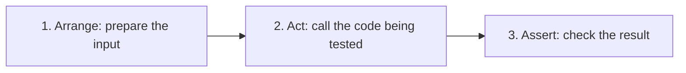
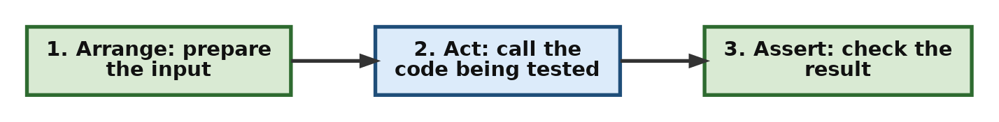
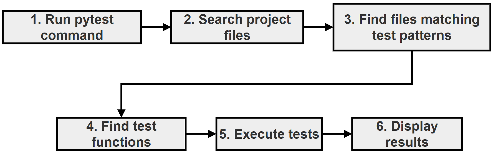
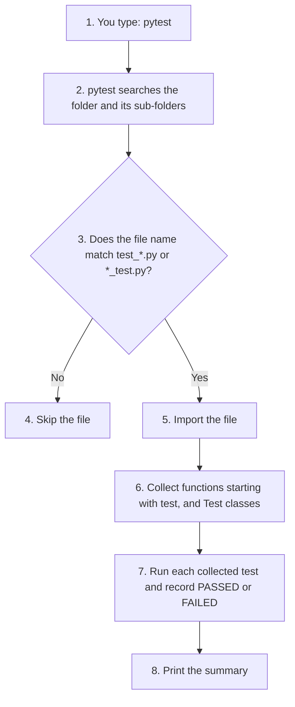
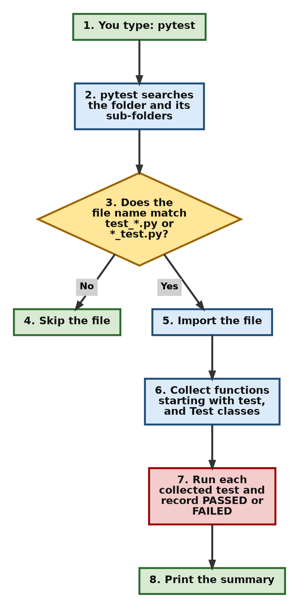
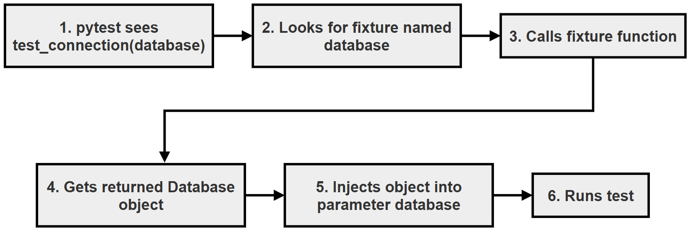
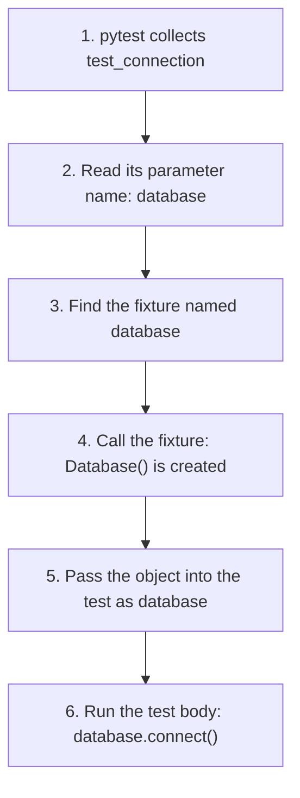
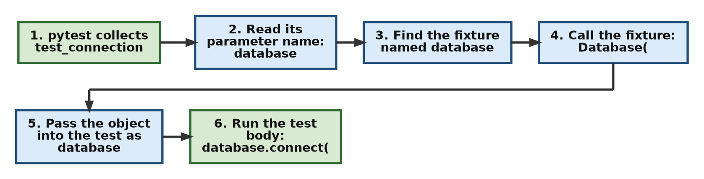
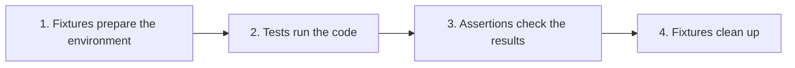
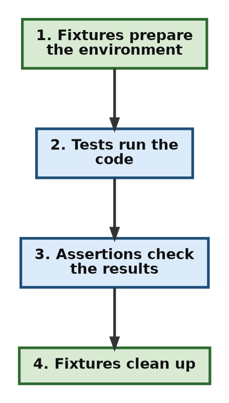

# Conceptual Questions and Answers: pytest

This page brings together twenty conceptual questions on testing with pytest, with detailed answers. The questions cover the main ideas of this chapter: what unit testing is, how pytest finds and runs tests, `assert`, fixtures and their scopes, dependency injection, mocking, testing exceptions, parameterized tests, skipping and expected failures, `conftest.py`, and how to keep tests independent.

The questions are grouped by topic. Each answer explains the idea in simple steps, and many answers include a small **"Try it yourself"** script with its actual output, so you can see the idea in action and not just read about it. All the scripts are in one folder and are listed in [Scripts for This Page and How to Run Them](095-ch20-conceptual-qa.md#scripts-for-this-page-and-how-to-run-them).

You can use this page to revise the chapter, to check your understanding before an exam or interview, or as a quick reference while writing your own tests. Testing is a core skill for every Python programmer: it is how you prove that your code works today and make sure it keeps working as it changes.

## Table of Contents

- [Conceptual Questions and Answers: pytest](095-ch20-conceptual-qa.md#conceptual-questions-and-answers-pytest)
    - [Key Terms Used on This Page](095-ch20-conceptual-qa.md#key-terms-used-on-this-page)
    - [Part A: Unit Testing Basics](095-ch20-conceptual-qa.md#part-a-unit-testing-basics)
        - [1. What is unit testing? Why do we test code even when the program runs correctly?](095-ch20-conceptual-qa.md#1-what-is-unit-testing-why-do-we-test-code-even-when-the-program-runs-correctly)
        - [2. How does pytest discover test files and test functions automatically?](095-ch20-conceptual-qa.md#2-how-does-pytest-discover-test-files-and-test-functions-automatically)
        - [3. What is the role of assert in pytest? Why does pytest use normal Python assert?](095-ch20-conceptual-qa.md#3-what-is-the-role-of-assert-in-pytest-why-does-pytest-use-normal-python-assert)
    - [Part B: Fixtures](095-ch20-conceptual-qa.md#part-b-fixtures)
        - [4. What is a fixture in pytest? Why are fixtures preferred over creating objects inside every test?](095-ch20-conceptual-qa.md#4-what-is-a-fixture-in-pytest-why-are-fixtures-preferred-over-creating-objects-inside-every-test)
        - [5. Explain pytest dependency injection using fixtures. Why does the fixture name become the test parameter name?](095-ch20-conceptual-qa.md#5-explain-pytest-dependency-injection-using-fixtures-why-does-the-fixture-name-become-the-test-parameter-name)
        - [6. What is the difference between a fixture and a normal function?](095-ch20-conceptual-qa.md#6-what-is-the-difference-between-a-fixture-and-a-normal-function)
        - [7. What are fixture scopes? Why do they exist?](095-ch20-conceptual-qa.md#7-what-are-fixture-scopes-why-do-they-exist)
        - [8. What is the difference between function scope and session scope fixtures?](095-ch20-conceptual-qa.md#8-what-is-the-difference-between-function-scope-and-session-scope-fixtures)
        - [9. Why can shared fixtures create problems?](095-ch20-conceptual-qa.md#9-why-can-shared-fixtures-create-problems)
    - [Part C: Mocking](095-ch20-conceptual-qa.md#part-c-mocking)
        - [10. What is mocking? Why do we replace real objects during testing?](095-ch20-conceptual-qa.md#10-what-is-mocking-why-do-we-replace-real-objects-during-testing)
        - [11. What is the difference between a real object, simulated object, and mock object?](095-ch20-conceptual-qa.md#11-what-is-the-difference-between-a-real-object-simulated-object-and-mock-object)
    - [Part D: Testing Exceptions](095-ch20-conceptual-qa.md#part-d-testing-exceptions)
        - [12. How does pytest.raises() test exceptions?](095-ch20-conceptual-qa.md#12-how-does-pytestraises-test-exceptions)
        - [13. Why should exception messages sometimes be tested?](095-ch20-conceptual-qa.md#13-why-should-exception-messages-sometimes-be-tested)
    - [Part E: Parameterized Testing](095-ch20-conceptual-qa.md#part-e-parameterized-testing)
        - [14. What is parameterized testing? Why is it useful?](095-ch20-conceptual-qa.md#14-what-is-parameterized-testing-why-is-it-useful)
        - [15. In parameterized testing, why does pytest show multiple tests?](095-ch20-conceptual-qa.md#15-in-parameterized-testing-why-does-pytest-show-multiple-tests)
    - [Part F: Skipping and Expected Failures](095-ch20-conceptual-qa.md#part-f-skipping-and-expected-failures)
        - [16. What is the difference between skipping and expected failure?](095-ch20-conceptual-qa.md#16-what-is-the-difference-between-skipping-and-expected-failure)
    - [Part G: Organising a Test Suite](095-ch20-conceptual-qa.md#part-g-organising-a-test-suite)
        - [17. What is the purpose of conftest.py?](095-ch20-conceptual-qa.md#17-what-is-the-purpose-of-conftestpy)
        - [18. Why should tests avoid depending on execution order?](095-ch20-conceptual-qa.md#18-why-should-tests-avoid-depending-on-execution-order)
        - [19. What is the difference between testing application logic and testing resources?](095-ch20-conceptual-qa.md#19-what-is-the-difference-between-testing-application-logic-and-testing-resources)
        - [20. Why are pytest fixtures considered one of the most important pytest features?](095-ch20-conceptual-qa.md#20-why-are-pytest-fixtures-considered-one-of-the-most-important-pytest-features)
    - [Scripts for This Page and How to Run Them](095-ch20-conceptual-qa.md#scripts-for-this-page-and-how-to-run-them)
    - [Summary](095-ch20-conceptual-qa.md#summary)
    - [Further Reading](095-ch20-conceptual-qa.md#further-reading)

## Key Terms Used on This Page

| Term | Simple Meaning | Learn More |
| --- | --- | --- |
| Unit test | A small test that checks one piece of code, such as one function, on its own | [Unit testing on Wikipedia](https://en.wikipedia.org/wiki/Unit_testing) |
| Test discovery | How pytest finds test files and test functions by their names | [pytest: test discovery](https://docs.pytest.org/en/stable/explanation/goodpractices.html#conventions-for-python-test-discovery) |
| Fixture | A function marked with `@pytest.fixture` that prepares something a test needs | [pytest: How to use fixtures](https://docs.pytest.org/en/stable/how-to/fixtures.html) |
| Scope | How widely a fixture is shared, and so how often it is created | [pytest: fixture scopes](https://docs.pytest.org/en/stable/how-to/fixtures.html#fixture-scopes) |
| Dependency injection | Handing a function the objects it needs from outside, instead of letting it create them | [Dependency injection on Wikipedia](https://en.wikipedia.org/wiki/Dependency_injection) |
| Mock | A stand-in object whose behaviour you control, used in place of a real one | [unittest.mock](https://docs.python.org/3/library/unittest.mock.html) |
| Marker | A label such as `@pytest.mark.skip` attached to a test | [pytest: markers](https://docs.pytest.org/en/stable/how-to/mark.html) |
| Edge case | An unusual or extreme input, such as zero, a negative number or an empty list | [Edge case on Wikipedia](https://en.wikipedia.org/wiki/Edge_case) |

[Back to the Table of Contents](095-ch20-conceptual-qa.md#table-of-contents)

## Part A: Unit Testing Basics

[Back to the Table of Contents](095-ch20-conceptual-qa.md#table-of-contents)

### 1. What is unit testing? Why do we test code even when the program runs correctly?

**Answer:**

Unit testing means testing small, independent parts of a program (usually single functions or methods) to check whether they behave as expected.

A program may run without any error message and still give wrong answers. For example, a function that should add 10% tax might add 1% because of a typing mistake. Nothing crashes, but the result is wrong. This kind of mistake is called a **logical error**, and only checking the results can find it.

Testing helps us:

- check that functions return correct results
- find out when a future change breaks behaviour that used to work (this is called a **regression**)
- check edge cases, such as zero, negative numbers or empty input
- confirm that error conditions are handled properly

A unit test usually follows three steps, known as **Arrange, Act, Assert**:





Example:

```python
# Arrange
number = 10

# Act
result = square(number)

# Assert
assert result == 100
```

The purpose of testing is not only to find current mistakes, but also to protect the program from future mistakes. Once a test exists, it checks the same behaviour every time it is run, at no extra cost.

**Try it yourself** (`calculator.py` and `test_q01_aaa.py`):

```python
# calculator.py
# Small functions used by the demo tests on this page.


def square(number):
    return number * number


def add(a, b):
    return a + b


def add_buggy(a, b):
    # A deliberate bug, used to show pytest's failure messages
    return a + b + 1


def set_age(age):
    if age < 0:
        raise ValueError("invalid age: age cannot be negative")
    return age
```

```python
# test_q01_aaa.py - Question 1: Arrange, Act, Assert
# Run it with:  pytest -v test_q01_aaa.py

from calculator import square


def test_square_of_ten():
    # Step 1 - Arrange: prepare the input
    number = 10

    # Step 2 - Act: call the code being tested
    result = square(number)

    # Step 3 - Assert: check the result
    assert result == 100


def test_square_of_negative_number():
    # An edge case: the square of a negative number is positive
    assert square(-3) == 9
```

Run `pytest -v test_q01_aaa.py`:

```text
============================= test session starts ==============================
platform win32 -- Python 3.10.10, pytest-9.0.3, pluggy-1.6.0 -- C:\Users\Anurag Gupta\AppData\Local\Programs\Python\Python310\python.exe
cachedir: .pytest_cache
rootdir: C:\qa-demo
plugins: anyio-4.12.1
collected 2 items

test_q01_aaa.py::test_square_of_ten PASSED                               [ 50%]
test_q01_aaa.py::test_square_of_negative_number PASSED                   [100%]

============================== 2 passed in 0.01s ===============================
```

The second test checks an edge case: a negative number.

[Back to the Table of Contents](095-ch20-conceptual-qa.md#table-of-contents)

### 2. How does pytest discover test files and test functions automatically?

**Answer:**

Pytest does not run every Python file. It follows naming rules to find tests. This is called **test discovery**.

The default rules are:

| Item | Naming Pattern |
| --- | --- |
| Test file | `test_*.py` or `*_test.py` |
| Test function | Name starts with `test` (usually written `test_`) |
| Test class | Name starts with `Test`, and the class has no `__init__` method |
| Test method inside a test class | Name starts with `test` |

Example:

```text
project/
│
├── calculator.py            <-- not a test file (name does not start with test_)
│
└── test_calculator.py       <-- test file
        │
        └── test_add()       <-- test function
```

Execution flow:



The same flow, step by step:





This automatic discovery removes the need to call every test function yourself.

Two points that often confuse beginners:

1. A helper function called `check_total()` in a test file is **not** run as a test, because its name does not start with `test`. This is useful for writing helper functions.
2. A class called `TestThing` that has an `__init__` method is **not** collected. Pytest shows the warning `cannot collect test class 'TestThing' because it has a __init__ constructor`.

**Try it yourself:** to see which tests pytest would find, without running them, use `--collect-only` (or `--co`):

```bash
pytest --collect-only -q test_q01_aaa.py
```

```text
test_q01_aaa.py::test_square_of_ten
test_q01_aaa.py::test_square_of_negative_number

2 tests collected in 0.00s
```

[Back to the Table of Contents](095-ch20-conceptual-qa.md#table-of-contents)

### 3. What is the role of assert in pytest? Why does pytest use normal Python assert?

**Answer:**

In pytest, the `assert` statement checks expected behaviour.

Example:

```python
assert result == expected
```

- If the condition is true, the test passes.
- If it is false, the test fails.

`assert` is ordinary Python, so there is nothing new to learn. Other testing tools need special methods such as `assertEqual(a, b)` or `assertTrue(x)`. With pytest, you just write the condition you expect to be true.

Plain Python `assert` gives almost no information when it fails. Pytest improves this: before running a test file, it **rewrites** its `assert` statements behind the scenes so that, when one fails, it can show the actual values involved. This is called **assertion rewriting**. You can read more in the pytest guide on [assertion introspection](https://docs.pytest.org/en/stable/how-to/assert.html#assertion-introspection-details).

**Try it yourself** (`test_q03_assert.py`, which fails on purpose):

```python
# test_q03_assert.py - Question 3: what pytest shows when an assert fails
# Run it with:  pytest test_q03_assert.py
# This test FAILS on purpose.

from calculator import add_buggy


def test_add_two_and_two():
    # 2 + 2 should be 4, but add_buggy has a deliberate bug
    assert add_buggy(2, 2) == 4
```

Run `pytest test_q03_assert.py`. The key part of the output is:

```text
=================================== FAILURES ===================================
_____________________________ test_add_two_and_two _____________________________

    def test_add_two_and_two():
        # 2 + 2 should be 4, but add_buggy has a deliberate bug
>       assert add_buggy(2, 2) == 4
E       assert 5 == 4
E        +  where 5 = add_buggy(2, 2)

test_q03_assert.py:10: AssertionError
=========================== short test summary info ============================
FAILED test_q03_assert.py::test_add_two_and_two - assert 5 == 4
============================== 1 failed in 0.01s ===============================
```

Reading the failure:

1. The line starting with `>` points to the `assert` that failed.
2. `E       assert 5 == 4` shows the actual values that were compared: the function returned 5, and 4 was expected.
3. `+  where 5 = add_buggy(2, 2)` shows where the value 5 came from.

Without pytest, plain Python would only report `AssertionError`, with no values. This extra detail makes debugging much easier.

[Back to the Table of Contents](095-ch20-conceptual-qa.md#table-of-contents)

## Part B: Fixtures

[Back to the Table of Contents](095-ch20-conceptual-qa.md#table-of-contents)

### 4. What is a fixture in pytest? Why are fixtures preferred over creating objects inside every test?

**Answer:**

A fixture is a function that prepares the data or resources that tests need.

Instead of writing:

```python
def test_one():
    db = Database()
```

and repeating it in every test, we write the setup once as a fixture:

```python
@pytest.fixture
def db():
    return Database()
```

Now tests simply ask for it:

```python
def test_one(db):
    ...
```

Benefits:

- removes repeated setup code
- keeps tests shorter and cleaner
- lets many tests reuse the same setup
- controls both setup and cleanup (see Question 6)
- one change to the fixture updates every test that uses it

Fixtures separate the two kinds of code in a test file:

```text
Preparation code   (the fixture)
        +
Testing code       (the test)
```

[Back to the Table of Contents](095-ch20-conceptual-qa.md#table-of-contents)

### 5. Explain pytest dependency injection using fixtures. Why does the fixture name become the test parameter name?

**Answer:**

Pytest uses the **name of the test parameter** to find a fixture with the same name. The name is the only link between the two: there is no import and no function call.

Example:

```python
@pytest.fixture
def database():
    return Database()


def test_connection(database):
    assert database.connect()
```

Execution:



The same flow, step by step:





The parameter name is not an ordinary variable. It is a **request**: "please give me the fixture called `database`". Pytest fulfils the request **before** the test starts. Giving a function what it needs from outside, instead of letting it create it, is called **dependency injection**.

If you write a parameter name that matches no fixture, pytest does not run the test. It reports an error such as `fixture 'databse' not found`, together with a list of the fixtures that are available.

[Back to the Table of Contents](095-ch20-conceptual-qa.md#table-of-contents)

### 6. What is the difference between a fixture and a normal function?

**Answer:**

A normal function runs only when your code calls it.

Example:

```python
create_database()
```

A fixture is controlled by pytest. You never call it yourself. Pytest decides:

- when to create it (just before a test that asks for it)
- how long to keep it (based on its scope, see Question 7)
- when to clean it up (after the last test that needs it)

A fixture can also clean up after itself, using `yield`:

```python
@pytest.fixture
def resource():
    obj = create()
    yield obj
    cleanup()
```

- The code before `yield` is the **setup**.
- The value after `yield` is handed to the test.
- The code after `yield` is the **teardown**. It runs after the test has finished, even if the test failed.

| | Normal Function | Fixture |
| --- | --- | --- |
| Who calls it? | Your code | Pytest |
| How is it used? | `create_database()` | Named as a test parameter |
| Can it clean up automatically? | No | Yes, with `yield` |
| Can it be shared between tests? | Only if you pass the result around | Yes, controlled by its scope |

In fact, calling a fixture directly is not allowed. Pytest stops with the message `Fixture "resource" called directly. Fixtures are not meant to be called directly`.

**Try it yourself** (`test_q06_fixture_yield.py`):

```python
# test_q06_fixture_yield.py - Question 6: setup and teardown with yield
# Run it with:  pytest -v -s test_q06_fixture_yield.py

import pytest


@pytest.fixture
def resource():
    # Step 1 - Setup: runs before the test
    print("\n   [setup] creating the resource")
    obj = {"status": "open"}

    # Step 2 - Hand the resource to the test
    yield obj

    # Step 3 - Teardown: runs after the test, even if it fails
    obj["status"] = "closed"
    print("\n   [teardown] resource closed")


def test_resource_is_open(resource):
    print("   [test] using the resource")
    assert resource["status"] == "open"
```

Run `pytest -v -s test_q06_fixture_yield.py`:

```text
============================= test session starts ==============================
platform win32 -- Python 3.10.10, pytest-9.0.3, pluggy-1.6.0 -- C:\Users\Anurag Gupta\AppData\Local\Programs\Python\Python310\python.exe
cachedir: .pytest_cache
rootdir: C:\qa-demo
plugins: anyio-4.12.1
collected 1 item

test_q06_fixture_yield.py::test_resource_is_open
   [setup] creating the resource
   [test] using the resource
PASSED
   [teardown] resource closed


============================== 1 passed in 0.00s ===============================
```

The order of the messages shows setup, then the test, then teardown.

[Back to the Table of Contents](095-ch20-conceptual-qa.md#table-of-contents)

### 7. What are fixture scopes? Why do they exist?

**Answer:**

A fixture's scope controls how often it is created, and how long each copy lasts.

Common scopes:

| Scope | Lifetime |
| --- | --- |
| `function` (the default) | Created once per test |
| `class` | Created once per test class |
| `module` | Created once per test file |
| `package` | Created once per folder (package) of tests |
| `session` | Created once per pytest run |

Example:

```python
@pytest.fixture(scope="session")
def connection():
    return create_connection()
```

Scopes exist because some resources are expensive to create. A session fixture is useful for things such as:

- a database connection
- a web browser opened for testing
- a test server

Creating these once per run, instead of once per test, can save a great deal of time. The price is that the tests share the same object, which Questions 8 and 9 explain.

[Back to the Table of Contents](095-ch20-conceptual-qa.md#table-of-contents)

### 8. What is the difference between function scope and session scope fixtures?

**Answer:**

Function scope creates a new object for every test:

```text
test1  →  object A
test2  →  object B
test3  →  object C
```

Session scope creates one object and shares it:

```text
test1  ─┐
test2  ─┼──►  the same object
test3  ─┘
```

| | Function Scope | Session Scope |
| --- | --- | --- |
| Objects created | One per test | One for the whole run |
| Tests affect each other? | No | Yes, if a test changes the object |
| Speed with expensive setup | Slower | Faster |
| Main benefit | Better isolation | Better performance |

Function scope gives better isolation. Session scope gives better performance. The choice depends on whether it is safe for the tests to share the object: it is safe if they only read it, and risky if they change it.

The "Try it yourself" script for Question 9 shows both scopes side by side.

[Back to the Table of Contents](095-ch20-conceptual-qa.md#table-of-contents)

### 9. Why can shared fixtures create problems?

**Answer:**

When several tests share the same object, a change made by one test is seen by the tests that run after it.

Example:

```python
@pytest.fixture(scope="session")
def account():
    return Account()
```

Test 1 changes the shared object:

```python
account.balance = 0
```

Test 2 then receives the same object, so it finds:

```python
account.balance == 0
```

even though a new `Account` would start with a different balance. This creates a **hidden dependency** between the tests. Test 2 may pass or fail depending on whether Test 1 ran before it, and when it fails, the real cause is in a different test. Such problems are hard to find.

A good test should usually be independent: it should give the same result whether it runs alone, first, last or in any other order.

**Try it yourself** (`test_q09_shared_state.py`, where one test fails on purpose):

```python
# test_q09_shared_state.py - Questions 8 and 9: function vs session scope
# Run it with:  pytest -v -s test_q09_shared_state.py
# One test FAILS on purpose, to show the danger of shared state.

import pytest


class Account:
    def __init__(self):
        self.balance = 100


# Step 1 - A function-scoped fixture: a new Account for every test
@pytest.fixture
def fresh_account():
    return Account()


# Step 2 - A session-scoped fixture: ONE Account shared by all tests
@pytest.fixture(scope="session")
def shared_account():
    return Account()


# Step 3 - Function scope: the change in test A does not reach test B
def test_a_fresh(fresh_account):
    fresh_account.balance = 0
    print(f"\n   test_a_fresh set balance to {fresh_account.balance}")


def test_b_fresh(fresh_account):
    print(f"\n   test_b_fresh received balance {fresh_account.balance}")
    assert fresh_account.balance == 100


# Step 4 - Session scope: the change in test C DOES reach test D
def test_c_shared(shared_account):
    shared_account.balance = 0
    print(f"\n   test_c_shared set balance to {shared_account.balance}")


def test_d_shared(shared_account):
    print(f"\n   test_d_shared received balance {shared_account.balance}")
    assert shared_account.balance == 100
```

Run `pytest -v -s test_q09_shared_state.py`:

```text
============================= test session starts ==============================
platform win32 -- Python 3.10.10, pytest-9.0.3, pluggy-1.6.0 -- C:\Users\Anurag Gupta\AppData\Local\Programs\Python\Python310\python.exe
cachedir: .pytest_cache
rootdir: C:\qa-demo
plugins: anyio-4.12.1
collected 4 items

test_q09_shared_state.py::test_a_fresh
   test_a_fresh set balance to 0
PASSED
test_q09_shared_state.py::test_b_fresh
   test_b_fresh received balance 100
PASSED
test_q09_shared_state.py::test_c_shared
   test_c_shared set balance to 0
PASSED
test_q09_shared_state.py::test_d_shared
   test_d_shared received balance 0
FAILED

=================================== FAILURES ===================================
________________________________ test_d_shared _________________________________

shared_account = <test_q09_shared_state.Account object at 0x0000021F4C8B7D90>

    def test_d_shared(shared_account):
        print(f"\n   test_d_shared received balance {shared_account.balance}")
>       assert shared_account.balance == 100
E       assert 0 == 100
E        +  where 0 = <test_q09_shared_state.Account object at 0x0000021F4C8B7D90>.balance

test_q09_shared_state.py:44: AssertionError
=========================== short test summary info ============================
FAILED test_q09_shared_state.py::test_d_shared - assert 0 == 100
========================= 1 failed, 3 passed in 0.03s ==========================
```

What happened:

1. `test_a_fresh` set its balance to 0, but `test_b_fresh` still received 100, because function scope gave it a new `Account`.
2. `test_c_shared` set the shared balance to 0, and `test_d_shared` received 0, because session scope gave it the **same** `Account`.
3. `test_d_shared` has no mistake of its own, yet it fails. That is the danger of shared state.

The memory address after `object at` will be different on your computer.

[Back to the Table of Contents](095-ch20-conceptual-qa.md#table-of-contents)

## Part C: Mocking

[Back to the Table of Contents](095-ch20-conceptual-qa.md#table-of-contents)

### 10. What is mocking? Why do we replace real objects during testing?

**Answer:**

Mocking means replacing a real dependency (something the code needs) with a controlled fake object, called a **mock**.

Real dependencies may be:

- slow
- unavailable (for example, no internet connection)
- expensive (for example, a paid service charged per request)
- unpredictable (for example, today's weather or share prices)

Examples:

- internet services (APIs)
- databases
- files

Instead of:

```text
Test  →  Real API  →  Internet
```

we use:

```text
Test  →  Mock API  (no internet needed)
```

Benefits:

- faster tests
- predictable results, because you decide what the mock returns
- no failures caused by things outside your code
- you can check **how** your code used the dependency, for example which arguments it passed

In Python, mocks come from the standard library module [unittest.mock](https://docs.python.org/3/library/unittest.mock.html).

**Try it yourself** (`test_q10_mock.py`):

```python
# test_q10_mock.py - Questions 10 and 11: replacing a slow service with a Mock
# Run it with:  pytest -v -s test_q10_mock.py

from unittest.mock import Mock


# Step 1 - The code under test: it asks a weather service for a temperature
def weather_message(service):
    temperature = service.get_temperature("Ranchi")
    if temperature > 35:
        return "Hot day"
    return "Pleasant day"


# Step 2 - A test that uses a Mock instead of a real internet service
def test_hot_day():
    fake_service = Mock()
    fake_service.get_temperature.return_value = 40   # we choose the answer

    message = weather_message(fake_service)
    print(f"\n   message = {message!r}")

    assert message == "Hot day"
    # The mock also records how it was used
    fake_service.get_temperature.assert_called_once_with("Ranchi")
```

Run `pytest -v -s test_q10_mock.py`:

```text
============================= test session starts ==============================
platform win32 -- Python 3.10.10, pytest-9.0.3, pluggy-1.6.0 -- C:\Users\Anurag Gupta\AppData\Local\Programs\Python\Python310\python.exe
cachedir: .pytest_cache
rootdir: C:\qa-demo
plugins: anyio-4.12.1
collected 1 item

test_q10_mock.py::test_hot_day
   message = 'Hot day'
PASSED

============================== 1 passed in 0.02s ===============================
```

The test ran instantly, with no internet, and the answer was fully under our control. The last line of the test also checked that the code asked for the right city.

[Back to the Table of Contents](095-ch20-conceptual-qa.md#table-of-contents)

### 11. What is the difference between a real object, simulated object, and mock object?

**Answer:**

A **real object** does the actual work.

Example:

```python
Database()        # connects to a real database
```

A **simulated object** (often called a **fake**) imitates the real thing with simplified code that you write yourself. For example, a fake database might keep its data in a Python dictionary instead of on a disk.

Example:

```python
FakeDatabase()    # a small class you write, storing data in a dictionary
```

A **mock** is created only for testing. You do not write its code. You tell it what to return, and it records how it was used.

Example:

```python
Mock()            # from unittest.mock
```

Comparison:

| Object | Purpose | Who Writes Its Behaviour? | Records How It Was Used? |
| --- | --- | --- | --- |
| Real | Actual application work | The application | No |
| Simulation (fake) | A simple working stand-in for demonstrations and tests | You, as ordinary code | Only if you add that yourself |
| Mock | A controlled replacement in tests | You configure it, for example with `return_value` | Yes, automatically (`called`, `call_args`, `assert_called_once_with()`) |

[Back to the Table of Contents](095-ch20-conceptual-qa.md#table-of-contents)

## Part D: Testing Exceptions

[Back to the Table of Contents](095-ch20-conceptual-qa.md#table-of-contents)

### 12. How does pytest.raises() test exceptions?

**Answer:**

Normally an exception stops a program. But sometimes an error is exactly what we expect. For example, `int("abc")` should fail, because `"abc"` is not a number. A test for this should **pass** when the error happens.

Example:

```python
with pytest.raises(ValueError):
    int("abc")
```

The test passes because the expected exception was raised inside the `with` block. `pytest.raises()` catches it, so it does not stop the test.

The test fails if:

- no exception occurs (pytest reports `DID NOT RAISE <class 'ValueError'>`)
- a different kind of exception occurs (it is not caught, and the test fails with that exception)

In this way, `pytest.raises()` checks that the program handles invalid situations correctly.

[Back to the Table of Contents](095-ch20-conceptual-qa.md#table-of-contents)

### 13. Why should exception messages sometimes be tested?

**Answer:**

Checking only the exception type may not be enough. A function can raise the same type, such as `ValueError`, for several different reasons. Only the message tells us which one happened.

Example:

```python
with pytest.raises(ValueError):
    process()
```

This confirms that some `ValueError` happened.

But:

```python
with pytest.raises(
    ValueError,
    match="invalid age"
):
    process()
```

also checks that the message contains the text `invalid age`, so the error happened for the right reason.

`match` is treated as a regular expression and only needs to be found somewhere in the message. It does not have to match the whole message.

**Try it yourself** (`test_q12_raises.py`, covering Questions 12 and 13):

```python
# test_q12_raises.py - Questions 12 and 13: testing exceptions and messages
# Run it with:  pytest -v test_q12_raises.py

import pytest
from calculator import set_age


# Step 1 - Check only the exception type
def test_int_of_text_raises():
    with pytest.raises(ValueError):
        int("abc")


# Step 2 - Check the type AND part of the message
def test_negative_age_message():
    with pytest.raises(ValueError, match="invalid age"):
        set_age(-5)
```

Run `pytest -v test_q12_raises.py`:

```text
============================= test session starts ==============================
platform win32 -- Python 3.10.10, pytest-9.0.3, pluggy-1.6.0 -- C:\Users\Anurag Gupta\AppData\Local\Programs\Python\Python310\python.exe
cachedir: .pytest_cache
rootdir: C:\qa-demo
plugins: anyio-4.12.1
collected 2 items

test_q12_raises.py::test_int_of_text_raises PASSED                       [ 50%]
test_q12_raises.py::test_negative_age_message PASSED                     [100%]

============================== 2 passed in 0.01s ===============================
```

The message raised by `set_age(-5)` is `invalid age: age cannot be negative`. It contains `invalid age`, so the second test passes.

[Back to the Table of Contents](095-ch20-conceptual-qa.md#table-of-contents)

## Part E: Parameterized Testing

[Back to the Table of Contents](095-ch20-conceptual-qa.md#table-of-contents)

### 14. What is parameterized testing? Why is it useful?

**Answer:**

Parameterized testing runs the same test function with several sets of input.

Without parameterization, you write one test per input:

```python
test_add_1()
test_add_2()
test_add_3()
```

With parameterization, one test handles all the cases:

```python
@pytest.mark.parametrize(
    "input,expected",
    [
        (1, 2),
        (3, 4),
    ],
)
def test_add(input, expected):
    assert add(input, 1) == expected
```

How it works:

1. `"input,expected"` names the two parameters of the test function.
2. Each tuple in the list is one set of values: `(input, expected)`.
3. Pytest runs `test_add` once for each tuple.

Benefits:

- less repeated code
- easier maintenance: a new case is just one more line
- better test coverage, because adding cases is so cheap

[Back to the Table of Contents](095-ch20-conceptual-qa.md#table-of-contents)

### 15. In parameterized testing, why does pytest show multiple tests?

**Answer:**

Each set of parameters becomes a **separate test case**, with its own name and its own result.

Example:

```python
[
    (1, 2),
    (3, 4),
    (5, 6),
]
```

creates:

```text
test_add[1-2]
test_add[3-4]
test_add[5-6]
```

The part in square brackets is the **test ID**. Pytest builds it from the parameter values, joined with `-`.

Because the cases are separate, if one fails, the others still run. The report then shows exactly which input caused the problem.

**Try it yourself** (`test_q15_parametrize.py`, covering Questions 14 and 15):

```python
# test_q15_parametrize.py - Questions 14 and 15: one test, many inputs
# Run it with:  pytest -v test_q15_parametrize.py

import pytest
from calculator import add


# Step 1 - Each tuple is (input, expected): here, add(input, 1) should give expected
@pytest.mark.parametrize(
    "input,expected",
    [
        (1, 2),
        (3, 4),
        (5, 6),
    ],
)
# Step 2 - pytest runs this function once for each tuple
def test_add(input, expected):
    assert add(input, 1) == expected
```

Run `pytest -v test_q15_parametrize.py`:

```text
============================= test session starts ==============================
platform win32 -- Python 3.10.10, pytest-9.0.3, pluggy-1.6.0 -- C:\Users\Anurag Gupta\AppData\Local\Programs\Python\Python310\python.exe
cachedir: .pytest_cache
rootdir: C:\qa-demo
plugins: anyio-4.12.1
collected 3 items

test_q15_parametrize.py::test_add[1-2] PASSED                            [ 33%]
test_q15_parametrize.py::test_add[3-4] PASSED                            [ 66%]
test_q15_parametrize.py::test_add[5-6] PASSED                            [100%]

============================== 3 passed in 0.01s ===============================
```

[Back to the Table of Contents](095-ch20-conceptual-qa.md#table-of-contents)

## Part F: Skipping and Expected Failures

[Back to the Table of Contents](095-ch20-conceptual-qa.md#table-of-contents)

### 16. What is the difference between skipping and expected failure?

**Answer:**

**Skipping** means:

> Do not run this test.

Example:

```python
@pytest.mark.skip(reason="feature not available yet")
```

**Expected failure** means:

> Run the test, but a failure is expected and acceptable.

Example:

```python
@pytest.mark.xfail(reason="known bug")
```

When to use each:

| Marker | Is the Test Run? | Use When | Reported As |
| --- | --- | --- | --- |
| `skip` | No | The feature is not available, or the test cannot run here (for example, on the wrong operating system) | `SKIPPED` |
| `xfail` | Yes | There is a known bug that has not been fixed yet | `XFAIL` if it fails, `XPASS` if it unexpectedly passes |

An `XPASS` is useful news: it usually means the bug has been fixed, and the `xfail` marker can be removed. A related marker, `skipif`, skips a test only when a condition is true, for example `@pytest.mark.skipif(sys.platform == "win32", reason="Linux only")`. You can read more in the pytest guide on [skip and xfail](https://docs.pytest.org/en/stable/how-to/skipping.html).

**Try it yourself** (`test_q16_skip_xfail.py`):

```python
# test_q16_skip_xfail.py - Question 16: skip vs xfail
# Run it with:  pytest -v -rsxX test_q16_skip_xfail.py
# (-rsxX asks pytest to list the reasons for skipped, xfailed and xpassed tests)

import pytest
from calculator import add_buggy, add


# Step 1 - skip: the test is NOT run at all
@pytest.mark.skip(reason="feature not available yet")
def test_export_to_pdf():
    assert False   # never runs


# Step 2 - xfail: the test IS run; failing is expected because of a known bug
@pytest.mark.xfail(reason="known bug: add_buggy adds 1 too many")
def test_known_bug():
    assert add_buggy(2, 2) == 4


# Step 3 - xfail on a test that actually passes is reported as XPASS
@pytest.mark.xfail(reason="bug thought to exist, but it is fixed")
def test_bug_already_fixed():
    assert add(2, 2) == 4
```

Run `pytest -v -rsxX test_q16_skip_xfail.py`:

```text
============================= test session starts ==============================
platform win32 -- Python 3.10.10, pytest-9.0.3, pluggy-1.6.0 -- C:\Users\Anurag Gupta\AppData\Local\Programs\Python\Python310\python.exe
cachedir: .pytest_cache
rootdir: C:\qa-demo
plugins: anyio-4.12.1
collected 3 items

test_q16_skip_xfail.py::test_export_to_pdf SKIPPED (feature not avai...) [ 33%]
test_q16_skip_xfail.py::test_known_bug XFAIL (known bug: add_buggy a...) [ 66%]
test_q16_skip_xfail.py::test_bug_already_fixed XPASS (bug thought to...) [100%]

=================================== XPASSES ====================================
=========================== short test summary info ============================
SKIPPED [1] test_q16_skip_xfail.py:10: feature not available yet
XFAIL test_q16_skip_xfail.py::test_known_bug - known bug: add_buggy adds 1 too many
XPASS test_q16_skip_xfail.py::test_bug_already_fixed - bug thought to exist, but it is fixed
=================== 1 skipped, 1 xfailed, 1 xpassed in 0.02s ===================
```

None of the three is counted as a failure. The summary line shows `1 skipped, 1 xfailed, 1 xpassed`.

[Back to the Table of Contents](095-ch20-conceptual-qa.md#table-of-contents)

## Part G: Organising a Test Suite

[Back to the Table of Contents](095-ch20-conceptual-qa.md#table-of-contents)

### 17. What is the purpose of conftest.py?

**Answer:**

`conftest.py` is a specially named file for storing fixtures that several test files share.

Instead of copying the same fixture into each file:

```text
test1.py
    fixture

test2.py
    same fixture (copied)
```

we put it in one place:

```text
conftest.py
    fixture

test1.py        (uses it, no import needed)
test2.py        (uses it, no import needed)
```

Pytest finds `conftest.py` automatically. Its fixtures can be used by every test file in the **same folder** and in all the folders **inside** it, without any import statement.

Advantages:

- avoids repeated code
- keeps setup code in one central place
- supports large projects, where each folder can have its own `conftest.py`

[Back to the Table of Contents](095-ch20-conceptual-qa.md#table-of-contents)

### 18. Why should tests avoid depending on execution order?

**Answer:**

Tests should be independent of each other.

Bad:

```text
test_create_user()
        │
        ▼
test_delete_user()     (needs the user created by the first test)
```

Here, if the first test fails, the second also fails, even though the delete code may be fine. And if the second test is run on its own, or the order changes, it fails too.

Better: each test creates the state it needs. For example, `test_delete_user()` first creates its own user (or receives one from a fixture) and then deletes it.

Advantages of independent tests:

- easier debugging: a failing test points to a real problem in the code it tests
- reliable results: the same test always gives the same answer
- tests can run in any order, one at a time, or in parallel

[Back to the Table of Contents](095-ch20-conceptual-qa.md#table-of-contents)

### 19. What is the difference between testing application logic and testing resources?

**Answer:**

**Application logic** is the code you wrote, such as the rules and calculations of your program. This is usually what we want to check.

Example:

```python
calculate_discount()
```

**Resources** are the things the program needs in order to run, but which are not part of the logic itself.

Examples:

- a database
- a file
- an internet service (API)

| | Application Logic | Resources |
| --- | --- | --- |
| Example | `calculate_discount()` | A database, a file, an API |
| Written by | You | Usually someone else, or provided by the system |
| In unit tests | The thing being checked | Things to prepare, clean up or replace |
| Handled with | `assert` | Fixtures (to prepare and clean up) and mocks (to replace) |

Fixtures and mocks take care of the resources, so that the tests can focus on the logic.

[Back to the Table of Contents](095-ch20-conceptual-qa.md#table-of-contents)

### 20. Why are pytest fixtures considered one of the most important pytest features?

**Answer:**

Fixtures bring several testing ideas together in one simple tool:

- setup
- cleanup
- reuse
- dependency injection
- resource management

They let each test focus only on the behaviour being tested.

A well-designed pytest suite usually has three layers:

```text
Fixtures    →  prepare the environment

Tests       →  exercise the behaviour

Assertions  →  check the results
```





This separation makes large test suites easier to read, change and maintain.

[Back to the Table of Contents](095-ch20-conceptual-qa.md#table-of-contents)

## Scripts for This Page and How to Run Them

All the scripts on this page are available in the [qa-demo folder](https://github.com/ag999git/001-Python-book-2026/tree/main/20-unittest/qa-demo).

| File | Question(s) | What It Shows |
| --- | --- | --- |
| [calculator.py](https://github.com/ag999git/001-Python-book-2026/blob/main/20-unittest/qa-demo/calculator.py) | All | Small functions used by the tests |
| [test_q01_aaa.py](https://github.com/ag999git/001-Python-book-2026/blob/main/20-unittest/qa-demo/test_q01_aaa.py) | 1, 2 | Arrange, Act, Assert, and an edge case |
| [test_q03_assert.py](https://github.com/ag999git/001-Python-book-2026/blob/main/20-unittest/qa-demo/test_q03_assert.py) | 3 | pytest's detailed failure message (fails on purpose) |
| [test_q06_fixture_yield.py](https://github.com/ag999git/001-Python-book-2026/blob/main/20-unittest/qa-demo/test_q06_fixture_yield.py) | 6 | Setup and teardown with `yield` |
| [test_q09_shared_state.py](https://github.com/ag999git/001-Python-book-2026/blob/main/20-unittest/qa-demo/test_q09_shared_state.py) | 8, 9 | Function scope versus session scope (one test fails on purpose) |
| [test_q10_mock.py](https://github.com/ag999git/001-Python-book-2026/blob/main/20-unittest/qa-demo/test_q10_mock.py) | 10, 11 | Replacing a service with a Mock |
| [test_q12_raises.py](https://github.com/ag999git/001-Python-book-2026/blob/main/20-unittest/qa-demo/test_q12_raises.py) | 12, 13 | `pytest.raises()` with and without `match` |
| [test_q15_parametrize.py](https://github.com/ag999git/001-Python-book-2026/blob/main/20-unittest/qa-demo/test_q15_parametrize.py) | 14, 15 | One parameterized test, three test cases |
| [test_q16_skip_xfail.py](https://github.com/ag999git/001-Python-book-2026/blob/main/20-unittest/qa-demo/test_q16_skip_xfail.py) | 16 | `skip`, `xfail` and `XPASS` |

To run them on your computer:

1. Create a folder, for example `qa-demo`, and save all nine files in it.
2. Open the folder in VS Code (**File > Open Folder...**) and open the terminal (**Terminal > New Terminal**).
3. Check that pytest is installed with `python -m pytest --version`. If you see `No module named pytest`, install it with `python -m pip install pytest`.
4. Run each file with the command given under its question, for example `python -m pytest -v test_q01_aaa.py`.

If you run the whole folder with `python -m pytest`, expect the summary `2 failed, 12 passed, 1 skipped, 1 xfailed, 1 xpassed`. The two failures come from `test_q03_assert.py` and `test_q09_shared_state.py`, which fail on purpose to demonstrate an idea.

Detailed, step-by-step instructions (installing Python and VS Code, downloading files from GitHub and fixing common errors) are given in [Running the Scripts on Your Computer](020-ch20-unittest-disadvantage-rigid-oop-style.md#running-the-scripts-on-your-computer).

[Back to the Table of Contents](095-ch20-conceptual-qa.md#table-of-contents)

## Summary

| Topic | Key Idea |
| --- | --- |
| Unit testing | Check small parts of the code; protect against today's and tomorrow's mistakes |
| Discovery | Files `test_*.py`, functions `test*`, classes `Test*` |
| `assert` | Plain Python; pytest shows the actual values when it fails |
| Fixtures | Prepare and clean up what tests need; requested by parameter name |
| Scopes | `function` for isolation, `session` for speed; beware shared state |
| Mocking | Replace slow or unpredictable dependencies with controlled fakes |
| `pytest.raises()` | Expect an exception; `match` checks the message |
| Parametrize | One test function, many separate test cases |
| `skip` / `xfail` | Do not run the test / run it but expect failure |
| `conftest.py` | Share fixtures across files without imports |
| Independence | Each test prepares its own state and can run in any order |

[Back to the Table of Contents](095-ch20-conceptual-qa.md#table-of-contents)

## Further Reading

- [pytest: Get Started](https://docs.pytest.org/en/stable/getting-started.html)
- [pytest: How to use fixtures](https://docs.pytest.org/en/stable/how-to/fixtures.html)
- [pytest: How to parametrize tests](https://docs.pytest.org/en/stable/how-to/parametrize.html)
- [pytest: Skip and xfail](https://docs.pytest.org/en/stable/how-to/skipping.html)
- [Python docs: unittest.mock](https://docs.python.org/3/library/unittest.mock.html)

[Back to the Table of Contents](095-ch20-conceptual-qa.md#table-of-contents)

