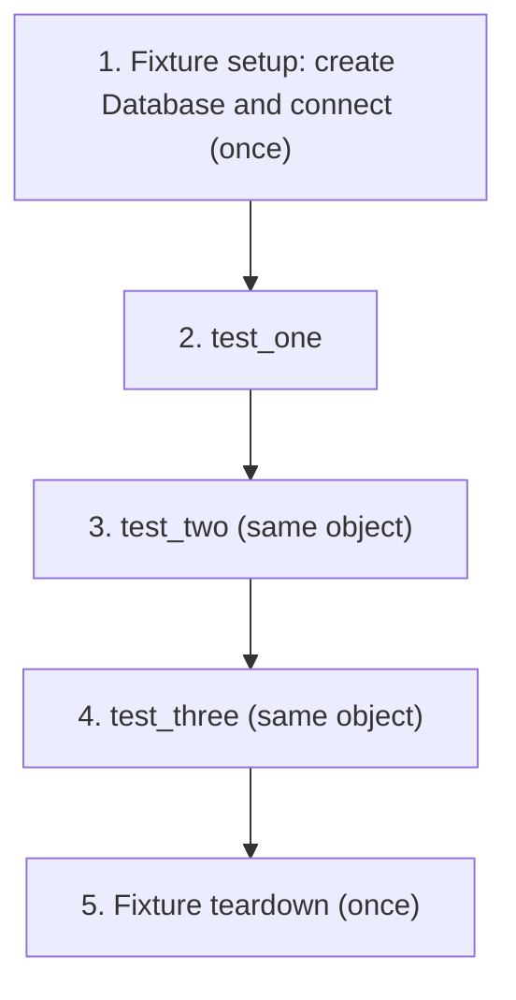
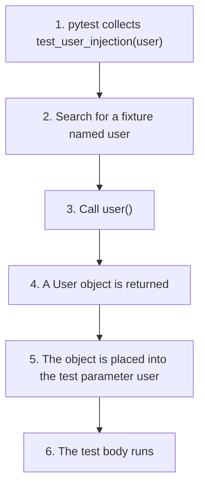
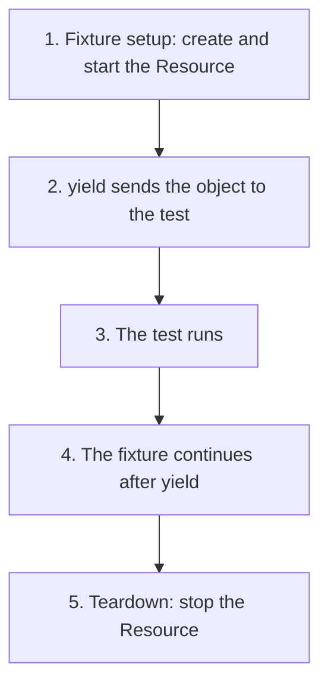
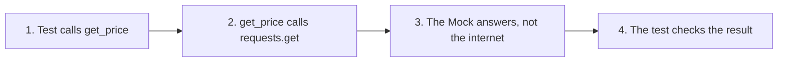
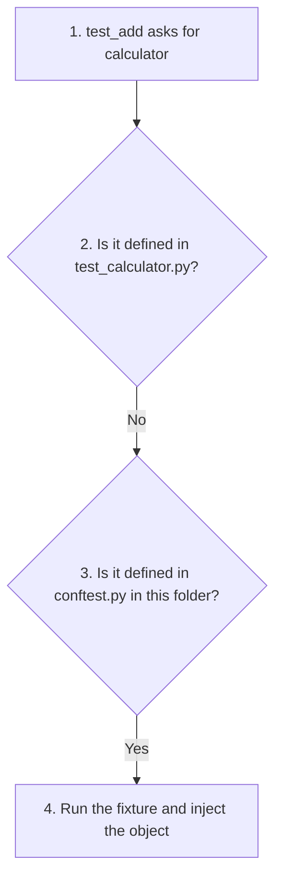
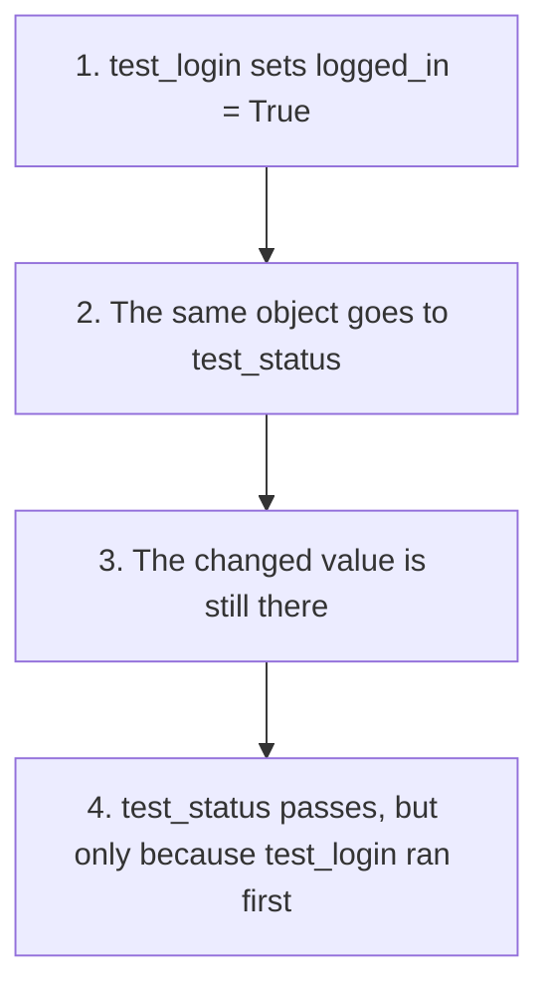
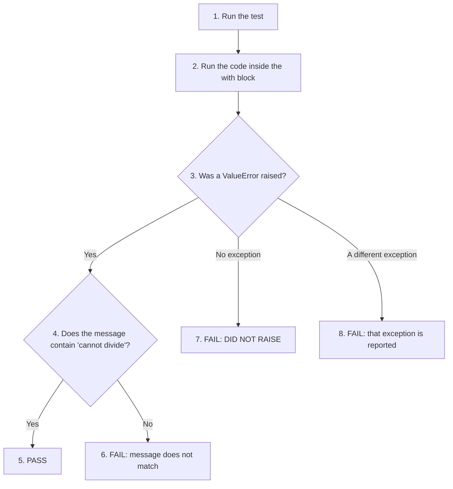
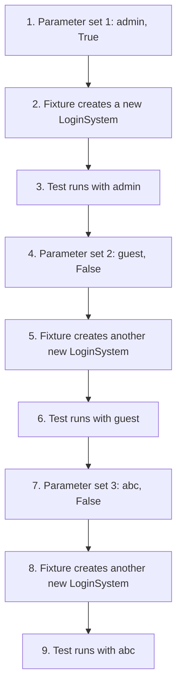

# Scripting Questions and Answers: pytest

This page contains twenty scripting questions on pytest, each with a complete, working answer. Where the conceptual questions for this chapter ask you to **explain** an idea, these questions ask you to **write the code**. Together they cover everything you need to build a real test suite: simple tests with `assert`, fixtures and dependency injection, fixture scopes, setup and teardown with `yield`, parameterized tests, testing exceptions and floating-point values, mocking an internet service, sharing fixtures with `conftest.py`, and arranging a small project so that pytest finds its tests automatically.

Every answer has been run with pytest, and the **actual output** is shown after the code, so you can compare it with what you see on your own computer. Each question has its own folder of files, because several questions use the same file names (for example `calculator.py`) with different contents. The folders are listed in [Scripts for This Page and How to Run Them](097-ch20-scripting-qa.md#scripts-for-this-page-and-how-to-run-them).

The questions become gradually harder. Questions 1 to 5 cover the basics, Questions 6 to 10 add parameters, project layout, teardown and mocking, Questions 11 to 15 look more closely at fixture scopes and special tests, and Questions 16 to 20 put everything together in a small project.

## Table of Contents

- [Scripting Questions and Answers: pytest](097-ch20-scripting-qa.md#scripting-questions-and-answers-pytest)
    - [How to Read the Outputs on This Page](097-ch20-scripting-qa.md#how-to-read-the-outputs-on-this-page)
    - [Part 1: Questions 1 to 5 (Basics)](097-ch20-scripting-qa.md#part-1-questions-1-to-5-basics)
        - [1. Write a pytest script to test a simple function that returns the square of a number. Create a test function and verify the returned value.](097-ch20-scripting-qa.md#1-write-a-pytest-script-to-test-a-simple-function-that-returns-the-square-of-a-number-create-a-test-function-and-verify-the-returned-value)
        - [2. Create a pytest fixture that creates a database object and injects it into two test functions.](097-ch20-scripting-qa.md#2-create-a-pytest-fixture-that-creates-a-database-object-and-injects-it-into-two-test-functions)
        - [3. Modify the fixture example to use session scope so that the object is created only once for all tests.](097-ch20-scripting-qa.md#3-modify-the-fixture-example-to-use-session-scope-so-that-the-object-is-created-only-once-for-all-tests)
        - [4. Write a pytest script demonstrating dependency injection. Show how pytest injects a fixture object into a test function parameter.](097-ch20-scripting-qa.md#4-write-a-pytest-script-demonstrating-dependency-injection-show-how-pytest-injects-a-fixture-object-into-a-test-function-parameter)
        - [5. Write a pytest test using pytest.raises() to verify that a function correctly raises an exception.](097-ch20-scripting-qa.md#5-write-a-pytest-test-using-pytestraises-to-verify-that-a-function-correctly-raises-an-exception)
    - [Part 2: Questions 6 to 10 (Parameters, Projects, Teardown and Mocks)](097-ch20-scripting-qa.md#part-2-questions-6-to-10-parameters-projects-teardown-and-mocks)
        - [6. Write a pytest script using pytest.mark.parametrize to test the same function with multiple input values.](097-ch20-scripting-qa.md#6-write-a-pytest-script-using-pytestmarkparametrize-to-test-the-same-function-with-multiple-input-values)
        - [7. Create a parameterized test that checks both valid and invalid inputs for a function.](097-ch20-scripting-qa.md#7-create-a-parameterized-test-that-checks-both-valid-and-invalid-inputs-for-a-function)
        - [8. Arrange a pytest project so that tests are automatically discovered.](097-ch20-scripting-qa.md#8-arrange-a-pytest-project-so-that-tests-are-automatically-discovered)
        - [9. Write a pytest fixture using yield to perform setup and teardown operations.](097-ch20-scripting-qa.md#9-write-a-pytest-fixture-using-yield-to-perform-setup-and-teardown-operations)
        - [10. Write a pytest example that uses a mock object instead of calling a real external service.](097-ch20-scripting-qa.md#10-write-a-pytest-example-that-uses-a-mock-object-instead-of-calling-a-real-external-service)
    - [Part 3: Questions 11 to 15 (Sharing Fixtures, Scopes and Special Tests)](097-ch20-scripting-qa.md#part-3-questions-11-to-15-sharing-fixtures-scopes-and-special-tests)
        - [11. Create a conftest.py file containing a fixture and use it in a test file without importing it.](097-ch20-scripting-qa.md#11-create-a-conftestpy-file-containing-a-fixture-and-use-it-in-a-test-file-without-importing-it)
        - [12. Demonstrate the difference between function scope and module scope fixtures.](097-ch20-scripting-qa.md#12-demonstrate-the-difference-between-function-scope-and-module-scope-fixtures)
        - [13. Create a session-scoped fixture to show that an expensive resource is created only once.](097-ch20-scripting-qa.md#13-create-a-session-scoped-fixture-to-show-that-an-expensive-resource-is-created-only-once)
        - [14. Demonstrate the shared state problem with a session-scoped fixture.](097-ch20-scripting-qa.md#14-demonstrate-the-shared-state-problem-with-a-session-scoped-fixture)
        - [15. Test exceptions and floating point values using pytest tools.](097-ch20-scripting-qa.md#15-test-exceptions-and-floating-point-values-using-pytest-tools)
    - [Part 4: Questions 16 to 20 (Putting It All Together)](097-ch20-scripting-qa.md#part-4-questions-16-to-20-putting-it-all-together)
        - [16. Write a pytest script that tests the return value of a function using assertions.](097-ch20-scripting-qa.md#16-write-a-pytest-script-that-tests-the-return-value-of-a-function-using-assertions)
        - [17. Create a pytest script to test multiple functions of an application.](097-ch20-scripting-qa.md#17-create-a-pytest-script-to-test-multiple-functions-of-an-application)
        - [18. Use fixtures with a test class to share common setup code.](097-ch20-scripting-qa.md#18-use-fixtures-with-a-test-class-to-share-common-setup-code)
        - [19. Combine parameterized testing and fixtures to test multiple cases.](097-ch20-scripting-qa.md#19-combine-parameterized-testing-and-fixtures-to-test-multiple-cases)
        - [20. Create a complete small pytest project with application code and test code.](097-ch20-scripting-qa.md#20-create-a-complete-small-pytest-project-with-application-code-and-test-code)
    - [Scripts for This Page and How to Run Them](097-ch20-scripting-qa.md#scripts-for-this-page-and-how-to-run-them)
    - [Summary](097-ch20-scripting-qa.md#summary)
    - [Further Reading](097-ch20-scripting-qa.md#further-reading)

## How to Read the Outputs on This Page

Most answers are run with:

```bash
pytest -v -s
```

| Flag | What It Does |
| --- | --- |
| `-v` | Shows the name and result (PASSED or FAILED) of every test |
| `-s` | Shows the output of `print()` statements, so you can see when fixtures and tests run |

The first few lines of every pytest run (platform, Python version, folder and plugins) will be different on your computer. That is normal. Compare the lines that show the tests, the printed messages and the final summary.

When `-s` is used, a message printed by a test may appear on the same line as the test's name, for example `test_session_fixture.py::test_two [TEST] two`. This is simply where the text lands in the terminal. It does not mean anything is wrong.

[Back to the Table of Contents](097-ch20-scripting-qa.md#table-of-contents)

## Part 1: Questions 1 to 5 (Basics)

[Back to the Table of Contents](097-ch20-scripting-qa.md#table-of-contents)

### 1. Write a pytest script to test a simple function that returns the square of a number. Create a test function and verify the returned value.

**Answer**

`square.py` (the application code):

```python
# square.py
# This is the application code that we want to test.


def square(number):
    # Step 1: Receive a number
    # Step 2: Multiply the number by itself
    # Step 3: Return the result
    return number * number
```

`test_square.py` (the test):

```python
# test_square.py
# Run it with:  pytest -v -s test_square.py

# Step 1: Import pytest (not strictly needed for a plain assert,
#         but most test files import it, so it is a good habit)
import pytest

# Step 2: Import the function to be tested
from square import square


# Step 3: Create a test function (its name must start with test)
def test_square():

    # Step 4 (Arrange): Prepare the input
    number = 5

    # Step 5 (Act): Call the application function
    result = square(number)
    print(f"\n[TEST] square({number}) returned {result}")

    # Step 6 (Assert): Check the returned value
    assert result == 25
```

Run `pytest -v -s test_square.py`:

```text
============================= test session starts ==============================
platform win32 -- Python 3.10.10, pytest-9.0.3, pluggy-1.6.0 -- C:\Users\Anurag Gupta\AppData\Local\Programs\Python\Python310\python.exe
cachedir: .pytest_cache
rootdir: C:\scripting-qa\q01
plugins: anyio-4.12.1
collected 1 item

test_square.py::test_square
[TEST] square(5) returned 25
PASSED

============================== 1 passed in 0.00s ===============================
```

**Explanation:**

The test follows the basic pattern for a unit test, known as **Arrange, Act, Assert**:

1. **Arrange:** prepare the input (`number = 5`).
2. **Act:** run the function (`result = square(number)`).
3. **Assert:** check the result (`assert result == 25`).

The `assert` statement checks whether the function behaved correctly. If `result` were not 25, the test would fail, and pytest would show the actual value.

Pytest found this test by itself, because the file name starts with `test_` and the function name starts with `test`.

[Back to the Table of Contents](097-ch20-scripting-qa.md#table-of-contents)

### 2. Create a pytest fixture that creates a database object and injects it into two test functions.

**Answer**

`database.py`:

```python
# database.py


class Database:

    def connect(self):
        # Step 1: Simulate a database connection
        print("[DB] connecting")
        return "connected"
```

`test_database.py`:

```python
# test_database.py
# Run it with:  pytest -v -s test_database.py

import pytest

from database import Database


# Step 1: Create a fixture.
#         The fixture creates the dependency object.
@pytest.fixture
def db():
    print("\n[FIXTURE] creating Database object")

    # Step 2: Create the Database object
    database = Database()

    # Step 3: Return the object to the test
    return database


# Step 4: pytest sees the parameter db.
#         It automatically calls the fixture named db,
#         and the returned Database object is injected here.
def test_connection(db):
    print("[TEST] test_connection")
    result = db.connect()
    assert result == "connected"


# Step 5: A second test receives its own Database object from the same fixture
def test_object_type(db):
    print("[TEST] test_object_type")
    assert isinstance(db, Database)
```

Run `pytest -v -s test_database.py`:

```text
============================= test session starts ==============================
platform win32 -- Python 3.10.10, pytest-9.0.3, pluggy-1.6.0 -- C:\Users\Anurag Gupta\AppData\Local\Programs\Python\Python310\python.exe
cachedir: .pytest_cache
rootdir: C:\scripting-qa\q02
plugins: anyio-4.12.1
collected 2 items

test_database.py::test_connection
[FIXTURE] creating Database object
[TEST] test_connection
[DB] connecting
PASSED
test_database.py::test_object_type
[FIXTURE] creating Database object
[TEST] test_object_type
PASSED

============================== 2 passed in 0.00s ===============================
```

**Important concept:**

The name `db` has two roles:

1. It is the name of the fixture function:

```python
def db():
```

2. It is the name of the test parameter that receives the object:

```python
def test_connection(db):
```

Pytest connects the two automatically, by matching the names. Handing a test the objects it needs in this way is called **dependency injection**.

Notice in the output that `[FIXTURE] creating Database object` appears **twice**, once before each test. A fixture has **function scope** by default, so each test gets its own new `Database` object. Question 3 changes this.

[Back to the Table of Contents](097-ch20-scripting-qa.md#table-of-contents)

### 3. Modify the fixture example to use session scope so that the object is created only once for all tests.

**Answer**

`test_session_fixture.py`:

```python
# test_session_fixture.py
# Run it with:  pytest -v -s test_session_fixture.py

import pytest


class Database:

    def connect(self):
        print("[DB] connecting")
        return "connected"


# Step 1: Create a session-scoped fixture
@pytest.fixture(scope="session")
def db():
    print("\n[FIXTURE] session setup")

    # Step 2: Create the object once, and connect once
    database = Database()
    database.connect()

    # Step 3: Provide the same object to all tests
    yield database

    # Step 4: Runs once, after all tests have finished
    print("\n[FIXTURE] session teardown")


def test_one(db):
    print("[TEST] one")
    assert isinstance(db, Database)


def test_two(db):
    print("[TEST] two")
    assert isinstance(db, Database)


def test_three(db):
    print("[TEST] three")
    assert db.connect() == "connected"
```

Run `pytest -v -s test_session_fixture.py`:

```text
============================= test session starts ==============================
platform win32 -- Python 3.10.10, pytest-9.0.3, pluggy-1.6.0 -- C:\Users\Anurag Gupta\AppData\Local\Programs\Python\Python310\python.exe
cachedir: .pytest_cache
rootdir: C:\scripting-qa\q03
plugins: anyio-4.12.1
collected 3 items

test_session_fixture.py::test_one
[FIXTURE] session setup
[DB] connecting
[TEST] one
PASSED
test_session_fixture.py::test_two [TEST] two
PASSED
test_session_fixture.py::test_three [TEST] three
[DB] connecting
PASSED
[FIXTURE] session teardown


============================== 3 passed in 0.00s ===============================
```

Expected execution order:



The setup and teardown happen only once. In the output, `[FIXTURE] session setup` and `[FIXTURE] session teardown` each appear a single time, even though there are three tests.

The second `[DB] connecting` line comes from `test_three` itself, which calls `db.connect()` in its `assert`. It is not a second setup.

[Back to the Table of Contents](097-ch20-scripting-qa.md#table-of-contents)

### 4. Write a pytest script demonstrating dependency injection. Show how pytest injects a fixture object into a test function parameter.

**Answer**

`test_injection.py`:

```python
# test_injection.py
# Run it with:  pytest -v -s test_injection.py

import pytest


class User:

    def __init__(self):
        self.name = "Alex"


# Step 1: The fixture function creates a User object
@pytest.fixture
def user():
    print("\n[FIXTURE] creating User object")
    return User()


# Step 2: The test requests "user".
#         pytest finds the fixture named user,
#         calls it, and injects the returned object.
def test_user_injection(user):
    print("[TEST] received object")
    print(type(user))

    # Step 3: Verify the injected object
    assert user.name == "Alex"
```

Run `pytest -v -s test_injection.py`:

```text
============================= test session starts ==============================
platform win32 -- Python 3.10.10, pytest-9.0.3, pluggy-1.6.0 -- C:\Users\Anurag Gupta\AppData\Local\Programs\Python\Python310\python.exe
cachedir: .pytest_cache
rootdir: C:\scripting-qa\q04
plugins: anyio-4.12.1
collected 1 item

test_injection.py::test_user_injection
[FIXTURE] creating User object
[TEST] received object
<class 'test_injection.User'>
PASSED

============================== 1 passed in 0.00s ===============================
```

The line `<class 'test_injection.User'>` proves that the parameter `user` holds a real `User` object, created by the fixture. The class name includes `test_injection`, because the class is defined in the file `test_injection.py`.

Flow:



Note that steps 2 to 5 all happen **before** the first line of the test runs. That is why `[FIXTURE] creating User object` is printed before `[TEST] received object`.

[Back to the Table of Contents](097-ch20-scripting-qa.md#table-of-contents)

### 5. Write a pytest test using pytest.raises() to verify that a function correctly raises an exception.

**Answer**

`calculator.py`:

```python
# calculator.py


def divide(a, b):

    # Step 1: Check for an invalid operation
    if b == 0:
        # Step 2: Raise an exception with a clear message
        raise ValueError("division by zero")

    # Step 3: Normal calculation
    return a / b
```

`test_calculator.py`:

```python
# test_calculator.py
# Run it with:  pytest -v test_calculator.py

import pytest

from calculator import divide


def test_divide_exception():

    # Step 1: Tell pytest that an exception is expected
    with pytest.raises(ValueError, match="division by zero"):

        # Step 2: The code inside this block should raise the exception
        divide(10, 0)


def test_divide_normal():
    # Step 3: Also check that normal division still works
    assert divide(10, 2) == 5
```

Run `pytest -v test_calculator.py`:

```text
============================= test session starts ==============================
platform win32 -- Python 3.10.10, pytest-9.0.3, pluggy-1.6.0 -- C:\Users\Anurag Gupta\AppData\Local\Programs\Python\Python310\python.exe
cachedir: .pytest_cache
rootdir: C:\scripting-qa\q05
plugins: anyio-4.12.1
collected 2 items

test_calculator.py::test_divide_exception PASSED                         [ 50%]
test_calculator.py::test_divide_normal PASSED                            [100%]

============================== 2 passed in 0.00s ===============================
```

**Important point:**

Without `pytest.raises()`, the line:

```python
divide(10, 0)
```

would raise `ValueError`, and the test would fail with that error.

With:

```python
with pytest.raises(ValueError, match="division by zero"):
```

pytest knows that the exception is expected. It catches the exception, checks that its message contains `division by zero`, and lets the test pass.

The test would **fail** if `divide(10, 0)` raised no exception, or raised a different kind of exception.

The file also has a second test, `test_divide_normal`, which checks that normal division still works. A good set of tests checks both the error case and the normal case.

(Python itself would raise `ZeroDivisionError` for `10 / 0`. Our function checks for zero first and raises its own `ValueError` with a clear message instead.)

[Back to the Table of Contents](097-ch20-scripting-qa.md#table-of-contents)

## Part 2: Questions 6 to 10 (Parameters, Projects, Teardown and Mocks)

[Back to the Table of Contents](097-ch20-scripting-qa.md#table-of-contents)

### 6. Write a pytest script using pytest.mark.parametrize to test the same function with multiple input values.

**Answer**

`calculator.py`:

```python
# calculator.py


def square(number):
    # Step 1: Receive a number
    # Step 2: Calculate the square
    result = number * number
    # Step 3: Return the result
    return result
```

`test_calculator.py`:

```python
# test_calculator.py
# Run it with:  pytest -v test_calculator.py

import pytest

from calculator import square


# Step 1: parametrize runs the same test several times,
#         each time with a different set of values.
@pytest.mark.parametrize(
    "number, expected",
    [
        (2, 4),
        (3, 9),
        (5, 25),
        (10, 100),
    ],
)
def test_square(number, expected):

    # Step 2: Each row of data becomes one test run
    result = square(number)

    # Step 3: Compare the actual result with the expected result
    assert result == expected
```

Run `pytest -v test_calculator.py`:

```text
============================= test session starts ==============================
platform win32 -- Python 3.10.10, pytest-9.0.3, pluggy-1.6.0 -- C:\Users\Anurag Gupta\AppData\Local\Programs\Python\Python310\python.exe
cachedir: .pytest_cache
rootdir: C:\scripting-qa\q06
plugins: anyio-4.12.1
collected 4 items

test_calculator.py::test_square[2-4] PASSED                              [ 25%]
test_calculator.py::test_square[3-9] PASSED                              [ 50%]
test_calculator.py::test_square[5-25] PASSED                             [ 75%]
test_calculator.py::test_square[10-100] PASSED                           [100%]

============================== 4 passed in 0.01s ===============================
```

**Explanation:**

Instead of writing:

```python
def test_square_2():
    assert square(2) == 4


def test_square_3():
    assert square(3) == 9
```

we write one test and give it many sets of input.

Each parameter set is treated as a separate test. The output shows four tests, one per row, each with its own name in square brackets (such as `test_square[3-9]`). If one fails, the others still run.

[Back to the Table of Contents](097-ch20-scripting-qa.md#table-of-contents)

### 7. Create a parameterized test that checks both valid and invalid inputs for a function.

**Answer**

`validator.py`:

```python
# validator.py


def check_age(age):

    # Step 1: Validate the age
    if age < 18:
        # Step 2: Return the "invalid" message
        return "not allowed"

    # Step 3: Return the "valid" message
    return "allowed"
```

`test_validator.py`:

```python
# test_validator.py
# Run it with:  pytest -v test_validator.py

import pytest

from validator import check_age


# Step 1: Create several test cases: two invalid and two valid ages.
#         17 and 18 are the boundary values, where mistakes often hide.
@pytest.mark.parametrize(
    "age, expected",
    [
        (10, "not allowed"),
        (17, "not allowed"),
        (18, "allowed"),
        (25, "allowed"),
    ],
)
def test_age_check(age, expected):

    # Step 2: Run the function
    result = check_age(age)

    # Step 3: Check the output
    assert result == expected
```

Run `pytest -v test_validator.py`:

```text
============================= test session starts ==============================
platform win32 -- Python 3.10.10, pytest-9.0.3, pluggy-1.6.0 -- C:\Users\Anurag Gupta\AppData\Local\Programs\Python\Python310\python.exe
cachedir: .pytest_cache
rootdir: C:\scripting-qa\q07
plugins: anyio-4.12.1
collected 4 items

test_validator.py::test_age_check[10-not allowed] PASSED                 [ 25%]
test_validator.py::test_age_check[17-not allowed] PASSED                 [ 50%]
test_validator.py::test_age_check[18-allowed] PASSED                     [ 75%]
test_validator.py::test_age_check[25-allowed] PASSED                     [100%]

============================== 4 passed in 0.01s ===============================
```

**Learning point:**

Parameterized testing is useful when:

- the logic is the same
- only the input changes

It improves:

- readability
- maintenance
- test coverage

The chosen ages are not random. 10 and 25 are clearly invalid and clearly valid. 17 and 18 sit on either side of the rule "18 or over", which is where mistakes such as writing `<=` instead of `<` would show up. These are called **boundary values**.

[Back to the Table of Contents](097-ch20-scripting-qa.md#table-of-contents)

### 8. Arrange a pytest project so that tests are automatically discovered.

**Answer**

Project structure:

```text
my_project/
│
├── pytest.ini
├── calculator.py
│
└── tests/
    ├── test_calculator.py
    └── test_more_math.py
```

`pytest.ini`:

```ini
# pytest.ini
# Marks the project root and tells pytest where the tests are.

[pytest]
# Look for tests in the tests folder
testpaths = tests

# Let the tests import calculator.py from the project root
pythonpath = .
```

`calculator.py`:

```python
# calculator.py
# Application file


def add(a, b):
    # Step 1: Add two numbers
    return a + b
```

`tests/test_calculator.py`:

```python
# tests/test_calculator.py
# Test file

from calculator import add


def test_add():

    # Step 1: Call the application function
    result = add(2, 3)

    # Step 2: Check the result
    assert result == 5
```

`tests/test_more_math.py`:

```python
# tests/test_more_math.py
# A second test file, to show that pytest finds every test_*.py file

from calculator import add


def test_add_negative_numbers():
    assert add(-2, -3) == -5


def helper_not_a_test():
    # Not collected: the name does not start with "test"
    return 42
```

Run (in the terminal, from the `my_project` folder):

```bash
pytest -v
```

Output:

```text
============================= test session starts ==============================
platform win32 -- Python 3.10.10, pytest-9.0.3, pluggy-1.6.0 -- C:\Users\Anurag Gupta\AppData\Local\Programs\Python\Python310\python.exe
cachedir: .pytest_cache
rootdir: C:\scripting-qa\q08\my_project
configfile: pytest.ini
testpaths: tests
plugins: anyio-4.12.1
collected 2 items

tests/test_calculator.py::test_add PASSED                                [ 50%]
tests/test_more_math.py::test_add_negative_numbers PASSED                [100%]

============================== 2 passed in 0.00s ===============================
```

Pytest found both test files and both test functions without being told their names. It automatically looks for files named:

```text
test_*.py
*_test.py
```

and, inside them, for functions whose names start with `test`. The function `helper_not_a_test()` was not run, because its name does not start with `test`.

To see which tests pytest would find, without running them:

```bash
pytest --collect-only -q
```

```text
tests/test_calculator.py::test_add
tests/test_more_math.py::test_add_negative_numbers

2 tests collected in 0.00s
```

**Why pytest.ini is needed here:** the tests are in `tests/`, but `calculator.py` is one folder up. Without `pythonpath = .`, the import fails with `ModuleNotFoundError: No module named 'calculator'`. The setting `testpaths = tests` tells pytest where to look for tests.

**Important naming rule:**

| File Name | Found Automatically? | Why |
| --- | --- | --- |
| `test_math.py` | Yes | Starts with `test_` |
| `math_test.py` | Yes | Ends with `_test.py` |
| `math_testing.py` | No | Ends with `_testing.py`, not `_test.py` |
| `mytests.py` | No | Neither starts with `test_` nor ends with `_test.py` |

Files with incorrect names are not collected unless you name them on the command line.

[Back to the Table of Contents](097-ch20-scripting-qa.md#table-of-contents)

### 9. Write a pytest fixture using yield to perform setup and teardown operations.

**Answer**

`test_resource.py`:

```python
# test_resource.py
# Run it with:  pytest -v -s test_resource.py

import pytest


class Resource:

    def start(self):
        print("[APP] resource started")

    def stop(self):
        print("[APP] resource stopped")


@pytest.fixture
def resource():

    # Step 1: Setup section
    print("\n[FIXTURE] setup")
    obj = Resource()
    obj.start()

    # Step 2: Send the object to the test
    yield obj

    # Step 3: Teardown section (runs after the test finishes, even if it fails)
    print("\n[FIXTURE] teardown")
    obj.stop()


def test_resource(resource):

    # Step 4: resource holds the object sent by yield
    print("[TEST] running")
    assert isinstance(resource, Resource)
```

Run `pytest -v -s test_resource.py`:

```text
============================= test session starts ==============================
platform win32 -- Python 3.10.10, pytest-9.0.3, pluggy-1.6.0 -- C:\Users\Anurag Gupta\AppData\Local\Programs\Python\Python310\python.exe
cachedir: .pytest_cache
rootdir: C:\scripting-qa\q09
plugins: anyio-4.12.1
collected 1 item

test_resource.py::test_resource
[FIXTURE] setup
[APP] resource started
[TEST] running
PASSED
[FIXTURE] teardown
[APP] resource stopped


============================== 1 passed in 0.00s ===============================
```

Execution flow:



**Important:**

- The code before `yield` is the setup.
- The code after `yield` is the cleanup (teardown).
- The teardown runs even if the test fails, so resources are always released.

[Back to the Table of Contents](097-ch20-scripting-qa.md#table-of-contents)

### 10. Write a pytest example that uses a mock object instead of calling a real external service.

**Answer**

`payment.py`:

```python
# payment.py
# Needs the requests library:  python -m pip install requests

import requests


def get_price(product):

    # Step 1: A real program would contact an internet API
    response = requests.get(f"https://example.com/products/{product}")

    # Step 2: Read the price from the JSON reply
    return response.json()["price"]
```

**Problem:**

Testing this function directly, with:

```python
get_price("book")
```

would:

- need an internet connection
- be slow
- depend on an outside server that may be down or may change its data

**Using a Mock:**

`test_payment.py`:

```python
# test_payment.py
# Run it with:  pytest -v -s test_payment.py

from unittest.mock import Mock, patch

from payment import get_price


def test_price():

    # Step 1: Create a fake response object
    fake_response = Mock()

    # Step 2: Decide what the fake object returns from .json()
    fake_response.json.return_value = {"price": 100}

    # Step 3: Replace requests.get with a Mock, but ONLY inside this
    #         with block. patch() puts the real requests.get back
    #         automatically when the block ends.
    with patch("payment.requests.get", return_value=fake_response) as fake_get:

        # Step 4: Run the application code
        result = get_price("book")
        print(f"\n[TEST] get_price returned {result}")

        # Step 5: Check which URL the code asked for
        fake_get.assert_called_once_with("https://example.com/products/book")

    # Step 6: Check the result
    assert result == 100
```

Run `pytest -v -s test_payment.py`:

```text
============================= test session starts ==============================
platform win32 -- Python 3.10.10, pytest-9.0.3, pluggy-1.6.0 -- C:\Users\Anurag Gupta\AppData\Local\Programs\Python\Python310\python.exe
cachedir: .pytest_cache
rootdir: C:\scripting-qa\q10
plugins: anyio-4.12.1
collected 1 item

test_payment.py::test_price
[TEST] get_price returned 100
PASSED

============================== 1 passed in 0.07s ===============================
```

How it works:

1. `Mock()` creates a fake response object. We tell its `json()` method to return `{"price": 100}`.
2. `patch("payment.requests.get", ...)` replaces `requests.get`, as used inside `payment.py`, with a mock that returns our fake response.
3. `get_price("book")` runs its normal code, but the "request" never leaves the computer.
4. `assert_called_once_with(...)` checks that the code asked for the right web address.
5. When the `with` block ends, `patch()` puts the real `requests.get` back.

Why use `patch()` instead of simply writing `requests.get = Mock(...)`? A direct assignment replaces `requests.get` for the **rest of the test run**. Every later test that uses `requests` would get the fake, which can cause confusing failures far away from this test. `patch()` limits the change to one block. (Pytest's built-in `monkeypatch` fixture does the same job.) You can read more in the Python documentation on [patch](https://docs.python.org/3/library/unittest.mock.html#unittest.mock.patch).

**Concept:**

The test does not contact the internet:



Mocking helps create:

- fast tests
- predictable tests
- independent tests

Note: `payment.py` imports the `requests` library, which is not part of standard Python. Install it with `python -m pip install requests` before running this example.

[Back to the Table of Contents](097-ch20-scripting-qa.md#table-of-contents)

## Part 3: Questions 11 to 15 (Sharing Fixtures, Scopes and Special Tests)

[Back to the Table of Contents](097-ch20-scripting-qa.md#table-of-contents)

### 11. Create a conftest.py file containing a fixture and use it in a test file without importing it.

**Answer**

Project structure:

```text
project/
│
├── calculator.py
├── conftest.py
└── test_calculator.py
```

`calculator.py`:

```python
# calculator.py
# Application file


class Calculator:

    def add(self, a, b):
        # Step 1: Add two numbers
        return a + b
```

`conftest.py`:

```python
# conftest.py
# Fixtures in this file are shared with every test file in this folder
# (and in the folders inside it). Test files do not import them.

import pytest

from calculator import Calculator


@pytest.fixture
def calculator():

    # Step 2: Create the object
    print("\n[FIXTURE] creating calculator")
    obj = Calculator()

    # Step 3: Return the object to the test
    return obj
```

`test_calculator.py`:

```python
# test_calculator.py
# Run it with:  pytest -v -s test_calculator.py
# Notice: there is NO "from conftest import calculator"


def test_add(calculator):

    # Step 1: The calculator object is injected automatically
    print("[TEST] add started")
    result = calculator.add(5, 10)

    # Step 2: Check the result
    assert result == 15
```

Run `pytest -v -s test_calculator.py`:

```text
============================= test session starts ==============================
platform win32 -- Python 3.10.10, pytest-9.0.3, pluggy-1.6.0 -- C:\Users\Anurag Gupta\AppData\Local\Programs\Python\Python310\python.exe
cachedir: .pytest_cache
rootdir: C:\scripting-qa\q11\project
plugins: anyio-4.12.1
collected 1 item

test_calculator.py::test_add
[FIXTURE] creating calculator
[TEST] add started
PASSED

============================== 1 passed in 0.00s ===============================
```

**Important observation:**

There is no:

```python
from conftest import calculator
```

Pytest looks for the fixture itself:



Any other test file in this folder, or in a folder inside it, could use the `calculator` fixture in the same way.

[Back to the Table of Contents](097-ch20-scripting-qa.md#table-of-contents)

### 12. Demonstrate the difference between function scope and module scope fixtures.

**Answer**

`test_scope.py`:

```python
# test_scope.py
# Run it with:  pytest -v -s test_scope.py

import pytest


# Step 1: Function scope is the default scope.
#         It runs once for every test function.
@pytest.fixture(scope="function")
def function_fixture():
    print("\n[FIXTURE] function setup")
    return "object"


# Step 2: Module scope runs once per file
@pytest.fixture(scope="module")
def module_fixture():
    print("\n[FIXTURE] module setup")
    return "object"


def test_one(function_fixture, module_fixture):
    print("[TEST] one")


def test_two(function_fixture, module_fixture):
    print("[TEST] two")
```

Run `pytest -v -s test_scope.py`:

```text
============================= test session starts ==============================
platform win32 -- Python 3.10.10, pytest-9.0.3, pluggy-1.6.0 -- C:\Users\Anurag Gupta\AppData\Local\Programs\Python\Python310\python.exe
cachedir: .pytest_cache
rootdir: C:\scripting-qa\q12
plugins: anyio-4.12.1
collected 2 items

test_scope.py::test_one
[FIXTURE] module setup

[FIXTURE] function setup
[TEST] one
PASSED
test_scope.py::test_two
[FIXTURE] function setup
[TEST] two
PASSED

============================== 2 passed in 0.00s ===============================
```

**Observation:**

- `module_fixture` ran **once**, before the first test.
- `function_fixture` ran **before every test**.

Pytest sets up the fixture with the wider scope first, which is why `module setup` is printed before `function setup` in the first test.

**Comparison table:**

| Scope | Lifetime | Runs |
| --- | --- | --- |
| `function` | One test | Before every test |
| `class` | One test class | Once per class |
| `module` | One file | Once per file |
| `package` | One folder of tests | Once per folder |
| `session` | The complete run | Once |

[Back to the Table of Contents](097-ch20-scripting-qa.md#table-of-contents)

### 13. Create a session-scoped fixture to show that an expensive resource is created only once.

**Answer**

`test_session.py`:

```python
# test_session.py
# Run it with:  pytest -v -s test_session.py

import pytest

# Counts how many times the fixture's setup runs
count = 0


class Connection:

    def connect(self):
        print("[APP] connecting")

    def close(self):
        print("[APP] closing")


@pytest.fixture(scope="session")
def connection():

    # 'global' lets the fixture change the count defined above
    global count

    # Step 1: This part runs only once for the whole session
    count += 1
    print(f"\n[FIXTURE] setup count = {count}")
    obj = Connection()
    obj.connect()

    # Step 2: Provide the same object to all tests
    yield obj

    # Step 3: Clean up at the end of the session
    print()
    obj.close()


def test_one(connection):
    print(f"[TEST] one (count = {count})")
    assert isinstance(connection, Connection)


def test_two(connection):
    print(f"[TEST] two (count = {count})")
    assert isinstance(connection, Connection)


def test_three(connection):
    print(f"[TEST] three (count = {count})")
    assert isinstance(connection, Connection)
```

Run `pytest -v -s test_session.py`:

```text
============================= test session starts ==============================
platform win32 -- Python 3.10.10, pytest-9.0.3, pluggy-1.6.0 -- C:\Users\Anurag Gupta\AppData\Local\Programs\Python\Python310\python.exe
cachedir: .pytest_cache
rootdir: C:\scripting-qa\q13
plugins: anyio-4.12.1
collected 3 items

test_session.py::test_one
[FIXTURE] setup count = 1
[APP] connecting
[TEST] one (count = 1)
PASSED
test_session.py::test_two [TEST] two (count = 1)
PASSED
test_session.py::test_three [TEST] three (count = 1)
PASSED
[APP] closing


============================== 3 passed in 0.00s ===============================
```

What the output shows:

1. `[FIXTURE] setup count = 1` and `[APP] connecting` appear once, before the first test.
2. All three tests print `count = 1`: the setup never ran a second time.
3. `[APP] closing` appears once, after the last test.

The same object is shared by all three tests. If connecting took several seconds (as a real database or network connection might), this would save a lot of time.

[Back to the Table of Contents](097-ch20-scripting-qa.md#table-of-contents)

### 14. Demonstrate the shared state problem with a session-scoped fixture.

**Answer**

`test_shared_state.py`:

```python
# test_shared_state.py
# Run it with:  pytest -v -s test_shared_state.py

import pytest


class User:

    def __init__(self):
        self.logged_in = False


@pytest.fixture(scope="session")
def user():

    # Step 1: Create one shared object
    print("\n[FIXTURE] creating user")
    return User()


def test_login(user):

    # Step 2: Change the shared object
    user.logged_in = True
    print("[TEST] user logged in")
    assert user.logged_in == True


def test_status(user):

    # Step 3: This test receives the SAME object
    print(f"[TEST] checking status: logged_in = {user.logged_in}")
    assert user.logged_in == True
```

Run `pytest -v -s test_shared_state.py`:

```text
============================= test session starts ==============================
platform win32 -- Python 3.10.10, pytest-9.0.3, pluggy-1.6.0 -- C:\Users\Anurag Gupta\AppData\Local\Programs\Python\Python310\python.exe
cachedir: .pytest_cache
rootdir: C:\scripting-qa\q14
plugins: anyio-4.12.1
collected 2 items

test_shared_state.py::test_login
[FIXTURE] creating user
[TEST] user logged in
PASSED
test_shared_state.py::test_status [TEST] checking status: logged_in = True
PASSED

============================== 2 passed in 0.00s ===============================
```

Both tests pass. But look at why `test_status` passes: it receives the **same** `User` object that `test_login` changed.



Now run `test_status` **on its own**:

```bash
pytest -v -s test_shared_state.py::test_status
```

```text
============================= test session starts ==============================
platform win32 -- Python 3.10.10, pytest-9.0.3, pluggy-1.6.0 -- C:\Users\Anurag Gupta\AppData\Local\Programs\Python\Python310\python.exe
cachedir: .pytest_cache
rootdir: C:\scripting-qa\q14
plugins: anyio-4.12.1
collected 1 item

test_shared_state.py::test_status
[FIXTURE] creating user
[TEST] checking status: logged_in = False
FAILED

=================================== FAILURES ===================================
_________________________________ test_status __________________________________

user = <test_shared_state.User object at 0x0000021F4C8B7D90>

    def test_status(user):

        # Step 3: This test receives the SAME object
        print(f"[TEST] checking status: logged_in = {user.logged_in}")
>       assert user.logged_in == True
E       assert False == True
E        +  where False = <test_shared_state.User object at 0x0000021F4C8B7D90>.logged_in

test_shared_state.py:33: AssertionError
=========================== short test summary info ============================
FAILED test_shared_state.py::test_status - assert False == True
============================== 1 failed in 0.01s ===============================
```

On its own, `test_status` receives a brand-new `User`, whose `logged_in` is `False`, and it fails. (The memory address after `object at` will be different on your computer.)

**Problem:**

The tests have become dependent on each other. `test_status` passes or fails depending on which tests ran before it. This kind of hidden dependency makes failures confusing and hard to track down.

A safer approach:

```python
@pytest.fixture(scope="function")
```

creates a fresh object for each test. Then each test must set up the state it needs itself, for example by logging the user in at the start of `test_status`.

[Back to the Table of Contents](097-ch20-scripting-qa.md#table-of-contents)

### 15. Test exceptions and floating point values using pytest tools.

**Answer**

`calculator.py` (both functions are in the same file):

```python
# calculator.py


def divide(a, b):

    # Step 1: Check for an invalid division
    if b == 0:
        raise ValueError("cannot divide by zero")

    # Step 2: Normal calculation
    return a / b


def calculate_tax(amount):
    # 10% tax
    return amount * 0.10
```

`test_calculator.py`:

```python
# test_calculator.py
# Run it with:  pytest -v -s test_calculator.py

import pytest

from calculator import divide, calculate_tax


# Part A - Testing exceptions
def test_exception():

    # Step 1: Tell pytest that an exception is expected
    with pytest.raises(ValueError, match="cannot divide"):

        # Step 2: Code that should raise the exception
        divide(10, 0)


# Part B - Testing floating-point values
def test_tax():

    result = calculate_tax(1.10)
    print(f"\n[TEST] calculate_tax(1.10) = {result!r}")

    # Step 1: Do not compare floats exactly.
    #         result == 0.11 would be False here.
    assert result == pytest.approx(0.11)
```

Run `pytest -v -s test_calculator.py`:

```text
============================= test session starts ==============================
platform win32 -- Python 3.10.10, pytest-9.0.3, pluggy-1.6.0 -- C:\Users\Anurag Gupta\AppData\Local\Programs\Python\Python310\python.exe
cachedir: .pytest_cache
rootdir: C:\scripting-qa\q15
plugins: anyio-4.12.1
collected 2 items

test_calculator.py::test_exception PASSED
test_calculator.py::test_tax
[TEST] calculate_tax(1.10) = 0.11000000000000001
PASSED

============================== 2 passed in 0.00s ===============================
```

**Part A: Testing exceptions**

Flow:



**Part B: Testing floating-point values**

The output shows that `calculate_tax(1.10)` returns `0.11000000000000001`, not `0.11`.

Why? Computers store most decimal numbers approximately, in binary. For example:

```text
On paper:   0.10 + 0.20 = 0.30
In Python:  0.1 + 0.2   = 0.30000000000000004
```

So `result == 0.11` would be `False`, and a plain `assert` would fail. `pytest.approx(0.11)` checks whether the values are close enough (by default, within one millionth of the expected value), so the test passes. You can read more in the Python tutorial on [floating-point arithmetic](https://docs.python.org/3/tutorial/floatingpoint.html).

[Back to the Table of Contents](097-ch20-scripting-qa.md#table-of-contents)

## Part 4: Questions 16 to 20 (Putting It All Together)

[Back to the Table of Contents](097-ch20-scripting-qa.md#table-of-contents)

### 16. Write a pytest script that tests the return value of a function using assertions.

**Answer**

`calculator.py`:

```python
# calculator.py
# Step 1: Application code file


def multiply(a, b):

    # Step 2: Perform the calculation
    result = a * b

    # Step 3: Return the result
    return result
```

`test_calculator.py`:

```python
# test_calculator.py
# Run it with:  pytest -v test_calculator.py

# Step 1: Import the application function
from calculator import multiply


def test_multiply():

    # Step 2: Call the function
    result = multiply(5, 4)

    # Step 3: Check the returned value
    assert result == 20

    # Step 4: Check the type as well
    assert isinstance(result, int)
```

Run `pytest -v test_calculator.py`:

```text
============================= test session starts ==============================
platform win32 -- Python 3.10.10, pytest-9.0.3, pluggy-1.6.0 -- C:\Users\Anurag Gupta\AppData\Local\Programs\Python\Python310\python.exe
cachedir: .pytest_cache
rootdir: C:\scripting-qa\q16
plugins: anyio-4.12.1
collected 1 item

test_calculator.py::test_multiply PASSED                                 [100%]

============================== 1 passed in 0.00s ===============================
```

**Learning point:**

A test should check:

- what the function returns
- whether the returned value is correct
- whether the returned data type is correct

To check the type, `isinstance(result, int)` is usually preferred to `type(result) == int`. `isinstance()` also accepts types built on top of `int` (subclasses), and it is the style recommended by Python's style guide, [PEP 8](https://peps.python.org/pep-0008/#programming-recommendations).

[Back to the Table of Contents](097-ch20-scripting-qa.md#table-of-contents)

### 17. Create a pytest script to test multiple functions of an application.

**Answer**

`bank.py`:

```python
# bank.py
# Application file


def deposit(balance, amount):
    # Step 1: Add the amount
    return balance + amount


def withdraw(balance, amount):
    # Step 2: Take away the amount
    return balance - amount
```

`test_bank.py`:

```python
# test_bank.py
# Run it with:  pytest -v test_bank.py

# Step 1: Import both functions
from bank import deposit, withdraw


def test_deposit():
    # Step 2: Test deposit
    result = deposit(100, 50)
    assert result == 150


def test_withdraw():
    # Step 3: Test withdrawal
    result = withdraw(100, 30)
    assert result == 70
```

Run `pytest -v test_bank.py`:

```text
============================= test session starts ==============================
platform win32 -- Python 3.10.10, pytest-9.0.3, pluggy-1.6.0 -- C:\Users\Anurag Gupta\AppData\Local\Programs\Python\Python310\python.exe
cachedir: .pytest_cache
rootdir: C:\scripting-qa\q17
plugins: anyio-4.12.1
collected 2 items

test_bank.py::test_deposit PASSED                                        [ 50%]
test_bank.py::test_withdraw PASSED                                       [100%]

============================== 2 passed in 0.00s ===============================
```

**Concept:**

Each test should normally test one behaviour.

Good:

```python
def test_deposit(): ...
def test_withdraw(): ...
```

Avoid:

```python
def test_everything(): ...
```

because when one big test fails, it is hard to tell which part went wrong. Also, the first failing `assert` stops the test, so the later checks never run. With separate tests, the report shows exactly which behaviour is broken.

[Back to the Table of Contents](097-ch20-scripting-qa.md#table-of-contents)

### 18. Use fixtures with a test class to share common setup code.

**Answer**

`test_user.py`:

```python
# test_user.py
# Run it with:  pytest -v -s test_user.py

import pytest


class User:

    def __init__(self):
        self.name = "Student"


@pytest.fixture
def user():
    # Step 1: Create the common object
    print("\n[FIXTURE] creating user")
    return User()


class TestUser:

    def test_name(self, user):
        # Step 2: The fixture object is injected (after self)
        assert user.name == "Student"

    def test_type(self, user):
        # Step 3: The same fixture is used again
        assert isinstance(user, User)
```

Run `pytest -v -s test_user.py`:

```text
============================= test session starts ==============================
platform win32 -- Python 3.10.10, pytest-9.0.3, pluggy-1.6.0 -- C:\Users\Anurag Gupta\AppData\Local\Programs\Python\Python310\python.exe
cachedir: .pytest_cache
rootdir: C:\scripting-qa\q18
plugins: anyio-4.12.1
collected 2 items

test_user.py::TestUser::test_name
[FIXTURE] creating user
PASSED
test_user.py::TestUser::test_type
[FIXTURE] creating user
PASSED

============================== 2 passed in 0.00s ===============================
```

Points to note:

1. Inside a class, the fixture name comes **after** `self`: `def test_name(self, user):`.
2. The test names in the output include the class name: `test_user.py::TestUser::test_name`.
3. The fixture has function scope, so `[FIXTURE] creating user` appears before **each** test method.

**Important:**

Fixtures reduce repeated code. Without the fixture, the line:

```python
user = User()
```

would be repeated in every test.

[Back to the Table of Contents](097-ch20-scripting-qa.md#table-of-contents)

### 19. Combine parameterized testing and fixtures to test multiple cases.

**Answer**

`test_login.py`:

```python
# test_login.py
# Run it with:  pytest -v -s test_login.py

import pytest


class LoginSystem:

    def check(self, username):
        # Step 1: Simple validation
        if username == "admin":
            return True
        return False


@pytest.fixture
def login():
    # Step 2: Create the object (runs again for EVERY test case)
    print("\n[FIXTURE] creating LoginSystem")
    return LoginSystem()


@pytest.mark.parametrize(
    "username, expected",
    [
        ("admin", True),
        ("guest", False),
        ("abc", False),
    ],
)
def test_login(login, username, expected):

    # Step 3: A fresh fixture object, with a different input each time
    result = login.check(username)
    print(f"[TEST] check({username!r}) -> {result}")

    # Step 4: Check the result
    assert result == expected
```

Run `pytest -v -s test_login.py`:

```text
============================= test session starts ==============================
platform win32 -- Python 3.10.10, pytest-9.0.3, pluggy-1.6.0 -- C:\Users\Anurag Gupta\AppData\Local\Programs\Python\Python310\python.exe
cachedir: .pytest_cache
rootdir: C:\scripting-qa\q19
plugins: anyio-4.12.1
collected 3 items

test_login.py::test_login[admin-True]
[FIXTURE] creating LoginSystem
[TEST] check('admin') -> True
PASSED
test_login.py::test_login[guest-False]
[FIXTURE] creating LoginSystem
[TEST] check('guest') -> False
PASSED
test_login.py::test_login[abc-False]
[FIXTURE] creating LoginSystem
[TEST] check('abc') -> False
PASSED

============================== 3 passed in 0.01s ===============================
```

Execution:



Note that the fixture runs **three times**, once for each parameter set, as the output shows. Each parameter set is a separate test, and a function-scoped fixture is created fresh for every test. If you wanted one shared `LoginSystem`, you would give the fixture a wider scope, such as `scope="module"`.

Advantages:

- no repeated test code
- many cases covered
- easy to add new tests: just add one more tuple

[Back to the Table of Contents](097-ch20-scripting-qa.md#table-of-contents)

### 20. Create a complete small pytest project with application code and test code.

**Answer**

Project structure:

```text
student_project/
│
├── pytest.ini
├── product.py
│
└── tests/
    └── test_product.py
```

`pytest.ini`:

```ini
# pytest.ini
[pytest]
testpaths = tests
pythonpath = .
```

`product.py`:

```python
# product.py
# Application file


class Product:

    def __init__(self, name, price):
        # Step 1: Store the product data
        self.name = name
        self.price = price

    def get_price(self):
        # Step 2: Return the stored price
        return self.price
```

`tests/test_product.py`:

```python
# tests/test_product.py
# Run it from the student_project folder with:  pytest -v -s

import pytest

from product import Product


@pytest.fixture
def product():
    # Step 1: Create the common object
    print("\n[FIXTURE] creating product")
    return Product("Book", 100)


def test_product_name(product):
    # Step 2: Test the name
    assert product.name == "Book"


def test_product_price(product):
    # Step 3: Test the method result
    result = product.get_price()
    assert result == 100


@pytest.mark.parametrize("value", [100, 200, 300])
def test_multiple_prices(value):
    # Step 4: Test several values
    p = Product("Item", value)
    assert p.get_price() == value
```

Run from the `student_project` folder:

```bash
pytest -v -s
```

Output:

```text
============================= test session starts ==============================
platform win32 -- Python 3.10.10, pytest-9.0.3, pluggy-1.6.0 -- C:\Users\Anurag Gupta\AppData\Local\Programs\Python\Python310\python.exe
cachedir: .pytest_cache
rootdir: C:\scripting-qa\q20\student_project
configfile: pytest.ini
testpaths: tests
plugins: anyio-4.12.1
collected 5 items

tests/test_product.py::test_product_name
[FIXTURE] creating product
PASSED
tests/test_product.py::test_product_price
[FIXTURE] creating product
PASSED
tests/test_product.py::test_multiple_prices[100] PASSED
tests/test_product.py::test_multiple_prices[200] PASSED
tests/test_product.py::test_multiple_prices[300] PASSED

============================== 5 passed in 0.01s ===============================
```

Notice that `test_multiple_prices` does not use the `product` fixture, so no `[FIXTURE]` line appears before its three cases.

The final project demonstrates:

| Concept | Where It Is Used |
| --- | --- |
| Separating application code from tests | `product.py` and `tests/test_product.py` |
| A test file | `tests/test_product.py` |
| A fixture | `@pytest.fixture def product()` |
| Dependency injection | The `product` parameter of the first two tests |
| Assertions | `assert` in every test |
| Parametrization | `@pytest.mark.parametrize` on `test_multiple_prices` |
| Testing a class | The `Product` class and its `get_price()` method |
| Project configuration | `pytest.ini` (`testpaths` and `pythonpath`) |

[Back to the Table of Contents](097-ch20-scripting-qa.md#table-of-contents)

## Scripts for This Page and How to Run Them

All the scripts are in the [scripting-qa folder](https://github.com/ag999git/001-Python-book-2026/tree/main/20-unittest/scripting-qa). Each question has its own sub-folder, because several questions use the same file names with different contents.

| Question | Folder | Files |
| --- | --- | --- |
| 1 | [q01](https://github.com/ag999git/001-Python-book-2026/tree/main/20-unittest/scripting-qa/q01) | `square.py`, `test_square.py` |
| 2 | [q02](https://github.com/ag999git/001-Python-book-2026/tree/main/20-unittest/scripting-qa/q02) | `database.py`, `test_database.py` |
| 3 | [q03](https://github.com/ag999git/001-Python-book-2026/tree/main/20-unittest/scripting-qa/q03) | `test_session_fixture.py` |
| 4 | [q04](https://github.com/ag999git/001-Python-book-2026/tree/main/20-unittest/scripting-qa/q04) | `test_injection.py` |
| 5 | [q05](https://github.com/ag999git/001-Python-book-2026/tree/main/20-unittest/scripting-qa/q05) | `calculator.py`, `test_calculator.py` |
| 6 | [q06](https://github.com/ag999git/001-Python-book-2026/tree/main/20-unittest/scripting-qa/q06) | `calculator.py`, `test_calculator.py` |
| 7 | [q07](https://github.com/ag999git/001-Python-book-2026/tree/main/20-unittest/scripting-qa/q07) | `validator.py`, `test_validator.py` |
| 8 | [q08](https://github.com/ag999git/001-Python-book-2026/tree/main/20-unittest/scripting-qa/q08) | `my_project/pytest.ini`, `my_project/calculator.py`, `my_project/tests/test_calculator.py`, `my_project/tests/test_more_math.py` |
| 9 | [q09](https://github.com/ag999git/001-Python-book-2026/tree/main/20-unittest/scripting-qa/q09) | `test_resource.py` |
| 10 | [q10](https://github.com/ag999git/001-Python-book-2026/tree/main/20-unittest/scripting-qa/q10) | `payment.py`, `test_payment.py` (needs `requests`) |
| 11 | [q11](https://github.com/ag999git/001-Python-book-2026/tree/main/20-unittest/scripting-qa/q11) | `project/calculator.py`, `project/conftest.py`, `project/test_calculator.py` |
| 12 | [q12](https://github.com/ag999git/001-Python-book-2026/tree/main/20-unittest/scripting-qa/q12) | `test_scope.py` |
| 13 | [q13](https://github.com/ag999git/001-Python-book-2026/tree/main/20-unittest/scripting-qa/q13) | `test_session.py` |
| 14 | [q14](https://github.com/ag999git/001-Python-book-2026/tree/main/20-unittest/scripting-qa/q14) | `test_shared_state.py` |
| 15 | [q15](https://github.com/ag999git/001-Python-book-2026/tree/main/20-unittest/scripting-qa/q15) | `calculator.py`, `test_calculator.py` |
| 16 | [q16](https://github.com/ag999git/001-Python-book-2026/tree/main/20-unittest/scripting-qa/q16) | `calculator.py`, `test_calculator.py` |
| 17 | [q17](https://github.com/ag999git/001-Python-book-2026/tree/main/20-unittest/scripting-qa/q17) | `bank.py`, `test_bank.py` |
| 18 | [q18](https://github.com/ag999git/001-Python-book-2026/tree/main/20-unittest/scripting-qa/q18) | `test_user.py` |
| 19 | [q19](https://github.com/ag999git/001-Python-book-2026/tree/main/20-unittest/scripting-qa/q19) | `test_login.py` |
| 20 | [q20](https://github.com/ag999git/001-Python-book-2026/tree/main/20-unittest/scripting-qa/q20) | `student_project/pytest.ini`, `student_project/product.py`, `student_project/tests/test_product.py` |

To run them on your computer:

1. For each question, create a folder (for example `q05`) and save that question's files in it, keeping any sub-folders shown in the table.
2. Open the folder in VS Code (**File > Open Folder...**) and open the terminal (**Terminal > New Terminal**).
3. Check that pytest is installed with `python -m pytest --version`. If you see `No module named pytest`, install it with `python -m pip install pytest`. For Question 10, also run `python -m pip install requests`.
4. Run the command given under the question, for example `python -m pytest -v -s test_calculator.py`. For Questions 8, 11 and 20, open the terminal in the project folder (`my_project`, `project` or `student_project`).

Keep each question in its own folder. If files with the same name (such as two different `calculator.py` files) are put in one folder, one will overwrite the other.

Detailed, step-by-step instructions (installing Python and VS Code, downloading files from GitHub and fixing common errors) are given in [Running the Scripts on Your Computer](020-ch20-unittest-disadvantage-rigid-oop-style.md#running-the-scripts-on-your-computer).

[Back to the Table of Contents](097-ch20-scripting-qa.md#table-of-contents)

## Summary

| Question(s) | Skill Practised |
| --- | --- |
| 1, 16, 17 | Writing simple tests with `assert` (Arrange, Act, Assert) |
| 2, 4, 18 | Fixtures and dependency injection |
| 3, 12, 13, 14 | Fixture scopes, and the danger of shared state |
| 5, 15 | Testing exceptions with `pytest.raises()` and floats with `pytest.approx()` |
| 6, 7, 19 | Parameterized tests |
| 8, 20 | Project layout, test discovery and `pytest.ini` |
| 9 | Setup and teardown with `yield` |
| 10 | Mocking an external service with `Mock` and `patch` |
| 11 | Sharing fixtures with `conftest.py` |

[Back to the Table of Contents](097-ch20-scripting-qa.md#table-of-contents)

## Further Reading

- [pytest: Get Started](https://docs.pytest.org/en/stable/getting-started.html)
- [pytest: How to use fixtures](https://docs.pytest.org/en/stable/how-to/fixtures.html)
- [pytest: How to parametrize tests](https://docs.pytest.org/en/stable/how-to/parametrize.html)
- [pytest: Good integration practices (project layout)](https://docs.pytest.org/en/stable/explanation/goodpractices.html)
- [Python docs: unittest.mock](https://docs.python.org/3/library/unittest.mock.html)

[Back to the Table of Contents](097-ch20-scripting-qa.md#table-of-contents)


