# Design Patterns in Python: Conceptual Questions and Answers

This page contains detailed answers to the conceptual questions on design patterns given in the printed book. Each answer explains the idea in plain words, walks through it step by step, and, wherever it helps, shows a short Python script with its output, a comparison table and a flowchart.

## Table of Contents

- [Introduction](#introduction)
  - [What This Page Contains](#what-this-page-contains)
  - [How Design Patterns Relate to Python](#how-design-patterns-relate-to-python)
  - [How to Use This Page](#how-to-use-this-page)
- [Key Terms Used on This Page](#key-terms-used-on-this-page)
- [Conceptual Questions and Answers](#conceptual-questions-and-answers)
  - [Q1. What is a Design Pattern? Why are design patterns needed? Are they algorithms or ready-made code? Explain with suitable examples.](#q1-what-is-a-design-pattern-why-are-design-patterns-needed-are-they-algorithms-or-ready-made-code-explain-with-suitable-examples)
  - [Q2. Classify design patterns. Compare Creational, Structural and Behavioral patterns. When is each category used?](#q2-classify-design-patterns-compare-creational-structural-and-behavioral-patterns-when-is-each-category-used)
  - [Q3. Explain the Factory Method Pattern. What problem does it solve? How does it improve software compared to directly creating objects?](#q3-explain-the-factory-method-pattern-what-problem-does-it-solve-how-does-it-improve-software-compared-to-directly-creating-objects)
  - [Q4. Compare the Singleton and Factory Method patterns. When should each be preferred?](#q4-compare-the-singleton-and-factory-method-patterns-when-should-each-be-preferred)
  - [Q5. Explain the Decorator Pattern. How does it differ from inheritance? Why are Python decorators considered a Pythonic alternative?](#q5-explain-the-decorator-pattern-how-does-it-differ-from-inheritance-why-are-python-decorators-considered-a-pythonic-alternative)
  - [Q6. Explain the Abstract Factory Pattern. What problem does it solve? How does it ensure that related objects are created together?](#q6-explain-the-abstract-factory-pattern-what-problem-does-it-solve-how-does-it-ensure-that-related-objects-are-created-together)
  - [Q7. Explain the Builder Pattern. Why is it preferred when constructing complex objects? Compare it with using a constructor having many parameters.](#q7-explain-the-builder-pattern-why-is-it-preferred-when-constructing-complex-objects-compare-it-with-using-a-constructor-having-many-parameters)
  - [Q8. Explain the Adapter Pattern. What problem does it solve? How does it help integrate incompatible classes?](#q8-explain-the-adapter-pattern-what-problem-does-it-solve-how-does-it-help-integrate-incompatible-classes)
  - [Q9. Explain the Facade Pattern. How does it simplify the use of complex subsystems? Give suitable situations where it is useful.](#q9-explain-the-facade-pattern-how-does-it-simplify-the-use-of-complex-subsystems-give-suitable-situations-where-it-is-useful)
  - [Q10. Compare the Decorator, Adapter and Facade patterns. Although all are structural patterns, how do their purposes differ?](#q10-compare-the-decorator-adapter-and-facade-patterns-although-all-are-structural-patterns-how-do-their-purposes-differ)
  - [Q11. Explain the Composite Pattern. What problem does it solve? How does it allow individual objects and groups of objects to be treated uniformly?](#q11-explain-the-composite-pattern-what-problem-does-it-solve-how-does-it-allow-individual-objects-and-groups-of-objects-to-be-treated-uniformly)
  - [Q12. Explain the Proxy Pattern. Why is it used? Compare it with directly accessing an object.](#q12-explain-the-proxy-pattern-why-is-it-used-compare-it-with-directly-accessing-an-object)
  - [Q13. Explain the Observer Pattern. How does it support communication between objects? Give suitable applications.](#q13-explain-the-observer-pattern-how-does-it-support-communication-between-objects-give-suitable-applications)
  - [Q14. Explain the Strategy Pattern. How does it allow algorithms to be changed at runtime? Compare it with using large if-elif statements.](#q14-explain-the-strategy-pattern-how-does-it-allow-algorithms-to-be-changed-at-runtime-compare-it-with-using-large-if-elif-statements)
  - [Q15. Explain the Command Pattern. How does it help in implementing undo operations, menus and task queues?](#q15-explain-the-command-pattern-how-does-it-help-in-implementing-undo-operations-menus-and-task-queues)
  - [Q16. Explain the Iterator and Template Method patterns. What problems do they solve? Compare their purposes and typical applications.](#q16-explain-the-iterator-and-template-method-patterns-what-problems-do-they-solve-compare-their-purposes-and-typical-applications)
  - [Q17. Explain Pythonic Design Patterns. How do Python features such as decorators, context managers, mixins, duck typing and dataclasses simplify classical design patterns?](#q17-explain-pythonic-design-patterns-how-do-python-features-such-as-decorators-context-managers-mixins-duck-typing-and-dataclasses-simplify-classical-design-patterns)
  - [Q18. How should a programmer choose the appropriate design pattern? What factors should be considered before applying one?](#q18-how-should-a-programmer-choose-the-appropriate-design-pattern-what-factors-should-be-considered-before-applying-one)
  - [Q19. Why are multiple design patterns sometimes combined in a single application? Explain with suitable examples.](#q19-why-are-multiple-design-patterns-sometimes-combined-in-a-single-application-explain-with-suitable-examples)
  - [Q20. What are anti-patterns? Explain common design-pattern mistakes such as over-engineering, God Object and cargo-cult programming. How can they be avoided?](#q20-what-are-anti-patterns-explain-common-design-pattern-mistakes-such-as-over-engineering-god-object-and-cargo-cult-programming-how-can-they-be-avoided)
- [Quick Revision Summary](#quick-revision-summary)

## Introduction

### What This Page Contains

This page has twenty questions. Together they cover:

1. what a design pattern is, and how it differs from an algorithm;
2. the three families of patterns: creational, structural and behavioral;
3. the most widely used individual patterns: Factory Method, Singleton, Abstract Factory, Builder, Decorator, Adapter, Facade, Composite, Proxy, Observer, Strategy, Command, Iterator and Template Method;
4. how Python's own features make many of these patterns simpler;
5. how to choose a pattern, how to combine patterns, and which mistakes to avoid.

Each question from the book is reproduced exactly as printed. Below it you will find the answer, and in most cases:

- a **step-by-step explanation** that you can follow in order;
- a **Python script** with `# Step 1`, `# Step 2` comments, followed by its **output**;
- a **comparison table**;
- a **flowchart** (as an image, and sometimes also as a Mermaid diagram);
- a few **follow-up questions** with short answers, to test your understanding.

[Back to the Table of Contents](#table-of-contents)

### How Design Patterns Relate to Python

When you write small programs, you can keep the whole program in your head. As programs grow, the same design problems appear again and again. How should objects be created? How should one part of a program be told that another part has changed? How can a new feature be added without breaking old code?

Experienced programmers noticed that good answers to these questions kept repeating. They gave those answers names, such as "Factory", "Observer" and "Strategy". These named, reusable answers are called **design patterns**. The best-known collection of them appeared in the 1994 book *Design Patterns: Elements of Reusable Object-Oriented Software* by Erich Gamma, Richard Helm, Ralph Johnson and John Vlissides. These four authors are often called the **Gang of Four (GoF)** ([more about the book](https://en.wikipedia.org/wiki/Design_Patterns)).

Python is an object-oriented language, so all these patterns can be written in Python. Python also has features such as first-class functions, decorators, generators, context managers and dataclasses. Because of these, many patterns become much shorter in Python than in languages such as Java or C++. Sometimes a pattern disappears into a single line of ordinary Python. This page points out such cases, because knowing the "Pythonic" version is as useful as knowing the classical one.

This page builds on the chapter on classes and objects and on the chapter on design patterns. You should be comfortable with classes, methods, inheritance and functions before reading it.

[Back to the Table of Contents](#table-of-contents)

### How to Use This Page

- Read the answer first. Then study the script and compare your own understanding with the printed output.
- Type the scripts yourself and run them. Change a value or add a new class and see what happens.
- Try the follow-up questions before reading their answers.
- Use the links in the text and in the [Key Terms](#key-terms-used-on-this-page) table if you meet an unfamiliar word.

[Back to the Table of Contents](#table-of-contents)

## Key Terms Used on This Page

The following words appear often. A short meaning is given here, with a link for those who want to read more.

| Term | Simple meaning | Read more |
| --- | --- | --- |
| Class and object | A class is a blueprint; an object is a thing built from that blueprint. | [Python tutorial: Classes](https://docs.python.org/3/tutorial/classes.html) |
| Interface | The set of methods an object offers to the outside world, for example `pay()` or `display()`. | [Interface (computing)](https://en.wikipedia.org/wiki/Interface_(computing)) |
| Client code | The part of the program that uses an object or a pattern. | [Client (computing)](https://en.wikipedia.org/wiki/Client_(computing)) |
| Coupling | How strongly one part of a program depends on another. **Loose coupling** means parts can change without breaking each other. | [Coupling](https://en.wikipedia.org/wiki/Coupling_(computer_programming)) |
| Encapsulation | Hiding the inner details of an object and exposing only what others need. | [Encapsulation](https://en.wikipedia.org/wiki/Encapsulation_(computer_programming)) |
| Inheritance | Creating a new class (subclass) from an existing class so that it reuses and extends it. | [Python tutorial: Inheritance](https://docs.python.org/3/tutorial/classes.html#inheritance) |
| Composition | Building an object by placing other objects inside it, instead of inheriting from them. | [Composition over inheritance](https://en.wikipedia.org/wiki/Composition_over_inheritance) |
| Boilerplate code | Repetitive code that must be written but adds little meaning. | [Boilerplate code](https://en.wikipedia.org/wiki/Boilerplate_code) |
| Runtime | The time when the program is actually running, as opposed to when it is being written. | [Runtime](https://en.wikipedia.org/wiki/Runtime_(program_lifecycle_phase)) |
| Legacy system | Older software that is still in use and is difficult or risky to change. | [Legacy system](https://en.wikipedia.org/wiki/Legacy_system) |
| API | Application Programming Interface: the set of functions or methods a library or service offers to other programs. | [API](https://en.wikipedia.org/wiki/API) |
| Lazy loading | Delaying the creation or loading of something until the moment it is actually needed. | [Lazy loading](https://en.wikipedia.org/wiki/Lazy_loading) |
| Decorator (Python) | A function that takes another function and returns an improved version of it, applied with `@name`. | [Python glossary: decorator](https://docs.python.org/3/glossary.html#term-decorator) |
| Iterator (Python) | An object that returns items one at a time through `next()`. | [Python glossary: iterator](https://docs.python.org/3/glossary.html#term-iterator) |
| Context manager | An object used with the `with` statement that sets something up and always cleans it up. | [Python glossary: context manager](https://docs.python.org/3/glossary.html#term-context-manager) |
| Duck typing | "If it walks like a duck and quacks like a duck, it is a duck." Python cares about what methods an object has, not about its class. | [Python glossary: duck typing](https://docs.python.org/3/glossary.html#term-duck-typing) |
| Mixin | A small class that adds one extra ability to other classes through multiple inheritance. | [Mixin](https://en.wikipedia.org/wiki/Mixin) |
| Dataclass | A class whose `__init__`, `__repr__` and `__eq__` methods are written automatically by Python. | [dataclasses module](https://docs.python.org/3/library/dataclasses.html) |

For a friendly, illustrated catalogue of all the classical patterns, see [Refactoring Guru: Design Patterns](https://refactoring.guru/design-patterns).

[Back to the Table of Contents](#table-of-contents)

## Conceptual Questions and Answers

### Q1. What is a Design Pattern? Why are design patterns needed? Are they algorithms or ready-made code? Explain with suitable examples.

**Answer**

A **design pattern** is a proven and reusable solution to a commonly occurring software design problem. It provides a general blueprint or template for organizing classes and objects so that software becomes easier to understand, maintain and extend.

A design pattern is **not** a complete program or a library that can simply be copied into an application. Instead, it describes how classes and objects should work together to solve a recurring problem. Different programmers may write the same design pattern in different ways while keeping its core idea. In this sense a design pattern is like the plan of a house. The plan tells you where the rooms go and how they connect. Each builder still lays the bricks in their own way.

**Why design patterns are needed**

Many software systems face similar design problems. Rather than reinventing a solution every time, programmers can use well-established patterns that have already been tested and refined over many years.

For example, suppose an application needs to create different types of reports. Instead of writing separate code everywhere to create report objects, a **Factory Method** can bring all object creation to one place. Similarly, if an application needs to inform several objects whenever some data changes, the **Observer** pattern provides a structured solution.

Design patterns improve software in several ways:

- they reduce duplicate code;
- they encourage modular design, where the program is made of small, separate parts;
- they make programs easier to modify;
- they improve code readability;
- they promote the reuse of proven solutions;
- they give programmers a **shared vocabulary**. Saying "use an Observer here" tells another programmer a whole design idea in three words.

**Step-by-step: how to recognise a design pattern**

1. Look for a **problem that keeps repeating** in many programs, for example "many parts of the program must be told when data changes".
2. Look for a **general arrangement of classes and objects** that solves it, for example "one subject keeps a list of observers and calls each of them".
3. Check that the arrangement can be **written in many different ways** and still keep the same idea.
4. If all three are true, you are looking at a design pattern, not an algorithm or a library.

**Are design patterns algorithms?**

No. It is important to understand that a design pattern is not an algorithm. An [algorithm](https://en.wikipedia.org/wiki/Algorithm) is a precise sequence of steps that solves a computational problem, such as sorting a list or searching for a value. A design pattern is about the *structure* of a program: which classes exist, what each one is responsible for, and how they talk to each other.

| Design Pattern | Algorithm |
| --- | --- |
| Solves a software design problem | Solves a computational problem |
| Describes relationships among classes and objects | Describes a sequence of computational steps |
| Focuses on software structure (architecture) | Focuses on computation and logic |
| A general idea that can be written in many different ways | A precise, well-defined procedure that gives a definite result |
| Example question: "How should objects be created?" | Example question: "How can this list be sorted?" |

For example:

- Merge Sort is an algorithm.
- Singleton is a design pattern.
- Observer is a design pattern.
- Binary Search is an algorithm.

**Are design patterns ready-made code?**

No again. A library such as `math` or `json` is ready-made code: you import it and call its functions. A design pattern cannot be imported. You read the idea, understand it, and then write your own code that follows it. The scripts on this page are therefore *examples* of the patterns, not the patterns themselves.

**Flowchart**

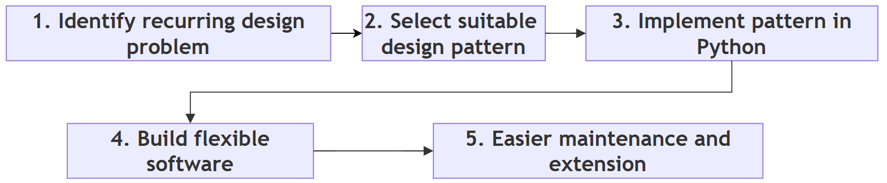

**Follow-up questions**

1. *Is Python's `sorted()` function a design pattern?*
   No. It is ready-made code that uses a sorting algorithm (Timsort). It solves a computational problem, not a design problem.
2. *Can one program use a design pattern and an algorithm together?*
   Yes. For example, a Strategy pattern (a design pattern) can let the user choose between Merge Sort and Quick Sort (two algorithms).

[Back to the Table of Contents](#table-of-contents)

### Q2. Classify design patterns. Compare Creational, Structural and Behavioral patterns. When is each category used?

**Answer**

The Gang of Four (GoF) classified design patterns into three major categories, according to the kind of design problem they solve. A simple way to remember them is to think of a school:

- **Creational**: how new students are admitted (creating objects);
- **Structural**: how students are arranged into classes and sections (organizing objects);
- **Behavioral**: how teachers and students communicate (interaction between objects).

**1. Creational Patterns**

Creational patterns focus on **object creation**.

Instead of creating objects directly all over the program, these patterns bring the creation process to one place or control how it happens.

Typical examples include:

- Singleton
- Factory Method
- Abstract Factory
- Builder
- Prototype

These patterns are useful when object creation is complex, when it must follow specific rules, or when the exact class to create should be decided later.

**2. Structural Patterns**

Structural patterns focus on **how objects are combined** to form larger structures.

They simplify the relationships among classes while keeping the system flexible.

Examples include:

- Decorator
- Adapter
- Facade
- Composite
- Proxy

These patterns help build larger systems from smaller, reusable components.

**3. Behavioral Patterns**

Behavioral patterns focus on **communication between objects**.

They define how objects exchange information and how responsibilities are shared among them.

Examples include:

- Observer
- Strategy
- Command
- Iterator
- Template Method

These patterns improve flexibility by separating a behaviour from the objects that use it.

**Comparison table**

| Category | Main Focus | Typical Question Answered | When to Use | Examples |
| --- | --- | --- | --- | --- |
| Creational | Creating objects | How should objects be created? | Object creation is complex, must follow rules, or the class should be chosen later | Singleton, Factory Method, Abstract Factory, Builder, Prototype |
| Structural | Organizing objects | How should objects be connected? | Classes must be combined, wrapped, simplified or made compatible | Decorator, Adapter, Facade, Composite, Proxy |
| Behavioral | Object communication | How should objects interact? | Objects must notify each other, share work, or switch behaviour | Observer, Strategy, Command, Iterator, Template Method |

**Step-by-step: deciding the category of a problem**

1. Ask: "Is my difficulty about **making** objects?" If yes, look at creational patterns.
2. If not, ask: "Is it about **putting objects together** or making them fit?" If yes, look at structural patterns.
3. If not, ask: "Is it about **how objects talk** to each other or share work?" If yes, look at behavioral patterns.

The original GoF book describes 23 patterns in total: 5 creational, 7 structural and 11 behavioral. This page covers the ones most useful to a Python programmer. You can see the full list at [Refactoring Guru: Catalog](https://refactoring.guru/design-patterns/catalog).

**Flowchart**

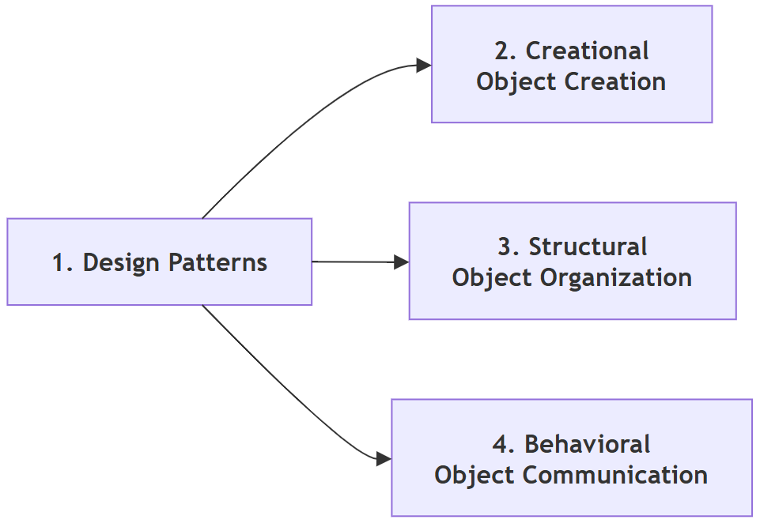

**Follow-up questions**

1. *In which category does the Prototype pattern fall, and what does it do?*
   It is a creational pattern. It creates a new object by copying an existing one. In Python, the `copy` module (`copy.copy()` and `copy.deepcopy()`) does most of this work ([copy module](https://docs.python.org/3/library/copy.html)).
2. *Can a single program use patterns from all three categories?*
   Yes. Large programs usually do. See [Q19](#q19-why-are-multiple-design-patterns-sometimes-combined-in-a-single-application-explain-with-suitable-examples).

[Back to the Table of Contents](#table-of-contents)

### Q3. Explain the Factory Method Pattern. What problem does it solve? How does it improve software compared to directly creating objects?

**Answer**

The **Factory Method** pattern places object creation inside a special method, called a *factory method*, instead of allowing client code to create objects directly.

**The problem**

Without a factory, a program may contain many statements such as:

```python
report = PDFReport()
```

If the report type changes later, for example from PDF to HTML, every such statement may have to be found and modified. The client code is also tied to the exact class name `PDFReport`.

**The solution**

With the Factory Method pattern, the client asks a factory to create the required object:

```python
report = factory.create_report()
```

The client does not need to know the exact class being created. It only knows that it will receive "some report" that has the methods it needs.

This separation makes the program easier to modify, because changes are confined to the factory rather than scattered throughout the application.

The Factory Method pattern also follows the principle of [encapsulation](https://en.wikipedia.org/wiki/Encapsulation_(computer_programming)) by hiding the object-creation logic from the client.

**Step-by-step: how the pattern works**

1. Write the classes of the objects to be created (the *products*), for example `PDFReport`, `ExcelReport` and `HTMLReport`. They all offer the same method, `generate()`.
2. Write a factory that contains the logic for choosing and creating the right product.
3. In client code, ask the factory for an object instead of calling the class directly.
4. Use the returned object through its common method. The client never needs to know its exact class.
5. When a new product is added later, change only the factory.

**Example script (a simple factory)**

```python
# Step 1: Define the product classes (the objects we want to create)
class PDFReport:
    def generate(self):
        return "Report generated in PDF format"

class ExcelReport:
    def generate(self):
        return "Report generated in Excel format"

class HTMLReport:
    def generate(self):
        return "Report generated in HTML format"

# Step 2: Write the factory. It is the ONLY place that knows the class names.
class ReportFactory:
    """Creates report objects so that client code never names a report class."""

    def create_report(self, report_type):
        # A dictionary maps a simple text label to the matching class
        reports = {
            "pdf": PDFReport,
            "excel": ExcelReport,
            "html": HTMLReport,
        }
        report_class = reports.get(report_type.lower())
        if report_class is None:
            raise ValueError(f"Unknown report type: {report_type}")
        return report_class()          # create and return the object

# Step 3: Client code asks the factory for objects
factory = ReportFactory()

for kind in ["pdf", "excel", "html"]:
    report = factory.create_report(kind)
    print(f"Asked for '{kind}' -> got {type(report).__name__}")
    print("   ", report.generate())

# Step 4: See what happens when an unknown type is requested
try:
    factory.create_report("word")
except ValueError as error:
    print("Error:", error)
```

**Output**

```text
Asked for 'pdf' -> got PDFReport
    Report generated in PDF format
Asked for 'excel' -> got ExcelReport
    Report generated in Excel format
Asked for 'html' -> got HTMLReport
    Report generated in HTML format
Error: Unknown report type: word
```

**How the script works**

- The dictionary inside `create_report()` is the only place where the class names appear.
- To add a Word report later, you would write a `WordReport` class and add one line to the dictionary. The loop in Step 3 would not change at all.
- Unknown types are reported clearly with a `ValueError` instead of failing in some confusing way later.

**A note on the classical form**

The script above is often called a **simple factory**. It is the easiest way to understand the idea. In the original GoF book, the Factory Method is described a little differently: a base class declares the factory method, and each **subclass overrides it** to decide which object to create. The base class can then do its work without knowing the concrete class. The next script shows this classical form.

```python
# Step 1: The base class declares the factory method
class ReportApp:
    def create_report(self):
        """Factory method: each subclass decides which report to create."""
        raise NotImplementedError

    def run(self):
        # Step 2: The base class uses the factory method without
        # knowing which concrete report class will be created
        report = self.create_report()
        print(f"{type(self).__name__} created {type(report).__name__}")
        print("   ", report.generate())

class PDFReport:
    def generate(self):
        return "Report generated in PDF format"

class HTMLReport:
    def generate(self):
        return "Report generated in HTML format"

# Step 3: Subclasses override the factory method
class PDFReportApp(ReportApp):
    def create_report(self):
        return PDFReport()

class HTMLReportApp(ReportApp):
    def create_report(self):
        return HTMLReport()

# Step 4: Run both applications
for app in [PDFReportApp(), HTMLReportApp()]:
    app.run()
```

**Output**

```text
PDFReportApp created PDFReport
    Report generated in PDF format
HTMLReportApp created HTMLReport
    Report generated in HTML format
```

Both forms share the same core idea: client code does not create the concrete object itself. Read more at [Refactoring Guru: Factory Method](https://refactoring.guru/design-patterns/factory-method).

**Mermaid flowchart of the simple factory script**

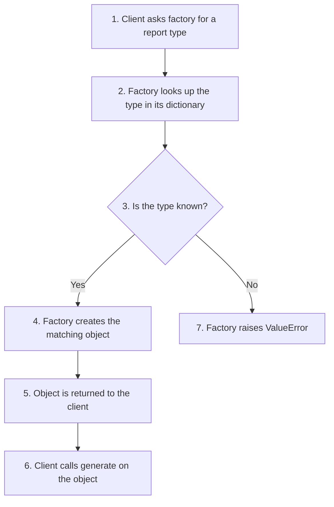

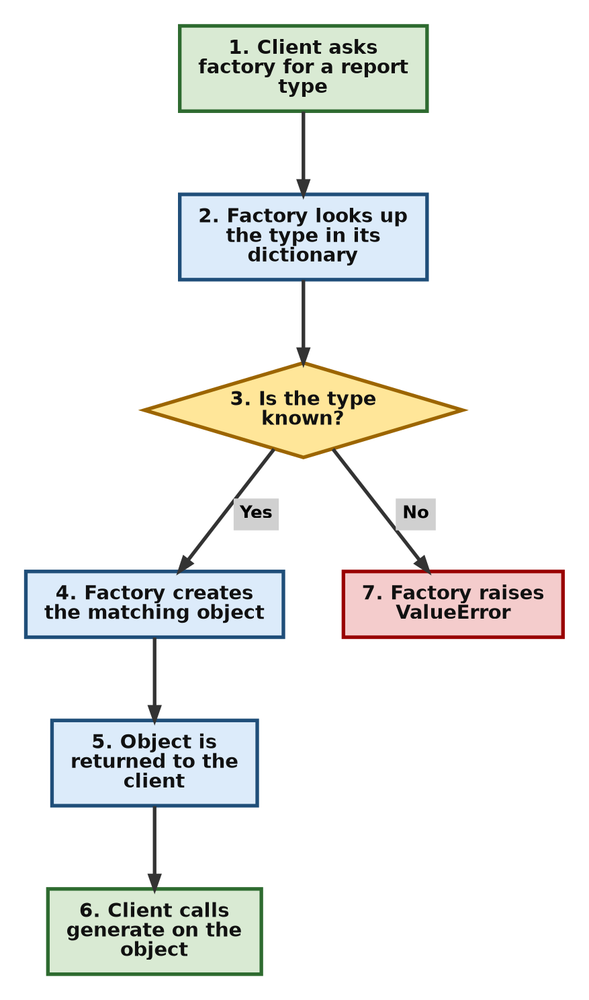

**Advantages**

- brings object creation to one place;
- reduces duplicate code;
- hides implementation details from the client;
- simplifies future modifications;
- improves maintainability;
- makes testing easier, because a test can use a factory that returns a simple fake object.

**Comparison table**

| Without Factory Method | With Factory Method |
| --- | --- |
| Client creates objects directly | Factory creates objects |
| Class names are repeated in many places | Class names appear in one place |
| Changes affect many locations | Changes usually affect only the factory |
| Strong (tight) coupling | Loose coupling |

**Flowchart**

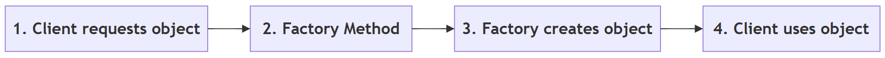

**Follow-up questions**

1. *Should every object in a program be created through a factory?*
   No. If a class is simple and unlikely to change, calling it directly is clearer. Use a factory only when the choice of class may vary or the creation logic is complicated.
2. *In Python, can a factory be a plain function instead of a class?*
   Yes. A function such as `def create_report(kind): ...` is a perfectly good factory, and is often the most Pythonic choice.

[Back to the Table of Contents](#table-of-contents)

### Q4. Compare the Singleton and Factory Method patterns. When should each be preferred?

**Answer**

Although both patterns deal with object creation, they solve different problems.

**Singleton**

The **Singleton** pattern ensures that **only one instance** (object) of a class exists throughout the program, and gives everyone a single point of access to it.

Examples include:

- application configuration;
- a logging system;
- a printer manager.

In each case, having two separate objects would cause confusion. For example, two configuration objects could hold different settings.

**Factory Method**

The **Factory Method** pattern decides **which object** should be created.

It does not restrict the number of objects.

For example, a report factory may create:

- PDF reports;
- Excel reports;
- HTML reports.

Each request may create a new object.

Thus:

- Singleton answers "**How many** objects should exist?"
- Factory Method answers "**Which** object should be created?"

These are completely different design goals.

**Step-by-step: choosing between them**

1. Ask whether the program must have **exactly one** shared object of this class. If yes, consider Singleton.
2. Ask whether the program must **choose among several classes** when creating an object. If yes, consider Factory Method.
3. If both are true, the two can be combined. For example, a factory could itself be a single shared object.
4. If neither is true, create the object directly with its class.

**Example script**

```python
# ---------- Part A: Singleton ----------

# Step 1: A class that allows only one object to be created
class AppConfig:
    _instance = None                      # will hold the single object

    def __new__(cls):
        # __new__ runs BEFORE __init__ and actually creates the object
        if cls._instance is None:
            print("Creating the one and only AppConfig object")
            cls._instance = super().__new__(cls)
            cls._instance.settings = {"theme": "light"}
        return cls._instance              # always return the same object

# Step 2: "Create" the object twice
config1 = AppConfig()
config2 = AppConfig()

# Step 3: Check that both names refer to the same object
print("config1 is config2:", config1 is config2)

# Step 4: A change made through one name is seen through the other
config1.settings["theme"] = "dark"
print("Theme seen through config2:", config2.settings["theme"])

# ---------- Part B: Factory Method ----------

class PDFReport:
    pass

class ExcelReport:
    pass

# Step 5: A simple factory function that decides WHICH class to create
def create_report(report_type):
    if report_type == "pdf":
        return PDFReport()
    return ExcelReport()

# Step 6: Every call creates a NEW object
report1 = create_report("pdf")
report2 = create_report("pdf")
report3 = create_report("excel")

print("report1 is report2:", report1 is report2)
print("Types created:", type(report1).__name__, type(report2).__name__,
      type(report3).__name__)
```

**Output**

```text
Creating the one and only AppConfig object
config1 is config2: True
Theme seen through config2: dark
report1 is report2: False
Types created: PDFReport PDFReport ExcelReport
```

**How the script works**

- `__new__` is the special method that actually creates an object. `AppConfig` overrides it so that a new object is created only the first time. Every later call returns the stored object.
- The message "Creating the one and only AppConfig object" appears only once, even though `AppConfig()` was called twice.
- `is` checks whether two names point to the **same** object. It gives `True` for the singleton and `False` for the two reports.

**A Pythonic note on Singleton**

In Python, a **module** is created only once, however many times it is imported. So the simplest way to have a single shared object is often to create it inside a module (for example, `config.py`) and import it wherever it is needed. Many Python programmers prefer this to writing a Singleton class.

Singleton should also be used with care. A single shared object behaves like a global variable. Any part of the program can change it, which can make bugs hard to trace and testing harder. Read more at [Refactoring Guru: Singleton](https://refactoring.guru/design-patterns/singleton).

**Comparison table**

| Singleton | Factory Method |
| --- | --- |
| One instance only | Many instances possible |
| Controls how many objects exist | Controls which object is created |
| Same object reused | New objects may be created |
| Useful for shared resources | Useful for flexible object creation |
| Example: configuration, logger | Example: PDF, Excel or HTML report |

**Flowchart**

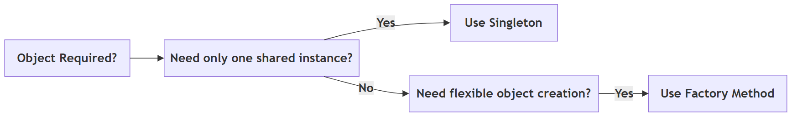

**Follow-up questions**

1. *What would happen in the script if `_instance` were not checked in `__new__`?*
   A new object would be created on every call, so `config1 is config2` would print `False`, and the theme change would not be seen through `config2`.
2. *Can a factory return the same object every time?*
   Yes, it can if it is written that way (for example, by caching). But that is a choice made inside the factory. Controlling the number of objects is not the purpose of the Factory Method pattern.

[Back to the Table of Contents](#table-of-contents)

### Q5. Explain the Decorator Pattern. How does it differ from inheritance? Why are Python decorators considered a Pythonic alternative?

**Answer**

The **Decorator** pattern allows new functionality to be added to an existing object **without modifying its original class**.

Instead of changing the class itself, another object **wraps** the original object and adds extra behaviour. The wrapper offers the same methods as the original, so the rest of the program can use it in exactly the same way. A simple picture is a gift: the gift stays the same, but you can add wrapping paper, then a ribbon, then a card, one layer at a time.

For example, a greeting function may simply return a user's name. A decorator can add:

- logging;
- timing;
- authentication (checking who the user is);
- formatting.

The original function remains unchanged.

**How it differs from inheritance**

[Inheritance](https://docs.python.org/3/tutorial/classes.html#inheritance) creates a new subclass. The new behaviour is fixed when the class is written. If you want every combination of extras (milk, sugar, milk and sugar, and so on), you may need a separate subclass for each combination, and the number of classes grows very quickly.

Decoration wraps an existing object. Because the wrapping happens while the program is running, extras can be added **dynamically at runtime**, in any combination and in any order. Each extra is written only once.

**Why Python decorators are a Pythonic alternative**

Python makes this idea especially convenient through the `@decorator` syntax ([Python glossary: decorator](https://docs.python.org/3/glossary.html#term-decorator)). In Python, functions are objects, so one function can receive another function and return a new, improved one.

Instead of writing separate wrapper classes, as is common in languages such as Java or C++, Python allows programmers to decorate functions (and classes) directly. This results in shorter, cleaner and more readable code.

One small but useful point: the `@` syntax applies the decorator **once, when the function is defined**. The classical Decorator pattern wraps **objects** while the program runs. Both follow the same idea of "wrap and add", and a Python decorator can also be applied at runtime by an ordinary call, as Step 5 of the first script shows.

**Step-by-step: how a Python decorator works**

1. Write a function (the decorator) that takes another function as its argument.
2. Inside it, define a `wrapper` function that does some extra work and calls the original function.
3. Return the `wrapper` function.
4. Place `@decorator_name` above any function you want to enhance. Python then replaces that function with the wrapper.
5. When the decorated function is called, the wrapper runs, does its extra work, and calls the original.

**Example script 1: Python function decorators**

```python
import functools

# Step 1: Write a decorator. It receives a function and returns a new
#         "wrapper" function that adds extra behaviour around it.
def log_call(func):
    @functools.wraps(func)          # keeps the original function's name
    def wrapper(*args, **kwargs):
        print(f"[LOG] Calling {func.__name__} with {args}")
        result = func(*args, **kwargs)      # run the original function
        print(f"[LOG] {func.__name__} returned {result!r}")
        return result
    return wrapper

# Step 2: A second decorator that changes the result
def shout(func):
    @functools.wraps(func)
    def wrapper(*args, **kwargs):
        return func(*args, **kwargs).upper()
    return wrapper

# Step 3: The original function stays simple
def greet(name):
    return f"Hello, {name}"

print("Plain function   :", greet("Asha"))

# Step 4: Decorate it using the @ syntax (decorators are applied bottom-up:
#         shout wraps greet first, then log_call wraps the result)
@log_call
@shout
def greet_loudly(name):
    return f"Hello, {name}"

print("Decorated result :", greet_loudly("Asha"))

# Step 5: A decorator can also be applied by an ordinary call, at runtime
logged_greet = log_call(greet)
logged_greet("Ravi")
```

**Output**

```text
Plain function   : Hello, Asha
[LOG] Calling greet_loudly with ('Asha',)
[LOG] greet_loudly returned 'HELLO, ASHA'
Decorated result : HELLO, ASHA
[LOG] Calling greet with ('Ravi',)
[LOG] greet returned 'Hello, Ravi'
```

**How the script works**

- `*args` and `**kwargs` let the wrapper accept any arguments and pass them on unchanged.
- `functools.wraps` copies the original function's name onto the wrapper. Without it, the log would show the name `wrapper` instead of `greet_loudly` ([functools.wraps](https://docs.python.org/3/library/functools.html#functools.wraps)).
- When two decorators are stacked, the one **closest to the function** is applied first. So `shout` turns the text into capitals, and `log_call` then logs the capitalised result.

**Example script 2: the classical Decorator pattern with objects**

This version is closer to the GoF description. Each decorator is an object that wraps another object and offers the same methods.

```python
# Classical (GoF-style) Decorator: wrapper OBJECTS around another object

# Step 1: The basic object
class Coffee:
    def cost(self):
        return 50

    def description(self):
        return "Coffee"

# Step 2: Each decorator holds the object it wraps and adds to it
class MilkDecorator:
    def __init__(self, drink):
        self.drink = drink                  # the object being wrapped

    def cost(self):
        return self.drink.cost() + 10

    def description(self):
        return self.drink.description() + " + Milk"

class SugarDecorator:
    def __init__(self, drink):
        self.drink = drink

    def cost(self):
        return self.drink.cost() + 5

    def description(self):
        return self.drink.description() + " + Sugar"

# Step 3: Wrap the object layer by layer while the program runs
order = Coffee()
print(order.description(), "=", order.cost())

order = MilkDecorator(order)
print(order.description(), "=", order.cost())

order = SugarDecorator(order)
print(order.description(), "=", order.cost())
```

**Output**

```text
Coffee = 50
Coffee + Milk = 60
Coffee + Milk + Sugar = 65
```

With inheritance, we would need classes such as `CoffeeWithMilk`, `CoffeeWithSugar` and `CoffeeWithMilkAndSugar`. With decorators, we have one class per extra and can combine them freely. Read more at [Refactoring Guru: Decorator](https://refactoring.guru/design-patterns/decorator).

**Comparison table**

| Inheritance | Decorator |
| --- | --- |
| Creates a new subclass | Wraps an existing object or function |
| Changes the class hierarchy | Adds behaviour without changing any class |
| Static relationship, fixed when the code is written | Can be applied at runtime, in any combination |
| Number of subclasses can grow quickly | One wrapper per extra feature |
| Less flexible | More flexible |

**Flowchart**

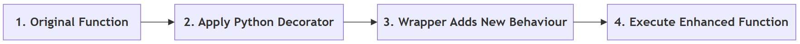

**Follow-up questions**

1. *Does a decorator change the source code of the original function?*
   No. The original function is untouched. The decorator only replaces the *name* with a wrapper that calls the original.
2. *If you reverse the two decorators (put `@shout` on top of `@log_call`), what changes in the output?*
   The log would now show the original result `'Hello, Asha'`, because logging happens before the text is converted to capitals. The final printed result would still be in capitals.

[Back to the Table of Contents](#table-of-contents)

### Q6. Explain the Abstract Factory Pattern. What problem does it solve? How does it ensure that related objects are created together?

**Answer**

The **Abstract Factory** pattern provides a way to create **families of related objects** without naming their concrete classes. Unlike the Factory Method pattern, which usually creates a single object, the Abstract Factory creates several objects that are designed to work together.

**The problem**

Consider a graphical user interface (GUI) application. If the application is running on Windows, all interface elements (buttons, checkboxes, menus) should have the Windows look and feel. Similarly, if it is running on macOS, all interface elements should have the Mac appearance.

If each element is created separately, a small mistake could produce a Windows button next to a Mac checkbox. Such a mixed screen looks wrong and may not even work properly.

**The solution**

Instead of creating each object individually, the application asks a factory to create all the required objects. There is one factory for each family: a `WindowsFactory` and a `MacFactory`. Each factory creates only the members of its own family.

**How it ensures related objects are created together**

The application chooses the factory **once**, at the start. After that, every object is requested from that same factory. Since a `WindowsFactory` can only produce Windows elements, it is impossible to mix families by accident. This keeps the application's appearance and behaviour consistent.

**Step-by-step: how the pattern works**

1. Write the product classes for each family, for example `WindowsButton`, `WindowsCheckbox`, `MacButton` and `MacCheckbox`.
2. Write one factory class per family. Each factory has the same methods, for example `create_button()` and `create_checkbox()`.
3. Write client code that receives a factory and asks it for the products it needs. The client never names a product class.
4. At the start of the program, choose the factory that matches the situation (Windows or macOS).
5. Pass that factory to the client. All objects created will belong to the same family.

**Example script**

```python
# Step 1: Products of the Windows family
class WindowsButton:
    def render(self):
        return "[ Windows Button ]"

class WindowsCheckbox:
    def render(self):
        return "[x] Windows Checkbox"

# Step 2: Products of the Mac family
class MacButton:
    def render(self):
        return "( Mac Button )"

class MacCheckbox:
    def render(self):
        return "(v) Mac Checkbox"

# Step 3: One factory per family. Each factory creates ALL the products
#         of its own family, so the products always match.
class WindowsFactory:
    def create_button(self):
        return WindowsButton()

    def create_checkbox(self):
        return WindowsCheckbox()

class MacFactory:
    def create_button(self):
        return MacButton()

    def create_checkbox(self):
        return MacCheckbox()

# Step 4: Client code works with ANY factory. It never names a product class.
def build_screen(factory):
    button = factory.create_button()
    checkbox = factory.create_checkbox()
    print("  ", button.render())
    print("  ", checkbox.render())

# Step 5: Choose the family once; everything else follows
for operating_system, factory in [("Windows", WindowsFactory()),
                                  ("macOS", MacFactory())]:
    print(f"Screen for {operating_system}:")
    build_screen(factory)
```

**Output**

```text
Screen for Windows:
   [ Windows Button ]
   [x] Windows Checkbox
Screen for macOS:
   ( Mac Button )
   (v) Mac Checkbox
```

**How the script works**

- `build_screen()` does not contain the words "Windows" or "Mac". It works with whatever factory it receives.
- Adding a third family, such as Linux, needs a `LinuxButton`, a `LinuxCheckbox` and a `LinuxFactory`. The function `build_screen()` does not change.

Read more at [Refactoring Guru: Abstract Factory](https://refactoring.guru/design-patterns/abstract-factory).

**Comparison table**

| Factory Method | Abstract Factory |
| --- | --- |
| Creates one object | Creates a family of related objects |
| Simpler | More comprehensive |
| Suitable for one kind of product | Suitable for several related products |
| Example: create a report | Example: create a complete GUI (button, checkbox, menu) |

**Flowchart**

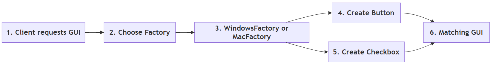

**Follow-up questions**

1. *What is the main cost of the Abstract Factory pattern?*
   It adds many classes. If a new kind of product (for example, a slider) is added, every factory must get a new method. Use it only when families of objects really exist.
2. *Give one more real-life example of product families.*
   A furniture shop selling "Modern" and "Victorian" sets, where each set has a chair, a sofa and a table that must match.

[Back to the Table of Contents](#table-of-contents)

### Q7. Explain the Builder Pattern. Why is it preferred when constructing complex objects? Compare it with using a constructor having many parameters.

**Answer**

The **Builder** pattern constructs a complex object **step by step**. Instead of supplying every value to a large constructor (the `__init__` method) all at once, the object is put together gradually.

**The problem**

Suppose a `Computer` object contains many components, several of them optional, such as RAM, SSD, processor, graphics card and operating system. A constructor with many parameters becomes difficult to read and use. A call such as:

```python
Computer("Intel i5", 8, 256, None, "Windows 11", True, False)
```

does not tell the reader which value means what. It is also easy to pass values in the wrong order.

**The solution**

The Builder pattern solves this problem by allowing each component to be added separately, with a clearly named method. After all the required components have been given, a final `build()` step returns the finished object.

**Why it is preferred for complex objects**

- **Readability**: each construction step clearly says what is being added.
- **Optional parts**: parts can be included or left out without changing the constructor.
- **Checking**: the `build()` step can check that the object is complete and valid before it is handed over.
- **Same steps, different results**: the same builder can produce an office computer or a gaming computer.

**Step-by-step: how the pattern works**

1. Write the class of the complex object (the *product*), here `Computer`.
2. Write a builder class that holds an unfinished product.
3. Give the builder one method per part, such as `set_ram()` or `set_ssd()`. Each method returns the builder itself, so calls can be chained.
4. Give the builder a `build()` method that checks the product and returns it.
5. In client code, call only the steps you need, then call `build()`.

**Example script**

```python
# Step 1: The complex object we want to build
class Computer:
    def __init__(self):
        self.parts = {}

    def __str__(self):
        lines = [f"  {name:<10}: {value}" for name, value in self.parts.items()]
        return "\n".join(lines)

# Step 2: The builder adds one part per method call.
#         Each method returns self, so calls can be chained.
class ComputerBuilder:
    def __init__(self):
        self.computer = Computer()

    def set_processor(self, processor):
        self.computer.parts["Processor"] = processor
        return self

    def set_ram(self, ram_gb):
        self.computer.parts["RAM"] = f"{ram_gb} GB"
        return self

    def set_ssd(self, ssd_gb):
        self.computer.parts["SSD"] = f"{ssd_gb} GB"
        return self

    def set_graphics(self, card):
        self.computer.parts["Graphics"] = card
        return self

    def set_os(self, os_name):
        self.computer.parts["OS"] = os_name
        return self

    def build(self):
        # Step 3: Check required parts before handing over the object
        if "Processor" not in self.computer.parts:
            raise ValueError("A computer needs a processor")
        return self.computer

# Step 4: Build an office computer (no graphics card)
office_pc = (ComputerBuilder()
             .set_processor("Intel i5")
             .set_ram(8)
             .set_ssd(256)
             .set_os("Windows 11")
             .build())
print("Office PC:")
print(office_pc)

# Step 5: Build a gaming computer (includes a graphics card)
gaming_pc = (ComputerBuilder()
             .set_processor("AMD Ryzen 9")
             .set_ram(32)
             .set_ssd(2000)
             .set_graphics("RTX 4070")
             .set_os("Windows 11")
             .build())
print("Gaming PC:")
print(gaming_pc)

# Step 6: Forgetting a required part is caught by build()
try:
    ComputerBuilder().set_ram(8).build()
except ValueError as error:
    print("Error:", error)
```

**Output**

```text
Office PC:
  Processor : Intel i5
  RAM       : 8 GB
  SSD       : 256 GB
  OS        : Windows 11
Gaming PC:
  Processor : AMD Ryzen 9
  RAM       : 32 GB
  SSD       : 2000 GB
  Graphics  : RTX 4070
  OS        : Windows 11
Error: A computer needs a processor
```

**How the script works**

- Each `set_...` method ends with `return self`. This is what allows the chained style `builder.set_ram(8).set_ssd(256)`. This style is sometimes called a *fluent interface*.
- The brackets around the whole chain let it span several lines without backslashes.
- The office PC simply skips `set_graphics()`. No `None` values need to be passed.

**A Pythonic note**

Python already has **keyword arguments with default values**. They remove much of the pain of long constructors, so in Python a full Builder class is needed less often than in Java.

```python
# The Pythonic alternative: keyword arguments with default values
def make_computer(processor, ram_gb=8, ssd_gb=256, graphics=None, os_name="Linux"):
    return {"Processor": processor, "RAM": ram_gb, "SSD": ssd_gb,
            "Graphics": graphics, "OS": os_name}

# Named arguments make the call easy to read, and optional parts can be left out
print(make_computer("Intel i5", os_name="Windows 11"))
print(make_computer("AMD Ryzen 9", ram_gb=32, graphics="RTX 4070"))
```

**Output**

```text
{'Processor': 'Intel i5', 'RAM': 8, 'SSD': 256, 'Graphics': None, 'OS': 'Windows 11'}
{'Processor': 'AMD Ryzen 9', 'RAM': 32, 'SSD': 256, 'Graphics': 'RTX 4070', 'OS': 'Linux'}
```

A Builder is still useful in Python when construction really happens in stages, when the order of steps matters, or when the finished object must be checked before use. Read more at [Refactoring Guru: Builder](https://refactoring.guru/design-patterns/builder).

**Comparison table**

| Large Constructor | Builder Pattern |
| --- | --- |
| Many parameters in one call | Step-by-step construction |
| Difficult to read | Easy to understand, each step is named |
| Hard to extend | Easy to add optional parts |
| Error-prone, values can be passed in the wrong order | More maintainable, each value goes to a named method |
| No natural place to check the finished object | `build()` can check the object before returning it |

**Flowchart**

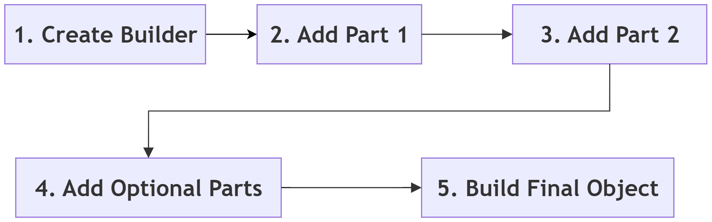

**Follow-up questions**

1. *Why does each builder method return `self`?*
   So that the next method can be called on the result straight away, which allows method chaining.
2. *What happens if you call `build()` without setting a processor?*
   The builder raises `ValueError("A computer needs a processor")`, as shown in Step 6 of the script.

[Back to the Table of Contents](#table-of-contents)

### Q8. Explain the Adapter Pattern. What problem does it solve? How does it help integrate incompatible classes?

**Answer**

The **Adapter** pattern allows two classes with **incompatible interfaces** to work together without modifying either of them. It works just like a travel plug adapter: an Indian plug cannot go into a UK socket directly, but with an adapter in between, both work without any change.

**The problem**

Often, an application needs to use an existing class whose interface differs from what the application expects. The existing class may belong to a third-party library, or to an old system that nobody wants to touch. Rewriting it is either impossible or risky.

**The solution**

Instead of rewriting the existing class, an adapter **converts one interface into another**.

For example, suppose an application expects every payment system to provide a method named `pay()`. A third-party payment library may instead provide a method called `make_payment()`, which even expects the amount in paise instead of rupees. An adapter can translate calls to `pay()` into calls to `make_payment()`, and convert the amount on the way.

The client code continues to use the expected interface without knowing that an adapter is doing the translation internally.

The Adapter pattern is widely used when integrating [legacy software](https://en.wikipedia.org/wiki/Legacy_system), third-party libraries, [APIs](https://en.wikipedia.org/wiki/API) and hardware drivers.

**Step-by-step: how the pattern works**

1. Identify the interface your program expects, for example `pay(amount)`.
2. Identify the existing class that does the job but has a different interface, for example `make_payment(amount_in_paise)`.
3. Write an adapter class that **holds** an object of the existing class.
4. Give the adapter the method your program expects. Inside it, convert the data if needed and call the existing method.
5. Pass the adapter to the client code wherever the expected interface is needed.

**Example script**

```python
# Step 1: The interface our application expects: every payment
#         object must have a pay(amount) method
class UPIPayment:
    def pay(self, amount):
        print(f"Paid Rs {amount} using UPI")

# Step 2: A third-party class we cannot change. Its method has a
#         different name and expects the amount in paise, not rupees.
class ThirdPartyGateway:
    def make_payment(self, amount_in_paise):
        print(f"Gateway received {amount_in_paise} paise")

# Step 3: The adapter translates pay() into make_payment()
class GatewayAdapter:
    def __init__(self, gateway):
        self.gateway = gateway              # the object being adapted

    def pay(self, amount):
        print(f"Adapter: converting Rs {amount} to paise")
        self.gateway.make_payment(amount * 100)

# Step 4: Client code only knows about pay(). It treats both
#         payment objects in exactly the same way.
def checkout(payment_method, amount):
    payment_method.pay(amount)

checkout(UPIPayment(), 500)
checkout(GatewayAdapter(ThirdPartyGateway()), 500)
```

**Output**

```text
Paid Rs 500 using UPI
Adapter: converting Rs 500 to paise
Gateway received 50000 paise
```

**How the script works**

- `checkout()` only ever calls `pay()`. It cannot tell the difference between the UPI object and the adapted gateway.
- Neither `ThirdPartyGateway` nor `checkout()` was changed. All the translation lives in `GatewayAdapter`.
- The adapter here *holds* the adapted object. This is called an **object adapter**. An adapter can also be written by inheriting from the adapted class (a **class adapter**), but holding the object is more common and more flexible. Read more at [Refactoring Guru: Adapter](https://refactoring.guru/design-patterns/adapter).

**Comparison table**

| Without Adapter | With Adapter |
| --- | --- |
| Interfaces are incompatible | Interfaces become compatible |
| Client code or library must be changed | Client and library both remain unchanged |
| Difficult integration | Easy integration |
| Tight coupling to the library's method names | Loose coupling, the library can be replaced by changing only the adapter |

**Flowchart**

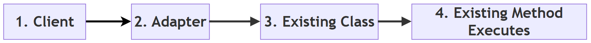

**Follow-up questions**

1. *If the payment company later renames `make_payment()` to `send_money()`, how many places in the program need to change?*
   Only one: the line inside `GatewayAdapter.pay()`.
2. *Does an adapter add new features?*
   No. Its job is only to translate. Adding new features is the job of a Decorator (see [Q10](#q10-compare-the-decorator-adapter-and-facade-patterns-although-all-are-structural-patterns-how-do-their-purposes-differ)).

[Back to the Table of Contents](#table-of-contents)

### Q9. Explain the Facade Pattern. How does it simplify the use of complex subsystems? Give suitable situations where it is useful.

**Answer**

The **Facade** pattern provides a **single, simple interface** to a complex subsystem. (The word "facade" means the front face of a building. You see a neat front, not the pipes and wires behind it.)

**The problem**

Large software systems often consist of many classes that must be called in a particular order. Requiring every programmer to remember this order increases complexity and the chance of errors.

**The solution**

A facade hides this complexity behind a single class with a few simple methods. The client talks only to the facade, while the facade internally coordinates all the necessary subsystem objects.

For example, starting a home theatre system may require dimming the lights and switching on the television, the sound system and the streaming device. A `HomeTheatreFacade` can perform all these operations through a single method such as `watch_movie()`.

The Facade pattern makes software easier to use, reduces coupling and improves maintainability. The subsystem classes are still available to anyone who needs fine control. The facade is a convenience, not a wall.

**Step-by-step: how the pattern works**

1. Identify the subsystem classes and the order in which they must be used.
2. Write a facade class that creates or receives these subsystem objects.
3. Give the facade a small number of simple methods, such as `watch_movie()` and `end_movie()`.
4. Inside each method, call the subsystem objects in the correct order.
5. Let client code use only the facade methods.

**Example script**

```python
# Step 1: The subsystem classes, each with its own methods
class Television:
    def on(self):
        print("  Television switched on")

    def off(self):
        print("  Television switched off")

class SoundSystem:
    def on(self):
        print("  Sound system switched on")

    def set_volume(self, level):
        print(f"  Volume set to {level}")

    def off(self):
        print("  Sound system switched off")

class StreamingDevice:
    def play(self, movie):
        print(f"  Streaming '{movie}'")

    def stop(self):
        print("  Streaming stopped")

class Lights:
    def dim(self, percent):
        print(f"  Lights dimmed to {percent}%")

    def full(self):
        print("  Lights at full brightness")

# Step 2: The facade knows the correct order of calls
class HomeTheatreFacade:
    def __init__(self):
        self.tv = Television()
        self.sound = SoundSystem()
        self.streamer = StreamingDevice()
        self.lights = Lights()

    def watch_movie(self, movie):
        print(f"Getting ready to watch '{movie}'...")
        self.lights.dim(20)
        self.tv.on()
        self.sound.on()
        self.sound.set_volume(15)
        self.streamer.play(movie)

    def end_movie(self):
        print("Shutting down the home theatre...")
        self.streamer.stop()
        self.sound.off()
        self.tv.off()
        self.lights.full()

# Step 3: The client makes just two simple calls
theatre = HomeTheatreFacade()
theatre.watch_movie("Sholay")
theatre.end_movie()
```

**Output**

```text
Getting ready to watch 'Sholay'...
  Lights dimmed to 20%
  Television switched on
  Sound system switched on
  Volume set to 15
  Streaming 'Sholay'
Shutting down the home theatre...
  Streaming stopped
  Sound system switched off
  Television switched off
  Lights at full brightness
```

**How the script works**

- The client code in Step 3 is just two lines. It does not know that four different objects exist.
- If the volume level or the order of steps changes, only the facade changes.

**Situations where a facade is useful**

- **Home automation**: one "Good night" button that locks doors, turns off lights and sets the alarm.
- **Online shopping checkout**: one `place_order()` method that checks stock, takes payment, creates an invoice and books delivery.
- **Database access**: one `save_student()` method that opens a connection, runs the query, commits and closes the connection.
- **Libraries**: in the popular third-party [requests](https://requests.readthedocs.io/) library, `requests.get(url)` is a friendly facade over the many steps of making an HTTP request.
- **Compilers and build tools**: a single "build" command runs many internal steps.

Read more at [Refactoring Guru: Facade](https://refactoring.guru/design-patterns/facade).

**Comparison table**

| Without Facade | With Facade |
| --- | --- |
| Many subsystem calls | One simple interface |
| Client manages the order of calls | Facade manages the order of calls |
| Complex client code | Cleaner client code |
| Strong coupling to many classes | Reduced coupling, client depends on one class |

**Flowchart**

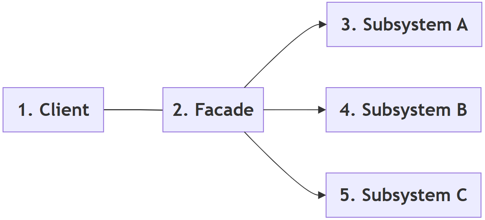

**Follow-up questions**

1. *Does a facade stop programmers from using the subsystem classes directly?*
   No. They can still use them if they need detailed control. The facade only offers an easier path for common tasks.
2. *What danger should be avoided when writing a facade?*
   The facade should not grow into one huge class that does everything. That would turn it into a "God Object" (see [Q20](#q20-what-are-anti-patterns-explain-common-design-pattern-mistakes-such-as-over-engineering-god-object-and-cargo-cult-programming-how-can-they-be-avoided)).

[Back to the Table of Contents](#table-of-contents)

### Q10. Compare the Decorator, Adapter and Facade patterns. Although all are structural patterns, how do their purposes differ?

**Answer**

Decorator, Adapter and Facade all belong to the **structural** category, because they organize relationships among objects. In their code they even look similar, since each one places an object "in front of" other objects. However, each addresses a different design problem.

- The **Decorator** pattern **adds new behaviour** to an existing object without modifying its class. The interface stays the **same**.
- The **Adapter** pattern **changes the interface** of an existing object so that it becomes compatible with another system. The behaviour stays the same.
- The **Facade** pattern **simplifies access** to a complex subsystem by providing a single, easy-to-use interface. It usually stands in front of **many** objects, not one.

Although these patterns all involve wrapping or connecting objects, their intentions are entirely different. Choosing the correct pattern depends on the **problem being solved**, not on how the code looks.

**Step-by-step: telling them apart**

1. Ask: "Does the object already have the interface I need?"
2. If **no**, you need an **Adapter** to translate the interface.
3. If **yes**, ask: "Do I want to add extra behaviour to it?" If yes, you need a **Decorator**.
4. If the real difficulty is that **many objects must be used together in a fixed order**, you need a **Facade**.

**Example script: all three in one small program**

```python
# A tiny printer example that shows all three patterns side by side

# Step 1: An existing class with its own method name
class OldPrinter:
    def print_text(self, text):
        print(f"  OldPrinter prints: {text}")

# Step 2: ADAPTER - our program expects a method called output()
class PrinterAdapter:
    def __init__(self, printer):
        self.printer = printer

    def output(self, text):                 # same job, new interface
        self.printer.print_text(text)

# Step 3: DECORATOR - same interface (output), extra behaviour added
class TimestampDecorator:
    def __init__(self, device):
        self.device = device

    def output(self, text):
        self.device.output("[09:30] " + text)

# Step 4: FACADE - one simple method hides several steps
class OfficeFacade:
    def __init__(self):
        self.device = TimestampDecorator(PrinterAdapter(OldPrinter()))

    def print_report(self, title):
        print("  Checking paper... OK")
        print("  Warming up... OK")
        self.device.output(title)

print("Adapter only:")
PrinterAdapter(OldPrinter()).output("Hello")

print("Adapter wrapped in a decorator:")
TimestampDecorator(PrinterAdapter(OldPrinter())).output("Hello")

print("Facade (uses both of the above inside):")
OfficeFacade().print_report("Monthly Report")
```

**Output**

```text
Adapter only:
  OldPrinter prints: Hello
Adapter wrapped in a decorator:
  OldPrinter prints: [09:30] Hello
Facade (uses both of the above inside):
  Checking paper... OK
  Warming up... OK
  OldPrinter prints: [09:30] Monthly Report
```

**How the script works**

- `PrinterAdapter` changes the method name from `print_text()` to `output()`. It adds nothing new.
- `TimestampDecorator` keeps the same method name `output()` but adds a time stamp.
- `OfficeFacade` offers one method, `print_report()`, that hides several steps and several objects.

**Comparison table**

| Pattern | Primary Purpose | Interface seen by the client | Number of objects wrapped | Typical Use |
| --- | --- | --- | --- | --- |
| Decorator | Add behaviour | Same as the wrapped object | Usually one | Logging, formatting, authentication |
| Adapter | Convert interface | Different from the wrapped object (the one the client expects) | Usually one | Third-party libraries, legacy systems |
| Facade | Simplify a subsystem | A new, simpler interface | Many | GUI, multimedia, database systems |

**Flowchart**

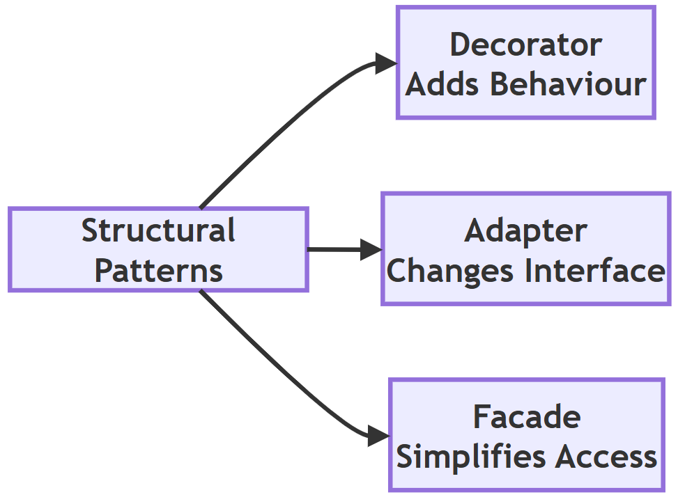

**Follow-up questions**

1. *A Proxy also wraps one object and keeps the same interface. How is it different from a Decorator?*
   A Decorator adds new behaviour. A Proxy **controls access** to the object (for example, by checking permissions or delaying its creation). See [Q12](#q12-explain-the-proxy-pattern-why-is-it-used-compare-it-with-directly-accessing-an-object).
2. *Can these patterns be used together?*
   Yes. In the script above, the facade uses a decorator that wraps an adapter.

[Back to the Table of Contents](#table-of-contents)

### Q11. Explain the Composite Pattern. What problem does it solve? How does it allow individual objects and groups of objects to be treated uniformly?

**Answer**

The **Composite** pattern allows individual objects and groups of objects to be treated in the same way. It organizes objects into a **tree-like structure**, where both individual objects (called **leaf** objects) and collections of objects (called **composites**) support the same operations.

**The problem**

Without this pattern, client code would need separate logic for a single object and for a collection of objects. It would be full of checks such as "is this an employee or a department?". This increases complexity and reduces code reusability, and the checks get worse as the tree grows deeper.

**The solution**

For example, a company's organizational structure may contain employees as well as departments. A department can contain employees and even other departments. Using the Composite pattern, both employees and departments provide the same method, such as `display()`.

- When `display()` is called on an **employee**, it simply prints that employee.
- When `display()` is called on a **department**, it prints the department name and then calls `display()` on each of its members. Some members may themselves be departments, which then repeat the same process. This is called **recursion** ([recursion in computer science](https://en.wikipedia.org/wiki/Recursion_(computer_science))).

The client simply calls the method, without worrying whether it is working with a single object or an entire group.

The Composite pattern is commonly used for:

- file and directory (folder) systems, where a folder can contain files and other folders;
- organization hierarchies;
- graphical user interface (GUI) components, where a window contains panels that contain buttons;
- menu structures, where a menu contains items and sub-menus.

**Step-by-step: how the pattern works**

1. Decide on the common operations, for example `display()` and `count()`.
2. Write the **leaf** class (`Employee`) that performs these operations for itself.
3. Write the **composite** class (`Department`) that stores a list of members and performs the operations by passing them on to each member.
4. Build the tree by adding employees and departments to departments.
5. Call the operation on the top of the tree. The whole tree is processed automatically.

**Example script**

```python
# Step 1: Leaf object - an individual employee
class Employee:
    def __init__(self, name, role):
        self.name = name
        self.role = role

    def display(self, indent=0):
        print(" " * indent + f"- {self.name} ({self.role})")

    def count(self):
        return 1

# Step 2: Composite object - a department that can hold employees
#         AND other departments. It has the SAME methods as Employee.
class Department:
    def __init__(self, name):
        self.name = name
        self.members = []

    def add(self, member):
        self.members.append(member)

    def display(self, indent=0):
        print(" " * indent + f"+ {self.name} Department")
        for member in self.members:
            member.display(indent + 4)      # same call for leaf or group

    def count(self):
        # Step 3: Recursion - ask every member for its own count
        return sum(member.count() for member in self.members)

# Step 4: Build a small tree
it = Department("IT")
it.add(Employee("Meena", "Developer"))
it.add(Employee("Arjun", "Tester"))

hr = Department("HR")
hr.add(Employee("Kavita", "Recruiter"))

company = Department("Head Office")
company.add(Employee("Sunil", "Director"))
company.add(it)
company.add(hr)

# Step 5: The client treats the whole tree as a single object
company.display()
print("Total employees:", company.count())

# Step 6: The same methods work on a single employee too
single = Employee("Rohan", "Intern")
single.display()
print("Count for one employee:", single.count())
```

**Output**

```text
+ Head Office Department
    - Sunil (Director)
    + IT Department
        - Meena (Developer)
        - Arjun (Tester)
    + HR Department
        - Kavita (Recruiter)
Total employees: 4
- Rohan (Intern)
Count for one employee: 1
```

**How the script works**

- `Department.display()` never checks whether a member is an employee or a department. It just calls `member.display()`, and each object does the right thing.
- `count()` for a department is the sum of the counts of its members. The recursion stops at employees, which always return 1.
- The indentation grows by 4 spaces at each level, which makes the tree easy to see.

Read more at [Refactoring Guru: Composite](https://refactoring.guru/design-patterns/composite).

**Comparison table**

| Without Composite | With Composite |
| --- | --- |
| Separate code for single objects and for groups | The same code handles both |
| Many conditional (`if`) statements | Uniform interface, no type checks |
| Difficult to manage deep hierarchies | Easy recursive processing at any depth |
| Less flexible | Highly extensible, new kinds of members can be added |

**Flowchart**

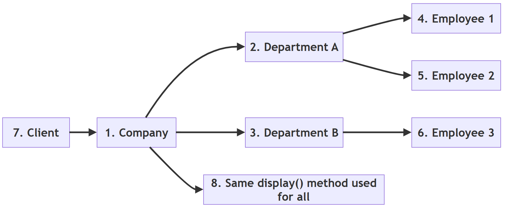

**Follow-up questions**

1. *How would you add a method that finds the total salary of the company?*
   Add a `salary` attribute and a `total_salary()` method to `Employee` that returns its salary, and a `total_salary()` method to `Department` that returns the sum of `member.total_salary()` for all members.
2. *Where do you see the Composite pattern on your own computer?*
   In the file system. A folder's size is the total size of the files and folders inside it.

[Back to the Table of Contents](#table-of-contents)

### Q12. Explain the Proxy Pattern. Why is it used? Compare it with directly accessing an object.

**Answer**

The **Proxy** pattern provides a **substitute or placeholder** for another object. Instead of letting the client talk directly to the real object, all requests pass through the proxy. (In everyday life, a "proxy" is a person who acts on someone else's behalf.)

The proxy has the **same methods** as the real object, so the client uses it in exactly the same way. The proxy can perform extra tasks before or after passing the request on.

**Why it is used**

Typical responsibilities of a proxy include:

- checking access permissions (a **protection proxy**);
- delaying object creation until it is needed, called [lazy loading](https://en.wikipedia.org/wiki/Lazy_loading) (a **virtual proxy**);
- logging operations;
- caching (storing) frequently used results;
- monitoring how the object is used;
- representing an object that lives on another computer (a **remote proxy**).

For example, suppose a large image needs a lot of memory and time to load. Instead of loading it immediately, a proxy object delays loading until the image is actually displayed. If the image is never displayed, it is never loaded.

The client continues to use the object in the same way, without knowing that a proxy is controlling access.

**Step-by-step: how the pattern works**

1. Write the real class (`RealImage`) whose objects are expensive to create or need protection.
2. Write a proxy class (`ImageProxy`) with the **same methods**.
3. Inside the proxy, keep a reference to the real object, starting as `None`.
4. When a method is called on the proxy, first perform the extra task (for example, check access).
5. If the real object does not exist yet, create it. Then pass the request on to it.

**Example script**

```python
# Step 1: The real object. Creating it is "expensive".
class RealImage:
    def __init__(self, filename):
        self.filename = filename
        print(f"  Loading '{filename}' from disk (slow step)")

    def show(self):
        print(f"  Displaying '{self.filename}'")

# Step 2: The proxy has the same show() method but controls access
class ImageProxy:
    def __init__(self, filename, user_role):
        self.filename = filename
        self.user_role = user_role
        self._real_image = None             # not loaded yet (lazy loading)

    def show(self):
        # Step 3: Access check before doing any work
        if self.user_role != "member":
            print(f"  Access denied for role '{self.user_role}'")
            return
        # Step 4: Create the real object only the first time it is needed
        if self._real_image is None:
            self._real_image = RealImage(self.filename)
        self._real_image.show()

print("Creating proxies (nothing is loaded yet)")
photo = ImageProxy("holiday.png", "member")
secret = ImageProxy("secret.png", "guest")

print("First call to show():")
photo.show()
print("Second call to show():")
photo.show()
print("Guest tries to view an image:")
secret.show()
```

**Output**

```text
Creating proxies (nothing is loaded yet)
First call to show():
  Loading 'holiday.png' from disk (slow step)
  Displaying 'holiday.png'
Second call to show():
  Displaying 'holiday.png'
Guest tries to view an image:
  Access denied for role 'guest'
```

**How the script works**

- Creating the two proxies prints nothing about loading. The real images do not exist yet.
- The first `show()` loads the image. The second `show()` reuses it, so "Loading" appears only once.
- The guest is stopped by the proxy, so `secret.png` is never loaded at all.

**Mermaid flowchart of the script**

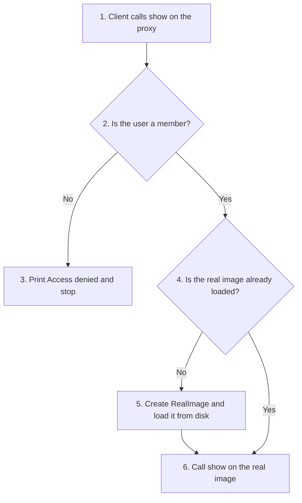

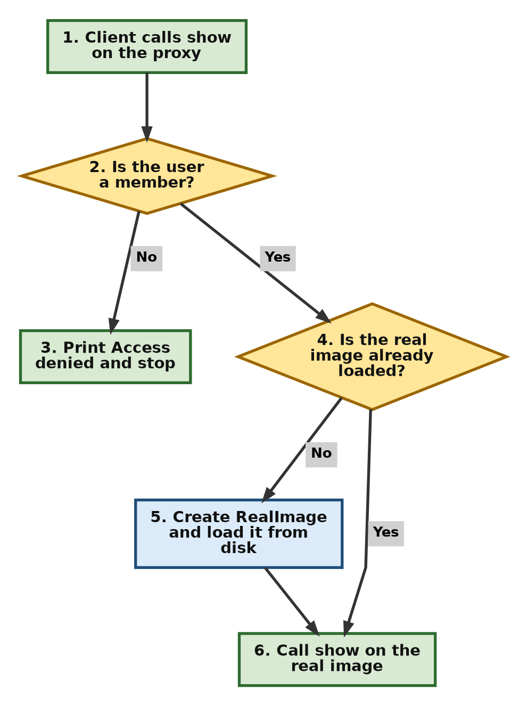

Read more at [Refactoring Guru: Proxy](https://refactoring.guru/design-patterns/proxy).

**Comparison table**

| Direct Access | Proxy Pattern |
| --- | --- |
| Client accesses the object directly | Client communicates through the proxy |
| No additional control | Access can be controlled |
| Object is created immediately | Lazy loading is possible |
| No central place to add security checks | Better security and monitoring |
| Slightly faster, no extra step | One extra step, but more control |

**Flowchart**

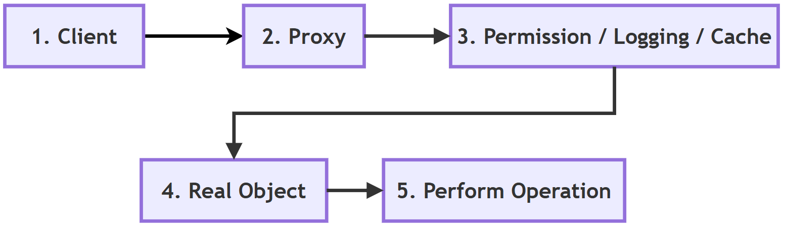

**Follow-up questions**

1. *How can a client tell whether it is using a proxy or the real object?*
   Ideally it cannot, because both offer the same methods. That is exactly what makes the proxy easy to introduce.
2. *How could the proxy also count how many times the image was shown?*
   Add a counter attribute to `ImageProxy` and increase it inside `show()` before passing the request on.

[Back to the Table of Contents](#table-of-contents)

### Q13. Explain the Observer Pattern. How does it support communication between objects? Give suitable applications.

**Answer**

The **Observer** pattern sets up a **one-to-many** relationship between objects. When one object changes its state, all the objects that depend on it are **automatically notified**.

The object being watched is called the **Subject**. The objects receiving notifications are called **Observers**. (This is also known as the **publish-subscribe** idea, like subscribing to a YouTube channel: when a new video is published, every subscriber is informed.)

**How it supports communication**

Instead of the programmer manually informing every object about a change, the subject automatically sends a notification to all registered observers.

1. Observers **register** (subscribe) with the subject.
2. When its data changes, the subject goes through its list of observers and calls a method, usually `update()`, on each one.
3. Each observer decides for itself how to react.
4. Observers can **unregister** (unsubscribe) at any time.

The Observer pattern reduces coupling because the subject does not need to know the internal details of the observers. It only knows that each observer has an `update()` method.

**Applications**

- A **weather station**: whenever the temperature changes, all subscribed displays receive the updated information automatically.
- **Graphical user interfaces**: when a user clicks a button, several components may react at the same time. GUI toolkits such as Tkinter call these *event handlers* or *callbacks*.
- **Spreadsheets**: when one cell changes, all cells whose formulas use it are recalculated.
- **Notifications**: news apps, stock price alerts, and email or SMS alerts.
- **Model-View-Controller (MVC)** programs, where views are told when the data model changes ([MVC](https://en.wikipedia.org/wiki/Model%E2%80%93view%E2%80%93controller)).

**Example script**

```python
# Step 1: The Subject keeps a list of observers and notifies them
class WeatherStation:
    def __init__(self):
        self._observers = []
        self._temperature = None

    def attach(self, observer):
        self._observers.append(observer)

    def detach(self, observer):
        self._observers.remove(observer)

    def set_temperature(self, value):
        print(f"Station: temperature changed to {value} C")
        self._temperature = value
        self._notify()                      # Step 2: tell everyone

    def _notify(self):
        for observer in self._observers:
            observer.update(self._temperature)

# Step 3: Observers only need an update() method
class PhoneDisplay:
    def update(self, temperature):
        print(f"  Phone app shows {temperature} C")

class AlertSystem:
    def update(self, temperature):
        if temperature > 40:
            print(f"  ALERT: heatwave warning ({temperature} C)")
        else:
            print("  Alert system: no warning needed")

# Step 4: Register observers and change the data
station = WeatherStation()
phone = PhoneDisplay()
alerts = AlertSystem()

station.attach(phone)
station.attach(alerts)

station.set_temperature(35)
station.set_temperature(42)

# Step 5: An observer can unsubscribe at any time
station.detach(phone)
station.set_temperature(30)
```

**Output**

```text
Station: temperature changed to 35 C
  Phone app shows 35 C
  Alert system: no warning needed
Station: temperature changed to 42 C
  Phone app shows 42 C
  ALERT: heatwave warning (42 C)
Station: temperature changed to 30 C
  Alert system: no warning needed
```

**How the script works**

- `WeatherStation` does not know what a `PhoneDisplay` or an `AlertSystem` is. It only calls `update()` on each registered object.
- A new kind of observer, such as an `SMSService`, can be added without changing the `WeatherStation` class at all.
- After `detach(phone)`, only the alert system reacts to the last change.

**Mermaid flowchart of the script**

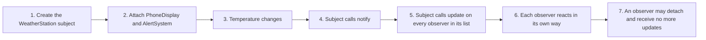

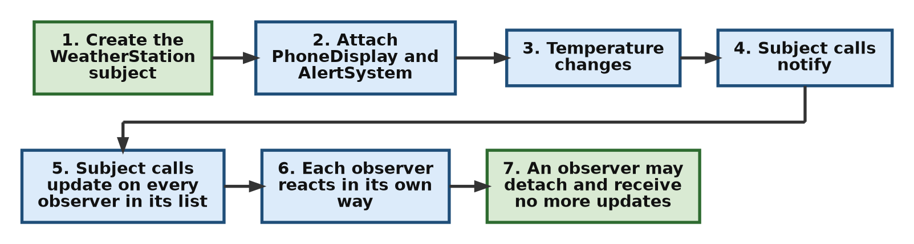

Read more at [Refactoring Guru: Observer](https://refactoring.guru/design-patterns/observer).

**Comparison table**

| Without Observer | With Observer |
| --- | --- |
| Manual notifications | Automatic notifications |
| Tight coupling, subject knows every receiver | Loose coupling, subject only knows `update()` |
| Difficult to add new listeners | Easy to register new observers |
| More maintenance | Better extensibility |

**Flowchart**

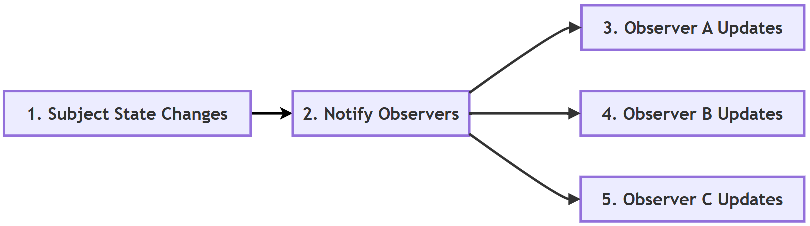

**Follow-up questions**

1. *What happens if an observer is attached twice?*
   It will be notified twice for every change, because it appears twice in the list. A careful subject can check `if observer not in self._observers` before adding it.
2. *Could a plain function act as an observer in Python?*
   Yes. The subject could store functions and call `observer(temperature)` instead of `observer.update(temperature)`. This is a common Pythonic shortcut.

[Back to the Table of Contents](#table-of-contents)

### Q14. Explain the Strategy Pattern. How does it allow algorithms to be changed at runtime? Compare it with using large if-elif statements.

**Answer**

The **Strategy** pattern places each of several interchangeable **algorithms** (ways of doing a task) in its own separate class or function. The client selects the required strategy **at runtime**, that is, while the program is running.

**The problem**

Without the Strategy pattern, programmers often write a large `if-elif` block to choose among several algorithms. Such code becomes difficult to read and maintain as the number of choices grows. Every new choice means editing the same function again, with the risk of breaking the choices that already work.

**The solution**

With the Strategy pattern, each algorithm is written independently. The object that uses it (called the **context**) simply holds a strategy and calls it. The client chooses which strategy to give it.

For example, an online shopping application may support several payment methods:

- Credit Card
- UPI
- Net Banking
- Digital Wallet

Each payment method becomes a separate strategy. Adding another payment option usually requires writing only one new strategy rather than modifying existing code.

**How the algorithm is changed at runtime**

The context stores the strategy in an ordinary attribute. Replacing that attribute with a different strategy immediately changes the behaviour, without restarting the program or changing any class. Step 4 of the script shows this.

**Step-by-step: how the pattern works**

1. Write each algorithm as a separate function (or class) with the same signature, for example `strategy(amount)`.
2. Write a context class that receives a strategy and uses it.
3. Keep the available strategies in a dictionary so they can be looked up by name.
4. At runtime, pick a strategy from the dictionary (for example, from the user's choice) and give it to the context.
5. To change behaviour, give the context a different strategy.

**Example script**

```python
# ---------- Version 1: a growing if-elif block ----------
def pay_with_if_elif(method, amount):
    if method == "card":
        return amount + amount * 0.02       # 2% card fee
    elif method == "upi":
        return amount                       # no fee
    elif method == "netbanking":
        return amount + 10                  # flat fee
    else:
        raise ValueError("Unknown method")

print("if-elif version, card:", pay_with_if_elif("card", 1000))

# ---------- Version 2: Strategy pattern ----------

# Step 1: Each algorithm (strategy) is a separate, small function
def card_strategy(amount):
    return amount + amount * 0.02

def upi_strategy(amount):
    return amount

def netbanking_strategy(amount):
    return amount + 10

def wallet_strategy(amount):                # added later, nothing else changed
    return amount + 5

# Step 2: The context class receives a strategy and uses it
class Checkout:
    def __init__(self, strategy):
        self.strategy = strategy

    def total(self, amount):
        return self.strategy(amount)

# Step 3: Choose the strategy at runtime, e.g. from the user's choice
strategies = {
    "card": card_strategy,
    "upi": upi_strategy,
    "netbanking": netbanking_strategy,
    "wallet": wallet_strategy,
}

for choice in ["card", "upi", "netbanking", "wallet"]:
    checkout = Checkout(strategies[choice])
    print(f"Strategy '{choice}': total = {checkout.total(1000)}")

# Step 4: The strategy of an existing object can be swapped at runtime
checkout = Checkout(upi_strategy)
print("Before swap:", checkout.total(1000))
checkout.strategy = card_strategy
print("After swap :", checkout.total(1000))
```

**Output**

```text
if-elif version, card: 1020.0
Strategy 'card': total = 1020.0
Strategy 'upi': total = 1000
Strategy 'netbanking': total = 1010
Strategy 'wallet': total = 1005
Before swap: 1000
After swap : 1020.0
```

**How the script works**

- In Python, functions are objects. They can be stored in a dictionary and passed around like any other value, so each strategy can be a plain function. In Java, each strategy would normally need its own class.
- The wallet strategy was added by writing one new function and one dictionary entry. `Checkout` did not change.
- Card totals print as `1020.0` because multiplying by `0.02` produces a floating-point number.

Read more at [Refactoring Guru: Strategy](https://refactoring.guru/design-patterns/strategy).

**Comparison table**

| Large if-elif | Strategy Pattern |
| --- | --- |
| Long conditional statements | Independent strategies |
| Difficult to extend | Easy to add new strategies |
| Existing code must be edited for every new choice | Minimal changes, existing strategies are untouched |
| All algorithms mixed in one function | Each algorithm can be tested on its own |
| Less maintainable | More maintainable |

**Flowchart**

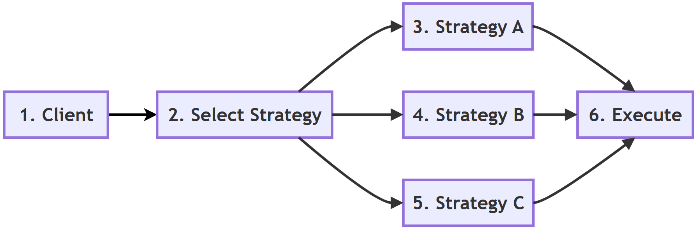

**Follow-up questions**

1. *Is an `if-elif` block always bad?*
   No. For two or three simple, stable choices, `if-elif` is clear and perfectly fine. The Strategy pattern pays off when the choices are many, complex or likely to grow.
2. *Name a built-in Python function that accepts a strategy.*
   `sorted()` accepts a `key` function, which is a strategy for deciding the sort order, for example `sorted(words, key=len)`.

[Back to the Table of Contents](#table-of-contents)

### Q15. Explain the Command Pattern. How does it help in implementing undo operations, menus and task queues?

**Answer**

The **Command** pattern turns a **request into an object**. Instead of performing an operation directly, the request is stored inside a command object.

Each command object contains all the information needed to perform the requested action: which object to act on, what to do, and with what data. A good everyday picture is a restaurant order slip. The waiter writes the order on a slip and hands it to the kitchen. The slip can wait in a queue, be cooked later, or be cancelled.

For example, in a text editor, clicking the Copy, Paste or Undo buttons creates matching command objects. The application executes these commands whenever required.

Since commands are ordinary objects, they can be:

- stored in a list;
- executed later;
- repeated;
- logged;
- undone.

The Command pattern separates the object **requesting** an operation (for example, a button) from the object **performing** it (for example, the editor).

**How it helps with undo, menus and task queues**

- **Undo**: each command has an `undo()` method that reverses its own work. The program keeps a history list of executed commands. To undo, it takes the last command off the list and calls its `undo()`.
- **Menus and toolbars**: a menu item and a toolbar button can both hold the **same** command object. The button does not need to know how the action works. It just calls `execute()`.
- **Task queues**: commands can be placed in a list and run later, one after another, or even by another part of the program. Macros (recorded sequences of actions) work in the same way.

**Step-by-step: how the pattern works**

1. Write the **receiver**, the object that does the real work (`TextEditor`).
2. Write one **command** class per action. Each has `execute()` and `undo()`.
3. Write an **invoker** (`CommandManager`) that runs commands and keeps a history.
4. To perform an action, create a command and give it to the invoker.
5. To undo, ask the invoker to take the last command from the history and call its `undo()`.

**Example script**

```python
# Step 1: The receiver - the object that does the real work
class TextEditor:
    def __init__(self):
        self.text = ""

# Step 2: Command objects. Each one knows how to do AND undo its action.
class AddTextCommand:
    def __init__(self, editor, words):
        self.editor = editor
        self.words = words

    def execute(self):
        self.editor.text += self.words

    def undo(self):
        self.editor.text = self.editor.text[:-len(self.words)]

class ClearCommand:
    def __init__(self, editor):
        self.editor = editor
        self.backup = ""

    def execute(self):
        self.backup = self.editor.text      # remember old text for undo
        self.editor.text = ""

    def undo(self):
        self.editor.text = self.backup

# Step 3: The invoker runs commands and keeps a history for undo
class CommandManager:
    def __init__(self):
        self.history = []

    def run(self, command):
        command.execute()
        self.history.append(command)

    def undo(self):
        if self.history:
            command = self.history.pop()
            command.undo()

# Step 4: Use the editor through commands
editor = TextEditor()
manager = CommandManager()

manager.run(AddTextCommand(editor, "Hello"))
print("After typing 'Hello'  :", repr(editor.text))
manager.run(AddTextCommand(editor, " World"))
print("After typing ' World' :", repr(editor.text))
manager.run(ClearCommand(editor))
print("After Clear           :", repr(editor.text))

# Step 5: Undo in reverse order
manager.undo()
print("Undo (Clear)          :", repr(editor.text))
manager.undo()
print("Undo (' World')       :", repr(editor.text))

# Step 6: Commands can also wait in a queue and run later
queue = [AddTextCommand(editor, "!"), AddTextCommand(editor, "!")]
print("Commands waiting in queue:", len(queue))
for command in queue:
    manager.run(command)
print("After running the queue:", repr(editor.text))
```

**Output**

```text
After typing 'Hello'  : 'Hello'
After typing ' World' : 'Hello World'
After Clear           : ''
Undo (Clear)          : 'Hello World'
Undo (' World')       : 'Hello'
Commands waiting in queue: 2
After running the queue: 'Hello!!'
```

**How the script works**

- `ClearCommand` saves a backup of the text before clearing it, so that its `undo()` can put the text back.
- Undo works in **reverse order**, because `history.pop()` removes the most recent command first. A list used this way is called a **stack** ([stack](https://en.wikipedia.org/wiki/Stack_(abstract_data_type))).
- In Step 6 the two commands are created first and run later. This is the idea behind task queues.

**Mermaid flowchart of the undo process**

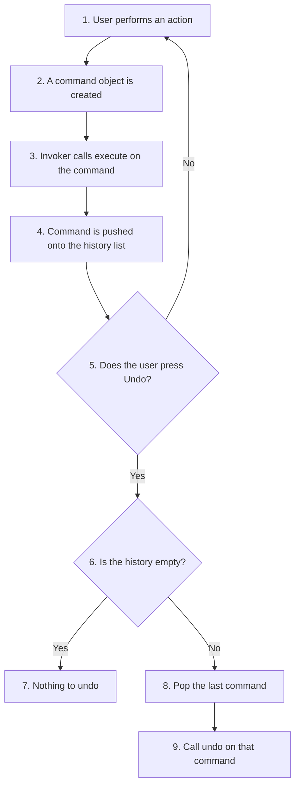

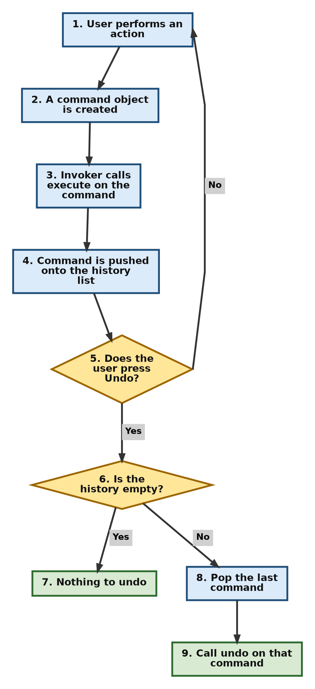

Read more at [Refactoring Guru: Command](https://refactoring.guru/design-patterns/command).

**Comparison table**

| Direct Method Call | Command Pattern |
| --- | --- |
| Immediate execution | Request stored as an object |
| Difficult to implement undo | Undo becomes easier |
| Cannot easily be queued, logged or repeated | Can be queued, logged, repeated or scheduled |
| Less flexible | More flexible |
| Tight coupling between caller and receiver | Loose coupling |

**Flowchart**

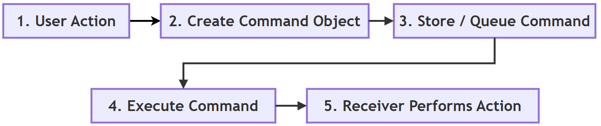

**Follow-up questions**

1. *How would you add a Redo feature?*
   Keep a second list. When a command is undone, push it onto the redo list. To redo, pop from the redo list, call `execute()` again, and push it back onto the history list.
2. *Why does `ClearCommand` need a `backup` attribute while `AddTextCommand` does not?*
   `AddTextCommand` can undo itself by removing the words it added. `ClearCommand` destroys the old text, so it must save a copy first to be able to restore it.

[Back to the Table of Contents](#table-of-contents)

### Q16. Explain the Iterator and Template Method patterns. What problems do they solve? Compare their purposes and typical applications.

**Answer**

The Iterator and Template Method patterns are both behavioral design patterns, but they solve different kinds of problems.

**Iterator pattern**

The **Iterator** pattern provides a standard way to access the elements of a collection **one at a time**, without exposing how the collection is stored inside. Whether the collection is a list, tuple, set or a custom data structure, the client can go through it using the same basic approach.

*Problem it solves*: without an iterator, the client would need to know the internal details of each collection. It would need one kind of loop for a list, another for a tree, and another for a file.

In Python, many built-in objects such as `list`, `tuple`, `set`, `dict` and `str` already support iteration using the `for` loop. This makes the Iterator pattern feel natural in Python. Behind the scenes, the `for` loop:

1. calls `iter()` on the collection to get an iterator;
2. calls `next()` on the iterator again and again to get each item;
3. stops when the iterator raises `StopIteration`.

Any class that provides `__iter__()` and `__next__()` can be used in a `for` loop. A **generator** function (one that uses `yield`) is the easiest way to write an iterator in Python ([Python glossary: generator](https://docs.python.org/3/glossary.html#term-generator)).

**Template Method pattern**

The **Template Method** pattern defines the overall structure (or skeleton) of an algorithm in a base class, while allowing certain individual steps to be written differently by subclasses.

*Problem it solves*: several classes follow the same overall procedure but differ in a few steps. Without the pattern, the whole procedure would be copied into every class, and a change to the order of steps would have to be made in many places.

For example, different report generators may all follow these steps:

1. Read data.
2. Process data.
3. Generate (format) the report.
4. Save the report.

The overall sequence remains the same, while subclasses change only specific steps.

Thus, the Iterator pattern focuses on **accessing data**, whereas the Template Method pattern focuses on **organizing the steps of an algorithm**.

**Example script 1: Iterator**

```python
# ---------- Iterator pattern ----------

# Step 1: A custom collection that follows Python's iterator protocol
class Countdown:
    def __init__(self, start):
        self.current = start

    def __iter__(self):
        return self                         # the object is its own iterator

    def __next__(self):
        if self.current <= 0:
            raise StopIteration             # tells the for loop to stop
        value = self.current
        self.current -= 1
        return value

# Step 2: The for loop does not care how Countdown stores its data
print("Custom iterator :", end=" ")
for number in Countdown(5):
    print(number, end=" ")
print()

# Step 3: A generator function does the same job with less code
def countdown(start):
    while start > 0:
        yield start                         # pause here and hand back a value
        start -= 1

print("Generator       :", list(countdown(5)))

# Step 4: The same loop style works for built-in collections too
for collection in [[1, 2], (3, 4), "ab", {"x": 1, "y": 2}]:
    print(type(collection).__name__, "->", [item for item in collection])

# Step 5: What the for loop does behind the scenes
it = iter([10, 20])
print("next():", next(it))
print("next():", next(it))
```

**Output**

```text
Custom iterator : 5 4 3 2 1
Generator       : [5, 4, 3, 2, 1]
list -> [1, 2]
tuple -> [3, 4]
str -> ['a', 'b']
dict -> ['x', 'y']
next(): 10
next(): 20
```

**How the script works**

- `Countdown` keeps its own `current` value. The `for` loop only calls `next()` and never looks inside.
- The generator `countdown()` produces the same numbers in five lines. `yield` pauses the function and resumes it on the next request.
- Iterating over a dictionary gives its **keys**.
- Step 5 shows exactly what a `for` loop does automatically.

**Example script 2: Template Method**

```python
# ---------- Template Method pattern ----------

# Step 1: The base class fixes the ORDER of steps in generate()
class ReportGenerator:
    def generate(self):
        """The template method. Subclasses should not change this."""
        data = self.read_data()
        result = self.process_data(data)
        report = self.format_report(result)
        self.save_report(report)

    # Steps that every subclass must provide
    def read_data(self):
        raise NotImplementedError

    def process_data(self, data):
        raise NotImplementedError

    # A step with a default behaviour that subclasses may keep
    def format_report(self, result):
        return f"{type(self).__name__}: {result}"

    def save_report(self, report):
        print("  Saved ->", report)

# Step 2: Subclasses fill in only the steps that differ
class SalesReport(ReportGenerator):
    def read_data(self):
        print("  Reading sales figures")
        return [1200, 800, 1500]

    def process_data(self, data):
        return f"total sales = {sum(data)}"

class AttendanceReport(ReportGenerator):
    def read_data(self):
        print("  Reading attendance register")
        return ["P", "P", "A", "P"]

    def process_data(self, data):
        return f"present {data.count('P')} of {len(data)} days"

# Step 3: The same generate() call runs both reports
for report in [SalesReport(), AttendanceReport()]:
    print(f"Running {type(report).__name__}:")
    report.generate()
```

**Output**

```text
Running SalesReport:
  Reading sales figures
  Saved -> SalesReport: total sales = 3500
Running AttendanceReport:
  Reading attendance register
  Saved -> AttendanceReport: present 3 of 4 days
```

**How the script works**

- `generate()` is the template method. It fixes the order: read, process, format, save.
- `SalesReport` and `AttendanceReport` supply only `read_data()` and `process_data()`. They reuse `format_report()` and `save_report()` from the base class.
- If a new step, such as "email the report", is needed for all reports, it is added once, in `generate()`.

Read more at [Refactoring Guru: Iterator](https://refactoring.guru/design-patterns/iterator) and [Refactoring Guru: Template Method](https://refactoring.guru/design-patterns/template-method).

**Comparison table**

| Iterator Pattern | Template Method Pattern |
| --- | --- |
| Goes through (traverses) collections | Organizes the steps of an algorithm |
| Focuses on accessing data | Focuses on the order of execution steps |
| Hides how the collection is stored | Fixes the algorithm's structure in the base class; subclasses change only some steps |
| Built into Python through `for`, `iter()`, `next()` and generators | Written with inheritance and method overriding |
| Common in loops | Common in frameworks |

**Flowchart**

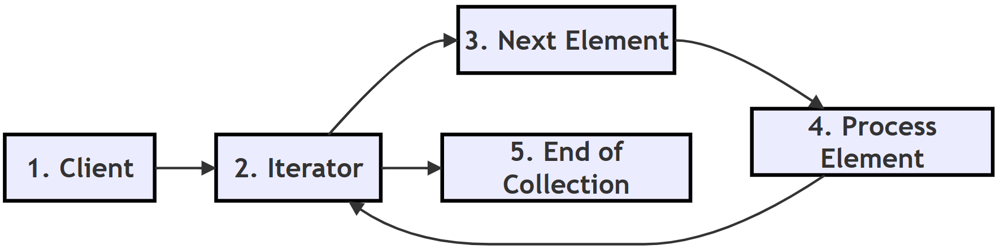

**Follow-up questions**

1. *What happens if you loop over the same `Countdown` object twice?*
   The second loop prints nothing, because the object is its own iterator and `current` has already reached 0. A fresh `Countdown(5)` is needed, or `__iter__()` could return a new iterator each time.
2. *In the Template Method script, what would happen if a subclass forgot to write `read_data()`?*
   Calling `generate()` would raise `NotImplementedError` from the base class, which clearly tells the programmer what is missing. Python's [abc module](https://docs.python.org/3/library/abc.html) can catch this even earlier, when the object is created.

[Back to the Table of Contents](#table-of-contents)

### Q17. Explain Pythonic Design Patterns. How do Python features such as decorators, context managers, mixins, duck typing and dataclasses simplify classical design patterns?

**Answer**

Many classical design patterns were first developed for languages such as C++ and Java. At that time, these languages had fewer high-level features, so programmers had to build certain solutions by hand, using extra classes and interfaces.

Python includes many language features that support the same design goals with much less code. Solutions that use these features are often called **Pythonic patterns**. ("Pythonic" means written in the natural style of Python, as described in [PEP 20, The Zen of Python](https://peps.python.org/pep-0020/).)

For example:

- **Decorators** simplify the classical Decorator pattern. A few lines with `@` replace a family of wrapper classes ([decorator](https://docs.python.org/3/glossary.html#term-decorator)).
- **Context managers** simplify resource management. The `with` statement makes sure that a file, connection or lock is always closed or released, even if an error occurs ([the with statement](https://docs.python.org/3/reference/compound_stmts.html#the-with-statement), [contextlib](https://docs.python.org/3/library/contextlib.html)).
- **Mixins** allow behaviour to be added through multiple inheritance. A small class adds one ability, such as "convert to JSON", to any class that inherits from it ([mixin](https://en.wikipedia.org/wiki/Mixin)).
- **Duck typing** removes the need for rigid interface hierarchies in many situations. Python does not ask "what class is this object?". It asks "does this object have the method I need?" ([duck typing](https://docs.python.org/3/glossary.html#term-duck-typing)).
- **Dataclasses and named tuples** provide lightweight value objects with minimal code. Python writes `__init__`, `__repr__` and `__eq__` automatically ([dataclasses](https://docs.python.org/3/library/dataclasses.html), [NamedTuple](https://docs.python.org/3/library/typing.html#typing.NamedTuple)).

Several other Python features also stand in for classical patterns:

- **First-class functions** replace many Strategy and Command classes (see Q14 and Q15).
- **Generators** replace hand-written Iterator classes (see Q16).
- **Modules** act as natural singletons (see Q4).

These language features reduce [boilerplate code](https://en.wikipedia.org/wiki/Boilerplate_code) while making programs easier to read and maintain.

Python programmers therefore often prefer the Pythonic solution whenever it solves the problem well enough. The classical form is still worth learning. It explains *why* the Pythonic feature exists, and it is needed when a problem is bigger than the shortcut can handle.

**Step-by-step: moving from a classical pattern to a Pythonic one**

1. Identify the design goal, for example "add logging without changing the function".
2. Ask whether a Python feature already serves that goal (here, a decorator).
3. If it does, use the feature and keep the code short.
4. If the problem needs more (for example, state that changes over time, or many related methods), fall back to the classical class-based pattern.

**Example script: five Pythonic features in one program**

```python
import json
from contextlib import contextmanager
from dataclasses import dataclass

# ---------- 1. Decorator instead of wrapper classes ----------
def announce(func):
    def wrapper(*args):
        print(f"Running {func.__name__}...")
        return func(*args)
    return wrapper

@announce
def add(a, b):
    return a + b

print("1. Decorator  :", add(2, 3))

# ---------- 2. Context manager for resource handling ----------
@contextmanager
def opened_resource(name):
    print(f"2. Context mgr: opening {name}")
    try:
        yield name.upper()                  # the value used inside 'with'
    finally:
        print(f"2. Context mgr: closing {name} (runs even if an error occurs)")

with opened_resource("database") as resource:
    print("2. Context mgr: working with", resource)

# ---------- 3. Mixin to add one extra ability ----------
class JSONMixin:
    def to_json(self):
        return json.dumps(self.__dict__)

class Student(JSONMixin):
    def __init__(self, name, marks):
        self.name = name
        self.marks = marks

print("3. Mixin      :", Student("Priya", 91).to_json())

# ---------- 4. Duck typing instead of formal interfaces ----------
class Duck:
    def speak(self):
        return "Quack"

class Robot:
    def speak(self):
        return "Beep"

def make_it_speak(thing):
    # No type check: any object with a speak() method will work
    return thing.speak()

print("4. Duck typing:", make_it_speak(Duck()), "/", make_it_speak(Robot()))

# ---------- 5. Dataclass instead of a hand-written value class ----------
@dataclass
class Point:
    x: int
    y: int

p1 = Point(3, 4)
p2 = Point(3, 4)
print("5. Dataclass  :", p1, "| equal?", p1 == p2)
```

**Output**

```text
Running add...
1. Decorator  : 5
2. Context mgr: opening database
2. Context mgr: working with DATABASE
2. Context mgr: closing database (runs even if an error occurs)
3. Mixin      : {"name": "Priya", "marks": 91}
4. Duck typing: Quack / Beep
5. Dataclass  : Point(x=3, y=4) | equal? True
```

**How the script works**

1. `@announce` adds a message before `add()` runs. No wrapper class was needed.
2. The `finally` block inside the context manager always runs, so the "closing" message is guaranteed. This is how `with open(...)` makes sure files are closed.
3. `Student` gains `to_json()` just by inheriting from `JSONMixin`. `self.__dict__` is the dictionary of the object's attributes.
4. `make_it_speak()` works with `Duck` and `Robot` even though they share no parent class.
5. `@dataclass` wrote `__init__`, a readable `__repr__` and `__eq__`, which is why `p1 == p2` is `True`.

**Comparison table**

| Classical GoF Approach | Pythonic Approach |
| --- | --- |
| Wrapper classes (Decorator) | Decorators with `@` |
| Explicit resource cleanup with `try`/`finally` everywhere | `with` statement and context managers |
| Large inheritance hierarchies | Mixins |
| Formal interfaces | Duck typing |
| Verbose data (value) classes | `@dataclass`, `NamedTuple` |
| Strategy and Command classes | Plain functions passed as values |
| Iterator classes | Generators with `yield` |
| Singleton class | A module-level object |

**Flowchart**

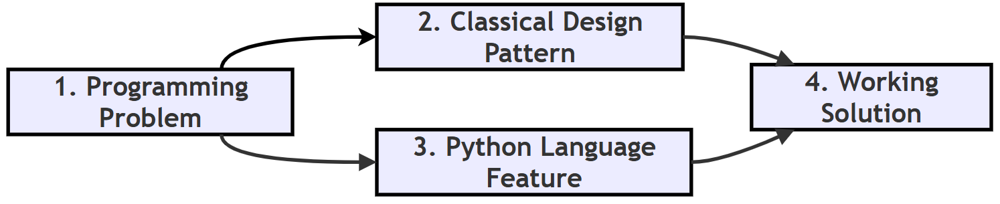

**Follow-up questions**

1. *What would happen to the `Point` comparison if `@dataclass` were removed and `__init__` were written by hand?*
   `p1 == p2` would print `False`, because a plain class compares objects by identity unless `__eq__` is written.
2. *Is duck typing risky?*
   It can be. If an object does not have the required method, the error appears only when the method is called. Good tests and [type hints](https://docs.python.org/3/library/typing.html) help catch such mistakes early.

[Back to the Table of Contents](#table-of-contents)

### Q18. How should a programmer choose the appropriate design pattern? What factors should be considered before applying one?

**Answer**

Selecting the right design pattern is one of the most important software design decisions. No single pattern is suitable for every problem.

A programmer should first understand the nature of the problem before selecting a pattern. A pattern chosen before the problem is clear usually ends up forcing the program into a shape it does not need.

**Step-by-step: choosing a pattern**

1. **Describe the problem in one sentence** without using any pattern names, for example "several screens must update when the score changes".
2. **Decide the category.** Some useful questions include:
   - Is the problem related to object creation? (creational)
   - Is it related to object organization? (structural)
   - Is it related to communication between objects? (behavioral)
3. **Check Python's built-in features first.** Can a function, a decorator, a generator, a `with` statement or a dataclass solve the problem more simply?
4. **Pick the simplest pattern that fits.** Use the decision guide below.
5. **Check the cost.** Count the extra classes and ask whether a new team member would still understand the code easily.
6. **Apply it, then review.** If the code became harder to read without a clear gain, remove the pattern.

**Factors to consider before applying a pattern**

| Factor | Question to ask |
| --- | --- |
| Nature of the problem | Is it about creating, organizing or connecting objects? |
| Likely changes | Which part of the program is most likely to change in future? Patterns are most useful there. |
| Simplicity | Would a plain function or class do the job just as well? |
| Python features | Does Python already offer a built-in way to do this? |
| Team understanding | Will other programmers recognise and understand the pattern? |
| Testing | Will the pattern make the code easier or harder to test? |
| Performance | Will the extra layers slow down a part of the program where speed matters? |

Choosing an unnecessarily complex pattern may make the program harder to understand.

A good programmer first tries the simplest solution and introduces a design pattern only when it clearly improves the software. This idea is often summed up as [KISS: Keep It Simple](https://en.wikipedia.org/wiki/KISS_principle).

Understanding the **purpose** of each pattern is therefore more important than memorizing its code.

**Decision guide**

| Problem | Suitable Pattern |
| --- | --- |
| Only one shared object must exist | Singleton (or a module-level object) |
| Flexible object creation | Factory Method |
| Family of related objects | Abstract Factory |
| Complex object built in steps | Builder |
| Add behaviour | Decorator |
| Make an incompatible class fit | Adapter |
| Simplify a subsystem | Facade |
| Treat single items and groups alike | Composite |
| Control or delay access to an object | Proxy |
| Multiple interchangeable algorithms | Strategy |
| Event notification | Observer |
| Undo, queue or log requests | Command |
| Go through a collection | Iterator (a `for` loop or generator in Python) |
| Same steps, some details differ | Template Method |

**Mermaid flowchart: a quick decision path**

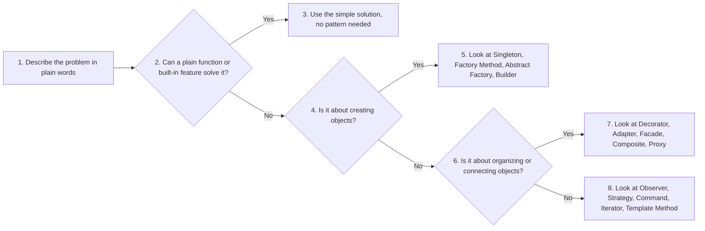

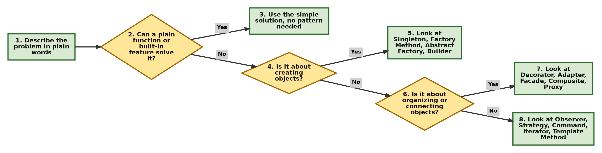

**Flowchart**

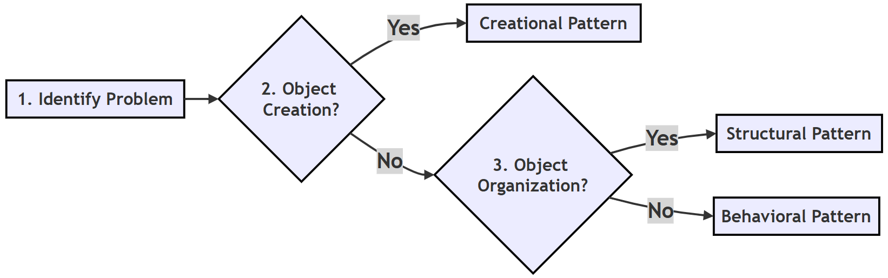

**Follow-up questions**

1. *A program must send the same message by email today and by SMS next month. Which pattern fits?*
   Strategy. Each sending method is a separate strategy, and new ones can be added later.
2. *Why should Python's built-in features be checked before choosing a classical pattern?*
   Because they often do the same job with far less code, which makes the program easier to read and maintain.

[Back to the Table of Contents](#table-of-contents)

### Q19. Why are multiple design patterns sometimes combined in a single application? Explain with suitable examples.

**Answer**

Large software systems usually face many different design problems at the same time. As a result, a single design pattern is rarely enough.

Instead, multiple patterns are combined, with each pattern solving one specific part of the overall problem. You can think of patterns as tools in a toolbox. Building a cupboard needs a saw, a hammer and a screwdriver, each for its own job.

For example, a graphical application may use:

- **Factory Method** to create windows;
- **Observer** to update the user interface when data changes;
- **Strategy** to select different sorting algorithms;
- **Decorator** to add logging;
- **Facade** to simplify interaction with the subsystems.

Each pattern performs a different responsibility while cooperating with the others.

This modular approach produces software that is easier to maintain, extend and test, because each concern lives in its own place.

However, programmers should combine patterns only when necessary. Using too many patterns can make the software unnecessarily complicated (see Q20).

**Step-by-step: combining patterns sensibly**

1. List the separate requirements of the application.
2. For each requirement, decide whether it needs a pattern at all.
3. Choose one suitable pattern per requirement.
4. Make sure the patterns connect through simple, clear methods.
5. Hide the combination behind a simple entry point (often a facade) so that client code stays easy.

**Example script: four patterns working together**

The program below shows a small result board for a class. It uses Decorator, Strategy, Observer and Facade together.

```python
# One small program that uses four patterns together

# Step 1: DECORATOR - adds logging to any function
def logged(func):
    def wrapper(*args):
        print(f"  [log] {func.__name__} called")
        return func(*args)
    return wrapper

# Step 2: STRATEGY - interchangeable sorting rules
@logged
def by_name(students):
    return sorted(students, key=lambda s: s[0])

@logged
def by_marks(students):
    return sorted(students, key=lambda s: s[1], reverse=True)

# Step 3: OBSERVER - displays that react when the list changes
class ConsoleView:
    def update(self, students):
        print("  Console view :", [name for name, _ in students])

class TopperView:
    def update(self, students):
        best = max(students, key=lambda s: s[1])
        print("  Topper view  :", best[0])

# Step 4: FACADE - one simple class that hides the coordination
class ResultBoard:
    def __init__(self, students):
        self.students = students
        self.views = [ConsoleView(), TopperView()]

    def show(self, strategy):
        self.students = strategy(self.students)
        for view in self.views:
            view.update(self.students)

# Step 5: The client uses only the facade and picks a strategy
board = ResultBoard([("Ravi", 92), ("Anita", 78), ("Deepak", 85)])
print("Sort by name:")
board.show(by_name)
print("Sort by marks:")
board.show(by_marks)
```

**Output**

```text
Sort by name:
  [log] by_name called
  Console view : ['Anita', 'Deepak', 'Ravi']
  Topper view  : Ravi
Sort by marks:
  [log] by_marks called
  Console view : ['Ravi', 'Deepak', 'Anita']
  Topper view  : Ravi
```

**How the script works**

| Requirement | Pattern used in the script | Where |
| --- | --- | --- |
| Record every sort operation | Decorator | `@logged` |
| Sort in different ways | Strategy | `by_name`, `by_marks` |
| Update several displays automatically | Observer | `ConsoleView`, `TopperView` |
| Give the client one easy class | Facade | `ResultBoard` |

The client code in Step 5 uses only `ResultBoard` and chooses a strategy. It does not need to know about logging or views.

**Example combination (graphical application)**

| Requirement | Pattern Used |
| --- | --- |
| Create interface components | Factory Method |
| Notify display changes | Observer |
| Select algorithm | Strategy |
| Add logging | Decorator |
| Simplify subsystem | Facade |

**More real-world combinations**

| Application | Patterns commonly combined |
| --- | --- |
| Text editor | Command (undo), Composite (document made of paragraphs and characters), Observer (screen refresh) |
| Online shop | Strategy (payment), Facade (checkout), Observer (order status alerts), Factory Method (creating orders) |
| Web framework | Template Method (request handling steps), Decorator (routes, login checks), Singleton (settings) |

**Flowchart**

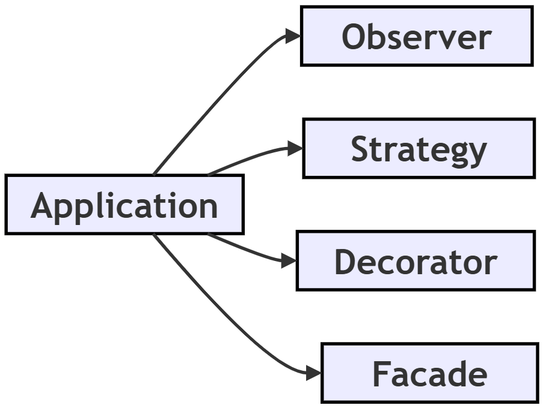

**Follow-up questions**

1. *In the script, how would you add a third view that prints the class average?*
   Write an `AverageView` class with an `update()` method and add an object of it to `self.views` in `ResultBoard`. Nothing else changes.
2. *What is the warning sign that too many patterns have been combined?*
   When a small change needs edits in many classes, or when the code is hard to explain to another programmer, the design has probably become over-engineered.

[Back to the Table of Contents](#table-of-contents)

### Q20. What are anti-patterns? Explain common design-pattern mistakes such as over-engineering, God Object and cargo-cult programming. How can they be avoided?

**Answer**

An **anti-pattern** is a commonly used solution that looks useful at first but ultimately leads to poor software design ([anti-pattern](https://en.wikipedia.org/wiki/Anti-pattern)). Just as design patterns are good solutions that keep repeating, anti-patterns are bad solutions that keep repeating.

**1. Over-engineering**

One common mistake is [over-engineering](https://en.wikipedia.org/wiki/Overengineering). Here, programmers introduce unnecessary classes, factories and abstractions for very simple problems. This increases complexity without giving any real benefit. It often comes from planning for future needs that never arrive. The principle [YAGNI, "You Aren't Gonna Need It"](https://en.wikipedia.org/wiki/You_aren%27t_gonna_need_it) warns against this.

**2. God Object**

Another common anti-pattern is the [God Object](https://en.wikipedia.org/wiki/God_object). In this situation, a single class performs too many responsibilities, such as data storage, business logic, user-interface management, database access and logging. Such classes become difficult to understand, test and maintain. A change to one feature can break an unrelated feature inside the same class. The cure is the [Single Responsibility Principle](https://en.wikipedia.org/wiki/Single-responsibility_principle): each class should have one job.

**3. Cargo-cult programming**

A third mistake is [cargo-cult programming](https://en.wikipedia.org/wiki/Cargo_cult_programming). Here, programmers copy design patterns from books or the Internet without understanding why they are being used. The result is complicated software that solves no real problem.

**How to avoid them**

Good software design follows the principle of simplicity. A design pattern should be introduced only when it clearly improves the program.

1. **Start simple.** Write the most direct solution first.
2. **Wait for the need.** Add a pattern only when a real problem appears, for example when the same `if-elif` block has grown for the third time.
3. **Give each class one job.** If you need the word "and" to describe what a class does, consider splitting it.
4. **Understand before copying.** Before using a pattern, be able to explain in your own words what problem it solves in *your* program.
5. **Review and refactor.** Improve the structure of working code without changing what it does ([refactoring](https://en.wikipedia.org/wiki/Code_refactoring)). Remove patterns that are not paying for themselves.

Remember the following guideline:

> Use a design pattern because the problem requires it, not because the pattern exists.

**Example script: over-engineering compared with a simple solution**

```python
# ---------- Over-engineered: three classes for a one-line job ----------
class GreetingStrategy:
    def greet(self, name):
        raise NotImplementedError

class EnglishGreetingStrategy(GreetingStrategy):
    def greet(self, name):
        return f"Hello, {name}"

class GreetingFactory:
    def create(self):
        return EnglishGreetingStrategy()

print("Over-engineered:", GreetingFactory().create().greet("Asha"))

# ---------- Simple and clear: one function does the same job ----------
def greet(name):
    return f"Hello, {name}"

print("Simple         :", greet("Asha"))
```

**Output**

```text
Over-engineered: Hello, Asha
Simple         : Hello, Asha
```

Both versions print exactly the same result. The first needs three classes and a chain of calls. The second needs one function. Unless there is a real plan to support many greeting styles, the simple version is the better design.

**Example: spotting a God Object**

```python
# A God Object: one class doing five unrelated jobs
class SchoolManager:
    def add_student(self, name): ...          # data storage
    def calculate_grade(self, marks): ...     # business logic
    def draw_report_card(self): ...           # user interface
    def save_to_database(self): ...           # database access
    def write_log(self, message): ...         # logging
```

A better design splits these jobs into separate classes, such as `StudentRecords`, `GradeCalculator`, `ReportCardView`, `StudentDatabase` and `Logger`. Each can then be understood, changed and tested on its own.

**Comparison table**

| Anti-pattern | Problem Created | Warning sign | Better Practice |
| --- | --- | --- | --- |
| Over-engineering | Unnecessary complexity | Many classes for a small task | Prefer simple solutions (KISS, YAGNI) |
| God Object | Too many responsibilities | One very large class that everything depends on | Divide responsibilities among classes |
| Cargo-cult programming | Blindly copying patterns | Nobody can explain why the pattern is there | Understand the problem first |

**Flowchart**

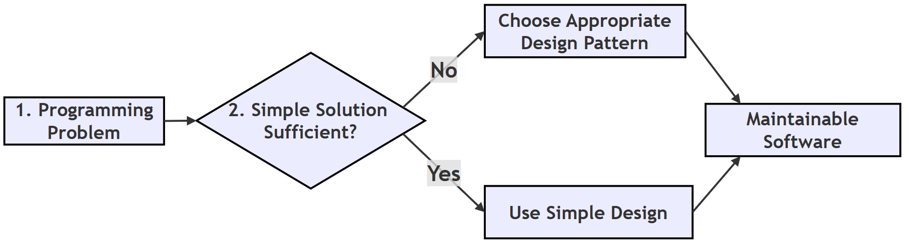

**Follow-up questions**

1. *Name one more common anti-pattern.*
   **Spaghetti code**: code with no clear structure, where the flow jumps around and is hard to follow ([spaghetti code](https://en.wikipedia.org/wiki/Spaghetti_code)). Another is the **Golden Hammer**: using one favourite pattern or tool for every problem.
2. *Can a correct design pattern become an anti-pattern?*
   Yes. Any pattern used where it is not needed turns into over-engineering. A Singleton used just to share data everywhere, for example, behaves like a global variable and is often treated as an anti-pattern.

[Back to the Table of Contents](#table-of-contents)

## Quick Revision Summary

| Pattern | Category | One-line purpose | Question |
| --- | --- | --- | --- |
| Singleton | Creational | Only one object of a class exists | Q4 |
| Factory Method | Creational | Decide which object to create in one place | Q3, Q4 |
| Abstract Factory | Creational | Create a family of matching objects | Q6 |
| Builder | Creational | Build a complex object step by step | Q7 |
| Decorator | Structural | Add behaviour without changing the class | Q5, Q10 |
| Adapter | Structural | Make an incompatible interface fit | Q8, Q10 |
| Facade | Structural | One simple front for a complex subsystem | Q9, Q10 |
| Composite | Structural | Treat single items and groups the same way | Q11 |
| Proxy | Structural | Control access to another object | Q12 |
| Observer | Behavioral | Notify many objects when one changes | Q13 |
| Strategy | Behavioral | Swap algorithms at runtime | Q14 |
| Command | Behavioral | Turn a request into an object (undo, queues) | Q15 |
| Iterator | Behavioral | Visit items one at a time | Q16 |
| Template Method | Behavioral | Fix the steps, let subclasses fill in details | Q16 |

[Back to the Table of Contents](#table-of-contents)

---

