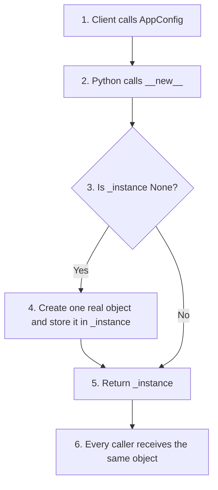
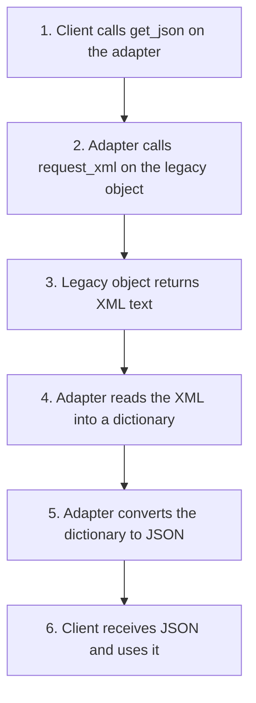
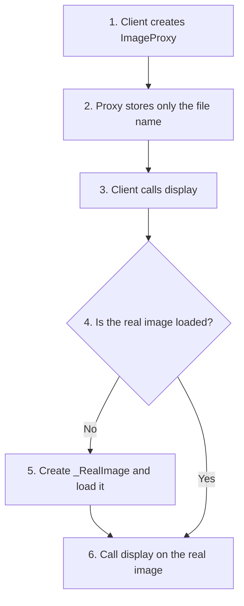
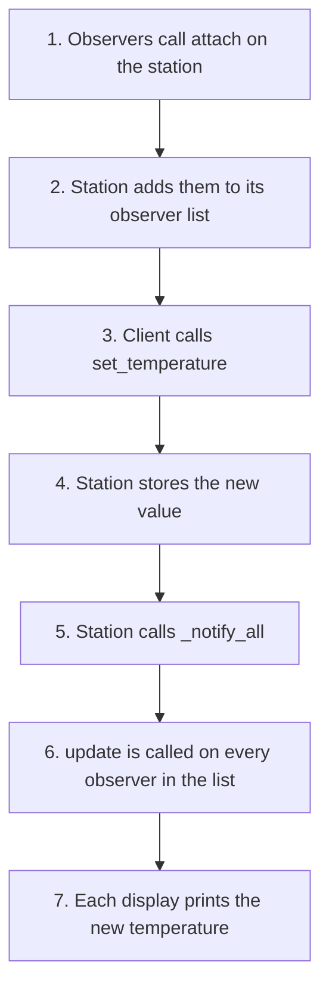
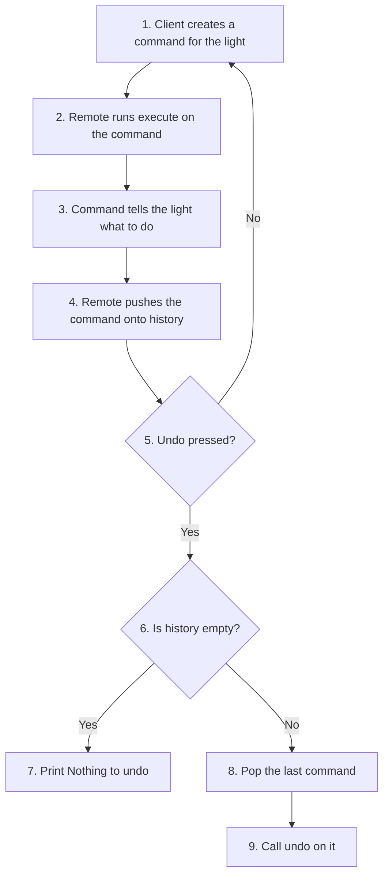
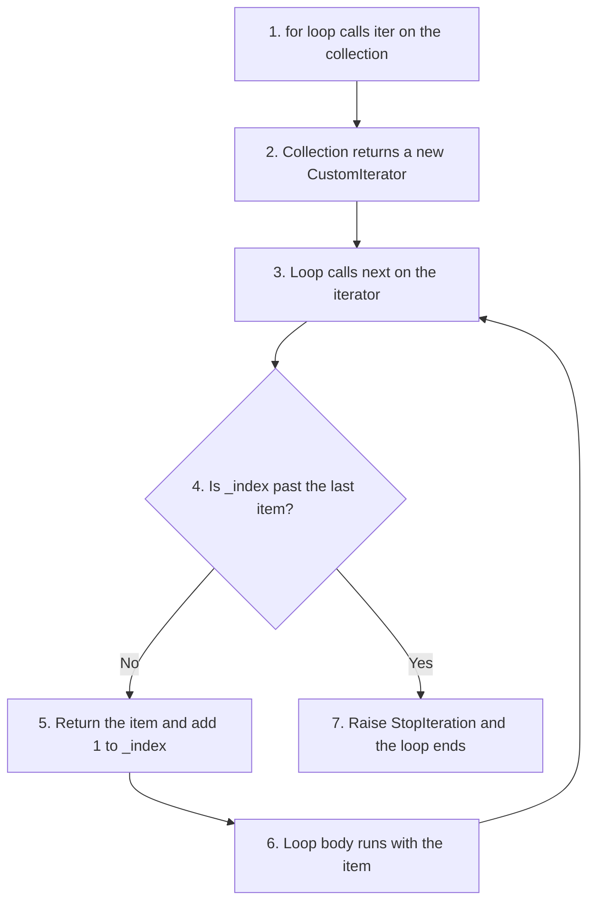
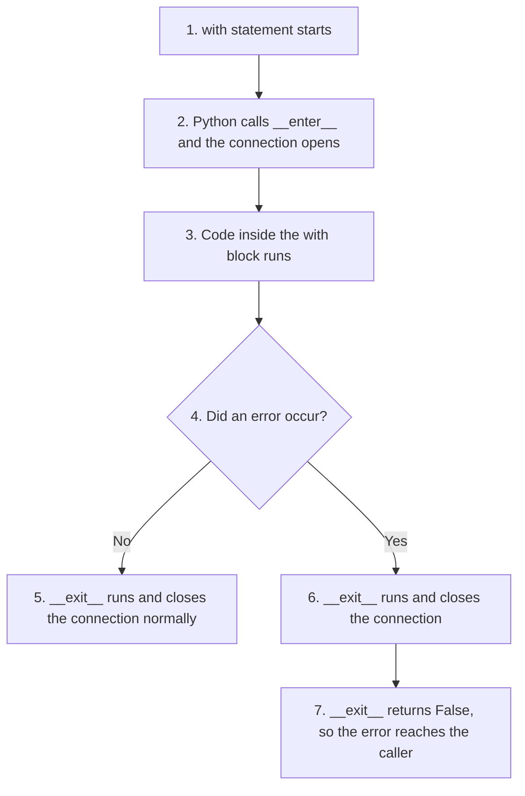

# Design Patterns in Python: Scripting Questions and Answers

This page contains worked answers to the scripting questions on design patterns given in the printed book. Every answer has a complete Python script with step-by-step comments, the output of the script, and a short explanation of the pattern it uses.

## Table of Contents

- [Introduction](#introduction)
  - [What This Page Contains](#what-this-page-contains)
  - [Why These Scripts Matter for Python Programmers](#why-these-scripts-matter-for-python-programmers)
  - [How Each Answer Is Arranged](#how-each-answer-is-arranged)
- [Key Terms Used on This Page](#key-terms-used-on-this-page)
- [Scripting Questions and Answers](#scripting-questions-and-answers)
  - [Q1. Write a script implementing a basic Singleton pattern to maintain a single configuration reference. Verify if two instances point to the exact same memory object.](#q1-write-a-script-implementing-a-basic-singleton-pattern-to-maintain-a-single-configuration-reference-verify-if-two-instances-point-to-the-exact-same-memory-object)
  - [Q2. Implement a Factory Method function named `get_vehicle` that returns an instance of a `Car` or `Bike` object based on an input string parameter.](#q2-implement-a-factory-method-function-named-get_vehicle-that-returns-an-instance-of-a-car-or-bike-object-based-on-an-input-string-parameter)
  - [Q3. Design an Abstract Factory setup featuring a `DarkButton` and `DarkWindow` under a `DarkThemeFactory`, and a `LightButton` and `LightWindow` under a `LightThemeFactory`. Include a uniform client loader.](#q3-design-an-abstract-factory-setup-featuring-a-darkbutton-and-darkwindow-under-a-darkthemefactory-and-a-lightbutton-and-lightwindow-under-a-lightthemefactory-include-a-uniform-client-loader)
  - [Q4. Build a Robot construction script using the Builder Pattern. Support method chaining for adding custom components step-by-step.](#q4-build-a-robot-construction-script-using-the-builder-pattern-support-method-chaining-for-adding-custom-components-step-by-step)
  - [Q5. Write a Prototype pattern script where a data-heavy configuration object clones itself via a distinct custom `.clone()` routine.](#q5-write-a-prototype-pattern-script-where-a-data-heavy-configuration-object-clones-itself-via-a-distinct-custom-clone-routine)
  - [Q6. Construct a manual structural Decorator class named `BoldDecorator` that wraps a base text-generation function to format string outputs.](#q6-construct-a-manual-structural-decorator-class-named-bolddecorator-that-wraps-a-base-text-generation-function-to-format-string-outputs)
  - [Q7. Convert the previous BoldDecorator script into an automated native Python syntax format using magic dunder methods.](#q7-convert-the-previous-bolddecorator-script-into-an-automated-native-python-syntax-format-using-magic-dunder-methods)
  - [Q8. Write an Adapter pattern script that converts a legacy incompatible `.request_xml()` output method style into a client-expected `.get_json()` format.](#q8-write-an-adapter-pattern-script-that-converts-a-legacy-incompatible-request_xml-output-method-style-into-a-client-expected-get_json-format)
  - [Q9. Implement a unified `HomeFacade` architecture containing `TV` and `SoundSystem` subsystems to expose an incredibly simple `.start_movie()` unified action.](#q9-implement-a-unified-homefacade-architecture-containing-tv-and-soundsystem-subsystems-to-expose-an-incredibly-simple-start_movie-unified-action)
  - [Q10. Model a hierarchical filesystem structure with a unified leaf/composite interface using a File and a Folder component via the Composite design pattern.](#q10-model-a-hierarchical-filesystem-structure-with-a-unified-leafcomposite-interface-using-a-file-and-a-folder-component-via-the-composite-design-pattern)
  - [Q11. Implement a lazy-loading proxy pattern class (ImageProxy) that defers actual instantiation of an expensive internal `_RealImage` object until `.display()` is invoked.](#q11-implement-a-lazy-loading-proxy-pattern-class-imageproxy-that-defers-actual-instantiation-of-an-expensive-internal-_realimage-object-until-display-is-invoked)
  - [Q12. Build an architectural event listener tracking routine matching an Observer workflow by linking a `WeatherStation` subject update with registered display units.](#q12-build-an-architectural-event-listener-tracking-routine-matching-an-observer-workflow-by-linking-a-weatherstation-subject-update-with-registered-display-units)
  - [Q13. Code a Strategy layout that encapsulates runtime interchangeable mathematical algorithms by writing an adaptive processing system handling Add or Multiply.](#q13-code-a-strategy-layout-that-encapsulates-runtime-interchangeable-mathematical-algorithms-by-writing-an-adaptive-processing-system-handling-add-or-multiply)
  - [Q14. Implement an undoable transaction command routing pipeline using the descriptive Command Pattern framework mapping action targets against a Light resource receptor.](#q14-implement-an-undoable-transaction-command-routing-pipeline-using-the-descriptive-command-pattern-framework-mapping-action-targets-against-a-light-resource-receptor)
  - [Q15. Write a custom sequence traversal loop pattern using the traditional Iterator architecture by defining sequential steps inside `CustomIterator` and `CustomCollection`.](#q15-write-a-custom-sequence-traversal-loop-pattern-using-the-traditional-iterator-architecture-by-defining-sequential-steps-inside-customiterator-and-customcollection)
  - [Q16. Create a structural text document printing layout that utilizes a generic standard workflow structure according to the Template Method format.](#q16-create-a-structural-text-document-printing-layout-that-utilizes-a-generic-standard-workflow-structure-according-to-the-template-method-format)
  - [Q17. Develop an elegant Pythonic native alternative to resource management workflows by configuring a class utilizing Context Manager protocols.](#q17-develop-an-elegant-pythonic-native-alternative-to-resource-management-workflows-by-configuring-a-class-utilizing-context-manager-protocols)
  - [Q18. Write a Python mixin architecture script featuring independent small single-purpose feature additions via structural multi-inheritance parameters.](#q18-write-a-python-mixin-architecture-script-featuring-independent-small-single-purpose-feature-additions-via-structural-multi-inheritance-parameters)
  - [Q19. Demonstrate Pythonic Duck Typing flexibility by defining classes lacking explicit interface inheritances that execute uniformly when passed inside a generalized calling routine.](#q19-demonstrate-pythonic-duck-typing-flexibility-by-defining-classes-lacking-explicit-interface-inheritances-that-execute-uniformly-when-passed-inside-a-generalized-calling-routine)
  - [Q20. Implement a native Python `@dataclass` setup acting as an immutable Value Object, and configure its parameters to raise runtime modifications errors.](#q20-implement-a-native-python-dataclass-setup-acting-as-an-immutable-value-object-and-configure-its-parameters-to-raise-runtime-modifications-errors)
- [Quick Revision Summary](#quick-revision-summary)

## Introduction

### What This Page Contains

The conceptual questions for this chapter explain *what* each design pattern is and *why* it is used. This page answers the other half of the question: *how* do you actually write it in Python?

There are twenty scripting questions. They are arranged roughly in the same order as the three pattern families:

| Questions | Family | Patterns covered |
| --- | --- | --- |
| Q1 to Q5 | Creational (creating objects) | Singleton, Factory Method, Abstract Factory, Builder, Prototype |
| Q6 to Q11 | Structural (organizing objects) | Decorator (class and `@` form), Adapter, Facade, Composite, Proxy |
| Q12 to Q16 | Behavioral (communication between objects) | Observer, Strategy, Command, Iterator, Template Method |
| Q17 to Q20 | Pythonic techniques | Context managers, mixins, duck typing, frozen dataclasses |

The companion page, [Design Patterns in Python: Conceptual Questions and Answers](060-ch21-conceptualqa.md), explains the ideas behind these patterns in more detail. It is a good idea to read the matching conceptual answer before or after each script here.

[Back to the Table of Contents](#table-of-contents)

### Why These Scripts Matter for Python Programmers

Design patterns are not special Python commands. They are ways of arranging ordinary classes, methods and functions. So every script on this page uses only the basic features you have already learnt: classes, `__init__`, methods, lists, dictionaries, loops and functions.

What makes these scripts interesting is that Python often lets you write a pattern in fewer lines than other languages do. Special methods such as `__new__`, `__call__`, `__iter__`, `__enter__` and `__exit__` let your own classes plug into Python's built-in behaviour. That is why the last few questions look at "Pythonic" techniques that replace or simplify the classical patterns.

[Back to the Table of Contents](#table-of-contents)

### How Each Answer Is Arranged

Each question is printed exactly as it appears in the book. Below it you will find:

1. **Plan**: the steps the script follows, in plain words.
2. **Script**: a complete, runnable script with `# Step 1`, `# Step 2` comments.
3. **Output**: what the script prints when you run it.
4. **How the script works**: short notes on the parts a beginner may find tricky.
5. **Pattern Explanation**: which pattern is used and how it works.
6. **Follow-up questions**: small extra questions, with answers, to test your understanding.

Some answers also include a flowchart drawn with [Mermaid](https://mermaid.js.org/), which GitHub displays as a diagram.

**Tip:** Type each script yourself rather than copying it. Then change one thing (add a class, change a value, remove a line) and predict the new output before you run it.

[Back to the Table of Contents](#table-of-contents)

## Key Terms Used on This Page

| Term | Simple meaning | Read more |
| --- | --- | --- |
| Dunder (magic) method | A special method whose name starts and ends with two underscores, such as `__init__`. Python calls it automatically in certain situations. | [Python data model: special method names](https://docs.python.org/3/reference/datamodel.html#special-method-names) |
| `__new__` | The special method that actually creates a new object. It runs before `__init__`. | [object.\_\_new\_\_](https://docs.python.org/3/reference/datamodel.html#object.__new__) |
| `__call__` | Lets an object be called like a function, for example `obj()`. | [object.\_\_call\_\_](https://docs.python.org/3/reference/datamodel.html#object.__call__) |
| `is` operator | Checks whether two names refer to the very same object in memory. | [Identity comparisons](https://docs.python.org/3/reference/expressions.html#is-not) |
| `id()` | Returns a number that identifies an object while it exists. Two names with the same `id()` refer to the same object. | [id()](https://docs.python.org/3/library/functions.html#id) |
| Interface | The set of methods an object offers, for example `drive()` or `render()`. | [Interface (computing)](https://en.wikipedia.org/wiki/Interface_(computing)) |
| Client code | The part of the program that uses an object or a pattern. | [Client (computing)](https://en.wikipedia.org/wiki/Client_(computing)) |
| Coupling | How strongly one part of a program depends on another. Loose coupling makes change easier. | [Coupling](https://en.wikipedia.org/wiki/Coupling_(computer_programming)) |
| Method chaining | Calling several methods in one line, such as `a.b().c()`, where each method returns an object for the next call. | [Method chaining](https://en.wikipedia.org/wiki/Method_chaining) |
| Deep copy | A copy that also copies every object stored inside the original, so the two are fully independent. | [copy module](https://docs.python.org/3/library/copy.html) |
| Recursion | A function or method that calls itself (or the same method on smaller parts) to solve a problem. | [Recursion](https://en.wikipedia.org/wiki/Recursion_(computer_science)) |
| Lazy loading | Delaying the creation of something until it is really needed. | [Lazy loading](https://en.wikipedia.org/wiki/Lazy_loading) |
| JSON and XML | Two common text formats for storing and exchanging data between programs. | [json module](https://docs.python.org/3/library/json.html), [xml.etree.ElementTree](https://docs.python.org/3/library/xml.etree.elementtree.html) |
| `StopIteration` | The signal an iterator raises when it has no more items. A `for` loop stops when it sees it. | [StopIteration](https://docs.python.org/3/library/exceptions.html#StopIteration) |
| Context manager | An object used with `with` that sets something up at the start and always cleans up at the end. | [Context managers](https://docs.python.org/3/reference/datamodel.html#context-managers) |
| MRO | Method Resolution Order: the order in which Python searches parent classes for a method. | [Python MRO](https://docs.python.org/3/howto/mro.html) |
| Immutable | Cannot be changed after it is created. | [Python glossary: immutable](https://docs.python.org/3/glossary.html#term-immutable) |
| Hashable | Can be used as a dictionary key or stored in a set. | [Python glossary: hashable](https://docs.python.org/3/glossary.html#term-hashable) |
| Open/Closed Principle | Code should be open for extension (you can add new behaviour) but closed for modification (you do not edit working code). | [Open/closed principle](https://en.wikipedia.org/wiki/Open%E2%80%93closed_principle) |

[Back to the Table of Contents](#table-of-contents)

## Scripting Questions and Answers

### Q1. Write a script implementing a basic Singleton pattern to maintain a single configuration reference. Verify if two instances point to the exact same memory object.

**Plan**

1. Write a class `AppConfig` with a class variable `_instance`, which starts as `None`.
2. Override `__new__` so that it creates an object only when `_instance` is still `None`, and returns the stored object every other time.
3. "Create" the object twice.
4. Check with `is` and with `id()` that both names point to the same object.
5. Change a setting through one name and read it through the other, to prove that the data is shared.

**Script**

```python
# Step 1: Define a class that uses __new__ to allow only one instance
class AppConfig:
    _instance = None  # Class variable that will hold the single shared object

    def __new__(cls):
        """
        __new__ runs BEFORE __init__ and is the method that actually
        creates a new object. We take control of it here:
        - if no object exists yet, create one and store it in _instance;
        - otherwise, hand back the object that already exists.
        """
        if cls._instance is None:
            print("  Inside __new__: no instance yet, creating the first one")
            cls._instance = super().__new__(cls)
            cls._instance.settings = {"theme": "light", "language": "en"}
        else:
            print("  Inside __new__: instance exists, returning the same one")
        return cls._instance

# Step 2: "Create" two objects (watch the messages from __new__)
print("Step 2: Creating config1")
config1 = AppConfig()
print("Step 2: Creating config2")
config2 = AppConfig()

# Step 3: Check identity with the 'is' operator and with id()
print("Step 3: Are instances identical?", config1 is config2)
print("Step 3: id(config1) == id(config2)?", id(config1) == id(config2))

# Step 4: A change made through one name is visible through the other
config1.settings["theme"] = "dark"
print("Step 4: Theme read through config2:", config2.settings["theme"])
```

**Output**

```text
Step 2: Creating config1
  Inside __new__: no instance yet, creating the first one
Step 2: Creating config2
  Inside __new__: instance exists, returning the same one
Step 3: Are instances identical? True
Step 3: id(config1) == id(config2)? True
Step 4: Theme read through config2: dark
```

**How the script works**

- When you write `AppConfig()`, Python first calls `__new__` to create the object and then `__init__` to set it up. By taking over `__new__`, the class decides whether a new object is made at all.
- `super().__new__(cls)` asks the normal, built-in object-creation code to make one real object. This happens only once.
- The settings dictionary is created inside the `if` block, so it is set up only on the first call. If it were placed in an `__init__` method instead, `__init__` would run on **every** call to `AppConfig()` and would reset the settings each time. This is a common beginner mistake with Singletons.
- `config1 is config2` is `True`, and both names have the same `id()`. They are two labels on one object.

**Mermaid flowchart**



**Pattern Explanation:**

- **Design Pattern Used:** Singleton Pattern (Creational family).
- **Core Mechanics:** The `__new__` magic method steps in at the creation stage of an object, before `__init__` is called. It checks whether `cls._instance` already holds an object. If it does, that same object is returned. So no matter how many times client code calls `AppConfig()`, it always receives a reference to the exact same object in memory.
- **Why it helps:** The single object acts as one central "source of truth" for settings. Different parts of a large program cannot end up with different, conflicting copies of the configuration.
- **A word of caution:** A Singleton behaves much like a global variable, since any part of the program can change it. In Python, a simpler way to share one object is often to create it in a module (for example `config.py`) and import it, because a module is loaded only once. Read more at [Refactoring Guru: Singleton](https://refactoring.guru/design-patterns/singleton).

**Follow-up questions**

1. *What would `config1 is config2` print if the `if cls._instance is None` check were removed?*
   `False`. A new object would be created on every call.
2. *Why is the settings dictionary created inside `__new__` and not inside `__init__`?*
   Because `__init__` runs on every call to `AppConfig()`. It would reset the settings each time, wiping out any changes.

[Back to the Table of Contents](#table-of-contents)

### Q2. Implement a Factory Method function named `get_vehicle` that returns an instance of a `Car` or `Bike` object based on an input string parameter.

**Plan**

1. Write two product classes, `Car` and `Bike`, that both have a `drive()` method.
2. Write the factory function `get_vehicle()`. It looks up the text in a dictionary and creates the matching object.
3. If the text is unknown, raise a clear `ValueError` instead of silently returning the wrong object.
4. Call the factory from client code and use the objects through `drive()`.

**Script**

```python
# Step 1: Create product classes that share the same method name, drive()
class Car:
    def drive(self):
        return "Driving a car!"

class Bike:
    def drive(self):
        return "Riding a bike!"

# Step 2: Write the factory function
def get_vehicle(vehicle_type):
    """Return a Car or a Bike object depending on the text given."""
    vehicles = {"car": Car, "bike": Bike}       # text label -> class
    vehicle_class = vehicles.get(vehicle_type.strip().lower())
    if vehicle_class is None:
        raise ValueError(f"Unknown vehicle type: {vehicle_type!r}")
    return vehicle_class()                      # create the object

# Step 3: The client asks the factory for objects and uses them
v1 = get_vehicle("car")
v2 = get_vehicle("Bike")          # capital letter also works
print("Step 3:", type(v1).__name__, "->", v1.drive())
print("Step 3:", type(v2).__name__, "->", v2.drive())

# Step 4: An unknown type is reported clearly
try:
    get_vehicle("plane")
except ValueError as error:
    print("Step 4: Error:", error)
```

**Output**

```text
Step 3: Car -> Driving a car!
Step 3: Bike -> Riding a bike!
Step 4: Error: Unknown vehicle type: 'plane'
```

**How the script works**

- The dictionary `{"car": Car, "bike": Bike}` stores the **classes themselves**, not objects. `vehicle_class()` then creates an object of whichever class was found.
- `.strip().lower()` removes extra spaces and ignores capital letters, so `"Bike"` and `" car "` both work.
- `dict.get()` returns `None` when a key is missing, which lets the function report an unknown type clearly.
- A shorter factory could simply return a `Bike` for **any** text that is not `"car"`. That would quietly give a bike for `"plane"` or for a spelling mistake such as `"cra"`. Raising an error is safer.

**Pattern Explanation:**

- **Design Pattern Used:** Factory Method Pattern (Creational family). Strictly speaking, a single function like this is often called a **simple factory**. It is the most common Pythonic form of the Factory Method idea.
- **Core Mechanics:** The client script never calls `Car()` or `Bike()` directly. Creating the object is handed over to `get_vehicle()`. This separation (called *decoupling*) means that if a new class such as `Truck` is introduced, only the factory changes: one new class and one new dictionary entry. The calling code stays untouched.
- **Why it helps:** Class names appear in one place only, so the program is easier to change and test. Read more at [Refactoring Guru: Factory Method](https://refactoring.guru/design-patterns/factory-method).

**Follow-up questions**

1. *Add a `Truck` class with a `drive()` method. What else must change?*
   Only the dictionary inside `get_vehicle()`: add `"truck": Truck`. The client code does not change.
2. *Why does the dictionary store `Car` and not `Car()`?*
   Storing `Car()` would create a car object once, when the dictionary is built, and every caller would then share that one object. Storing the class lets the factory create a fresh object on each call.

[Back to the Table of Contents](#table-of-contents)

### Q3. Design an Abstract Factory setup featuring a `DarkButton` and `DarkWindow` under a `DarkThemeFactory`, and a `LightButton` and `LightWindow` under a `LightThemeFactory`. Include a uniform client loader.

**Plan**

1. Write the four product classes, each with a `render()` method.
2. Write two factories. `DarkThemeFactory` creates only dark products; `LightThemeFactory` creates only light products. Both have the same methods: `create_button()` and `create_window()`.
3. Write one client loader, `render_ui(factory)`, that works with **any** theme factory.
4. Call the loader once with each factory.

**Script**

```python
# Step 1: Build the two product families
class DarkButton:
    def render(self):
        print("  Dark Button")

class DarkWindow:
    def render(self):
        print("  Dark Window")

class LightButton:
    def render(self):
        print("  Light Button")

class LightWindow:
    def render(self):
        print("  Light Window")

# Step 2: One factory per family. Each creates only its own family's products.
class DarkThemeFactory:
    def create_button(self):
        return DarkButton()

    def create_window(self):
        return DarkWindow()

class LightThemeFactory:
    def create_button(self):
        return LightButton()

    def create_window(self):
        return LightWindow()

# Step 3: The uniform client loader works with ANY theme factory
def render_ui(factory):
    print(f"Rendering with {type(factory).__name__}:")
    btn = factory.create_button()
    win = factory.create_window()
    btn.render()
    win.render()

# Step 4: Run the loader once for each family
render_ui(DarkThemeFactory())
render_ui(LightThemeFactory())
```

**Output**

```text
Rendering with DarkThemeFactory:
  Dark Button
  Dark Window
Rendering with LightThemeFactory:
  Light Button
  Light Window
```

**How the script works**

- `render_ui()` never mentions "Dark" or "Light". It only calls `create_button()` and `create_window()` on whatever factory it is given. This is what makes it a *uniform* client loader.
- Each class body is written on its own indented lines. Writing `class DarkButton:   def render(self): ...` on a single line is **not** valid Python, because a `def` cannot follow a `class` header on the same line. It causes a `SyntaxError`.

**Pattern Explanation:**

- **Design Pattern Used:** Abstract Factory Pattern (Creational family).
- **Core Mechanics:** Each factory offers the same set of creation methods (`create_button`, `create_window`), and each one produces a matching set of products. Once the program picks a factory, every object it creates comes from that one family. This prevents accidental mixing, such as a `DarkButton` next to a `LightWindow`, and keeps all components of the screen consistent.
- **A common misunderstanding:** The Abstract Factory is sometimes called a "factory of factories". That is not accurate. It is a factory that creates a **family of related products**. It does not create other factories.
- Read more at [Refactoring Guru: Abstract Factory](https://refactoring.guru/design-patterns/abstract-factory).

**Comparison: Factory Method (Q2) and Abstract Factory (Q3)**

| Factory Method (Q2) | Abstract Factory (Q3) |
| --- | --- |
| Creates one kind of product | Creates a family of related products |
| One creation method | Several creation methods, one per product |
| Example: a car or a bike | Example: a dark button with a dark window |

**Follow-up questions**

1. *How would you add a "High Contrast" theme?*
   Write `HighContrastButton`, `HighContrastWindow` and a `HighContrastThemeFactory` with the same two methods. `render_ui()` does not change.
2. *How would you choose the theme from a user setting?*
   Use a dictionary such as `{"dark": DarkThemeFactory, "light": LightThemeFactory}`, look up the user's choice, create the factory, and pass it to `render_ui()`.

[Back to the Table of Contents](#table-of-contents)

### Q4. Build a Robot construction script using the Builder Pattern. Support method chaining for adding custom components step-by-step.

**Plan**

1. Write the product class `Robot`, which simply stores a list of parts.
2. Write a separate `RobotBuilder` class with one method per part: `add_sensor()`, `add_gripper()` and `add_wheels()`.
3. Make every builder method end with `return self`, so calls can be chained.
4. Add a `build()` method that checks the robot and returns it.
5. Build two different robots and show what happens when no parts are added.

**Script**

```python
# Step 1: The product: a Robot that simply stores its parts
class Robot:
    def __init__(self):
        self.parts = []

    def __str__(self):
        return f"Robot with {len(self.parts)} parts: {self.parts}"

# Step 2: The builder adds one part per method and returns self for chaining
class RobotBuilder:
    def __init__(self):
        self._robot = Robot()

    def add_sensor(self):
        self._robot.parts.append("Lidar Sensor")
        return self  # returning self is what makes method chaining possible

    def add_gripper(self):
        self._robot.parts.append("Mechanical Gripper")
        return self

    def add_wheels(self, count=4):
        self._robot.parts.append(f"{count} Wheels")
        return self

    def build(self):
        # Step 3: Check the robot before handing it over
        if not self._robot.parts:
            raise ValueError("A robot needs at least one part")
        return self._robot

# Step 4: Build two different robots with the same builder class
my_bot = RobotBuilder().add_sensor().add_gripper().add_sensor().build()
print("Step 4: Robot assembly:", my_bot.parts)

rover = (RobotBuilder()
         .add_wheels(6)
         .add_sensor()
         .build())
print("Step 4:", rover)

# Step 5: Building with no parts is refused
try:
    RobotBuilder().build()
except ValueError as error:
    print("Step 5: Error:", error)
```

**Output**

```text
Step 4: Robot assembly: ['Lidar Sensor', 'Mechanical Gripper', 'Lidar Sensor']
Step 4: Robot with 2 parts: ['6 Wheels', 'Lidar Sensor']
Step 5: Error: A robot needs at least one part
```

**How the script works**

- `RobotBuilder().add_sensor()` returns the builder itself, so `.add_gripper()` can be called straight away on the result. This chain of calls is called a **fluent interface**.
- When a chain is long, wrapping it in brackets `( ... )` lets you place each step on its own line, as done for `rover`.
- `add_wheels(count=4)` shows that each step can take its own arguments, with sensible defaults.
- Keeping the building steps in `RobotBuilder`, separate from `Robot`, is what makes this a true Builder. The `Robot` object itself stays simple, and the `build()` step is the one place where the finished object is checked.

**Pattern Explanation:**

- **Design Pattern Used:** Builder Pattern (Creational family).
- **Core Mechanics:** Instead of one large constructor with many arguments, such as `Robot(True, False, True, 6, ...)`, the Builder pattern builds the object piece by piece with clearly named methods. Returning `self` at the end of each step makes method chaining possible, and the final `build()` step hands over a complete, checked object.
- **Pythonic note:** For simple objects, keyword arguments with default values (for example `Robot(sensors=2, gripper=True)`) often do the same job with less code. A Builder earns its place when construction has many optional steps, when the order of steps matters, or when the finished object must be checked. Read more at [Refactoring Guru: Builder](https://refactoring.guru/design-patterns/builder).

**Follow-up questions**

1. *What happens if `add_sensor()` forgets to `return self`?*
   It returns `None`, so the next call in the chain fails with `AttributeError: 'NoneType' object has no attribute 'add_gripper'`.
2. *Add a `set_name(name)` step. What must it return?*
   `self`, like every other step, so that it can be used anywhere in the chain.

[Back to the Table of Contents](#table-of-contents)

### Q5. Write a Prototype pattern script where a data-heavy configuration object clones itself via a distinct custom `.clone()` routine.

**Plan**

1. Write a class `DataConfig` whose `__init__` stands for a slow, expensive setup.
2. Give it a `clone()` method that makes an independent copy **without** running `__init__` again.
3. Create one original object, then clone it.
4. Check that the data matches but the two are different objects.
5. Change the clone and confirm that the original is not affected.

**Script**

```python
import copy

# Step 1: Create a configuration object whose setup is "expensive"
class DataConfig:
    def __init__(self):
        print("  (running the slow setup in __init__)")
        self.dataset = [10, 20, 30]           # imagine this came from a database
        self.options = {"mode": "fast"}

    def clone(self):
        """
        Step 2: Make a copy WITHOUT running __init__ again.
        copy.deepcopy creates a new object and copies everything inside it,
        including the list and the dictionary, so the copy is fully independent.
        """
        return copy.deepcopy(self)

# Step 3: Create the original object (setup runs once)
print("Step 3: Creating the original object")
base_obj = DataConfig()

# Step 4: Clone it (notice that the setup message does NOT appear again)
print("Step 4: Cloning the object")
cloned_obj = base_obj.clone()

print("Step 4: Data matches:", base_obj.dataset == cloned_obj.dataset)
print("Step 4: Are distinct objects:", base_obj is not cloned_obj)

# Step 5: Change the clone and confirm the original is not affected
cloned_obj.dataset.append(40)
cloned_obj.options["mode"] = "safe"
print("Step 5: Original:", base_obj.dataset, base_obj.options)
print("Step 5: Clone   :", cloned_obj.dataset, cloned_obj.options)
```

**Output**

```text
Step 3: Creating the original object
  (running the slow setup in __init__)
Step 4: Cloning the object
Step 4: Data matches: True
Step 4: Are distinct objects: True
Step 5: Original: [10, 20, 30] {'mode': 'fast'}
Step 5: Clone   : [10, 20, 30, 40] {'mode': 'safe'}
```

**How the script works**

- The message `(running the slow setup in __init__)` appears **only once**. Cloning does not repeat the expensive setup, which is the whole point of the Prototype pattern.
- `copy.deepcopy(self)` builds a new object and also copies the list and the dictionary stored inside it.
- Step 5 proves that the copy is independent: adding `40` to the clone's list does not change the original's list.
- A tempting but weaker way to write `clone()` is `new_clone = DataConfig()` followed by copying the list. That version calls `DataConfig()` again, which **re-runs `__init__`** and repeats the expensive setup that the pattern is meant to avoid.

**Shallow copy and deep copy**

| `copy.copy(obj)` (shallow) | `copy.deepcopy(obj)` (deep) |
| --- | --- |
| New outer object | New outer object |
| Inner lists and dictionaries are **shared** with the original | Inner lists and dictionaries are **copied** too |
| Changing the clone's list also changes the original's list | Clone and original are fully independent |
| Faster | Slower, but safer for nested data |

**Pattern Explanation:**

- **Design Pattern Used:** Prototype Pattern (Creational family).
- **Core Mechanics:** The Prototype pattern creates new objects by copying an existing, fully set-up object (the *prototype*) instead of building each one from scratch. The costly setup work is done once. Each later object is a quick copy that can then be changed on its own.
- **Why it helps:** When setup is slow (reading files, fetching data, heavy calculations), copying a ready-made object saves time. Python's [copy module](https://docs.python.org/3/library/copy.html) does most of the work. Read more at [Refactoring Guru: Prototype](https://refactoring.guru/design-patterns/prototype).

**Follow-up questions**

1. *What would Step 5 print if `clone()` used `copy.copy(self)` instead of `copy.deepcopy(self)`?*
   The original would also show `[10, 20, 30, 40]` and `{'mode': 'safe'}`, because a shallow copy shares the inner list and dictionary.
2. *Why is `base_obj is not cloned_obj` `True` while `base_obj.dataset == cloned_obj.dataset` is also `True` (before Step 5)?*
   `is not` checks identity (different objects). `==` checks values (same contents). Two different objects can hold equal values.

[Back to the Table of Contents](#table-of-contents)

### Q6. Construct a manual structural Decorator class named `BoldDecorator` that wraps a base text-generation function to format string outputs.

**Plan**

1. Write a simple source function `get_text()` that returns some text.
2. Write a class `BoldDecorator` that stores the function and offers a `render()` method. `render()` calls the function and wraps its result in `<b>` and `</b>` tags.
3. Write a second decorator, `ItalicDecorator`, to show that decorators can be stacked one around another.
4. Compare the original output with the decorated outputs.
5. Confirm that the original function has not changed.

**Script**

```python
# Step 1: A simple source function that produces text
def get_text():
    return "Hello World"

# Step 2: A decorator CLASS that wraps the function and adds bold tags
class BoldDecorator:
    def __init__(self, target_function):
        self.target = target_function  # keep a reference to the original function

    def render(self):
        # Call the original, then wrap its result in <b> ... </b>
        return f"<b>{self.target()}</b>"

# Step 3: A second decorator that wraps the SAME kind of object
class ItalicDecorator:
    def __init__(self, target):
        self.target = target

    def render(self):
        return f"<i>{self.target.render()}</i>"

# Step 4: Wrap manually and compare the outputs
print("Step 4: Original function :", get_text())

wrapped = BoldDecorator(get_text)
print("Step 4: Bold decorator    :", wrapped.render())

double_wrapped = ItalicDecorator(wrapped)          # a wrapper around a wrapper
print("Step 4: Bold then italic  :", double_wrapped.render())

# Step 5: The original function is completely unchanged
print("Step 5: Original again    :", get_text())
```

**Output**

```text
Step 4: Original function : Hello World
Step 4: Bold decorator    : <b>Hello World</b>
Step 4: Bold then italic  : <i><b>Hello World</b></i>
Step 5: Original again    : Hello World
```

**How the script works**

- `self.target = target_function` stores the function itself (without brackets), so it can be called later with `self.target()`.
- `BoldDecorator` wraps a **function**, and `ItalicDecorator` wraps an **object that has `render()`**. Because `BoldDecorator` offers `render()`, it can itself be wrapped. This layering is the heart of the Decorator pattern.
- The tags `<b>` and `<i>` are HTML tags for bold and italic text. Here they are just text, used to make the extra formatting easy to see.
- `get_text()` returns exactly the same result before and after. Nothing inside it was touched.

**Pattern Explanation:**

- **Design Pattern Used:** Decorator Pattern (Structural family).
- **Core Mechanics:** The decorator **wraps** the original function or object and adds extra behaviour around its result. This happens at runtime, while the program is running, and without changing the original code or class. Several decorators can be layered, each adding one small feature.
- **Why it helps:** The original function stays small and simple. New formatting is added from outside, which follows the [Open/Closed Principle](https://en.wikipedia.org/wiki/Open%E2%80%93closed_principle): open for extension, closed for modification. Read more at [Refactoring Guru: Decorator](https://refactoring.guru/design-patterns/decorator).

**Follow-up questions**

1. *What does `ItalicDecorator(BoldDecorator(get_text)).render()` return?*
   `<i><b>Hello World</b></i>`. The tags of the outermost wrapper always appear on the outside.
2. *Why is this called a "manual" decorator?*
   Because we wrap the function ourselves by writing `BoldDecorator(get_text)`. Q7 shows how Python's `@` syntax does the wrapping automatically.

[Back to the Table of Contents](#table-of-contents)

### Q7. Convert the previous BoldDecorator script into an automated native Python syntax format using magic dunder methods.

**Plan**

1. Write a decorator class `BoldDecoratorSyntax` that stores the original function in `__init__`.
2. Add a `__call__` method so that objects of this class can be called just like functions.
3. Make `__call__` accept any arguments (`*args, **kwargs`) and pass them on, so that it works with functions that take parameters.
4. Put `@BoldDecoratorSyntax` above the functions to be decorated.
5. Call the decorated functions in the normal way and check what their names now refer to.

**Script**

```python
import functools

# Step 1: A decorator class. __call__ lets its objects be called like functions.
class BoldDecoratorSyntax:
    def __init__(self, target_function):
        print(f"  Decorating {target_function.__name__}()")
        self.target = target_function
        functools.update_wrapper(self, target_function)  # copy name and docstring

    def __call__(self, *args, **kwargs):
        # *args and **kwargs pass any arguments straight to the original function
        return f"<b>{self.target(*args, **kwargs)}</b>"

# Step 2: Apply the decorator with the @ syntax
#         This is the same as writing: get_custom_text = BoldDecoratorSyntax(get_custom_text)
print("Step 2: Applying decorators")

@BoldDecoratorSyntax
def get_custom_text():
    return "Python Design Patterns"

@BoldDecoratorSyntax
def greet(name):
    return f"Hello, {name}"

# Step 3: Call the decorated functions in the normal way
print("Step 3:", get_custom_text())
print("Step 3:", greet("Meera"))

# Step 4: Look at what the names now refer to
print("Step 4: get_custom_text is a", type(get_custom_text).__name__, "object")
print("Step 4: Its name is still", get_custom_text.__name__)
```

**Output**

```text
Step 2: Applying decorators
  Decorating get_custom_text()
  Decorating greet()
Step 3: <b>Python Design Patterns</b>
Step 3: <b>Hello, Meera</b>
Step 4: get_custom_text is a BoldDecoratorSyntax object
Step 4: Its name is still get_custom_text
```

**How the script works**

- Writing `@BoldDecoratorSyntax` above `def get_custom_text():` is exactly the same as writing `get_custom_text = BoldDecoratorSyntax(get_custom_text)` after the function. The name `get_custom_text` now refers to a `BoldDecoratorSyntax` **object**, not to the original function.
- The "Decorating ..." messages appear as soon as the functions are defined, **before** they are ever called. This shows that `@` applies the decorator once, at definition time.
- Because the class has `__call__`, the object can be called with brackets, `get_custom_text()`, just like a function. Python runs `__call__`, which runs the original function and adds the tags.
- `*args, **kwargs` collect any positional and keyword arguments and pass them unchanged to the original function. Without them, the decorator would break on `greet("Meera")`, which takes an argument.
- `functools.update_wrapper(self, target_function)` copies the original function's name and docstring onto the decorator object, so `get_custom_text.__name__` still reports `get_custom_text` ([functools.update_wrapper](https://docs.python.org/3/library/functools.html#functools.update_wrapper)).

**Manual (Q6) and automatic (Q7) decoration compared**

| Q6: Manual decorator | Q7: `@` decorator with `__call__` |
| --- | --- |
| You write `BoldDecorator(get_text)` yourself | Python does the wrapping when it sees `@` |
| Called through a method: `wrapped.render()` | Called like a normal function: `get_custom_text()` |
| The original name still refers to the plain function | The original name now refers to the decorated version |
| Easy to add or remove wrappers while the program runs | Applied once, when the function is defined |

**Pattern Explanation:**

- **Design Pattern Used:** Pythonic Decorator Pattern (Structural family).
- **Core Mechanics:** Defining the `__call__` dunder method inside the wrapper class makes its objects callable. When Python meets `@BoldDecoratorSyntax`, it passes the original function to the class and **replaces the function's name** with the resulting wrapper object. Every later call goes through `__call__`, which adds the extra behaviour.
- **Why it helps:** The `@` syntax gives a short, readable, natural alternative to the wrapper classes used in the classical Gang of Four design. Most Python decorators are written as functions rather than classes (see the [conceptual page, Q5](060-ch21-conceptualqa.md#q5-explain-the-decorator-pattern-how-does-it-differ-from-inheritance-why-are-python-decorators-considered-a-pythonic-alternative)), but a class with `__call__` is useful when the decorator needs to remember information between calls. Read more in the [Python glossary: decorator](https://docs.python.org/3/glossary.html#term-decorator).

**Follow-up questions**

1. *How could the decorator count how many times the function has been called?*
   Add `self.calls = 0` in `__init__` and `self.calls += 1` at the start of `__call__`. After two calls, `get_custom_text.calls` would be `2`. Remembering such information is a good reason to use a class-based decorator.
2. *What error would appear if `__call__` were defined as `def __call__(self):` (with no `*args`) and you then called `greet("Meera")`?*
   `TypeError`, because `__call__` would receive one more argument than it accepts.

[Back to the Table of Contents](#table-of-contents)

### Q8. Write an Adapter pattern script that converts a legacy incompatible `.request_xml()` output method style into a client-expected `.get_json()` format.

**Plan**

1. Write the legacy class `LegacyXMLProvider`. Its `request_xml()` method returns data as XML text. We treat this class as fixed and do not change it.
2. Write the adapter class `DataAdapter`. It stores a legacy object and offers the method the client expects, `get_json()`.
3. Inside `get_json()`: (a) get the XML, (b) read the XML into a Python dictionary, (c) turn the dictionary into a JSON string.
4. Write client code that only knows about `get_json()`, and give it the adapter.

**Script**

```python
import json
import xml.etree.ElementTree as ET

# Step 1: The legacy class. It returns XML and we must not change it.
class LegacyXMLProvider:
    def request_xml(self):
        return "<data><name>Asha</name><marks>91</marks></data>"

# Step 2: The Adapter offers the method the client expects: get_json()
class DataAdapter:
    def __init__(self, legacy_service):
        self.service = legacy_service          # the object being adapted

    def get_json(self):
        # 2a: Ask the legacy object for its data in XML form
        xml_payload = self.service.request_xml()
        print("  Adapter received XML :", xml_payload)

        # 2b: Read the XML and turn each child tag into a dictionary entry
        root = ET.fromstring(xml_payload)
        record = {child.tag: child.text for child in root}

        # 2c: Convert the dictionary into a proper JSON string
        return json.dumps(record)

# Step 3: The client only knows about get_json()
def show_report(source):
    data = json.loads(source.get_json())       # client expects JSON
    print(f"  Client sees: {data['name']} scored {data['marks']}")

legacy = LegacyXMLProvider()
bridge = DataAdapter(legacy)

print("Step 3: JSON from adapter:", bridge.get_json())
print("Step 3: Client using the adapter:")
show_report(bridge)
```

**Output**

```text
  Adapter received XML : <data><name>Asha</name><marks>91</marks></data>
Step 3: JSON from adapter: {"name": "Asha", "marks": "91"}
Step 3: Client using the adapter:
  Adapter received XML : <data><name>Asha</name><marks>91</marks></data>
  Client sees: Asha scored 91
```

**How the script works**

- `ET.fromstring(xml_payload)` reads the XML text and returns the outer `<data>` element. Looping over it gives each inner element (`<name>`, `<marks>`). `child.tag` is the tag name and `child.text` is the text inside it.
- `json.dumps(record)` turns a Python dictionary into a correctly formatted JSON string. Building JSON by hand with an f-string is risky: a single quote or bracket in the data can easily produce invalid JSON.
- The client uses `json.loads()` to turn the JSON text back into a dictionary. It never calls `request_xml()` and does not know that XML exists.
- The line "Adapter received XML" appears twice because `get_json()` is called twice: once directly in Step 3, and once inside `show_report()`.
- The marks come out as the text `"91"`, because everything read from XML is text. The client could convert it with `int()` if it needed a number.

**Mermaid flowchart**



**Pattern Explanation:**

- **Design Pattern Used:** Adapter Pattern (Structural family).
- **Core Mechanics:** The adapter is a translation layer between two parts that do not fit together. It wraps the legacy object and offers the method that modern client code expects (`get_json`). Inside, it calls the old method and converts the data format. The client and the legacy class both stay unchanged.
- **Why it helps:** Old ([legacy](https://en.wikipedia.org/wiki/Legacy_system)) systems and third-party libraries can be used without rewriting them. If the legacy provider is later replaced, only the adapter needs to change. Read more at [Refactoring Guru: Adapter](https://refactoring.guru/design-patterns/adapter).

**Follow-up questions**

1. *How would you make the marks arrive as a number instead of text?*
   Inside the adapter, convert it before calling `json.dumps()`, for example `record["marks"] = int(record["marks"])`.
2. *Is the adapter adding new features to the legacy class?*
   No. It only changes the **shape** of the interface and the data format. Adding features is the job of a Decorator.

[Back to the Table of Contents](#table-of-contents)

### Q9. Implement a unified `HomeFacade` architecture containing `TV` and `SoundSystem` subsystems to expose an incredibly simple `.start_movie()` unified action.

**Plan**

1. Write the subsystem classes `TV` and `SoundSystem`, each with its own methods.
2. Write the facade class `HomeFacade`, which creates both subsystem objects.
3. Give the facade a `start_movie()` method that calls the subsystem methods in the right order, and an `end_movie()` method that switches things off.
4. Let the client use only the two facade methods.

**Script**

```python
# Step 1: The subsystem classes, each with its own separate job
class TV:
    def turn_on(self):
        return "TV screen active."

    def turn_off(self):
        return "TV screen off."

class SoundSystem:
    def set_surround(self):
        return "Surround sound initialized."

    def mute(self):
        return "Sound muted."

# Step 2: The Facade gives one simple method for each common task
class HomeFacade:
    def __init__(self):
        self.tv = TV()
        self.sound = SoundSystem()

    def start_movie(self):
        # The facade knows the correct order of calls
        steps = [self.tv.turn_on(), self.sound.set_surround()]
        return " | ".join(steps)

    def end_movie(self):
        steps = [self.sound.mute(), self.tv.turn_off()]
        return " | ".join(steps)

# Step 3: The client uses only the simple facade methods
theater = HomeFacade()
print("Step 3: start_movie ->", theater.start_movie())
print("Step 3: end_movie   ->", theater.end_movie())
```

**Output**

```text
Step 3: start_movie -> TV screen active. | Surround sound initialized.
Step 3: end_movie   -> Sound muted. | TV screen off.
```

**How the script works**

- The facade collects the result of each step in a list and joins them with `" | "` to make one line of output.
- The client never creates a `TV` or a `SoundSystem` object and never needs to remember the order of steps.
- `end_movie()` mutes the sound **before** turning the TV off. The correct order is known in one place only: the facade.

**Pattern Explanation:**

- **Design Pattern Used:** Facade Pattern (Structural family).
- **Core Mechanics:** A facade offers one simple, high-level interface in front of several lower-level parts. Instead of making client code manage each part separately, the facade coordinates them behind a small set of easy methods.
- **Why it helps:** Client code becomes short and less likely to make mistakes. If the subsystem changes (for example, a projector replaces the TV), only the facade needs updating. Read more at [Refactoring Guru: Facade](https://refactoring.guru/design-patterns/facade).

**Follow-up questions**

1. *Add a `Lights` class with a `dim()` method. Where should the call to `dim()` go?*
   Inside `HomeFacade.start_movie()`, in the correct position in the list of steps. The client code does not change.
2. *Can a program still use `TV()` directly if it needs to?*
   Yes. A facade is a shortcut for common tasks. It does not stop anyone from using the subsystem classes directly.

[Back to the Table of Contents](#table-of-contents)

### Q10. Model a hierarchical filesystem structure with a unified leaf/composite interface using a File and a Folder component via the Composite design pattern.

**Plan**

1. Write the **leaf** class `File`, which has a fixed size.
2. Write the **composite** class `Folder`, which holds a list of children. A child can be a `File` or another `Folder`.
3. Give both classes the same methods: `get_size()` and `show()`.
4. In `Folder.get_size()`, add up `get_size()` of every child. This works at any depth because of recursion.
5. Build a small tree, print it, and calculate its total size. Then grow the tree and check that the totals update.

**Script**

```python
# Step 1: The Leaf - a single file with a fixed size
class File:
    def __init__(self, name, size):
        self.name = name
        self.size_value = size

    def get_size(self):
        return self.size_value

    def show(self, indent=0):
        print(" " * indent + f"- {self.name} ({self.size_value} bytes)")

# Step 2: The Composite - a folder that holds files AND other folders
class Folder:
    def __init__(self, name):
        self.name = name
        self.children = []

    def add(self, component):
        self.children.append(component)

    def get_size(self):
        # Recursion: ask every child for its size, whatever kind of child it is
        return sum(child.get_size() for child in self.children)

    def show(self, indent=0):
        print(" " * indent + f"+ {self.name}/ ({self.get_size()} bytes)")
        for child in self.children:
            child.show(indent + 4)

# Step 3: Build the tree
root = Folder("Root")
root.add(File("notes.txt", 500))

sub_folder = Folder("Images")
sub_folder.add(File("pic.png", 1200))
root.add(sub_folder)

# Step 4: Treat the whole tree as one object
root.show()
print(f"Step 4: Total structured sizing: {root.get_size()} bytes")

# Step 5: Grow the tree; the totals update automatically
sub_folder.add(File("logo.png", 300))
root.add(Folder("Backup"))        # an empty folder is allowed too
root.show()
print(f"Step 5: New total: {root.get_size()} bytes")

# Step 6: The same method works on a single file and on a sub-folder
print("Step 6: Size of one file      :", File("a.txt", 42).get_size())
print("Step 6: Size of Images folder :", sub_folder.get_size())
```

**Output**

```text
+ Root/ (1700 bytes)
    - notes.txt (500 bytes)
    + Images/ (1200 bytes)
        - pic.png (1200 bytes)
Step 4: Total structured sizing: 1700 bytes
+ Root/ (2000 bytes)
    - notes.txt (500 bytes)
    + Images/ (1500 bytes)
        - pic.png (1200 bytes)
        - logo.png (300 bytes)
    + Backup/ (0 bytes)
Step 5: New total: 2000 bytes
Step 6: Size of one file      : 42
Step 6: Size of Images folder : 1500
```

**How the script works**

- `sum(child.get_size() for child in self.children)` asks each child for its size. A `File` answers at once. A `Folder` asks its own children in turn. This chain of calls is **recursion**, and it stops at the files.
- An empty folder returns `0`, because `sum()` of nothing is `0`.
- `show()` adds four spaces of indentation at each level, so the printed tree shows the structure clearly.
- The client calls `root.get_size()` once and never checks whether an item is a file or a folder.

**Pattern Explanation:**

- **Design Pattern Used:** Composite Pattern (Structural family).
- **Core Mechanics:** The Composite pattern gives single items (`File`, the *leaf*) and containers (`Folder`, the *composite*) the same methods (`get_size`, `show`). Containers pass each request on to their children. This lets client code treat one file and a whole tree of folders in exactly the same way, without any `if isinstance(...)` checks.
- **Why it helps:** Any tree-shaped data (folders, company departments, menus, GUI windows) can be processed with very little code, and new levels can be added freely. Read more at [Refactoring Guru: Composite](https://refactoring.guru/design-patterns/composite).

**Follow-up questions**

1. *Add a `count_files()` method to both classes.*
   `File.count_files()` returns `1`. `Folder.count_files()` returns `sum(child.count_files() for child in self.children)`. For the final tree above, the answer is `3`.
2. *What would happen if a folder were accidentally added to itself (`root.add(root)`)?*
   `get_size()` would call itself forever, and Python would stop with a `RecursionError`. A careful `add()` method could refuse this.

[Back to the Table of Contents](#table-of-contents)

### Q11. Implement a lazy-loading proxy pattern class (ImageProxy) that defers actual instantiation of an expensive internal `_RealImage` object until `.display()` is invoked.

**Plan**

1. Write the expensive class `_RealImage`. Its `__init__` prints a "LOADING" message to stand for slow loading from disk.
2. Write the proxy class `ImageProxy` with the **same** `display()` method. It stores only the file name at first.
3. Inside `ImageProxy.display()`, create the real image only if it does not exist yet, and then pass the request to it.
4. Create the proxy and show that nothing is loaded.
5. Call `display()` twice and show that loading happens only once.

**Script**

```python
# Step 1: The expensive "real" class (the underscore marks it as internal)
class _RealImage:
    def __init__(self, filename):
        self.filename = filename
        print(f"  LOADING high-res file from disk: {filename}")

    def display(self):
        print(f"  Displaying original full resolution file: {self.filename}")

# Step 2: The proxy has the same display() method but delays the loading
class ImageProxy:
    def __init__(self, filename):
        self.filename = filename
        self._real_subject = None  # nothing is loaded yet

    def display(self):
        # Step 3: Create the real object only the first time it is needed
        if self._real_subject is None:
            print("  Proxy: first request, creating the real image now")
            self._real_subject = _RealImage(self.filename)
        else:
            print("  Proxy: real image already loaded, reusing it")
        self._real_subject.display()

# Step 4: Create the proxy. No loading message appears here.
img = ImageProxy("photo.raw")
print("--- Proxy initialized ---")

# Step 5: The first call loads the file; the second call reuses it
print("First display():")
img.display()
print("Second display():")
img.display()
```

**Output**

```text
--- Proxy initialized ---
First display():
  Proxy: first request, creating the real image now
  LOADING high-res file from disk: photo.raw
  Displaying original full resolution file: photo.raw
Second display():
  Proxy: real image already loaded, reusing it
  Displaying original full resolution file: photo.raw
```

**How the script works**

- Creating `ImageProxy("photo.raw")` prints nothing about loading, because `_real_subject` is set to `None`.
- On the first `display()`, the proxy creates `_RealImage`, which prints the "LOADING" message. On the second call, the stored object is reused and no loading happens.
- The leading underscore in `_RealImage` is a Python convention meaning "internal, do not use directly". Client code is expected to use `ImageProxy` instead ([PEP 8: naming conventions](https://peps.python.org/pep-0008/#descriptive-naming-styles)).

**Mermaid flowchart**



**Pattern Explanation:**

- **Design Pattern Used:** Proxy Pattern (Structural family). This kind is called a **virtual proxy**, because it delays creating an expensive object.
- **Core Mechanics:** The proxy stands in for the real object. Both offer the same public method, `display()`, so the client cannot tell them apart. The proxy intercepts each request and puts off the costly work until it is really needed ([lazy loading](https://en.wikipedia.org/wiki/Lazy_loading)).
- **Why it helps:** Programs start faster and use less memory, because objects that are never displayed are never loaded. Other kinds of proxy use the same structure to check permissions (a *protection proxy*), cache results, or log requests. Read more at [Refactoring Guru: Proxy](https://refactoring.guru/design-patterns/proxy).

**Follow-up questions**

1. *How would you turn this into a protection proxy that only lets logged-in users see the image?*
   Pass a `user_logged_in` flag to `ImageProxy`. At the start of `display()`, print "Access denied" and `return` if the flag is `False`.
2. *If you create 100 proxies but display only 3 of them, how many "LOADING" messages appear?*
   Three. Only the displayed images are ever loaded.

[Back to the Table of Contents](#table-of-contents)

### Q12. Build an architectural event listener tracking routine matching an Observer workflow by linking a `WeatherStation` subject update with registered display units.

**Plan**

1. Write the **subject** class `WeatherStation`. It keeps a list of observers and has `attach()`, `detach()` and `set_temperature()` methods.
2. Make `set_temperature()` store the new value and then call `_notify_all()`, which calls `update()` on every observer.
3. Write two **observer** classes, `PhoneDisplay` and `WallDisplay`, each with an `update()` method.
4. Attach both observers and change the temperature.
5. Detach one observer and change the temperature again.

**Script**

```python
# Step 1: The Subject - keeps a list of observers and tells them about changes
class WeatherStation:
    def __init__(self):
        self._observers = []
        self._temp = 0

    def attach(self, observer):
        self._observers.append(observer)
        print(f"  {type(observer).__name__} subscribed")

    def detach(self, observer):
        self._observers.remove(observer)
        print(f"  {type(observer).__name__} unsubscribed")

    def set_temperature(self, temp):
        print(f"Station: new temperature {temp}°C")
        self._temp = temp
        self._notify_all()

    def _notify_all(self):
        for obs in self._observers:
            obs.update(self._temp)

# Step 2: Observers - each only needs an update() method
class PhoneDisplay:
    def update(self, temp):
        print(f"  Phone screen shows: {temp}°C")

class WallDisplay:
    def update(self, temp):
        print(f"  Wall display shows: {temp}°C")

# Step 3: Connect observers to the subject
station = WeatherStation()
phone = PhoneDisplay()
wall = WallDisplay()
station.attach(phone)
station.attach(wall)

# Step 4: Change the data; every observer is told automatically
station.set_temperature(32)

# Step 5: Remove one observer and change the data again
station.detach(wall)
station.set_temperature(28)
```

**Output**

```text
  PhoneDisplay subscribed
  WallDisplay subscribed
Station: new temperature 32°C
  Phone screen shows: 32°C
  Wall display shows: 32°C
  WallDisplay unsubscribed
Station: new temperature 28°C
  Phone screen shows: 28°C
```

**How the script works**

- The subject does not know what a `PhoneDisplay` or a `WallDisplay` is. It only knows that each object in its list has an `update()` method.
- After `detach(wall)`, only the phone receives the 28°C update.
- `_notify_all()` starts with an underscore to show that it is meant for use inside the class only. Client code changes the data through `set_temperature()`, and notification happens automatically.

**Mermaid flowchart**



**Pattern Explanation:**

- **Design Pattern Used:** Observer Pattern (Behavioral family).
- **Core Mechanics:** This pattern sets up a publish-subscribe relationship. The subject keeps a list of listeners (`_observers`) and, whenever its data changes, it automatically pushes the new value to each of them by calling `update()`. The sender and the receivers stay loosely connected ([coupling](https://en.wikipedia.org/wiki/Coupling_(computer_programming))).
- **Why it helps:** New displays (an SMS alert, a website widget) can be added without changing the core `WeatherStation` class. Each listener decides for itself how to react. Read more at [Refactoring Guru: Observer](https://refactoring.guru/design-patterns/observer).

**Follow-up questions**

1. *Write an `AlertDisplay` observer that prints a warning only when the temperature is above 40.*
   ```python
   class AlertDisplay:
       def update(self, temp):
           if temp > 40:
               print(f"  Heatwave warning: {temp}°C")
   ```
   Attach it with `station.attach(AlertDisplay())`. The station itself needs no change.
2. *What happens if you call `detach()` on an observer that was never attached?*
   `list.remove()` raises a `ValueError`. A safer `detach()` could first check `if observer in self._observers`.

[Back to the Table of Contents](#table-of-contents)

### Q13. Code a Strategy layout that encapsulates runtime interchangeable mathematical algorithms by writing an adaptive processing system handling Add or Multiply.

**Plan**

1. Write one class per algorithm (**strategy**): `StrategyAdd`, `StrategyMultiply` and, to show how easy extension is, `StrategySubtract`. Each has an `execute(a, b)` method.
2. Write the **context** class `CalculatorContext`. It holds one strategy and passes every calculation to it.
3. Start with Add, then swap the strategy at runtime and calculate again.
4. Choose strategies from a dictionary keyed by symbols, instead of using `if-elif`.

**Script**

```python
# Step 1: Concrete strategies - each class holds one algorithm
class StrategyAdd:
    def execute(self, a, b):
        return a + b

class StrategyMultiply:
    def execute(self, a, b):
        return a * b

class StrategySubtract:          # a new strategy; nothing else needs to change
    def execute(self, a, b):
        return a - b

# Step 2: The context holds a strategy and hands the work to it
class CalculatorContext:
    def __init__(self, default_strategy):
        self.strategy = default_strategy

    def calculate(self, x, y):
        return self.strategy.execute(x, y)

# Step 3: Start with Add, then swap strategies while the program runs
calc = CalculatorContext(StrategyAdd())
print("Step 3: Add      ->", calc.calculate(10, 5))

calc.strategy = StrategyMultiply()
print("Step 3: Multiply ->", calc.calculate(10, 5))

calc.strategy = StrategySubtract()
print("Step 3: Subtract ->", calc.calculate(10, 5))

# Step 4: Choose a strategy from user input using a dictionary (no if-elif)
strategies = {"+": StrategyAdd(), "*": StrategyMultiply(), "-": StrategySubtract()}
for symbol in ["+", "*", "-"]:
    calc.strategy = strategies[symbol]
    print(f"Step 4: 10 {symbol} 5 = {calc.calculate(10, 5)}")
```

**Output**

```text
Step 3: Add      -> 15
Step 3: Multiply -> 50
Step 3: Subtract -> 5
Step 4: 10 + 5 = 15
Step 4: 10 * 5 = 50
Step 4: 10 - 5 = 5
```

**How the script works**

- `calc.strategy = StrategyMultiply()` replaces the algorithm inside the same `calc` object. The next call to `calculate()` uses the new one immediately.
- Adding `StrategySubtract` needed one new class. `CalculatorContext` did not change at all.
- The dictionary in Step 4 maps each symbol to a strategy object, so no `if-elif` chain is needed to pick one.

**If-elif compared with Strategy**

The same calculator written with `if-elif` would look like this:

```python
def calculate(symbol, x, y):
    if symbol == "+":
        return x + y
    elif symbol == "*":
        return x * y
    elif symbol == "-":
        return x - y
```

| `if-elif` version | Strategy version |
| --- | --- |
| Every new operation means editing the same function | Every new operation is a new, separate class |
| All algorithms are mixed in one place | Each algorithm can be tested on its own |
| Fine for two or three fixed choices | Better when choices are many or keep growing |

**Pattern Explanation:**

- **Design Pattern Used:** Strategy Pattern (Behavioral family).
- **Core Mechanics:** The Strategy pattern places each algorithm in its own interchangeable class. The context object holds one strategy and hands the work to it. Because the strategy is just an attribute, it can be swapped while the program is running.
- **Why it helps:** Long `if-elif` blocks disappear, the context stays small, and each algorithm is easy to test. In Python, a strategy can even be a plain function, since functions can be stored and passed around like any other value (see the [conceptual page, Q14](060-ch21-conceptualqa.md#q14-explain-the-strategy-pattern-how-does-it-allow-algorithms-to-be-changed-at-runtime-compare-it-with-using-large-if-elif-statements)). Read more at [Refactoring Guru: Strategy](https://refactoring.guru/design-patterns/strategy).

**Follow-up questions**

1. *Add a `StrategyDivide` that returns the message "Cannot divide by zero" when `b` is 0.*
   ```python
   class StrategyDivide:
       def execute(self, a, b):
           if b == 0:
               return "Cannot divide by zero"
           return a / b
   ```
   Add it to the dictionary as `"/": StrategyDivide()`.
2. *Could the strategies be plain functions instead of classes?*
   Yes. For example `strategies = {"+": lambda a, b: a + b}` and `self.strategy(x, y)` in the context. Classes are useful when a strategy needs its own settings or several methods.

[Back to the Table of Contents](#table-of-contents)

### Q14. Implement an undoable transaction command routing pipeline using the descriptive Command Pattern framework mapping action targets against a Light resource receptor.

**Plan**

1. Write the **receiver** class `Light`, which does the real work (`turn_on()`, `turn_off()`).
2. Write two **command** classes, `LightOnCommand` and `LightOffCommand`. Each stores the light and has `execute()` and `undo()` methods, where `undo()` does the opposite of `execute()`.
3. Write an **invoker** class `RemoteControl` that runs commands and keeps a history list.
4. Press the ON and OFF commands through the remote.
5. Undo them one by one, in reverse order.

**Script**

```python
# Step 1: The Receiver - the object that does the real work
class Light:
    def __init__(self):
        self.state = "OFF"

    def turn_on(self):
        self.state = "ON"

    def turn_off(self):
        self.state = "OFF"

# Step 2: Command classes - each knows how to execute AND undo one action
class LightOnCommand:
    def __init__(self, receiver_light):
        self.light = receiver_light

    def execute(self):
        self.light.turn_on()

    def undo(self):
        self.light.turn_off()   # the opposite of execute()

class LightOffCommand:
    def __init__(self, receiver_light):
        self.light = receiver_light

    def execute(self):
        self.light.turn_off()

    def undo(self):
        self.light.turn_on()

# Step 3: The Invoker - a remote control that runs commands and keeps history
class RemoteControl:
    def __init__(self):
        self.history = []

    def press(self, command):
        command.execute()
        self.history.append(command)

    def undo_last(self):
        if self.history:
            self.history.pop().undo()
        else:
            print("  Nothing to undo")

# Step 4: Use the remote
bulb = Light()
remote = RemoteControl()

remote.press(LightOnCommand(bulb))
print(f"Step 4: Current bulb status state: {bulb.state}")
remote.press(LightOffCommand(bulb))
print(f"Step 4: After OFF command: {bulb.state}")

# Step 5: Undo in reverse order
remote.undo_last()
print(f"Step 5: After first undo : {bulb.state}")
remote.undo_last()
print(f"Step 5: After second undo: {bulb.state}")
remote.undo_last()
```

**Output**

```text
Step 4: Current bulb status state: ON
Step 4: After OFF command: OFF
Step 5: After first undo : ON
Step 5: After second undo: OFF
  Nothing to undo
```

**How the script works**

- The remote never calls `turn_on()` or `turn_off()` itself. It only calls `execute()` or `undo()` on whatever command it is given.
- `self.history.pop()` removes and returns the **most recent** command, so undo works backwards: last in, first out. A list used this way is called a [stack](https://en.wikipedia.org/wiki/Stack_(abstract_data_type)).
- The third `undo_last()` finds the history empty and prints "Nothing to undo" instead of crashing.

**The four roles in this script**

| Role | Class in the script | Job |
| --- | --- | --- |
| Receiver | `Light` | Does the real work |
| Command | `LightOnCommand`, `LightOffCommand` | Packs one request, with `execute()` and `undo()` |
| Invoker | `RemoteControl` | Runs commands and remembers them |
| Client | The code in Steps 4 and 5 | Creates commands and gives them to the invoker |

**Mermaid flowchart**



**Pattern Explanation:**

- **Design Pattern Used:** Command Pattern (Behavioral family).
- **Core Mechanics:** The Command pattern wraps each request in its own object, which holds everything needed to carry it out. The object that asks for an action (the invoker) is separated from the object that performs it (the receiver). Because commands are ordinary objects, they can be stored in a list, queued, passed as parameters, or undone by pairing each `execute()` with an opposite `undo()`.
- **Why it helps:** Undo and redo, menus, keyboard shortcuts, macros and task queues all become easy to build. Read more at [Refactoring Guru: Command](https://refactoring.guru/design-patterns/command).

**Follow-up questions**

1. *How would you add a Redo button?*
   Keep a second list, `redo_stack`. In `undo_last()`, push the undone command onto `redo_stack`. A `redo()` method pops from `redo_stack`, calls `execute()` again and pushes the command back onto `history`.
2. *Why is `undo()` in `LightOffCommand` equal to `turn_on()`?*
   Because undoing "switch off" means switching the light back on. Each command must know its own opposite action.

[Back to the Table of Contents](#table-of-contents)

### Q15. Write a custom sequence traversal loop pattern using the traditional Iterator architecture by defining sequential steps inside `CustomIterator` and `CustomCollection`.

**Plan**

1. Write the **iterator** class `CustomIterator`. It remembers the current position (`_index`) and returns one item each time `__next__()` is called. When no items are left, it raises `StopIteration`.
2. Give the iterator an `__iter__()` method that returns itself. This is part of Python's iterator rules.
3. Write the **collection** class `CustomCollection`. Its `__iter__()` returns a **new** `CustomIterator` each time.
4. Loop over the collection twice with `for`.
5. Call `iter()` and `next()` by hand to see what the `for` loop does behind the scenes.

**Script**

```python
# Step 1: The Iterator - remembers where it is and hands out one item at a time
class CustomIterator:
    def __init__(self, elements):
        self._items = elements
        self._index = 0          # position of the next item to return

    def __iter__(self):
        # An iterator should return itself, so it can also be used in a for loop
        return self

    def __next__(self):
        if self._index >= len(self._items):
            raise StopIteration  # no items left: this tells the for loop to stop
        val = self._items[self._index]
        self._index += 1
        return val

# Step 2: The Collection - stores the data and creates a NEW iterator on request
class CustomCollection:
    def __init__(self):
        self.data = ["A", "B", "C"]

    def __iter__(self):
        return CustomIterator(self.data)

# Step 3: Use the collection in an ordinary for loop
collection = CustomCollection()
print("Step 3: First loop :", end=" ")
for token in collection:
    print(token, end=" ")
print()

# Step 4: A second loop works too, because each loop gets a fresh iterator
print("Step 4: Second loop:", end=" ")
for token in collection:
    print(token, end=" ")
print()

# Step 5: What the for loop does behind the scenes
it = iter(collection)          # calls collection.__iter__()
print("Step 5: next ->", next(it))
print("Step 5: next ->", next(it))
print("Step 5: next ->", next(it))
try:
    next(it)
except StopIteration:
    print("Step 5: StopIteration raised, so a for loop would stop here")

# Step 6: Other tools that understand iteration also work
print("Step 6: list()  ->", list(collection))
print("Step 6: 'B' in collection ->", "B" in collection)
```

**Output**

```text
Step 3: First loop : A B C
Step 4: Second loop: A B C
Step 5: next -> A
Step 5: next -> B
Step 5: next -> C
Step 5: StopIteration raised, so a for loop would stop here
Step 6: list()  -> ['A', 'B', 'C']
Step 6: 'B' in collection -> True
```

**How the script works**

- A `for` loop first calls `iter(collection)`, which runs `CustomCollection.__iter__()` and gets a fresh iterator. It then calls `next()` on that iterator again and again until `StopIteration` is raised.
- Because `CustomCollection.__iter__()` makes a **new** iterator every time, the collection can be looped over many times. Each loop starts again from `"A"`.
- Python's rules say an iterator should have **both** `__next__()` and `__iter__()` (returning itself). With `__iter__()` added, a `CustomIterator` can also be used directly in a `for` loop ([iterator types](https://docs.python.org/3/library/stdtypes.html#iterator-types)).
- Once the collection follows these rules, other tools work with it for free: `list()`, the `in` operator, `sum()`, `sorted()` and many more.

**Mermaid flowchart**



**Pattern Explanation:**

- **Design Pattern Used:** Iterator Pattern (Behavioral family).
- **Core Mechanics:** The Iterator pattern moves the job of stepping through data out of the collection and into a separate iterator object. The collection stores the data; the iterator remembers the position. The client moves through the items with a standard loop and never needs to know how the collection is built inside.
- **Why it helps:** Any collection, however it is stored, can be used with the same `for` loop. In everyday Python, a **generator** (a function using `yield`) is the shortest way to write an iterator. For example, `def __iter__(self): yield from self.data` would replace the whole `CustomIterator` class ([Python glossary: generator](https://docs.python.org/3/glossary.html#term-generator)). Read more at [Refactoring Guru: Iterator](https://refactoring.guru/design-patterns/iterator).

**Follow-up questions**

1. *Change `CustomIterator` so that it returns the items in reverse order.*
   Start with `self._index = len(elements) - 1`, stop when `self._index < 0`, and subtract 1 instead of adding 1.
2. *What would happen in Step 4 if `CustomCollection.__iter__()` returned the same stored iterator every time?*
   The second loop would print nothing, because that iterator would already be at the end of the list.

[Back to the Table of Contents](#table-of-contents)

### Q16. Create a structural text document printing layout that utilizes a generic standard workflow structure according to the Template Method format.

**Plan**

1. Write a base class `BaseDocumentRenderer`. Its `render_all()` method is the **template method**: it fixes the order header, body, footer.
2. Give the base class default versions of `print_header()` and `print_footer()`, and make `print_body()` raise `NotImplementedError`, so that every subclass must supply it.
3. Write `PDFReport` and `HTMLReport` subclasses that override only what differs.
4. Call `render_all()` on each subclass.
5. Show the clear error a subclass gets if it forgets to supply `print_body()`.

**Script**

```python
# Step 1: The base class holds the Template Method, render_all()
class BaseDocumentRenderer:
    def render_all(self):
        """The template method: fixes the ORDER of the steps."""
        self.print_header()
        self.print_body()      # this step is different in every subclass
        self.print_footer()

    def print_header(self):    # shared default step
        print("--- Document Standard Header ---")

    def print_body(self):      # step that subclasses MUST provide
        raise NotImplementedError("Subclasses must override print_body()")

    def print_footer(self):    # shared default step
        print("--- End of Document ---")

# Step 2: Subclasses override only the step that differs
class PDFReport(BaseDocumentRenderer):
    def print_body(self):
        print("PDF report body: binary content, ready for printing.")

class HTMLReport(BaseDocumentRenderer):
    def print_body(self):
        print("<p>HTML report body, ready for a web browser.</p>")

    def print_footer(self):    # a subclass MAY also replace a default step
        print("--- End of Web Page ---")

# Step 3: Call the same template method on each subclass
print("Step 3: PDFReport")
PDFReport().render_all()
print()
print("Step 3: HTMLReport")
HTMLReport().render_all()

# Step 4: A subclass that forgets print_body() gets a clear error
class BrokenReport(BaseDocumentRenderer):
    pass

print()
print("Step 4: BrokenReport")
try:
    BrokenReport().render_all()
except NotImplementedError as error:
    print("Error:", error)
```

**Output**

```text
Step 3: PDFReport
--- Document Standard Header ---
PDF report body: binary content, ready for printing.
--- End of Document ---

Step 3: HTMLReport
--- Document Standard Header ---
<p>HTML report body, ready for a web browser.</p>
--- End of Web Page ---

Step 4: BrokenReport
--- Document Standard Header ---
Error: Subclasses must override print_body()
```

**How the script works**

- Neither subclass defines `render_all()`. Both reuse the one in the base class, so the order of steps is the same for every document.
- `PDFReport` overrides only `print_body()`. `HTMLReport` overrides `print_body()` and also chooses to replace the default footer.
- `BrokenReport` prints the header and then fails at the body step, with a message that says exactly what is missing.

**Pattern Explanation:**

- **Design Pattern Used:** Template Method Pattern (Behavioral family).
- **Core Mechanics:** The parent class sets out a fixed skeleton for the algorithm (`render_all`), which decides the order of the steps. It provides shared default steps (`print_header`, `print_footer`) and leaves the steps that vary (`print_body`) for subclasses to fill in. Python does not stop a subclass from overriding `render_all()` itself, so by agreement subclasses leave it alone.
- **Why it helps:** Common steps are written once, which avoids copying the same code into every variation. A change to the overall order is made in one place. Read more at [Refactoring Guru: Template Method](https://refactoring.guru/design-patterns/template-method).
- **Note:** Although the question describes the layout as "structural", Template Method belongs to the **behavioral** family, because it organizes the steps of an algorithm rather than the structure of objects.

**Follow-up questions**

1. *Write a `TextReport` subclass that prints "Plain text body." as its body.*
   ```python
   class TextReport(BaseDocumentRenderer):
       def print_body(self):
           print("Plain text body.")
   ```
   `TextReport().render_all()` prints the standard header, the body line and the standard footer.
2. *How can Python catch a missing `print_body()` when the object is created, instead of when `render_all()` runs?*
   Make the base class inherit from `ABC` and mark `print_body()` with `@abstractmethod` from the [abc module](https://docs.python.org/3/library/abc.html). Creating `BrokenReport()` would then raise a `TypeError` at once.

[Back to the Table of Contents](#table-of-contents)

### Q17. Develop an elegant Pythonic native alternative to resource management workflows by configuring a class utilizing Context Manager protocols.

**Plan**

1. Write a class `DbSessionConnection` with the two special methods of the context manager protocol: `__enter__()` and `__exit__()`.
2. In `__enter__()`, "open" the connection and return the object, so it can be used after `as`.
3. In `__exit__()`, "close" the connection. Report whether the block ended normally or because of an error, and return `False` so that errors are not hidden.
4. Use the class in a normal `with` block.
5. Use it again in a block that raises an error, and show that the connection is still closed.

**Script**

```python
# Step 1: A context manager class needs __enter__ and __exit__
class DbSessionConnection:
    def __init__(self, name):
        self.name = name

    def __enter__(self):
        # Runs at the start of the with block
        print(f"  ACQUIRE: opening connection to '{self.name}'")
        return self  # this object is given to the name after 'as'

    def __exit__(self, exc_type, exc_val, exc_tb):
        """
        Runs at the end of the with block, ALWAYS, even if an error happened.
        exc_type, exc_val and exc_tb describe the error (all None if there was none).
        """
        if exc_type is None:
            print(f"  RELEASE: closing '{self.name}' normally")
        else:
            print(f"  RELEASE: closing '{self.name}' after error: {exc_val}")
        return False  # False means: do not hide the error from the caller

    def run(self, query):
        print(f"  Running query: {query}")

# Step 2: Normal use - setup and cleanup happen automatically
print("Step 2: Normal block")
with DbSessionConnection("school_db") as session:
    print("  Executing operations inside the with block...")
    session.run("SELECT * FROM students")

# Step 3: Even when an error occurs, __exit__ still closes the connection
print("Step 3: Block with an error")
try:
    with DbSessionConnection("school_db") as session:
        session.run("SELECT * FROM marks")
        raise ValueError("bad data found")
except ValueError as error:
    print("  Error reached the caller:", error)
```

**Output**

```text
Step 2: Normal block
  ACQUIRE: opening connection to 'school_db'
  Executing operations inside the with block...
  Running query: SELECT * FROM students
  RELEASE: closing 'school_db' normally
Step 3: Block with an error
  ACQUIRE: opening connection to 'school_db'
  Running query: SELECT * FROM marks
  RELEASE: closing 'school_db' after error: bad data found
  Error reached the caller: bad data found
```

**How the script works**

- `with DbSessionConnection("school_db") as session:` first calls `__enter__()`. Whatever `__enter__()` returns is stored in `session`.
- When the block finishes, Python calls `__exit__()` automatically. It does this **even when an error occurs**, as Step 3 shows.
- `__exit__()` receives three values that describe any error: its type, the error object and a traceback (a record of where the error happened). If there was no error, all three are `None`.
- Returning `False` from `__exit__()` means "do not hide the error", so the `ValueError` still reaches the `except` block outside. Returning `True` would silently swallow it, which is rarely a good idea.

**Without a context manager**

The same safety without `with` needs a `try` / `finally` block every time the connection is used:

```python
session = DbSessionConnection("school_db")
session.__enter__()
try:
    session.run("SELECT * FROM students")
finally:
    session.__exit__(None, None, None)
```

The `with` statement writes all of this for you, and you cannot forget the cleanup step.

**Mermaid flowchart**



**Pattern Explanation:**

- **Design Pattern Used:** Pythonic Context Manager idiom, used for resource management. It does not belong to one of the three GoF families. It plays the same role as a `try` / `finally` block in other languages, and as the idea called [RAII](https://en.wikipedia.org/wiki/Resource_acquisition_is_initialization) in C++.
- **Core Mechanics:** The `__enter__` and `__exit__` special methods handle the setup and cleanup stages of a resource's life. Because `__exit__` always runs, files, network connections, database connections and locks are reliably released even if an unexpected error stops the code inside the block.
- **Why it helps:** Resource leaks (files left open, connections never closed) are a common source of bugs. With `with`, the cleanup cannot be forgotten. Python's own `open()` works this way. For short cases, the [`contextlib.contextmanager`](https://docs.python.org/3/library/contextlib.html#contextlib.contextmanager) decorator lets you write a context manager as a single generator function.

**Follow-up questions**

1. *What would change in Step 3 if `__exit__()` returned `True`?*
   The `ValueError` would be swallowed. The line "Error reached the caller" would not be printed, and the program would carry on as if nothing had gone wrong.
2. *Name a context manager that is built into Python.*
   `open()`: `with open("notes.txt") as f:` closes the file automatically at the end of the block.

[Back to the Table of Contents](#table-of-contents)

### Q18. Write a Python mixin architecture script featuring independent small single-purpose feature additions via structural multi-inheritance parameters.

**Plan**

1. Write two small mixin classes, each adding **one** ability: `JSONSerializationMixin` (convert to JSON) and `GreetMixin` (say hello).
2. Write `EmployeeProfile`, which inherits from both mixins and so gains both abilities.
3. Write `Product`, an unrelated class that reuses only the JSON mixin.
4. Call the borrowed methods on objects of both classes.
5. Print the Method Resolution Order (MRO) to see where Python looks for methods.

**Script**

```python
import json

# Step 1: Small single-purpose mixin classes
class JSONSerializationMixin:
    def to_json(self):
        # self.__dict__ is a dictionary of the object's attributes
        return json.dumps({"data_dump": self.__dict__})

class GreetMixin:
    def greet(self):
        return f"Hello, I am {self.username}"

# Step 2: A normal class that picks up abilities by inheriting from mixins
class EmployeeProfile(JSONSerializationMixin, GreetMixin):
    def __init__(self, username, department):
        self.username = username
        self.department = department

# Step 3: A completely different class can reuse the same mixin
class Product(JSONSerializationMixin):
    def __init__(self, title, price):
        self.title = title
        self.price = price

# Step 4: Use the borrowed abilities
worker = EmployeeProfile("Alex", "Accounts")
print("Step 4:", worker.to_json())
print("Step 4:", worker.greet())
print("Step 4:", Product("Notebook", 45).to_json())

# Step 5: See the order in which Python searches the classes (MRO)
print("Step 5:", [cls.__name__ for cls in EmployeeProfile.__mro__])
```

**Output**

```text
Step 4: {"data_dump": {"username": "Alex", "department": "Accounts"}}
Step 4: Hello, I am Alex
Step 4: {"data_dump": {"title": "Notebook", "price": 45}}
Step 5: ['EmployeeProfile', 'JSONSerializationMixin', 'GreetMixin', 'object']
```

**How the script works**

- `self.__dict__` is a dictionary of the object's own attributes. For `worker` it is `{"username": "Alex", "department": "Accounts"}`.
- `json.dumps()` turns that dictionary into a real JSON string, with double quotes. A hand-built string such as `f'{{"data_dump": {str(self.__dict__)}}}'` would contain single quotes, like `{'username': 'Alex'}`, which is **not** valid JSON and would fail if another program tried to read it.
- The mixins have no `__init__` of their own. They simply use attributes that the main class creates. That is typical of mixins.
- The MRO list shows the order in which Python searches for a method: first `EmployeeProfile`, then `JSONSerializationMixin`, then `GreetMixin`, and finally `object`, the root of every Python class ([MRO](https://docs.python.org/3/howto/mro.html)).

**Pattern Explanation:**

- **Design Pattern Used:** Pythonic Mixin technique, which works at the level of class structure.
- **Core Mechanics:** A [mixin](https://en.wikipedia.org/wiki/Mixin) is a small parent class written only to add one reusable feature to other classes through **multiple inheritance**. It is not meant to be used on its own. A class "mixes in" only the abilities it needs.
- **Why it helps:** Features such as "convert to JSON", "log my actions" or "compare by value" can be written once and added to many unrelated classes, without building a large, rigid family tree of classes.
- **Mixin or composition?** Mixins add abilities through **inheritance**. The alternative, **composition**, would store a helper object inside the class instead (for example `self.serializer = JSONSerializer()`). Both are valid; mixins are shorter when the feature is small and general ([composition over inheritance](https://en.wikipedia.org/wiki/Composition_over_inheritance)).

**Follow-up questions**

1. *Write a `DisplayMixin` with a `show()` method that prints every attribute on its own line.*
   ```python
   class DisplayMixin:
       def show(self):
           for key, value in self.__dict__.items():
               print(f"{key}: {value}")
   ```
   Add it to the parent list of any class, for example `class Product(JSONSerializationMixin, DisplayMixin):`.
2. *Why do mixin names usually end in "Mixin"?*
   It is a naming convention that tells readers the class adds a feature and is not meant to be used on its own.

[Back to the Table of Contents](#table-of-contents)

### Q19. Demonstrate Pythonic Duck Typing flexibility by defining classes lacking explicit interface inheritances that execute uniformly when passed inside a generalized calling routine.

**Plan**

1. Write three unrelated classes, `AudioFile`, `VideoFile` and `Podcast`, that each have a `play()` method but share **no** parent class.
2. Write a class `TextFile` that does **not** have `play()`.
3. Write one function, `broadcast_media()`, that simply calls `play()` on whatever it receives.
4. Pass each media object to the function.
5. Pass a `TextFile` and show the error, then write a safer version that checks first.

**Script**

```python
# Step 1: Unrelated classes that happen to share a method name, play()
class AudioFile:
    def play(self):
        print("  Playing music sound wave tracks.")

class VideoFile:
    def play(self):
        print("  Rendering interactive movie clip frames.")

class Podcast:                    # added later; no changes needed elsewhere
    def play(self):
        print("  Streaming podcast episode.")

class TextFile:                   # has NO play() method
    def read(self):
        print("  Reading text.")

# Step 2: A function that only cares whether the object can play()
def broadcast_media(media_object):
    # "If it walks like a duck and quacks like a duck, it is a duck."
    media_object.play()

# Step 3: The same function works with every object that has play()
print("Step 3: Playing a list of media")
for item in [AudioFile(), VideoFile(), Podcast()]:
    broadcast_media(item)

# Step 4: An object without play() fails only when play() is called
print("Step 4: Trying a TextFile")
try:
    broadcast_media(TextFile())
except AttributeError as error:
    print("  AttributeError:", error)

# Step 5: A safer version checks for the method first
def safe_broadcast(media_object):
    if hasattr(media_object, "play"):
        media_object.play()
    else:
        print(f"  {type(media_object).__name__} cannot be played")

print("Step 5: Safe version")
safe_broadcast(TextFile())
```

**Output**

```text
Step 3: Playing a list of media
  Playing music sound wave tracks.
  Rendering interactive movie clip frames.
  Streaming podcast episode.
Step 4: Trying a TextFile
  AttributeError: 'TextFile' object has no attribute 'play'
Step 5: Safe version
  TextFile cannot be played
```

**How the script works**

- `broadcast_media()` never checks the type of its argument. It works for any object that has a `play()` method.
- `Podcast` was added without touching `broadcast_media()` or any other class.
- The `TextFile` problem is discovered only when `play()` is actually called, and Python raises an `AttributeError`.
- `hasattr(obj, "play")` returns `True` if the object has something called `play`. The safe version uses it to avoid the error ([hasattr()](https://docs.python.org/3/library/functions.html#hasattr)).

**Pattern Explanation:**

- **Design Pattern Used:** Duck Typing, a Pythonic style that replaces formal interfaces.
- **Core Mechanics:** "If it walks like a duck and quacks like a duck, it is a duck." Python does not require classes to declare that they follow an interface or to inherit from a common parent. It only cares whether the object can do what is asked, in this case whether it has `play()` ([Python glossary: duck typing](https://docs.python.org/3/glossary.html#term-duck-typing)).
- **Why it helps:** It removes a lot of structural boilerplate code and lets unrelated classes work together easily.
- **The trade-off:** Mistakes show up only when the program runs, not before. Tests, careful naming, and optional [type hints with `typing.Protocol`](https://docs.python.org/3/library/typing.html#typing.Protocol) help catch them earlier.

**Follow-up questions**

1. *Is `hasattr()` the only way to write the safe version?*
   No. Another common Python style is "easier to ask forgiveness than permission" (EAFP): call `play()` inside `try` and handle `AttributeError` in `except`, as Step 4 does ([EAFP](https://docs.python.org/3/glossary.html#term-EAFP)).
2. *Would `broadcast_media()` work with an object whose `play` is a plain string instead of a method?*
   No. `hasattr()` would return `True`, but calling it would raise `TypeError: 'str' object is not callable`. A stricter check is `callable(getattr(obj, "play", None))`.

[Back to the Table of Contents](#table-of-contents)

### Q20. Implement a native Python `@dataclass` setup acting as an immutable Value Object, and configure its parameters to raise runtime modifications errors.

**Plan**

1. Import `dataclass`, `FrozenInstanceError` and `replace` from the `dataclasses` module.
2. Declare `GeoCoordinates` with `@dataclass(frozen=True)` and two fields, `latitude` and `longitude`.
3. Create an object and read its values.
4. Try to change a value inside `try` / `except`, and show the `FrozenInstanceError`.
5. Show that two objects with the same values are equal, how to make a changed copy with `replace()`, and that frozen objects can be stored in a set.

**Script**

```python
from dataclasses import dataclass, FrozenInstanceError, replace

# Step 1: frozen=True makes every object of this class read-only (immutable)
@dataclass(frozen=True)
class GeoCoordinates:
    latitude: float
    longitude: float

# Step 2: Create an object and read its values
point = GeoCoordinates(23.45, 85.33)
print(f"Step 2: Stored point: {point.latitude}, {point.longitude}")
print("Step 2: Automatic repr:", point)

# Step 3: Try to change a value - Python refuses
try:
    point.latitude = 25.00
except FrozenInstanceError as error:
    print("Step 3: FrozenInstanceError:", error)

# Step 4: Value objects are compared by their values, not by identity
same_place = GeoCoordinates(23.45, 85.33)
print("Step 4: point == same_place ->", point == same_place)
print("Step 4: point is same_place ->", point is same_place)

# Step 5: To "change" a value object, make a new one with replace()
moved = replace(point, latitude=25.00)
print("Step 5: New object:", moved)
print("Step 5: Original  :", point)

# Step 6: Frozen dataclasses are hashable, so they can be set members or dict keys
visited = {point, same_place, moved}
print("Step 6: Unique places in the set:", len(visited))
```

**Output**

```text
Step 2: Stored point: 23.45, 85.33
Step 2: Automatic repr: GeoCoordinates(latitude=23.45, longitude=85.33)
Step 3: FrozenInstanceError: cannot assign to field 'latitude'
Step 4: point == same_place -> True
Step 4: point is same_place -> False
Step 5: New object: GeoCoordinates(latitude=25.0, longitude=85.33)
Step 5: Original  : GeoCoordinates(latitude=23.45, longitude=85.33)
Step 6: Unique places in the set: 2
```

**How the script works**

- `@dataclass` writes `__init__`, `__repr__` and `__eq__` for you, based on the fields listed in the class. That is why the object prints as `GeoCoordinates(latitude=23.45, longitude=85.33)`.
- `frozen=True` blocks any attempt to change a field after creation. Instead of leaving the failing line commented out, the script runs it inside `try` so you can see the actual error.
- `point == same_place` is `True` because the values match, even though `point is same_place` is `False` (they are two separate objects). Comparing by value is what makes this a **value object**.
- `replace(point, latitude=25.00)` does not change `point`. It builds a **new** object with one value changed.
- Frozen dataclasses are **hashable**, so they can be stored in a set. The set keeps only two items, because `point` and `same_place` count as the same value.

**Pattern Explanation:**

- **Design Pattern Used:** Value Object pattern, written the Pythonic way with a frozen dataclass.
- **Core Mechanics:** `@dataclass(frozen=True)` creates a lightweight class whose objects are read-only ([immutable](https://docs.python.org/3/glossary.html#term-immutable)) and are compared by their values. Such objects behave like plain values (a number or a date) rather than things with changing state ([value object](https://en.wikipedia.org/wiki/Value_object)).
- **Why it helps:** Because a value object can never change, it can be shared safely between different parts of a program. No part can alter it unexpectedly, which prevents a whole class of bugs caused by hidden side effects and accidental data corruption.
- **A limit to keep in mind:** Freezing is shallow. If a field holds a list, the field cannot be replaced, but the list itself can still be changed with `append()`. For fully immutable value objects, use immutable field types such as numbers, strings and tuples. Read more in the [dataclasses documentation](https://docs.python.org/3/library/dataclasses.html#frozen-instances).

**Follow-up questions**

1. *What does `print(point)` show if `frozen=True` is removed, and what happens in Step 3?*
   `print(point)` looks the same, but Step 3 no longer raises an error: the latitude is simply changed to `25.0`. The object is no longer a safe value object.
2. *Why could a normal (non-frozen) dataclass not be stored in a set in Step 6?*
   A normal dataclass that defines `__eq__` has its `__hash__` set to `None`, so it is not hashable. Adding it to a set raises `TypeError: unhashable type`.

[Back to the Table of Contents](#table-of-contents)

## Quick Revision Summary

| Question | Pattern or technique | Family | Key Python feature used |
| --- | --- | --- | --- |
| Q1 | Singleton | Creational | `__new__` and a class variable |
| Q2 | Factory Method (simple factory) | Creational | Dictionary of classes |
| Q3 | Abstract Factory | Creational | One factory class per product family |
| Q4 | Builder | Creational | Methods that `return self` (method chaining) |
| Q5 | Prototype | Creational | `copy.deepcopy()` |
| Q6 | Decorator (manual) | Structural | A wrapper class that stores a function |
| Q7 | Decorator (`@` syntax) | Structural | `__call__` and `functools.update_wrapper` |
| Q8 | Adapter | Structural | `xml.etree.ElementTree` and `json` |
| Q9 | Facade | Structural | One class that coordinates others |
| Q10 | Composite | Structural | Recursion with `sum()` |
| Q11 | Proxy (virtual) | Structural | Lazy creation with a `None` check |
| Q12 | Observer | Behavioral | A list of observers and `update()` |
| Q13 | Strategy | Behavioral | Swappable attribute, dictionary lookup |
| Q14 | Command | Behavioral | `execute()` / `undo()` and a history stack |
| Q15 | Iterator | Behavioral | `__iter__`, `__next__`, `StopIteration` |
| Q16 | Template Method | Behavioral | Base-class method calling overridable steps |
| Q17 | Context Manager | Pythonic idiom | `__enter__`, `__exit__`, `with` |
| Q18 | Mixin | Pythonic technique | Multiple inheritance, MRO |
| Q19 | Duck Typing | Pythonic technique | Calling methods without type checks, `hasattr()` |
| Q20 | Value Object | Pythonic technique | `@dataclass(frozen=True)`, `replace()` |

[Back to the Table of Contents](#table-of-contents)

---

